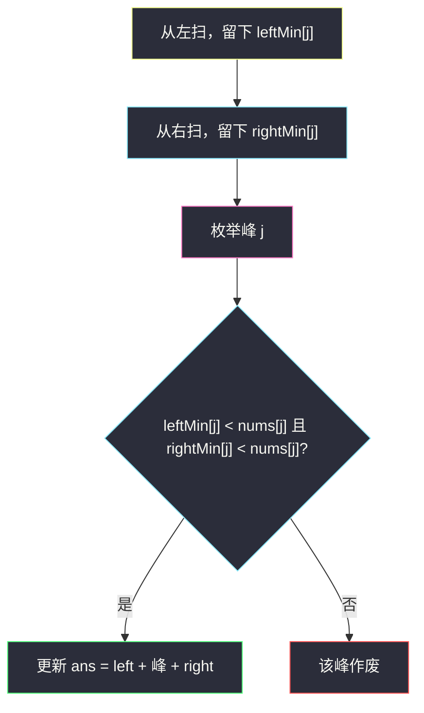
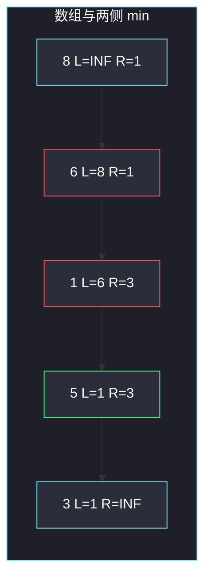

# 元素和最小的山形三元组 II（枚举中间）

## 一、问题描述

给你一个下标从 0 开始的整数数组 `nums`。山形三元组指下标 `(i, j, k)` 满足：

- `i < j < k`
- `nums[i] < nums[j]` 且 `nums[k] < nums[j]`（`j` 是严格高峰）

请返回所有山形三元组中 `nums[i] + nums[j] + nums[k]` 的**最小值**。若不存在任何山形三元组，返回 `-1`。

> 🔗 LeetCode 2909：https://leetcode.cn/problems/minimum-sum-of-mountain-triplets-ii/
>
> 数据范围：`3 <= nums.length <= 10^5`，`1 <= nums[i] <= 10^8`。同题还有 [2908](https://leetcode.cn/problems/minimum-sum-of-mountain-triplets-i/)（`n ≤ 100`），数据更大必须线性。

**示例 1**

```
输入：nums = [8,6,1,5,3]
输出：9
解释：三元组 (2, 3, 4) → 1 + 5 + 3 = 9。
```

**示例 2**

```
输入：nums = [5,4,8,7,10,2]
输出：13
解释：(1, 3, 5) → 4 + 7 + 2 = 13。
```

**示例 3**

```
输入：nums = [6,5,4,3,4,5]
输出：-1
解释：没有任何下标能当严格高峰（左侧或右侧找不到更小的数）。
```

**直观理解**

峰在中间。枚举每一个可能的峰 `j`，左边要一个**严格小于** `nums[j]` 的数，右边同理；要使三个数的和最小，左右都应取各自范围内「小于峰」的最小值。而「小于峰的最小值」其实就是**整段左侧（右侧）的最小值**——若这个最小值已经 ≥ 峰，那左边（右边）根本没有更小的，该峰作废。

---

## 二、暴力解法

三层循环枚举 `i < j < k`：

```python
class Solution:
    def minimumSum(self, nums: List[int]) -> int:
        n = len(nums)
        ans = 10**18
        for j in range(1, n - 1):
            for i in range(j):
                if nums[i] >= nums[j]:
                    continue
                for k in range(j + 1, n):
                    if nums[k] < nums[j]:
                        ans = min(ans, nums[i] + nums[j] + nums[k])
        return -1 if ans == 10**18 else ans
```

内层其实可以先扫出左右最小值再相加，变成 `O(n²)`：

```python
# 仍超时：对每个 j 再扫左右
for j in range(1, n - 1):
    L = min((nums[i] for i in range(j) if nums[i] < nums[j]), default=None)
    R = min((nums[k] for k in range(j + 1, n) if nums[k] < nums[j]), default=None)
    ...
```

### 复杂度

- **时间**：`O(n³)` 或优化后 `O(n²)`。`n = 10^5` 都超时。
- **空间**：`O(1)`。

### 🔴 瓶颈在哪里

每个 `j` 都重新扫左右。左侧最小值其实可以一边从左往右扫一边维护；右侧同理从右往左。预处理后枚举峰就是 `O(n)`。

---

## 三、优化探索（核心章节）

> 📚 本题在灵茶题单中属于 **枚举中间 · §0.2**。套路：先固定中间下标 `j`，把「左边要满足的最优量」和「右边要满足的最优量」预处理成两个数组，再 `O(1)` 拼答案。

### 3.1 枚举峰 j

合法三元组由峰决定。对固定 `j`：

- 左边可选的 `i` 必须 `nums[i] < nums[j]`，其中越小越好
- 右边同理

设 `leftMin[j] = min(nums[0], …, nums[j-1])`（没有左边时视为 +∞），`rightMin[j]` 对称。

- 若 `leftMin[j] < nums[j]`：这个最小值本身就合法，且是左边最优
- 若 `leftMin[j] ≥ nums[j]`：左边所有数都 ≥ 峰，不存在合法 `i`

右边同理。不必再维护「只在小于峰的数里取 min」——全域 min 要么合格，要么整侧都不合格。



### 3.2 为什么不能用「小于等于」

题面是严格 `<`。若 `leftMin[j] == nums[j]`，这个最小值不能当左臂；同时左边没有更小的，该峰失败。实现里用严格比较，不要写成 `≤`。

### 3.3 一句话核心

> **枚举峰 j；左边用前缀最小值、右边用后缀最小值；两侧都严格小于峰时更新三数之和。**

---

## 四、代码实现

### Python（主解）

```python
class Solution:
    def minimumSum(self, nums: List[int]) -> int:
        n = len(nums)
        INF = 10**18
        leftMin = [INF] * n
        mn = INF
        for j in range(n):
            leftMin[j] = mn          # 下标 < j 的最小值
            mn = min(mn, nums[j])

        rightMin = [INF] * n
        mn = INF
        for j in range(n - 1, -1, -1):
            rightMin[j] = mn         # 下标 > j 的最小值
            mn = min(mn, nums[j])

        ans = INF
        for j in range(1, n - 1):
            if leftMin[j] < nums[j] and rightMin[j] < nums[j]:
                ans = min(ans, leftMin[j] + nums[j] + rightMin[j])
        return -1 if ans == INF else ans
```

**变量含义**

| 变量 | 含义 |
|------|------|
| `leftMin[j]` | `min(nums[0..j-1])`，`j=0` 为 INF |
| `rightMin[j]` | `min(nums[j+1..n-1])`，`j=n-1` 为 INF |
| 取用条件 | 必须再判断 `< nums[j]`，保证严格山形 |

注意：**先写入 `leftMin[j]`，再把 `nums[j]` 纳入 `mn`**。若顺序反了，最小值会包含自己，峰被自己比下去。

### Java（最优解同款）

```java
class Solution {
    public int minimumSum(int[] nums) {
        int n = nums.length;
        int INF = Integer.MAX_VALUE / 4;
        int[] leftMin = new int[n];
        int[] rightMin = new int[n];
        int mn = INF;
        for (int j = 0; j < n; j++) {
            leftMin[j] = mn;
            mn = Math.min(mn, nums[j]);
        }
        mn = INF;
        for (int j = n - 1; j >= 0; j--) {
            rightMin[j] = mn;
            mn = Math.min(mn, nums[j]);
        }
        int ans = INF;
        for (int j = 1; j < n - 1; j++) {
            if (leftMin[j] < nums[j] && rightMin[j] < nums[j]) {
                ans = Math.min(ans, leftMin[j] + nums[j] + rightMin[j]);
            }
        }
        return ans == INF ? -1 : ans;
    }
}
```

`nums[i] ≤ 10^8`，三数之和不超过 `3·10^8`，`int` 安全。`INF` 取 `Integer.MAX_VALUE / 4` 避免相加溢出。

---

## 五、具体例子演示

### 5.1 `nums = [8, 6, 1, 5, 3]`：填 leftMin / rightMin

从左维护 `mn`（写入 leftMin 之后才更新）：

| j | nums[j] | 写入前 mn | leftMin[j] | 写入后 mn |
|---|--------|-----------|------------|-----------|
| 0 | 8 | INF | INF | 8 |
| 1 | 6 | 8 | 8 | 6 |
| 2 | 1 | 6 | 6 | 1 |
| 3 | 5 | 1 | 1 | 1 |
| 4 | 3 | 1 | 1 | 1 |

从右：

| j | nums[j] | 写入前 mn | rightMin[j] | 写入后 mn |
|---|--------|-----------|-------------|-----------|
| 4 | 3 | INF | INF | 3 |
| 3 | 5 | 3 | 3 | 3 |
| 2 | 1 | 3 | 3 | 1 |
| 1 | 6 | 1 | 1 | 1 |
| 0 | 8 | 1 | 1 | 1 |

枚举峰（`j = 1,2,3`；两端没有两侧）：

| j | 峰 | leftMin | rightMin | 两侧都严格更小? | 和 |
|---|----|---------|----------|-----------------|-----|
| 1 | 6 | 8 | 1 | `8<6`? 否 | — |
| 2 | 1 | 6 | 3 | `6<1`? 否 | — |
| 3 | 5 | 1 | 3 | `1<5` 且 `3<5` | **1+5+3=9** |

答案 **9**。`j=1` 左边最小值 8 并不小于 6，尽管右边有 1，仍不能当峰。



### 5.2 `nums = [5, 4, 8, 7, 10, 2]`

`leftMin  = [INF, 5, 4, 4, 4, 4]`
`rightMin = [2, 2, 2, 2, 2, INF]`

| j | 峰 | 判定 | 和 |
|---|----|------|-----|
| 1 | 4 | `5<4`? 否 | — |
| 2 | 8 | `4<8` 且 `2<8` | 4+8+2=14 |
| 3 | 7 | `4<7` 且 `2<7` | **4+7+2=13** |
| 4 | 10 | `4<10` 且 `2<10` | 4+10+2=16 |

答案 **13**。

### 5.3 `nums = [6, 5, 4, 3, 4, 5]` → -1

数组整体递减再抬一点。每个 `j` 要么左边 min ≥ 峰（一直在下坡），要么右边 min ≥ 峰（末尾在上坡但右侧更大）。没有一个峰两侧都更小。

---

## 六、复杂度分析

| 方法 | 时间 | 空间 | 说明 |
|------|------|------|------|
| 三重循环 | `O(n³)` | `O(1)` | n=1e5 不可用 |
| 每个 j 扫左右 | `O(n²)` | `O(1)` | 2908 能过，本题不行 |
| 前缀/后缀 min（主解） | `O(n)` | `O(n)` | 两次数组扫描 + 一次枚举峰 |

`leftMin` / `rightMin` 可压成只留一个数组 + 枚举时现场维护一侧，空间仍是 `O(n)`（另一侧要存）。再压到 `O(1)` 额外空间没有必要。

---

## 七、对比总结

| 维度 | 暴力枚举三下标 | 枚举峰 + 两侧 min |
|------|----------------|-------------------|
| 左臂怎么选 | 试所有 `i` | 直接用前缀最小值 |
| 严格小于 | 循环里比较 | 取用时 `leftMin[j] < nums[j]` |
| 无解 | 跑完没有更新 | `ans` 仍是 INF，返回 -1 |

**易错点**

1. **先更新 `mn` 再写 `leftMin[j]`**：峰和自己比较，左右 min 会脏。
2. **用 `≤` 当合法**：相等不是山形。
3. **以为 leftMin 要「只在小于峰的数里取 min」**：全域 min 再加一次严格比较即可；若全域 min ≥ 峰，过滤版的 min 也不存在。
4. **返回 0 当无解**：和可能为正，无解必须 `-1`。
5. **只枚举全局最大值当峰**：真正最优峰可能不是全局最大（示例 2 的 7 优于 10）。

**模板（§0.2 枚举中间）**

```python
# 左侧最优量
for j in range(n):
    left[j] = 已维护的左侧统计
    用 nums[j] 更新统计
# 右侧同理（倒着扫）
for j in range(n):
    用 left[j]、nums[j]、right[j] 更新答案
```

---

## 八、举一反三

| 题目 | 关系 |
|------|------|
| [2908. 元素和最小的山形三元组](https://leetcode.cn/problems/minimum-sum-of-mountain-triplets-i/) | 同一题，`n≤100`，可用 `O(n²)`；模板应直接写 II 的 `O(n)` |
| [2874. 有序三元组中的最大值 II](https://leetcode.cn/problems/maximum-value-of-an-ordered-triplet-ii/) | 同样枚举中间；左右改成最大 `nums[i]`、最大 `nums[k]` |
| [2873. 有序三元组中的最大值 I](https://leetcode.cn/problems/maximum-value-of-an-ordered-triplet-i/) | 2874 的小数据版 |
| [845. 数组中的最长山脉](https://leetcode.cn/problems/longest-mountain-in-array/) | 山形改成「连续下标的山脉长度」 |
| [1671. 得到山形数组的最少删除次数](https://leetcode.cn/problems/minimum-number-of-removals-to-make-mountain-array/) | 枚举峰 + 左右 LIS |
| [152. 乘积最大子数组](https://leetcode.cn/problems/maximum-product-subarray/) | 也是「中间这个数」配合左右信息，但是 DP |

**思想迁移**

- `i < j < k` 且左右对中间有约束 → 不要三重循环，**枚举 j，左右预处理**。
- 口诀：**「峰扫一遍；左前缀 min、右后缀 min；取用时必须严格更小。」**
