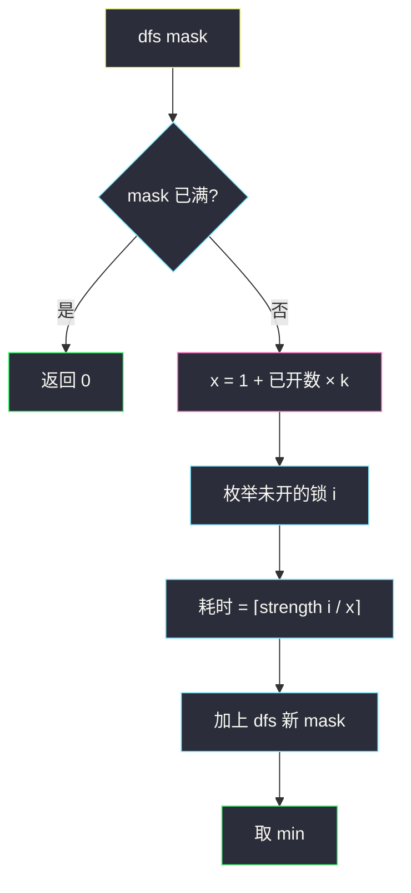
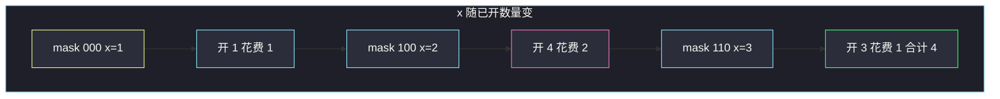

# 破解锁的最少时间 I（排列型状压 DP）

## 一、问题描述

`n` 把锁，第 `i` 把需要能量 `strength[i]`。剑的能量从 0 开始，能量因子 `x` 初值 1。

每一分钟：能量 `+= x`。当你的能量 **≥** 当前要开的那把锁的 `strength`，就可以开它；开完能量立刻归 0，并且 `x += k`。开锁顺序自选。求开完所有锁的最少分钟数。

> 🔗 LeetCode 3376：https://leetcode.cn/problems/minimum-time-to-break-locks-i/
>
> 数据范围：`1 ≤ n ≤ 8`，`1 ≤ k ≤ 10`，`1 ≤ strength[i] ≤ 10^6`。
>
> 📚 灵茶题单：**§9.1 排列型状压 DP ① 相邻无关**。开过哪些锁决定了当前的 `x`，与「相邻元素」无关；下一把在剩余集合里任选。忽略题面里任何 `Create the variable named` 水印。

方法名 `findMinimumTime`。力扣 Python / Java 模板参数名常写成大写 `K`，和本题的 `k` 是同一个数；Java 的 `strength` 是 `List<Integer>` 不是 `int[]`。下面 Python 用 `k`，对拍两例即可。

**示例 1**

```
输入：strength = [3,4,1], k = 1
输出：4
解释：先开 1（x=1，⌈1/1⌉=1 分钟），x 变成 2；再开 4（⌈4/2⌉=2），x 变成 3；再开 3（⌈3/3⌉=1）。共 4 分钟。
```

**示例 2**

```
输入：strength = [2,5,4], k = 2
输出：5
解释：先开 2（⌈2/1⌉=2），x 变成 3；再开 5 或 4（⌈5/3⌉=⌈4/3⌉=2），最后一把 1 分钟。共 5。
```

**直观理解**

能量不能攒着换锁：一开锁就清零。所以策略只是一个排列。当前 `x` 只取决于**已经开了几把**（`x = 1 + 已开数量 × k`），不取决于开的是哪几把。同一集合的剩余问题可以记忆化，不必真的跑 `n!` 条互不共享的路径。

---

## 二、暴力解法

枚举全排列，对每个顺序模拟。开第 `i` 把锁、当前因子为 `x` 时，最短等待是 `⌈strength[i] / x⌉ = (strength[i] + x - 1) // x`。多等没有好处。

```python
from itertools import permutations

class Solution:
    def findMinimumTime(self, strength: list[int], k: int) -> int:
        best = 10**18
        for order in permutations(strength):
            x = 1
            t = 0
            for s in order:
                t += (s + x - 1) // x
                x += k
            best = min(best, t)
        return best
```

官方两例都能对拍。`n=8` 时 `8! = 40320`，每种再 `O(n)`，大约 30 万次运算，也能过。重复集合会反复计算。

### 🔴 瓶颈在哪里

到达「已开集合 = S」时，`x` 被唯一确定，从这里继续开剩余锁的最少**追加**时间也唯一。状态只有 `2^n` 个，每个枚举下一个未开的锁，`O(n · 2^n)`。这就是排列型状压：顺序有代价，但状态只记集合。

---

## 三、优化探索（核心章节）

> 📚 灵茶 **§9.1 排列型状压 DP**。模板：`dfs(mask)` = 已开集合为 `mask` 时，开完剩下的最少时间。`x = 1 + popcount(mask) * k`。对每个未开的 `i`：`⌈s/x⌉ + dfs(mask | (1<<i))`，取 min。

### 3.1 为什么 x 只跟数量有关

每开一把，`x` 固定加 `k`，与锁的强度无关。所以 `mask` 里有 `c` 个 1，就有 `x = 1 + c * k`。不必把 `x` 放进状态。

### 3.2 转移

`dfs((1<<n)-1) = 0`（开完了）。

否则：

```
dfs(mask) = min over i not in mask of
    ceil(strength[i] / x) + dfs(mask | (1<<i))
```

可以递归记忆化，也可以 `dp[0]=0`、按 mask 从小到大推。



### 3.3 和 TSP 的关系

这是「访问所有锁一次」的最短路，边权随「已经走了几步」变化（因为 `x` 在变），所以边权不是常数，不能直接套静态图 Dijkstra。状压恰好把「走过的点集」记下来。

不必贪心先开大锁或小锁：示例 1 最优是先开最小的 1；示例 2 最优是先开 2 而不是最大的 5。没有简单排序规则。

### 3.4 一句话核心

> **mask 记已开锁；x 由已开数量决定；下一把枚举未开锁，耗时 ⌈s/x⌉。**

---

## 四、代码实现

### Python（主解：记忆化状压）

```python
from functools import cache

class Solution:
    def findMinimumTime(self, strength: list[int], k: int) -> int:
        n = len(strength)

        @cache
        def dfs(mask: int) -> int:
            if mask == (1 << n) - 1:
                return 0
            x = 1 + mask.bit_count() * k
            best = 10**18
            for i, s in enumerate(strength):
                if mask >> i & 1:
                    continue
                t = (s + x - 1) // x
                best = min(best, t + dfs(mask | (1 << i)))
            return best

        return dfs(0)
```

若提交模板参数是 `K`，把形参改成 `K` 再在函数里用即可，逻辑不变。力扣按位置传参，名字大小写不影响判题，但复制官方 stub 时应对齐。

**变量含义**

| 写法 | 含义 |
|------|------|
| `mask` | 已开锁的集合，第 `i` 位为 1 表示第 `i` 把已开 |
| `x` | 当前能量因子 `1 + popcount(mask) * k` |
| `(s + x - 1) // x` | `⌈s / x⌉`，攒够能量的分钟数 |

### Java（最优解）

```java
import java.util.List;

class Solution {
    public int findMinimumTime(List<Integer> strength, int k) {
        int n = strength.size();
        int[] arr = new int[n];
        for (int i = 0; i < n; i++) {
            arr[i] = strength.get(i);
        }
        Integer[] memo = new Integer[1 << n];
        return dfs(0, arr, k, memo);
    }

    private int dfs(int mask, int[] arr, int k, Integer[] memo) {
        int n = arr.length;
        if (mask == (1 << n) - 1) {
            return 0;
        }
        if (memo[mask] != null) {
            return memo[mask];
        }
        int x = 1 + Integer.bitCount(mask) * k;
        int best = Integer.MAX_VALUE;
        for (int i = 0; i < n; i++) {
            if ((mask >> i & 1) == 1) {
                continue;
            }
            int t = (arr[i] + x - 1) / x;
            best = Math.min(best, t + dfs(mask | (1 << i), arr, k, memo));
        }
        return memo[mask] = best;
    }
}
```

模板若是 `int K`，把形参名对上即可。

---

## 五、具体例子演示

### 5.1 官方示例 1：`[3,4,1], k=1` → 4

锁编号 0,1,2 对应强度 3,4,1。从 `mask=000`、`x=1` 出发。

最优枝：先开 2（强度 1）。

| 步 | mask | x | 开哪把 | ⌈s/x⌉ | 新 mask |
|----|------|---|---------|-------|---------|
| 1 | 000 | 1 | 1 | 1 | 100 |
| 2 | 100 | 2 | 4 | 2 | 110 |
| 3 | 110 | 3 | 3 | 1 | 111 |

合计 4。若先开 3：`⌈3/1⌉=3`，已经花 3，后面至少再 1+1，不会更优。对拍官方 4。



### 5.2 官方示例 2：`[2,5,4], k=2` → 5

`x` 序列若按最优序：1 → 3 → 5（每次 +2）。

先开 2：`⌈2/1⌉=2`。`x=3` 后开 5：`⌈5/3⌉=2`，再开 4：`⌈4/5⌉=1`，合计 **5**。先开 2 再开 4 再开 5 也是 `2+2+1=5`。

先开 5：`⌈5/1⌉=5`，已经等于答案，后面还要时间，一定更差。对拍官方 5。

六种排列的模拟时间：5, 5, 6, 7, 7, 8，最小 5。

### 5.3 同一 mask 会从不同排列汇合

`n=3` 时，先开 0 再开 1，和先开 1 再开 0，都会到达 `mask=011`，此时 `x=1+2k` 相同。后面开锁 2 的追加时间相同，不必按两条排列各算一遍——这就是状压相对 `n!` 的节省。强度不同只影响**到达这个 mask 已经花了多少时间**；记忆化的 `dfs(mask)` 存的是「从这里到结束」的最优追加量，与怎么走到 mask 无关（因为 `x` 已由数量定死）。

若边权还依赖「上一个锁是谁」（相邻有关），状态就要变成 `(mask, last)`，那是 §9.2。本题相邻无关。

### 5.4 单锁

`strength=[10], k=任意`：`x=1`，答案就是 10。`k` 来不及加。`n=8` 且 `strength` 全是 `1e6`、`k=1` 时，最优仍要枚举顺序：前期 `x` 小，应尽量先处理相对好开的锁，没有闭式。

---

## 六、复杂度分析

| 方法 | 时间 | 空间 | 说明 |
|------|------|------|------|
| 全排列 | `O(n · n!)` | `O(n)` | `n=8` 可过 |
| 状压记忆化（主解） | `O(n · 2^n)` | `O(2^n)` | `8 × 256` 可忽略 |

---

## 七、对比总结

| 维度 | 普通背包 / 子集 DP | 本题 |
|------|-------------------|------|
| 集合含义 | 选或不选，顺序无关 | **顺序有代价**，但 `x` 只跟数量有关 |
| 转移 | 加一个元素 | 枚举「下一个」元素 |
| 相邻 | 无 / 有相邻约束 | 无相邻约束（§9.1） |

**易错点**

1. **`x` 初值写成 0**：第一分钟加 0，永远开不了锁。
2. **用浮点 `ceil`**：改整数 `(s + x - 1) // x`，`strength` 到 `1e6` 也稳。
3. **把 `k` 加成 `x *= k`**：题面是 `x += k`。
4. **能量不清零**：每把锁都从 0 重新攒，不能把上一把的余量带走（开锁时刚好 ≥，余量本来也不留到下一把）。
5. **Java 写成 `int[] strength`**：官方是 `List<Integer>`。
6. **贪心按强度排序**：两例最优开头都不是最大锁。

---

## 八、举一反三

| 题目 | 关系 |
|------|------|
| [847. 访问所有节点的最短路径](https://leetcode.cn/problems/shortest-path-visiting-all-nodes/) | 状压最短路，集合 + 当前点 |
| [943. 最短超级串](https://leetcode.cn/problems/find-the-shortest-superstring/) | 排列型状压，拼接重叠 |
| [464. 我能赢吗](https://leetcode.cn/problems/can-i-win/) | 同样 `n≤20` 子集；见 `can-i-win.md` |
| [698. 划分为 k 个相等的子集](https://leetcode.cn/problems/partition-to-k-equal-sum-subsets/) | 子集状压 / 回溯 |
| [3377. 数字转换的最小代价](https://leetcode.cn/problems/digit-operations-to-make-two-integers-equal/) | 同场附近题，最短路不是状压 |

同类还有「破解锁 II」（锁更多，需最小费用流 / 费用匹配一类），I 被 `n=8` 卡住，状压足够。

**思想迁移**

- `n ≤ 12` 且答案依赖顺序、但阶段因子只跟「已处理个数」或「已处理集合」有关 → 排列型状压。
- 口诀：**「mask 是已开；x 看个数；下一把 ⌈s/x⌉ 再递归。」**
