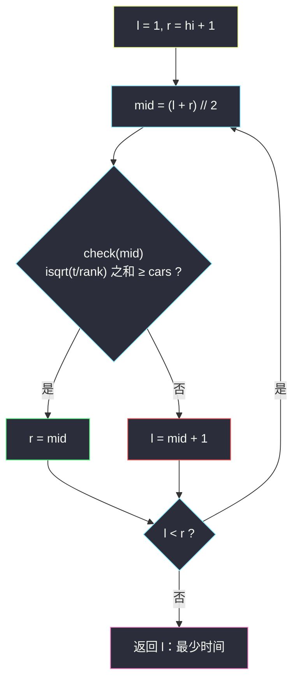
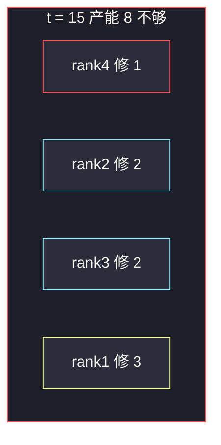

# 修车的最少时间（二分时间 + 整数开方 check）

## 一、问题描述

给你整数数组 `ranks` 和整数 `cars`。`ranks[i]` 是第 `i` 位机械师的等级：等级为 `r` 的人修 `n` 辆车要花 `r * n²` 分钟。所有人**同时开工**，互不影响。求把 `cars` 辆车全部修好的**最少时间**。

> 🔗 LeetCode 2594：https://leetcode.cn/problems/minimum-time-to-repair-cars/
>
> 数据范围：`1 <= ranks.length <= 10^5`，`1 <= ranks[i] <= 100`，`1 <= cars <= 10^6`。
>
> 📚 灵茶题单：**二分算法 · §2.1 求最小**。

**示例 1**

```
输入：ranks = [4,2,3,1], cars = 10
输出：16
解释：4 修 2 辆（16 分钟）、2 修 2 辆（8）、3 修 2 辆（12）、1 修 4 辆（16）。
并行取 max = 16。少一分钟就凑不齐 10 辆。
```

**示例 2**

```
输入：ranks = [5,1,8], cars = 6
输出：16
解释：最强的那位（rank=1）修 4 辆要 16 分钟，另外两位各修 1 辆，总车数 6。
```

**直观理解**

时间给得越宽，每人能修的车越多。问的是「刚好修完」的最短时间——§2.1 求最小。不要去枚举「谁修几辆」（那是分配问题），而是猜一个时刻 `t`，看所有人在 `t` 分钟内最多能修多少辆。

---

## 二、暴力解法

从 `t = 1` 往上加，直到某时刻产能 ≥ `cars`。每位机械师在时间 `t` 最多修 ⌊sqrt(t / rank)⌋ 辆：

```python
class Solution:
    def repairCars(self, ranks: List[int], cars: int) -> int:
        t = 1
        while True:
            done = 0
            for rank in ranks:
                n = 0
                while rank * n * n <= t:
                    n += 1
                done += n - 1
            if done >= cars:
                return t
            t += 1
```

### 复杂度

- **时间**：`O(RANGE · n · sqrt(cars))` 量级。上界 `min(ranks) * cars²` 可达 `10^14`，完全不可用。
- **空间**：`O(1)`。

### 🔴 瓶颈在哪里

「时间 t 够不够」随 t 增大从假变真，一刀切。线性试 t 会跑 `10^14` 轮。二分把轮数打到 `≈ 50`，每轮 `O(n)` 求和即可。

---

## 三、优化探索（核心章节）

> 📚 本题在灵茶题单中属于 **二分算法 · §2.1 求最小**。二分的是时间 t；check 要讲清单调性。与 [供暖器](https://leetcode.cn/problems/heaters/)（`heaters.md`）同一套「左假右真求最小」。

### 3.1 check(t)：t 分钟内能否修完

等级 `r` 的人修 `n` 辆耗时 `r * n²`。在时限 `t` 内：

```
r * n² ≤ t  ⇔  n² ≤ t / r  ⇔  n ≤ ⌊sqrt(t / r)⌋
```

整数写法：`n = isqrt(t // r)`（先整除再开方，全程整数，避开浮点误差）。所有人的 `n` 加起来 ≥ `cars` 则可行。人是并行的，**不要**把耗时加起来，产能才是加起来。

### 3.2 check 关于 t 的单调性

`t` 增大，每人能修的车数不减，总和只增不减。所以 `check(t)` **左假右真**：时间太短修不完（红），时间够了一定修得完（蓝）。答案 = **最小的蓝色 t**。

下界取 `1`（至少要修车）。上界：让等级最低（数字最小、速度最快）的那一位包办全部，耗时 `min(ranks) * cars * cars`，一定合法。


### 3.3 左闭右开求最小 t（一套走到底）

答案落在 `[1, hi]`。区间 `[l, r)` 表示「最小可行时间 ∈ `[l, r)`」：

```
l, r = 1, hi + 1
while l < r:
    mid = (l + r) // 2
    if check(mid): r = mid      # 蓝：还能再压时间
    else:          l = mid + 1  # 红：必须加大
return l
```

合法就收右端，不合法就丢左端。不要改成闭区间的 `r = mid - 1`。



### 3.4 溢出与开方

`hi = min(ranks) * cars * cars` 可达 `100 * 10^12 = 10^14`。Python 整数无上限；Java 必须用 `long`。`n` 不要用 `int(math.sqrt(t / rank))`：大整数转 `float` 会丢精度，可能多算一辆。`math.isqrt(t // rank)` 保证 `n² ≤ t // rank`，从而 `rank * n² ≤ t`。

产能求和时可以提前 `≥ cars` 就返回真，少做几次开方。

### 3.5 一句话核心

> **时间越长产能越大（左假右真）→ 左闭右开求最小 t；check = 每人 ⌊sqrt(t/rank)⌋ 辆之和 ≥ cars。**

---

## 四、代码实现

### Python（主解：二分 t + 整数开方）

```python
import math

class Solution:
    def repairCars(self, ranks: List[int], cars: int) -> int:
        def check(t: int) -> bool:
            done = 0
            for rank in ranks:
                done += math.isqrt(t // rank)   # 最多修几辆
                if done >= cars:
                    return True
            return False

        hi = min(ranks) * cars * cars           # 最快的那位包办
        l, r = 1, hi + 1                        # 最小可行 t ∈ [l, r)
        while l < r:
            mid = (l + r) // 2
            if check(mid):
                r = mid
            else:
                l = mid + 1
        return l
```

**变量含义**

| 变量 | 含义 |
|------|------|
| `t` / `mid` | 猜测的统一时限 |
| `isqrt(t // rank)` | 该机械师在时限内最多修几辆 |
| `hi` | 最快的人独自修完的时间，必可行 |
| `l` / `r` | 左闭右开：`[1, l)` 已确认不够，`[r, hi+1)` 已确认够 |

### Java（最优解同款）

```java
class Solution {
    public long repairCars(int[] ranks, int cars) {
        long hi = (long) ranks[0] * cars * cars;
        for (int rank : ranks) hi = Math.min(hi, (long) rank * cars * cars);
        long l = 1, r = hi + 1;                  // [l, r)
        while (l < r) {
            long mid = l + (r - l) / 2;
            if (check(ranks, cars, mid)) r = mid;
            else l = mid + 1;
        }
        return l;
    }

    private boolean check(int[] ranks, int cars, long t) {
        long done = 0;
        for (int rank : ranks) {
            done += (long) Math.sqrt(t / (double) rank);  // t ≤ 10^14，double 精确
            if (done >= cars) return true;
        }
        return false;
    }
}
```

本题 `t ≤ 10^14 < 2^53`，`double` 能精确表示整数 `t`，`Math.sqrt` 再取整可用。范围再大应改整数开方（Python 的 `math.isqrt` 没有这个问题）。

---

## 五、具体例子演示

以示例 1：`ranks = [4,2,3,1]`，`cars = 10`。`hi = 1 * 10 * 10 = 100`，初始 `l = 1`，`r = 101`。

`check(t) ⇔` 四位分别修 ⌊sqrt(t/4)⌋、⌊sqrt(t/2)⌋、⌊sqrt(t/3)⌋、⌊sqrt(t/1)⌋ 辆，和 ≥ 10。手工验证分界：`t = 15` 产能 `1+2+2+3 = 8` 不够；`t = 16` 产能 `2+2+2+4 = 10` 刚好。故 `check(t) ⇔ t ≥ 16`。

| 轮次 | l | r | mid | 四人产能 | 和 | check | 动作 |
|------|---|---|-----|----------|---|-------|------|
| 1 | 1 | 101 | 51 | 3,5,4,7 | 19 | 真 | `r = 51` |
| 2 | 1 | 51 | 26 | 2,3,2,5 | 12 | 真 | `r = 26` |
| 3 | 1 | 26 | 13 | 1,2,2,3 | 8 | 假 | `l = 14` |
| 4 | 14 | 26 | 20 | 2,3,2,4 | 11 | 真 | `r = 20` |
| 5 | 14 | 20 | 17 | 2,2,2,4 | 10 | 真 | `r = 17` |
| 6 | 14 | 17 | 15 | 1,2,2,3 | 8 | 假 | `l = 16` |
| 7 | 16 | 17 | 16 | 2,2,2,4 | 10 | 真 | `r = 16` |

`l == r == 16`，返回 **16** ✓。



---

## 六、复杂度分析

| 方法 | 时间 | 空间 | 说明 |
|------|------|------|------|
| t 从 1 递增 | 与 `RANGE` 成正比 | `O(1)` | RANGE 达 `10^14` |
| 二分 t + 整数开方（主解） | `O(n log RANGE)` | `O(1)` | RANGE ≤ `10^14`，约 50 轮；n ≤ `10^5` |

---

## 七、对比总结

| 维度 | 暴力加 t | 二分答案 |
|------|----------|----------|
| 利用单调性 | 否 | 左假右真，求最小蓝 |
| 轮数 | 与上界成正比 | `log RANGE` |
| 分配方案 | 不必求 | 也不必求，check 只问产能 |

**易错点**

1. **把耗时加总**：人是并行的，比的是「最慢那位何时收工」，check 里加的是**辆数**不是分钟。
2. **用 `sqrt` 浮点**：`t` 到 `10^14`，`double` 的尾数只有 53 bit，可能把 `n` 算大一辆。用 `isqrt`。
3. **上界写成 `max(ranks) * cars²`**：最慢的人包办也能当上界，只是多几轮；写成 `min` 更紧，且一定可行。
4. **区间改成闭的却没改 `while`**：`r = mid - 1` 配 `while l < r` 会丢掉唯一可行的 `mid`。
5. **Java 用 `int` 算 `hi`**：`cars * cars` 在 `int` 里已经溢出。

**模板（§2.1 求最小，左闭右开）**

```python
l, r = 1, hi + 1
while l < r:
    mid = (l + r) // 2
    if check(mid): r = mid
    else:          l = mid + 1
return l
```

---

## 八、举一反三

| 题目 | 关系 |
|------|------|
| [475. 供暖器](https://leetcode.cn/problems/heaters/) | 同节 §2.1，见 `heaters.md` |
| [875. 爱吃香蕉的珂珂](https://leetcode.cn/problems/koko-eating-bananas/) | 二分速度，check 是求和 ⌈pile/speed⌉ |
| [1011. 在 D 天内送达包裹的能力](https://leetcode.cn/problems/capacity-to-ship-packages-within-d-days/) | 最小化载重 |
| [410. 分割数组的最大值](https://leetcode.cn/problems/split-array-largest-sum/) | 同家族最小化最大值，见 `split-array-largest-sum.md` |
| [1898. 可移除字符的最大数目](https://leetcode.cn/problems/maximum-number-of-removable-characters/) | 单调反过来求最大，见 `maximum-number-of-removable-characters.md` |
| [1870. 准时到达的列车最小时速](https://leetcode.cn/problems/minimum-speed-to-arrive-on-time/) | 二分速度 + 求和 |

**思想迁移**

- 见到「并行加工 / 每人产能是关于时间的单调函数」，先写 `check(t)`，确认左假右真，再套求最小。
- 公式里带平方、开方时，**先整除再整数开方**，不要让大数进浮点。
- 口诀：**「时间左假右真，往左压到不能压；每人能修几辆用 isqrt。」**
