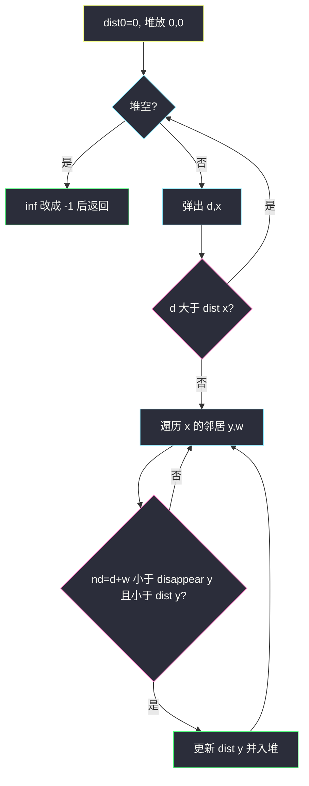

# 访问消失节点的最少时间（Dijkstra 松弛带消失截止）

## 一、问题描述

`n` 个点的**无向**带权图，`edges[i] = [u, v, length]` 表示 `u–v` 要花 `length` 时间。`disappear[i]` 是节点 `i` 消失的时刻：在该时刻**及以后**不能再访问 `i`。从节点 `0` 出发，返回长度为 `n` 的数组：到每个点的最短时间；不可达（含「到了已经没了」）为 `-1`。

> 🔗 LeetCode 3112：https://leetcode.cn/problems/minimum-time-to-visit-disappearing-nodes/
>
> 数据范围：`1 ≤ n ≤ 5e4`，边最多 `1e5`，`1 ≤ length, disappear[i] ≤ 1e5`。可能不连通、重边、自环。`n` 到 5 万，必须堆优化。
>
> 📚 灵茶题单：**§3.1 单源最短路：Dijkstra 算法**（松弛条件带「到达时刻严格小于消失时刻」）。

**示例 1**

```
输入：n = 3, edges = [[0,1,2],[1,2,1],[0,2,4]], disappear = [1,1,5]
输出：[0, -1, 4]
```

到 1 要 2，但 `disappear[1] = 1`，`2 < 1` 不成立，1 到不了。直达 2 用 4，`4 < 5`，可以。

**示例 2**

```
输入：n = 3, edges = [[0,1,2],[1,2,1],[0,2,4]], disappear = [1,3,5]
输出：[0, 2, 3]
```

先到 1 用 2（`2 < 3`），再走 `1–2` 得 3，比直达 4 更短。

**示例 3**

```
输入：n = 2, edges = [[0,1,1]], disappear = [1,1]
输出：[0, -1]
```

到达 1 的时刻恰好等于 `disappear[1]`，**不行**。截止是严格小于。

**直观理解**

普通最短路再加一道门禁：路再短，踩到点上的时间如果 `≥ disappear[v]`，这条松弛作废。剩下的仍是正权单源最短路，堆 Dijkstra。和 [network-delay-time.md](./network-delay-time.md) 比，只多一个不等式。

题目约束 `disappear[i] ≥ 1`，起点时刻 0 一定合法，`answer[0] = 0`。

---

## 二、暴力解法

朴素 Dijkstra：每次在未确定点里扫 `dist` 最小的，再松弛邻居，顺带检查消失。时间 `O(n²)`，`n = 5e4` 必 TLE。

```python
from math import inf
from typing import List

class Solution:
    def minimumTime(self, n: int, edges: List[List[int]], disappear: List[int]) -> List[int]:
        g = [[] for _ in range(n)]
        for u, v, w in edges:
            g[u].append((v, w))
            g[v].append((u, w))
        dist = [inf] * n
        dist[0] = 0
        vis = [False] * n
        for _ in range(n):
            x = -1
            for i in range(n):
                if not vis[i] and (x < 0 or dist[i] < dist[x]):
                    x = i
            if x < 0 or dist[x] == inf:
                break
            vis[x] = True
            for y, w in g[x]:
                nd = dist[x] + w
                if nd < disappear[y] and nd < dist[y]:
                    dist[y] = nd
        return [-1 if d == inf else d for d in dist]
```

逻辑和小数据都对，规模不对。主解换成堆，邻接表。

### 🔴 瓶颈在哪里

稀疏图找最小点不要扫 `n`。弹出后过期跳过；松弛时 **两个** 条件一起判：`nd < dist[y]` 且 `nd < disappear[y]`。相等即消失，到不了。

---

## 三、优化探索（核心章节）

> 📚 本题在灵茶题单中属于 **§3.1 单源最短路：Dijkstra 算法**。无向正权 + 节点截止时间。

### 3.1 建无向图

```python
g = [[] for _ in range(n)]
for u, v, w in edges:
    g[u].append((v, w))
    g[v].append((u, w))
```

双向都加。自环权为正，最短路不会靠它变短，加上也无妨，建图时 `u == v` 可跳过。重边全留下，松弛自然取更短的那次。

### 3.2 松弛带消失

`dist[x]`：当前已知的 `0 → x` 最短路（且该时刻点还在）。初始 `dist[0] = 0`，其余无穷。

弹出 `(d, x)`，若 `d > dist[x]` 过期。否则对每条 `x–y` 权 `w`：

```text
nd = d + w
若 nd < disappear[y] 且 nd < dist[y]：更新 dist[y] 并入堆
```

`nd == disappear[y]` 时点已经没了，不能更新。示例 3 就是这条。

从已消失的点无法再出发：我们根本不会把非法到达写进 `dist`，也就不会用它去松弛别人。



正权：第一次弹出 `x` 时 `dist[x]` 已是满足截止约束的最短到达。之后更晚的到达即使还没消失，也不会更优。

### 3.3 起点与对拍

官方 `1 ≤ disappear[i]`，所以 `0 < disappear[0]` 恒成立，`answer[0] = 0`。若本地把 `disappear[0]` 改成 0：时刻 0 已经「及以后不可访问」，连自己都无效，`answer[0]` 应为 `-1`，其余也到不了。提交数据里没有这种情况。

### 3.4 一句话核心

> **无向邻接表 + 堆 Dijkstra；松弛 `nd = d+w` 仅当 `nd < disappear[v]` 且更短；inf 输出 -1。**

---

## 四、代码实现

### Python（主解：堆优化 Dijkstra）

```python
from heapq import heappop, heappush
from math import inf
from typing import List

class Solution:
    def minimumTime(
        self, n: int, edges: List[List[int]], disappear: List[int]
    ) -> List[int]:
        g = [[] for _ in range(n)]
        for u, v, w in edges:
            g[u].append((v, w))
            g[v].append((u, w))
        dist = [inf] * n
        dist[0] = 0
        h = [(0, 0)]
        while h:
            d, x = heappop(h)
            if d > dist[x]:
                continue
            for y, w in g[x]:
                nd = d + w
                if nd < disappear[y] and nd < dist[y]:
                    dist[y] = nd
                    heappush(h, (nd, y))
        return [-1 if d == inf else d for d in dist]
```

和 [network-delay-time.md](./network-delay-time.md) 的差别：无向双向加边；松弛多一个 `nd < disappear[y]`；答案是整条 `dist`，不是 `max`。过期跳过同样必须写。

不要用 BFS：边权是任意正整数。不要 Floyd：`n²` 都存不下。

`disappear` 只约束**到达该点的时刻**，不约束边的存在：边还在，只是你踩上去的瞬间点已经没了。不要建图时按 `disappear` 删点——那样会误删「晚一点才消失、短路径赶得上」的点。过滤放在松弛里。

---

## 五、具体例子演示

示例 1：边 `0–1 (2)`，`1–2 (1)`，`0–2 (4)`，`disappear = [1, 1, 5]`。

初始：`dist = [0, inf, inf]`，堆 `[(0, 0)]`。

| 弹出 | 过期? | 松弛 | dist | 堆 |
|------|-------|------|------|-----|
| `(0, 0)` | 否 | `0→1`：2 `< disappear[1]=1`？否。`0→2`：4 `< 5` 且 `< inf` → 4 | `[0, inf, 4]` | `[(4, 2)]` |
| `(4, 2)` | 否 | `2→1`：5 `< 1`？否。`2→0`：8 不优于 0 | `[0, inf, 4]` | 空 |

`inf` 改 `-1` → `[0, -1, 4]`。点 1 不是图不连通，是**赶不上消失**。


示例 2：`disappear = [1, 3, 5]`。同一张图。

| 弹出 | 松弛 | dist | 堆 |
|------|------|------|-----|
| `(0, 0)` | `0→1`：2 `< 3` → 2；`0→2`：4 `< 5` → 4 | `[0, 2, 4]` | `[(2,1), (4,2)]` |
| `(2, 1)` | `1→2`：2+1=3 `< 5` 且 `< 4` → **改成 3** | `[0, 2, 3]` | `[(3,2), (4,2)]` |
| `(3, 2)` | 邻居不更优 | `[0, 2, 3]` | `[(4, 2)]` |
| `(4, 2)` | `4 > dist[2]=3`，**过期 continue** | 不变 | 空 |

答案 `[0, 2, 3]`。直达 2 的 4 被「经 1」的 3 淘汰，旧堆项必须丢掉。

示例 3：`0→1` 得 1，`1 < disappear[1]=1` 为假 → `[0, -1]`。写 `≤` 会错误返回 `[0, 1]`。

重边：`0–1` 同时有权 5 和权 2，两次松弛取 2。自环 `1–1` 只会让到达 1 更晚，正权下无用。

`n=1`、`edges=[]`、`disappear=[1]`：堆弹出 0 后没有邻居，返回 `[0]`。不要因为「没有边」把起点写成 `-1`。

本地对拍若设 `disappear[0]=0`：不应把 `dist[0]=0` 放进堆（0 已经不小于消失时刻）。主解按官方约束没写这分支；加上就是 `if disappear[0] == 0: return [-1]*n`。

---

## 六、复杂度分析

| 方法 | 时间 | 空间 | 说明 |
|------|------|------|------|
| 朴素 Dijkstra | `O(n²)` | `O(n+m)` | `n=5e4` TLE |
| 堆优化（主解） | `O((n+m) log n)` | `O(n+m)` | 过期项使堆可达 `O(m)` |
| Floyd | `O(n³)` 且 `O(n²)` 内存 | 不可用 | |

通常写成 `O(m log n)`；与站内网络延迟时间同一档。

---

## 七、对比总结

| 维度 | 普通最短路 | 本题 |
|------|------------|------|
| 建图 | 有向或无向看题 | **无向**双向 |
| 松弛 | `d+w < dist[y]` | 再加 `d+w < disappear[y]` |
| 相等 | 无截止 | **等于消失时刻也不行** |
| 答案 | 单点 / max | 每个点，inf → `-1` |

**易错点**

1. **建成有向**：漏反向边，少一堆可达点。
2. **`nd ≤ disappear[y]`**：示例 3 会错。题面是「那一刻及以后无法访问」。
3. **不过期跳过**：经更短路更新后，旧的直达项仍在堆里。
4. **用 BFS**：权不是 1。
5. **自环/重边崩掉建图**：邻接表直接 append 即可。
6. **把 `answer[0]` 特判成 `-1`**：官方约束下恒为 0。

和 [network-delay-time.md](./network-delay-time.md) 默写差异只有三处：双向加边、松弛多 `nd < disappear[y]`、返回整表而不是 `max`。截止是开区间，示例 3 专门打「等于不行」。

---

## 八、举一反三

| 题目 | 关系 |
|------|------|
| [743. 网络延迟时间](https://leetcode.cn/problems/network-delay-time/) | 同模板去掉消失条件，站内 [network-delay-time.md](./network-delay-time.md) |
| [3341. 到达最后一个房间的最少时间 I](https://leetcode.cn/problems/find-minimum-time-to-reach-last-room-i/) | 网格等待版 Dijkstra，站内 [find-minimum-time-to-reach-last-room-i.md](./find-minimum-time-to-reach-last-room-i.md) |
| [1976. 到达目的地的方案数](https://leetcode.cn/problems/number-of-ways-to-arrive-at-destination/) | Dijkstra 同时数最短路条数 |
| [2045. 到达目的地的第二短时间](https://leetcode.cn/problems/second-minimum-time-to-reach-destination/) | 次短路 + 红绿灯等待 |
| [1514. 概率最大的路径](https://leetcode.cn/problems/path-with-maximum-probability/) | 堆改最大、松弛改乘法 |

**思想迁移**

- 正权单源 + 额外可行性（消失、等待、限流）→ 仍 Dijkstra，把约束写进松弛。
- 「刚好踩在截止点上」读题：开区间还是闭区间差一道示例。
- 口诀：**「无向建图；nd 严格小于 disappear；堆弹过期跳过；inf 变 -1。」**
