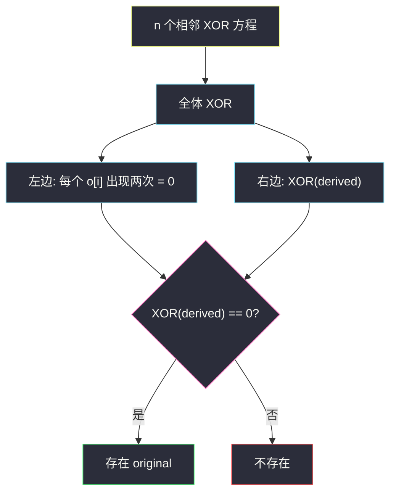
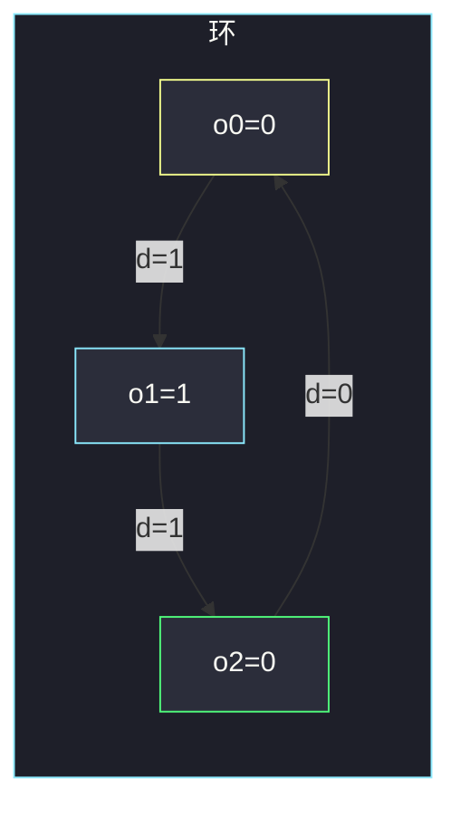

# 相邻值的按位异或（全体 XOR · 环上两两抵消）

## 一、问题描述

下标从 0 开始的数组 `derived` 长度为 `n`。它由某个 `original` 按下面规则得到：

- `derived[i] = original[i] XOR original[i+1]`（`i = 0..n-2`）
- `derived[n-1] = original[n-1] XOR original[0]`（首尾相接）

给你 `derived`（每个元素是 0 或 1），问是否**存在**一个 `original` 能生成它。

> 🔗 LeetCode 2683：https://leetcode.cn/problems/neighboring-bitwise-xor/
>
> 数据范围：`1 ≤ n ≤ 10^5`，`derived[i] ∈ {0, 1}`。
>
> 📚 灵茶题单：**二、异或（XOR）的性质**（1518 分）。`x XOR x = 0`，环上每个 `original[i]` 恰好出现两次，全部异或后左边等于 `XOR(derived)`，右边恒为 0。

**示例 1**

```
输入：derived = [1,1,0]
输出：true
解释：original = [0,1,0] 或 [1,0,1] 都可以。
     0^1=1，1^0=1，0^0=0。
```

**示例 2**

```
输入：derived = [1,1]
输出：true
解释：original = [0,1]：0^1=1，1^0=1。
```

**示例 3**

```
输入：derived = [1,0]
输出：false
解释：两条边互相矛盾，不存在 original。
```

**直观理解**

这是一个环：每个结点连出一条标了 0/1 的边。XOR 是模 2 加法，绕环走一圈，每条边加起来必须是 0（每个点进一次出一次）。所以 `derived` 全部 XOR 必须等于 0，这是充要条件。

---

## 二、暴力解法

`original` 每个元素也可以只取 0/1（更高位互相独立，且 `derived` 只有 0/1）。任定 `original[0] = 0`，用前 `n-1` 个方程推出后面每一位：

`original[i+1] = original[i] XOR derived[i]`

最后检查闭环：`original[n-1] XOR original[0] == derived[n-1]`。若失败，再试 `original[0] = 1`。

```python
class Solution:
    def doesValidArrayExist(self, derived: list[int]) -> bool:
        n = len(derived)

        def ok(start: int) -> bool:
            cur = start
            for i in range(n - 1):
                cur ^= derived[i]
            return (cur ^ start) == derived[n - 1]

        return ok(0) or ok(1)
```

`n ≤ 10^5` 线性构造过得去。但它没解释**为什么**两个起点常常同时成功或同时失败，也没压缩成一次 XOR。

### 🔴 瓶颈在哪里

构造只是验证手段。把 `n` 个等式左右两边全部 XOR：左边是 `XOR(derived)`，右边每个 `original[i]` 出现两次变成 0。于是**存在解 ⇔ `XOR(derived) == 0`**，连构造都不必写（除非题目要你输出 `original`）。

---

## 三、优化探索（核心章节）

> 📚 本题在灵茶题单中属于 **二、异或（XOR）的性质**。XOR 满足交换、结合、`x^x=0`、`x^0=x`。前缀 XOR、全体 XOR、成对抵消都从这四条来。

### 3.1 写出 n 个方程

设 `d[i] = derived[i]`，`o[i] = original[i]`：

```
o[0] ^ o[1]     = d[0]
o[1] ^ o[2]     = d[1]
...
o[n-2] ^ o[n-1] = d[n-2]
o[n-1] ^ o[0]   = d[n-1]
```

### 3.2 全体 XOR：左边抵消

左右同时 XOR：

- 左边：每个 `o[i]` 出现在两个方程里，`o[i] ^ o[i] = 0`，整边变成 0。
- 右边：`d[0] ^ d[1] ^ ... ^ d[n-1]`。

所以**必要条件**是 `XOR(derived) == 0`。

### 3.3 这也是充分条件

固定 `o[0]`，前 `n-1` 个方程唯一确定 `o[1]..o[n-1]`。还剩最后一条要满足。把前 `n-1` 条 XOR 起来，中间项抵消：

`d[0] ^ ... ^ d[n-2] = o[0] ^ o[n-1]`

最后一条要求 `d[n-1] = o[n-1] ^ o[0]`，右边正好等于上面。于是最后一条成立 ⇔

`d[n-1] == d[0] ^ ... ^ d[n-2]` ⇔ 全体 XOR 为 0。

与 `o[0]` 取 0 还是 1 无关：一组解的每位同时翻 0/1，仍是解（整体 XOR 一个常数）。所以试一个起点就够；再压缩，连数组都不用造。



### 3.4 n = 1 的特例

`derived = [x]` 意味着 `o[0] ^ o[0] = x`，即 `0 = x`。仍然是 `XOR(derived) == 0`。`[0]` 合法（`original = [0]` 或 `[1]`），`[1]` 不合法。

### 3.5 一句话核心

> **环上每项出现两次，全体 XOR 恒为 0；故存在 original 当且仅当 `XOR(derived) == 0`。**

---

## 四、代码实现

### Python（主解：全体 XOR）

```python
class Solution:
    def doesValidArrayExist(self, derived: list[int]) -> bool:
        x = 0
        for v in derived:
            x ^= v
        return x == 0
```

一行版：`return functools.reduce(operator.xor, derived) == 0`。`sum(derived) % 2 == 0` 也对，因为每个元素只有 0/1，全体 XOR 就是模 2 和。

**变量含义**

| 写法 | 含义 |
|------|------|
| `x` | `derived` 的全体 XOR |
| `x == 0` | 环上方程有解 |

构造版（与暴力同一套，可当验证）：

```python
class Solution:
    def doesValidArrayExist(self, derived: list[int]) -> bool:
        cur = 0
        for v in derived[:-1]:
            cur ^= v
        return (cur ^ 0) == derived[-1]
```

`cur` 推完是 `original[n-1]`（起点 0），闭环检查即最后一式。由 3.3，它和 `XOR(derived)==0` 完全等价。

---

## 五、具体例子演示

**示例 1**：`derived = [1, 1, 0]`。

全体 XOR：`1 ^ 1 ^ 0 = 0`，判 true。

用构造对拍。设 `original[0] = 0`：

| i | 已知 | 公式 | 得到 |
|---|------|------|------|
| 0 | o0=0, d0=1 | o1 = o0 ^ d0 | o1 = 1 |
| 1 | o1=1, d1=1 | o2 = o1 ^ d1 | o2 = 0 |
| 闭环 | o2=0, o0=0, d2=0 | o2 ^ o0 ?== d2 | 0^0=0，成立 |

`original = [0, 1, 0]`。若起点取 1：每位翻过来得 `[1, 0, 1]`，同样合法。



**示例 2**：`derived = [1, 1]`。`1 ^ 1 = 0`，true。

| 起点 | 推出 o1 | 闭环 o1^o0 对 d1=1 |
|------|---------|-------------------|
| 0 | 0^1=1 | 1^0=1，通过 |
| 1 | 1^1=0 | 0^1=1，通过 |

**示例 3**：`derived = [1, 0]`。`1 ^ 0 = 1 ≠ 0`，false。

| 起点 | 推出 o1 | 闭环应对 d1=0 |
|------|---------|---------------|
| 0 | 0^1=1 | 1^0=1 ≠ 0，失败 |
| 1 | 1^1=0 | 0^1=1 ≠ 0，失败 |

两条边要求 `o0^o1=1` 且 `o1^o0=0`，但 `o0^o1` 等于 `o1^o0`，不可能一个 1 一个 0。

**前缀 XOR 表**（示例 1，帮助看出「最后一条自动成立」）：

| 前缀下标 | 前缀 XOR | 含义 |
|----------|----------|------|
| 0 | 0 | 空 |
| 1 | 1 | d0 |
| 2 | 1^1=0 | d0^d1 = o0^o2 |
| 3 | 0^0=0 | 全体，必须回到 0 |

**边界**：`[0]` → true；`[1]` → false；全 0 → true（`original` 全 0 或全 1）；`n=10^5` 仍一次线性扫描。

---

## 六、复杂度分析

| 方法 | 时间 | 空间 | 说明 |
|------|------|------|------|
| 枚举 original（2^n） | 指数 | `O(n)` | 不可用 |
| 试两个起点并构造 | `O(n)` | `O(1)` | 正确，可当验证 |
| 全体 XOR（主解） | `O(n)` | `O(1)` | 充要条件 |

---

## 七、对比总结

| 维度 | 本题（环） | 1720 解码异或后的排列 | 前缀 XOR 还原 |
|------|-----------|------------------------|---------------|
| 方程数 vs 未知数 | n 个方程 n 个未知，有环依赖 | n-1 个方程，给定 first | 给定 pref[0] |
| 有解条件 | 全体 XOR = 0 | 总是有解 | 总是有解 |
| 解的个数 | 0 或 2（整体翻转） | 1 | 1 |
| 要不要构造 | 本题只问存在 | 必须输出 | 必须输出 |

**易错点**

1. **忘记闭环**：只检查前 `n-1` 条，会把示例 3 判成 true。
2. **以为要枚举整个 original**：一位确定则全体确定。
3. **把 XOR 写成 AND/OR**：抵消性质只有 XOR 有。
4. **`n=1` 漏掉**：`[1]` 必须是 false。
5. **返回构造出的数组而不是 bool**：本题只要存在性。

---

## 八、举一反三

| 题目 | 关系 |
|------|------|
| [1720. 解码异或后的数组](https://leetcode.cn/problems/decode-xored-array/) | 链上还原：给定 first，没有闭环条件 |
| [1734. 解码异或后的排列](https://leetcode.cn/problems/decode-xored-permutation/) | 用 `1..n` 的 XOR 先找回 `perm[0]` |
| [2433. 找出前缀异或的原始数组](https://leetcode.cn/problems/find-the-original-array-of-prefix-xor/) | `arr[i] = pref[i] ^ pref[i-1]` |
| [268. 丢失的数字](https://leetcode.cn/problems/missing-number/) | 全体 XOR 抵消成对元素 |
| [2425. 所有数对的异或和](https://leetcode.cn/problems/bitwise-xor-of-all-pairings/) | 每个数出现次数的奇偶决定是否留下 |

**思想迁移**

- 一组 XOR 方程先全体 XOR，看哪些未知数出现偶数次（消掉）——剩下的就是约束。
- 口诀：**「环上相邻 XOR，全部异或必为 0 才有解。」**
