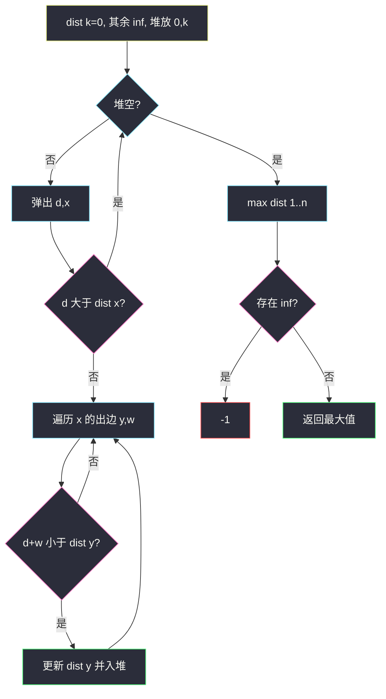
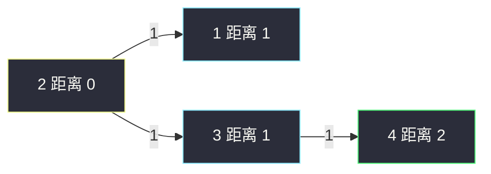

# 网络延迟时间（堆优化 Dijkstra）

## 一、问题描述

`n` 个节点编号 `1 .. n`。有向边 `times[i] = [u, v, w]` 表示信号从 `u` 到 `v` 需要 `w`。从节点 `k` 发出信号，求让**所有**节点都收到的最短时间（即 `k` 到各点最短路的最大值）。有节点不可达则返回 `-1`。

> 🔗 LeetCode 743：https://leetcode.cn/problems/network-delay-time/
>
> 数据范围：`1 ≤ n ≤ 100`，`1 ≤ times.length ≤ 6000`，边权正整数。`n` 很小，朴素 `O(n²)` Dijkstra 也能过；题单要求**堆优化**写法，先建邻接表。
>
> 📚 灵茶题单：**§3.1 单源最短路：Dijkstra 算法**。

**示例 1**

```
输入：times = [[2,1,1],[2,3,1],[3,4,1]], n = 4, k = 2
输出：2
```

从 2 出发：到 1 用 1，到 3 用 1，到 4 经 3 用 2。最慢的是 4，答案 2。

**示例 2**

```
输入：times = [[1,2,1]], n = 2, k = 1
输出：1
```

**示例 3**

```
输入：times = [[1,2,1]], n = 2, k = 2
输出：-1
```

边是 `1 → 2`，从 2 到不了 1。有向图不能当无向用。

**直观理解**

信号沿最短路传播，整张网「全部收到」的时刻 = 最晚收到的那个人 = `max(dist[1], …, dist[n])`。不可达的 `dist` 仍是无穷，答案 `-1`。

---

## 二、暴力解法

朴素 Dijkstra：每次在未确定的点里线性扫出 `dist` 最小的，再松弛出边。`n ≤ 100` 时 `O(n²)` 足够。

```python
from math import inf
from typing import List

class Solution:
    def networkDelayTime(self, times: List[List[int]], n: int, k: int) -> int:
        g = [[inf] * (n + 1) for _ in range(n + 1)]
        for u, v, w in times:
            g[u][v] = w
        dist = [inf] * (n + 1)
        dist[k] = 0
        vis = [False] * (n + 1)
        for _ in range(n):
            x = -1
            for i in range(1, n + 1):
                if not vis[i] and (x < 0 or dist[i] < dist[x]):
                    x = i
            if x < 0 or dist[x] == inf:
                break
            vis[x] = True
            for y in range(1, n + 1):
                if dist[x] + g[x][y] < dist[y]:
                    dist[y] = dist[x] + g[x][y]
        ans = max(dist[1:])
        return -1 if ans == inf else ans
```

稠密图合适。稀疏图（边远少于 `n²`）每次找最小点要扫 `n`，浪费。主解改成堆，按模板可迁到 `n` 更大的题。

### 🔴 瓶颈在哪里

最短路模板：邻接表 + 小根堆。弹出的距离若比 `dist[x]` 大，是过期堆项，跳过。只沿**有向**出边松弛。

---

## 三、优化探索（核心章节）

> 📚 本题在灵茶题单中属于 **§3.1 单源最短路：Dijkstra 算法**。正权图单源最短路，堆优化是默写版。

### 3.1 建有向图

```python
g = [[] for _ in range(n + 1)]  # 节点从 1 到 n
for u, v, w in times:
    g[u].append((v, w))  # 只有 u → v
```

`times[i] = [u,v,w]` 不是双向。示例 3 就是反例。

### 3.2 堆优化 Dijkstra

`dist[x]`：当前已知的 `k → x` 最短路，初始 `dist[k] = 0`，其余无穷。

堆里放 `(d, x)`。弹出后：

- `d > dist[x]`：过期，continue。
- 否则对每条 `x → y` 权 `w`：若 `d + w < dist[y]`，更新并 `heappush`。



正权保证：第一次从堆里弹出某个点时，它的 `dist` 已经是最终最短路（二叉堆实现里用「过期跳过」代替 decrease-key，第一次以最小 `d` 弹出时同样成立）。

### 3.3 一句话核心

> **有向邻接表 + 堆 Dijkstra；答案是 dist[1..n] 的最大值，有 inf 则 -1。**

---

## 四、代码实现

### Python（主解：堆优化 Dijkstra）

```python
from heapq import heappop, heappush
from math import inf
from typing import List

class Solution:
    def networkDelayTime(self, times: List[List[int]], n: int, k: int) -> int:
        g = [[] for _ in range(n + 1)]
        for u, v, w in times:
            g[u].append((v, w))
        dist = [inf] * (n + 1)
        dist[k] = 0
        h = [(0, k)]
        while h:
            d, x = heappop(h)
            if d > dist[x]:
                continue
            for y, w in g[x]:
                nd = d + w
                if nd < dist[y]:
                    dist[y] = nd
                    heappush(h, (nd, y))
        ans = max(dist[1:])
        return -1 if ans == inf else ans
```

下标 `0` 空着不用。`max(dist[1:])` 不要把 `dist[0]` 的 inf 算进去。

和 0-1 BFS 的分工：边权只有 0/1 时双端队列更干净；本题权是任意正整数，必须堆（或朴素 n²）。不要对 `w` 随便 BFS。

Bellman-Ford 松弛 `n-1` 轮也能做，时间 `O(n·m)`，本题边少能过，但不是这一节要练的模板。有负权才轮到它。

---

## 五、具体例子演示

示例 1：`n=4, k=2`，边 `2→1 (1)`，`2→3 (1)`，`3→4 (1)`。

初始：`dist = [_, inf, 0, inf, inf]`（按下标 1..4），堆 `[(0, 2)]`。

| 弹出 | 过期? | 松弛 | dist `[1,2,3,4]` | 堆 |
|------|-------|------|------------------|-----|
| `(0, 2)` | 否 | `2→1`：0+1 < inf → 1；`2→3`：0+1 < inf → 1 | `[1, 0, 1, inf]` | `[(1,1), (1,3)]` |
| `(1, 1)` | 否 | 1 没有出边 | `[1, 0, 1, inf]` | `[(1,3)]` |
| `(1, 3)` | 否 | `3→4`：1+1 < inf → 2 | `[1, 0, 1, 2]` | `[(2,4)]` |
| `(2, 4)` | 否 | 4 没有出边 | `[1, 0, 1, 2]` | 空 |

`max = 2`，没有 inf，返回 2。点 4 必须等 2 个单位，所以整网延迟是 2，不是 1。



示例 3：`k=2`，只有 `1→2`。弹出 2 后没有出边，`dist[1]` 仍 inf → `-1`。若误建成无向，会错误返回 1。

**过期堆项（必须跳过）**

边：`1→2` 权 1，`2→3` 权 2，`1→3` 权 4。从 1 出发。

| 弹出 | 松弛 | dist `[1,2,3]` | 堆 |
|------|------|----------------|-----|
| `(0,1)` | `1→2` 得 1；`1→3` 得 4 | `[0, 1, 4]` | `[(1,2), (4,3)]` |
| `(1,2)` | `2→3`：1+2=3 < 4，改成 3 | `[0, 1, 3]` | `[(3,3), (4,3)]` |
| `(3,3)` | 无出边 | `[0, 1, 3]` | `[(4,3)]` |
| `(4,3)` | `4 > dist[3]=3`，**过期 continue** | 不变 | 空 |

若不过期检查，用旧的 4 再去松弛 3 的出边，会把已经更短的后续点改坏。二叉堆没有 decrease-key，同一点可以进堆多次，**弹出时比一下 `d` 和 `dist[x]`** 是模板的一部分。

`n=100` 时朴素 `O(n²)` 也能过；题单这一节练的是堆模板，迁到 `n=1e5` 的最短路题时只能用主解。

节点 `k` 自己的 `dist` 是 0。若 `n=1` 没有边，`max` 就是 0，返回 0：信号发出的瞬间唯一的节点已经「收到」。不要把 0 特判成 `-1`。

多条平行边：邻接表全部留下，松弛时自然取更短的那次更新；也可以建图时对同一 `(u,v)` 只留最小 `w`，不是必须。

---

## 六、复杂度分析

| 方法 | 时间 | 空间 | 说明 |
|------|------|------|------|
| 朴素 Dijkstra | `O(n²)` | `O(n²)` 邻接矩阵 或 `O(n+m)` | `n=100` 能过 |
| 堆优化（主解） | `O(m log n)` | `O(n+m)` 邻接表 + 堆 | 过期项使堆可能到 `O(m)` |
| Floyd 全源 | `O(n³)` | `O(n²)` | 小题能过，不是单源模板 |

二叉堆没有 decrease-key 时，每次松弛都 push，时间按 `O(m log m)` 理解也可以，通常写成 `O(m log n)`。

---

## 七、对比总结

| 维度 | BFS | Dijkstra 堆 | Bellman-Ford |
|------|-----|-------------|--------------|
| 边权 | 必须全 1 | 非负 | 可负，不能负环 |
| 本题 | 权不是 1 | 对 | 能过但慢 |
| 方向 | 看建图 | 只走 u→v | 同 |

**易错点**

1. **无向化**：漏掉示例 3，从 k 顺着反向边走。
2. **下标 0**：节点是 `1..n`，`max(dist)` 若含 `dist[0]` 会永远 inf。
3. **答案取 min 或取 k 自己的 0**：要的是最慢的人，`max`。
4. **不过期跳过**：同一点多次入堆，旧的大距离会把已更新的 `dist` 再松弛坏。必须 `if d > dist[x]: continue`。
5. **负权**：本题没有；负权不能 Dijkstra。
6. **忘了不可达**：有一个 inf 就 `-1`，不要只看能到达的点的 max。

---

## 八、举一反三

| 题目 | 关系 |
|------|------|
| [1514. 概率最大的路径](https://leetcode.cn/problems/path-with-maximum-probability/) | Dijkstra，松弛改成乘概率、堆改最大 |
| [1631. 最小体力消耗路径](https://leetcode.cn/problems/path-with-minimum-effort/) | 边权是高度差绝对值，Dijkstra / 二分 |
| [787. K 站中转内最便宜的航班](https://leetcode.cn/problems/cheapest-flights-within-k-stops/) | 限制边数，Bellman-Ford / 分层最短路 |
| [778. 水位上升的泳池中游泳](https://leetcode.cn/problems/swim-in-rising-water/) | 网格最短路，堆里按高度 |

**思想迁移**

- 正权单源最短路 → 邻接表 + 堆 Dijkstra；0-1 边权可换成 0-1 BFS。
- 「所有人收到的时刻」= 单源 `dist` 的 max，不是某条特定路径。
- 口诀：**「有向建图；堆弹过期跳过；答案 max(dist)，有 inf 则 -1。」**
