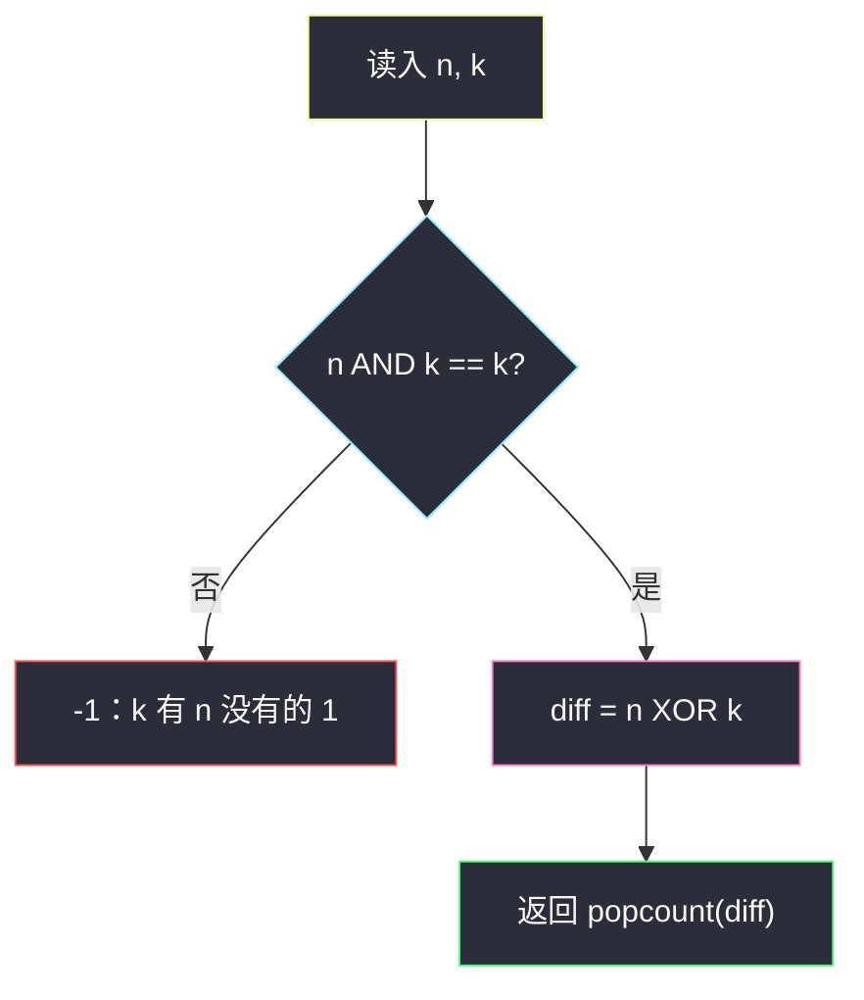
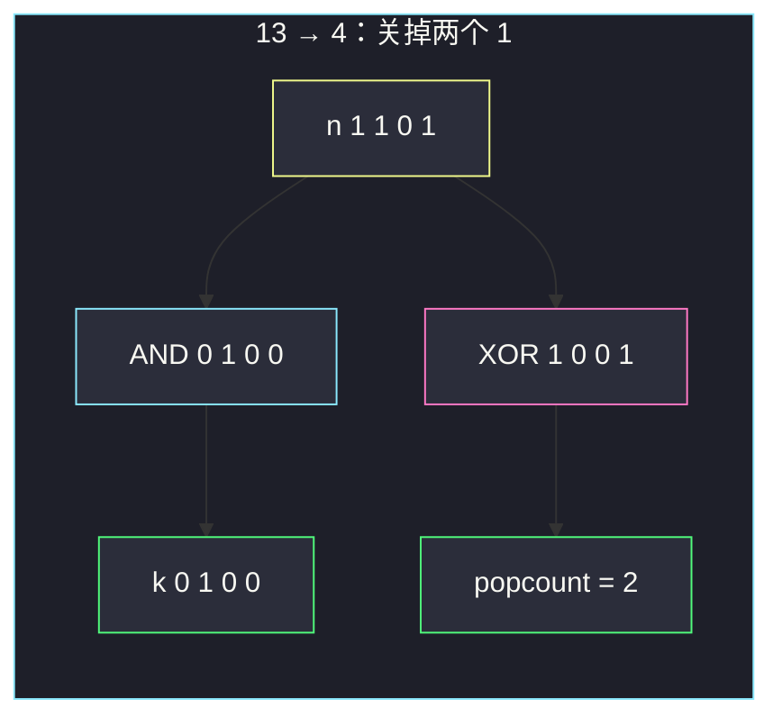

# 使两个整数相等的位更改次数（AND 判定 + popcount）

## 一、问题描述

给你两个正整数 `n` 和 `k`。一次操作：把 `n` 二进制表示里**某一个 1 改成 0**（不能把 0 改成 1）。返回使 `n` 变成 `k` 所需的最少操作次数；若不可能，返回 `-1`。

> 🔗 LeetCode 3226：https://leetcode.cn/problems/number-of-bit-changes-to-make-two-integers-equal/
>
> 数据范围：`1 ≤ n, k ≤ 10⁶`。
>
> 📚 灵茶题单：**一、基础题**（1247 分）。只能 1→0，意味着 `k` 的 1 必须是 `n` 的 1 的子集：`n & k == k`。合法时，多出来的那些 1 的个数就是 `popcount(n XOR k)`。

**示例 1**

```
输入：n = 13, k = 4
输出：2
解释：13 = 1101₂，4 = 0100₂。把第 1 位和第 4 位（从右往左、从 1 计）的 1 改成 0。
```

**示例 2**

```
输入：n = 21, k = 21
输出：0
解释：已经相等，不用改。
```

**示例 3**

```
输入：n = 14, k = 13
输出：-1
解释：14 = 1110₂，13 = 1101₂。k 的最低位是 1，n 对应位是 0，无法凭空造出 1。
```

**直观理解**

你只能「关掉」`n` 里已有的灯（1→0），不能「打开」原来是灭的灯。所以 `k` 里每一盏亮着的灯，`n` 里本来就得是亮的。关掉的盏数 = `n` 比 `k` 多出来的那些 1。

---

## 二、暴力解法

从 `n` 出发，每次枚举一个为 1 的位关掉，BFS 直到变成 `k` 或搜完所有「`n` 的 1-子集」。`n ≤ 10⁶` 最多约 20 位，子集 `2^{popcount(n)}` 能过，但完全没必要。

```python
class Solution:
    def minChanges(self, n: int, k: int) -> int:
        if n == k:
            return 0
        seen = {n}
        q = [n]
        steps = 0
        while q:
            nxt = []
            steps += 1
            for x in q:
                bit = 1
                tmp = x
                while tmp:
                    if x & bit:
                        y = x ^ bit
                        if y == k:
                            return steps
                        if y not in seen:
                            seen.add(y)
                            nxt.append(y)
                    bit <<= 1
                    tmp >>= 1
            q = nxt
        return -1
```

### 🔴 瓶颈在哪里

关掉哪些 1、顺序如何，互不影响。目标是否可达，只取决于「`k` 的 1 是不是都在 `n` 里」；次数就是多出来的 1 的个数。一次 AND、一次 XOR、一次 popcount 即可。

---

## 三、优化探索（核心章节）

> 📚 灵茶题单位运算模板：先性质，再代码。本题用到 **AND 子集** 和 **popcount**。

### 3.1 只能 1→0：k 必须是 n 的位子集

逐位看四种组合：

| n 的该位 | k 的该位 | 能否做到 | 操作 |
|---------|---------|----------|------|
| 0 | 0 | 能 | 不动 |
| 0 | 1 | **不能** | 需要 0→1，规则禁止 |
| 1 | 0 | 能 | 把这一位 1 改成 0，计 1 次 |
| 1 | 1 | 能 | 不动 |

「不能」那一行：`k` 该位为 1 而 `n` 为 0。所有位都不出现这一行 ⇔ `k` 的每一个 1 在 `n` 里也是 1 ⇔ **`n & k == k`**。

为什么 AND 能判定：`n & k` 会把 `k` 里那些 `n` 为 0 的位清掉。若清完还等于 `k`，说明没有位被清掉，即 `k` 是 `n` 的子集。

### 3.2 合法时次数 = popcount(n XOR k)

`n XOR k` 的某一位为 1 ⇔ 这一位上 `n` 和 `k` 不同。在已经通过 AND 判定的前提下，不可能出现「`k=1, n=0`」，所以不同的位**全部是**「`n=1, k=0`」——正好是要关掉的那些 1。

`popcount`（Python 里 `int.bit_count()`）数有多少个 1，就是操作次数。每次关掉一位，互不影响，次数就是汉明距离，也是最少次数。



### 3.3 一句话核心

> **`n & k == k` 保证 k 的 1 都在 n 里；合法则 `popcount(n ^ k)` 就是要关掉的 1 的个数。**

---

## 四、代码实现

### Python（主解）

```python
class Solution:
    def minChanges(self, n: int, k: int) -> int:
        if n & k != k:
            return -1
        return (n ^ k).bit_count()
```

一行版：`return -1 if n & k != k else (n ^ k).bit_count()`。

**变量含义**

| 写法 | 含义 |
|------|------|
| `n & k == k` | `k` 是 `n` 的位子集（AND 判定） |
| `n ^ k` | 合法时 = `n` 中多出来的那些 1 |
| `.bit_count()` | popcount，1 的个数 = 操作次数 |

`n ≤ 10⁶`，不超过 20 个二进制位，手写循环数 1 也可以：`while x: x &= x - 1; cnt += 1`。

---

## 五、具体例子演示

**示例 1**：`n = 13 = 1101₂`，`k = 4 = 0100₂`。从右往左编号 1..4：

| 位（从右、从 1） | n | k | n AND k | n XOR k | 动作 |
|-----------------|---|---|---------|---------|------|
| 1 | 1 | 0 | 0 | 1 | 关掉 |
| 2 | 0 | 0 | 0 | 0 | 不动 |
| 3 | 1 | 1 | 1 | 0 | 不动 |
| 4 | 1 | 0 | 0 | 1 | 关掉 |

`n & k = 0100₂ = 4 == k`，判定通过。`n ^ k = 1001₂`，popcount = 2。与官方一致。



**示例 2**：`n = k = 21`。`21 & 21 == 21`，`21 ^ 21 = 0`，`bit_count() = 0`。

**示例 3**：`n = 14 = 1110₂`，`k = 13 = 1101₂`：

| 位（从右、从 1） | n | k | 冲突? |
|-----------------|---|---|-------|
| 1 | 0 | 1 | **是：k 要 1，n 是 0** |
| 2 | 1 | 0 | 否（可关） |
| 3 | 1 | 1 | 否 |
| 4 | 1 | 1 | 否 |

`n & k = 1100₂ = 12 ≠ 13`，返回 `-1`。即使把 n 的第 2 位关掉得到 `1100₂ = 12`，也到不了 13。

**边界**：`n=1, k=1` → 0；`n=1, k=2`（`01₂` vs `10₂`）→ `-1`；`n=7=111₂, k=1=001₂` → 关掉两个 1，答案 2。

---

## 六、复杂度分析

| 方法 | 时间 | 空间 | 说明 |
|------|------|------|------|
| BFS 枚举关灯 | `O(2^{popcount(n)})` | 同阶 | 正确但重 |
| AND + popcount（主解） | `O(1)` | `O(1)` | 位宽固定，Python `bit_count` 线性于位数也可看成 `O(log n)` |

位数 `≤ ⌊log₂(10⁶)⌋ + 1 = 20`，常数。

---

## 七、对比总结

| 维度 | 无限制位翻转（汉明距离） | 本题（只能 1→0） |
|------|-------------------------|------------------|
| `0→1` | 允许 | 禁止 |
| 判定 | 总能互变 | 必须 `n & k == k` |
| 次数 | `popcount(n ^ k)` | 同样，但先判定 |

**易错点**

1. **只算 XOR 的 popcount、不做 AND 判定**：示例 3 会得到 2 而不是 `-1`。
2. **写成 `n & k == n`**：那是「n 是 k 的子集」，方向反了（变成只能 0→1）。
3. **把 `n - k` 当答案**：只有在 `n` 真包含 `k` 的位且差恰好等于那些 2 的幂之和时才碰巧对；用 popcount 才稳。
4. **从左数位序和题目「第 1、4 位」对不上**：计数从 LSB 往左、从 1 开始；不影响算法，只影响读题。
5. **`n < k` 直接返回 -1**：数值更小不代表位子集关系，例如 `n=8=1000₂, k=1` 才是不可能；`n=7, k=1` 数值更大却合法。反过来 `n=4, k=5` 才是 `n < k` 且不可能。用 AND，不要用大小比较代替。

---

## 八、举一反三

| 题目 | 关系 |
|------|------|
| [461. 汉明距离](https://leetcode.cn/problems/hamming-distance/) | 允许双向翻转，答案就是 `popcount(x ^ y)` |
| [2220. 转换数字的最少位翻转次数](https://leetcode.cn/problems/minimum-bit-flips-to-convert-number/) | 同上，无 1→0 限制 |
| [191. 位 1 的个数](https://leetcode.cn/problems/number-of-1-bits/) | 单独练 popcount / `n &= n - 1` |
| [1318. 或运算的最小翻转次数](https://leetcode.cn/problems/minimum-flips-to-make-a-or-b-equal-to-c/) | 按位看哪些必须 0→1、哪些必须 1→0 |
| [2997. 使数组异或和等于 K 的最少操作次数](https://leetcode.cn/problems/minimum-number-of-operations-to-make-array-xor-equal-to-k/) | 操作是翻转一位，答案仍是某个 XOR 的 popcount |

**思想迁移**

- 「只能删 1、不能加 1」= 目标是当前数的位子集 = AND 判定。
- 口诀：**「先 `n & k == k`，再数 `(n ^ k)` 里有几个 1。」**
