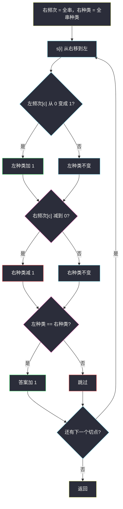
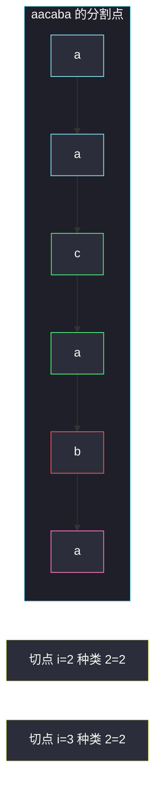

# 字符串的好分割数目（左右种类数相等）

## 一、问题描述

给你小写字符串 `s`。把它分成左右两段**非空**连续子串：左 `s[0..i]`、右 `s[i+1..n-1]`（`0 ≤ i ≤ n-2`）。若两段的**不同字符种类数**相等，称为一次好分割。求好分割的个数。

> 🔗 LeetCode 1525：https://leetcode.cn/problems/number-of-good-ways-to-split-a-string/
>
> 数据范围：`1 ≤ s.length ≤ 10^5`，只含小写字母。
>
> 📚 灵茶题单：**专题：前后缀分解**。分割点左边维护种类，右边用频次数组（或后缀种类数组）同步减少。种类不是出现次数——`"aa"` 的种类是 1。

**示例 1**

```
输入：s = "aacaba"
输出：2
解释：好分割是 "aac" | "aba"（种类 2=2）和 "aaca" | "ba"（种类 2=2）。
```

**示例 2**

```
输入：s = "abcd"
输出：1
解释：只有 "ab" | "cd"（种类 2=2）。
```

**直观理解**

在相邻两字符之间插一根竖线。左边出现过几种字母、右边还剩几种字母，相等就计 1。竖线不能插在串外（两段都要非空）。`n=10^5` 时不能每个分割点都 `set(左)+set(右)`。

---

## 二、暴力解法

枚举每个分割点，两边各建集合。

```python
class Solution:
    def numSplits(self, s: str) -> int:
        n = len(s)
        ans = 0
        for i in range(n - 1):
            if len(set(s[: i + 1])) == len(set(s[i + 1 :])):
                ans += 1
        return ans
```

每个切点拷贝切片再去重，最坏 `O(n²)`。两例能对；`n=10^5` 超时。

### 🔴 瓶颈在哪里

切点从 `i` 移到 `i+1`，左边只多一个字符，右边只少一个字符。用频次数组维护「某字母还在不在这一侧」，种类数可以 `O(1)` 更新。

---

## 三、优化探索（核心章节）

> 📚 本题在灵茶题单中属于 **专题：前后缀分解**。和商店关门代价一样：枚举分割点，左信息用前缀增量维护，右信息先统计全体再往左吐。

### 3.1 种类数怎么变

左侧加入字符 `c`：若它之前次数是 0，左种类 `+1`，再把次数 `+1`。
右侧去掉字符 `c`：先把次数 `-1`，若减到 0，右种类 `-1`。

必须先减右侧再判断是否归零；左侧必须先看「是不是新种类」再加次数。顺序反了会错。

### 3.2 扫描范围

`i` 从 0 走到 `n-2`：每次把 `s[i]` 从右边移到左边，然后比较种类。这样保证左右都非空（最后一格不移走）。`n=1` 时循环不执行，答案 0，符合「无法分成两段非空」。

也可以先开一个 `rightKind[i]` = `s[i..]` 的种类，再左扫；频次数组一趟就够，不必真开后缀数组。



### 3.3 一句话核心

> **竖线从左往右推：左边纳入新字母可能种类 +1，右边吐掉最后一次出现则种类 -1；相等就记一次好分割。**

---

## 四、代码实现

### Python（主解：左增右减种类）

```python
class Solution:
    def numSplits(self, s: str) -> int:
        right = [0] * 26
        for ch in s:
            right[ord(ch) - 97] += 1
        r_kind = sum(1 for x in right if x)
        left = [0] * 26
        l_kind = 0
        ans = 0
        for i in range(len(s) - 1):
            x = ord(s[i]) - 97
            if left[x] == 0:
                l_kind += 1
            left[x] += 1
            right[x] -= 1
            if right[x] == 0:
                r_kind -= 1
            if l_kind == r_kind:
                ans += 1
        return ans
```

**变量含义**

| 写法 | 含义 |
|------|------|
| `left[x]` / `right[x]` | 字母 `x` 在当前左段 / 右段的出现次数 |
| `l_kind` / `r_kind` | 当前左右不同字母个数 |
| `i` 循环到 `n-2` | 右段至少留一个字符 |
| `ord(ch)-97` | `'a'..'z'` 映到 `0..25` |

用 `set` 维护左右也可以，但 `discard` / 再查长度在 Python 里常数更大；26 格数组是默写首选。

---

## 五、具体例子演示

仍然**先画分割点**，再逐步跟踪种类。

### 5.1 官方示例 1：`s = "aacaba"`

下标：`0:a 1:a 2:c 3:a 4:b 5:a`。初始右频次 a:4, c:1, b:1，右种类 3；左空，种类 0。

| 切在 i 后 | 左段 | 右段 | 移入 | 左种类 | 右种类 | 好？ |
|-----------|------|------|------|--------|--------|------|
| 0 | a | acaba | a | 1 | 3 | 否 |
| 1 | aa | caba | a | 1 | 3 | 否 |
| 2 | aac | aba | c | 2 | 2 | **是** |
| 3 | aaca | ba | a | 2 | 2 | **是** |
| 4 | aacab | a | b | 3 | 1 | 否 |

`i=2`：第一次纳入 `c`，左种类 1→2；右边 `c` 次数 1→0，右种类 3→2。相等。
`i=3`：`a` 左边已有，左种类仍 2；右边 `a` 还剩 1 个（末尾），右种类仍 2。

答案 2。对拍官方。



绿节点是两条好竖线紧邻的字符：`c|a` 与 `a|b`。

### 5.2 官方示例 2：`s = "abcd"`

四种字母各一次，初始右种类 4。

| 切在 i 后 | 左 | 右 | 左种类 | 右种类 |
|-----------|----|----|--------|--------|
| 0 | a | bcd | 1 | 3 |
| 1 | ab | cd | 2 | 2 |
| 2 | abc | d | 3 | 1 |

只有中间一刀。答案 1。对拍官方。

### 5.3 边界

`s="a"`：无法切，0。
`s="aa"`：`"a"|"a"` 种类 1=1，答案 1。
`s="aba"`：`"a"|"ba"` → 1 对 2；`"ab"|"a"` → 2 对 1。答案 0。种类看的是集合大小，不是长度。

---

## 六、复杂度分析

| 方法 | 时间 | 空间 | 说明 |
|------|------|------|------|
| 每个切点两边 set | `O(n²)` | `O(n)` | 超时 |
| 左增右减 26 数组（主解） | `O(n)` | `O(1)` | 字母表大小 26 |
| 后缀种类数组再左扫 | `O(n)` | `O(n)` | 更直观，多一个数组 |

---

## 七、对比总结

| 维度 | 每次 set(切片) | 频次 + 种类计数 |
|------|----------------|-----------------|
| 切点移动 | 重建集合 | 一个字符的 ±1 |
| 种类含义 | `len(set)` | 次数从 0↔正 时改种类 |
| `n=10^5` | 不行 | 线性 |

**易错点**

1. **把种类当成长度 / 当成总次数**：`"aa"` 种类是 1。
2. **循环到 `n-1`**：右段被搬空，题目要求两段非空。
3. **先加左次数再判断新种类**：`left[x]` 已经不是 0，新字母检测失败。
4. **右边先判断再减**：次数还是 1 时就减种类，字母其实还在。
5. **`n=1` 特判漏写**：循环上界 `n-1` 自然得到 0，不必单独 if，但要意识到。

---

## 八、举一反三

| 题目 | 关系 |
|------|------|
| [2483. 商店的最少代价](https://leetcode.cn/problems/minimum-penalty-for-a-shop/)（`minimum-penalty-for-a-shop.md`） | 同批前后缀：枚举竖线，左 N + 右 Y |
| [1930. 长度为 3 的不同回文子序列](https://leetcode.cn/problems/unique-length-3-palindromic-subsequences/)（`unique-length-3-palindromic-subsequences.md`） | 同批：两端 first/last，中间数种类 |
| [1422. 分割字符串的最大得分](https://leetcode.cn/problems/maximum-score-after-splitting-a-string/) | 同样非空左右分割，左 0 右 1 计数 |
| [2405. 子字符串的分组](https://leetcode.cn/problems/optimal-partition-of-string/) | 也维护「当前段种类」，但是贪心切多段 |
| [2270. 分割数组的方案数](https://leetcode.cn/problems/number-of-ways-to-split-array/) | 数组版分割点，比的是前缀和 |
| [916. 单词子集](https://leetcode.cn/problems/word-subsets/) | 26 数组统计种类/频次的另一面 |

**思想迁移**

- 分割点左右各自一个可增量维护的统计量（和、种类、最大值），就不要对每个切点重建。
- 口诀：**「左纳入、右吐出；次数过 0 才改种类；两段非空才计数。」**
