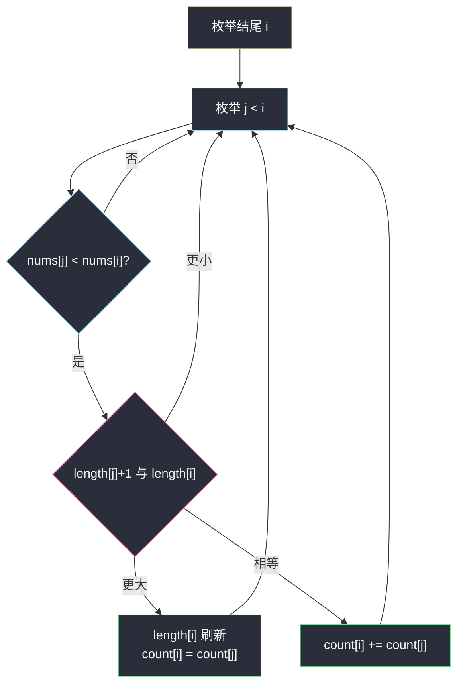
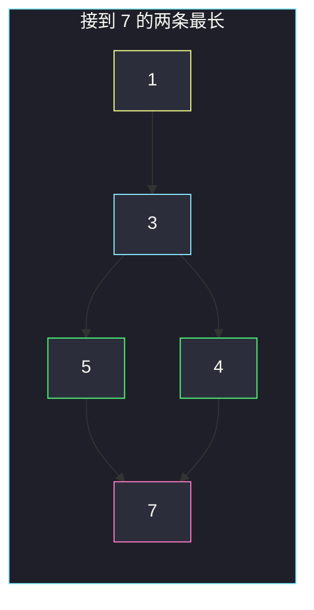

# 最长递增子序列的个数（LIS 计数 · length + count）

## 一、问题描述

给整数数组 `nums`，求**严格递增**的最长递增子序列（LIS）有多少条。只要下标递增、值严格递增，不必连续。两条子序列只要选取的下标集合不同，就算不同的两条。

> 🔗 LeetCode 673：https://leetcode.cn/problems/number-of-longest-increasing-subsequence/
>
> 数据范围：`1 ≤ n ≤ 2000`，`-10^6 ≤ nums[i] ≤ 10^6`。
>
> 📚 灵茶题单：**§4.2 最长递增子序列（LIS）**。#300 只求长度；本题在同一套 `O(n²)` 转移上多维护一个 `count[i]`：以 i 结尾的 LIS 有几条。长度被刷新则重置计数，长度持平则累加。答案是所有 `length[i] == maxLen` 的 `count[i]` 之和。

**示例 1**

```
输入：nums = [1,3,5,4,7]
输出：2
解释：两条 LIS：1,3,5,7 与 1,3,4,7，长度都是 4。
```

**示例 2**

```
输入：nums = [2,2,2,2,2]
输出：5
解释：严格递增长度为 1，五个单元素各算一条。
```

**直观理解**

#300 的 `dp[i]` 是「以 i 结尾的 LIS 长度」。现在要数有多少条达到全局最长。不能只看长度，必须在转移时把「有多少种方式接到这个长度」一起加起来。

---

## 二、暴力解法

枚举所有子序列，过滤严格递增的，记录最大长度并计数。`2^n` 条，`n=2000` 不可能。

稍微好一点：DFS 从每个起点往后拼递增，仍然指数级。

```python
class Solution:
    def findNumberOfLIS(self, nums: list[int]) -> int:
        n = len(nums)
        best = 0
        cnt = 0

        def dfs(i: int, last: int, length: int) -> None:
            nonlocal best, cnt
            if length > best:
                best, cnt = length, 1
            elif length == best:
                cnt += 1
            for j in range(i + 1, n):
                if nums[j] > last:
                    dfs(j, nums[j], length + 1)

        for i in range(n):
            dfs(i, nums[i], 1)
        return cnt
```

官方两例都能过。每个递增子序列都被单独走一遍，重复前缀极多。

### 🔴 瓶颈在哪里

以 i 结尾的 LIS，其倒数第二个位置是某个 `j < i` 且 `nums[j] < nums[i]`。把所有这样的 j 按「能接到的长度」分类：更长则换源，同样长则把条数加起来。`O(n²)` 扫完所有 `(j,i)` 对即可。

---

## 三、优化探索（核心章节）

> 📚 灵茶 **§4.2 LIS**。长度数组与 #300 相同：`length[i] = 1 + max{length[j] | j<i 且 nums[j]<nums[i]}`（没有这样的 j 则为 1）。计数：只从「正好能让 length[i] 达到这个最大值」的那些 j 上累加 `count[j]`；若某个 j 把长度刷新得更大，`count[i]` 整段作废，改成 `count[j]`。

### 3.1 状态

- `length[i]`：以 `nums[i]` 为结尾的 LIS **长度**。
- `count[i]`：以 `nums[i]` 为结尾、且长度恰好为 `length[i]` 的 LIS **条数**。

初值：每个单独一个数都是长度 1 的递增子序列，`length[i] = count[i] = 1`。

对 `j < i` 且 `nums[j] < nums[i]`（严格递增）：

1. `length[j] + 1 > length[i]`：发现更长接法，`length[i] = length[j] + 1`，`count[i] = count[j]`（从这批 j 重新开始数）。
2. `length[j] + 1 == length[i]`：同样长的另一批来源，`count[i] += count[j]`。
3. `length[j] + 1 < length[i]`：更短，丢掉。

答案：`maxLen = max(length)`，然后把所有 `length[i] == maxLen` 的 `count[i]` 加起来。

注意：全局 LIS 可以在数组中间结束，所以是「所有达到 maxLen 的结尾」求和，不是只看 `count[n-1]`。



### 3.2 为什么刷新时要重置而不是累加

`count[i]` 始终对应**当前这个** `length[i]`。长度从 2 变成 3 时，原来那些长度为 2 的结尾方式不再是 LIS，条数必须扔掉，只保留能接到 3 的来源。

### 3.3 和二分 LIS 的关系

#300 求长度可以用 `O(n log n)` 的 tails 数组。求**条数**时二分不直接给出 count，需要树状数组 / 线段树维护「长度→条数」。`n=2000` 时 `O(n²)` 更干净，也是 §4.2 计数题的主模板。

### 3.4 一句话核心

> **length 跟 #300；count 在长度被刷新时重置、持平时累加；答案是所有最长结尾的 count 之和。**

---

## 四、代码实现

### Python（主解：O(n²) 双数组）

```python
class Solution:
    def findNumberOfLIS(self, nums: list[int]) -> int:
        n = len(nums)
        # length[i]: 以 i 结尾的 LIS 长度
        # count[i]: 以 i 结尾、长度恰为 length[i] 的 LIS 条数
        length = [1] * n
        count = [1] * n
        for i in range(n):
            for j in range(i):
                if nums[j] < nums[i]:
                    if length[j] + 1 > length[i]:
                        length[i] = length[j] + 1
                        count[i] = count[j]
                    elif length[j] + 1 == length[i]:
                        count[i] += count[j]
        max_len = max(length)
        return sum(c for l, c in zip(length, count) if l == max_len)
```

**变量含义**

| 写法 | 含义 |
|------|------|
| `length[i] = 1` | 至少包含自己 |
| `nums[j] < nums[i]` | 严格递增，相等不能接 |
| `> ` 分支 | 更长来源，count 重置为这个 j 的条数 |
| `==` 分支 | 并列来源，条数相加 |
| 最后按 `max_len` 过滤 | LIS 不必以最后一个元素结尾 |

### Java（最优解）

```java
class Solution {
    public int findNumberOfLIS(int[] nums) {
        int n = nums.length;
        int[] length = new int[n];
        int[] count = new int[n];
        int maxLen = 0, ans = 0;
        for (int i = 0; i < n; i++) {
            length[i] = 1;
            count[i] = 1;
            for (int j = 0; j < i; j++) {
                if (nums[j] < nums[i]) {
                    if (length[j] + 1 > length[i]) {
                        length[i] = length[j] + 1;
                        count[i] = count[j];
                    } else if (length[j] + 1 == length[i]) {
                        count[i] += count[j];
                    }
                }
            }
            if (length[i] > maxLen) {
                maxLen = length[i];
                ans = count[i];
            } else if (length[i] == maxLen) {
                ans += count[i];
            }
        }
        return ans;
    }
}
```

Java 版边算边维护 `maxLen` 与答案，少一次扫尾。

---

## 五、具体例子演示

### 5.1 官方示例 1：逐步填 length / count

`nums = [1, 3, 5, 4, 7]`。

| i | nums[i] | 能接的 j | length[i] | count[i] |
|---|---------|----------|-----------|----------|
| 0 | 1 | 无 | 1 | 1 |
| 1 | 3 | 0：1+1=2 | 2 | count[0]=1 |
| 2 | 5 | 0→2；1→3 更长 | 3 | count[1]=1 |
| 3 | 4 | 0→2；1→3 更长；2 的 5 不小于 4 | 3 | count[1]=1 |
| 4 | 7 | 0→2；1→3；2→4 刷新；3→4 持平 | 4 | 1+1=2 |

i=4 细拆（这是计数关键步）：

1. 初值 `length[4]=1, count[4]=1`。
2. j=0：`1<7`，`1+1=2>1`，刷新为 2，`count=1`。
3. j=1：`3<7`，`2+1=3>2`，刷新为 3，`count=1`。
4. j=2：`5<7`，`3+1=4>3`，刷新为 4，`count=count[2]=1`（对应 `1,3,5,7`）。
5. j=3：`4<7`，`3+1=4 == 4`，`count += count[3]` → `1+1=2`（加上 `1,3,4,7`）。

`maxLen = 4`，只有 i=4 达到，答案 `2`。对拍官方。



两张表对照：

```
下标     0  1  2  3  4
nums     1  3  5  4  7
length   1  2  3  3  4
count    1  1  1  1  2
```

### 5.2 官方示例 2：全相等

`nums = [2,2,2,2,2]`。任意 `j<i` 都有 `nums[j] == nums[i]`，接不上。

```
length = [1,1,1,1,1]
count  = [1,1,1,1,1]
```

`maxLen = 1`，五个结尾都算，答案 `5`。对拍官方。若误写成 `<=` 非严格递增，会连成一条长度为 5 的，答案变成 1，错。

### 5.3 多个结尾都是最长

例如 `[1, 2, 4, 3, 5]`：

```
length = [1, 2, 3, 3, 4]
count  = [1, 1, 1, 1, 2]
```

仍是一个最长结尾。若改成 `[1,3,2]`：

```
length = [1, 2, 2]
count  = [1, 1, 1]
```

`maxLen=2`，i=1 与 i=2 都是最长结尾，答案 `1+1=2`（`[1,3]` 与 `[1,2]`）。说明最后一步必须把所有最长结尾加起来。

---

## 六、复杂度分析

| 方法 | 时间 | 空间 | 说明 |
|------|------|------|------|
| 枚举子序列 | `O(2^n)` | `O(n)` | 超时 |
| length+count（主解） | `O(n²)` | `O(n)` | n=2000 约 4×10^6 |
| 树状数组维护计数 | `O(n log n)` | `O(n)` | 求长度可二分；求条数要权值树，不作为主解 |

---

## 七、对比总结

| 维度 | #300 LIS 长度 | 本题条数 | #674 连续递增 |
|------|---------------|----------|----------------|
| 子序列/子数组 | 可跳着选 | 可跳着选 | 必须相邻 |
| 额外数组 | 只要 length | length + count | 一维即可 |
| 相等元素 | 不能接 | 不能接 | 不能接 |

**易错点**

1. **只返回 `count[n-1]`**：LIS 可能在中间结束，要按 `maxLen` 汇总。
2. **刷新长度时 `count[i] += count[j]`**：必须赋值重置，否则把短的条数掺进来。
3. **非严格递增**：`nums[j] < nums[i]` 不是 `<=`。全相等数组是试金石。
4. **`count[i]` 初值写成 0**：单个元素也是一条长度为 1 的 LIS。
5. **把「不同下标集合」理解成「值序列去重」**：`[2,2,2]` 是 3 条，不是 1 条。

---

## 八、举一反三

| 题目 | 关系 |
|------|------|
| [300. 最长递增子序列](https://leetcode.cn/problems/longest-increasing-subsequence/) | 只要 length，不要 count |
| [674. 最长连续递增序列](https://leetcode.cn/problems/longest-continuous-increasing-subsequence/) | 子数组，不能跳 |
| [646. 最长数对链](https://leetcode.cn/problems/maximum-length-of-pair-chain/) | LIS 思想，同目录 `maximum-length-of-pair-chain.md` |
| [354. 俄罗斯套娃信封](https://leetcode.cn/problems/russian-doll-envelopes/) | 二维 LIS |
| [329. 矩阵中的最长递增路径](https://leetcode.cn/problems/longest-increasing-path-in-a-matrix/) | 网格上的 LIS，同目录 `longest-increasing-path-in-a-matrix.md` |
| [1671. 得到山形数组的最少删除次数](https://leetcode.cn/problems/minimum-number-of-removals-to-make-mountain-array/) | 正反两遍 LIS 长度 |

**思想迁移**

- 求 LIS **长度**只要 `max`；求 **方案数** 在「更优则重置、同样优则相加」上计数。这个套路对路径数、方案数 DP 普遍适用。
- 口诀：**「length 刷新就重置 count；length 持平就累加；按全局最长把 count 加总。」**
