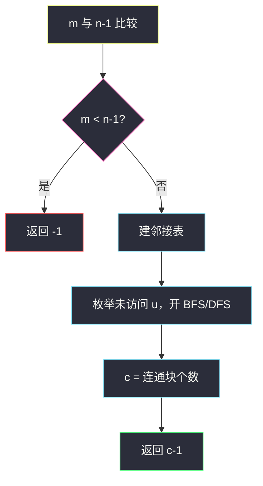
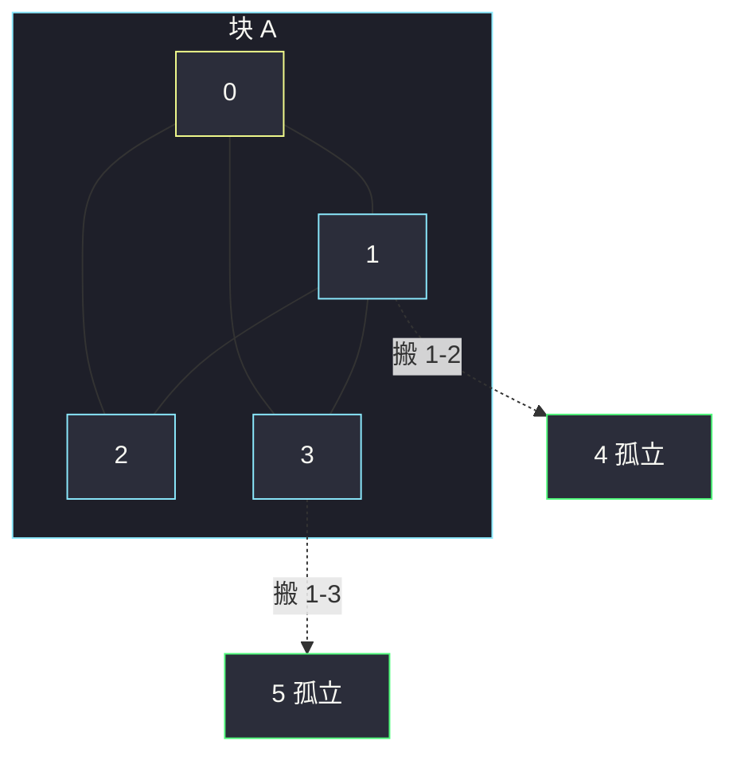

# 连通网络的操作次数（数连通分量 · 多余边够用）

## 一、问题描述

`n` 台电脑编号 `0 .. n-1`，`connections` 给出已有的网线（无向）。一次操作：拔掉某根现有线，接到另一对尚未直接相连的电脑上。求让整个网络连通的最少操作次数；不可能则返回 `-1`。

> 🔗 LeetCode 1319：https://leetcode.cn/problems/number-of-operations-to-make-network-connected/
>
> 数据范围：`1 <= n <= 10^5`，边数 `m <= 10^5`，无重边、无自环。
>
> 📚 灵茶题单：**图论 · §1.1 深度优先搜索（DFS）**（1633 分）。

**示例 1**

```
输入：n = 4, connections = [[0,1],[0,2],[1,2]]
输出：1
{0,1,2} 已连通且有一根多余边，{3} 孤立。
把 1-2 拔掉接到 1-3（或任意跨块），一次即可。
```

**示例 2**

```
输入：n = 6, connections = [[0,1],[0,2],[0,3],[1,2],[1,3]]
输出：2
一块 {0,1,2,3}，加上孤立的 4、5。三块合成一块需要 2 根线。
```

**示例 3**

```
输入：n = 6, connections = [[0,1],[0,2],[0,3],[1,2]]
输出：-1
只有 4 根线，连通 6 台至少要 5 根，线不够。
```

**直观理解**

不要真的模拟「拔哪根、插哪对」。连通 `n` 个点至少要 `n-1` 条边；线不够直接 `-1`。线够时，答案只取决于现在有几块——`c` 个连通分量合成 1 块，最少搬 `c-1` 根线。块内的环/多余边就是搬迁的「库存」。

---

## 二、暴力解法

把「选哪 `c-1` 条冗余边、接到哪对块间」当成搜索：先找出所有环上的边，再枚举接到哪些分量对上。

```python
# 伪代码：指数级，仅说明「真去搬线」有多糟
# 1. 找所有可以拔的边（删掉后该连通块仍连通）
# 2. 枚举把它们插到哪些尚未相连的分量之间
# n、m 达 1e5，搜索空间爆炸，且实现极繁。
```

就算改成「每次随便拔一根环边、接到两个分量」，也要反复判环、反复建图，`O(n)` 次操作每次 `O(n+m)`，在 `n=1e5` 下超时，还容易写错。

### 复杂度

- **时间**：搜索版指数级；朴素模拟 `O(c · (n+m))` 最坏仍太大。
- **空间**：邻接表 `O(n+m)`。

### 🔴 瓶颈在哪里

操作次数的**数值**有闭式：与具体拔哪根无关。只需要 `m` 和连通分量个数 `c`。一次遍历（或并查集）数出 `c` 就结束。

---

## 三、优化探索（核心章节）

> 📚 本题在灵茶题单中属于 **图论 · §1.1 DFS**。先建无向邻接表，DFS/BFS/并查集数连通分量；不要模拟拔线。

### 3.1 线够不够

树有 `n-1` 条边。任意连通图至少这么多。因此：

- `m < n - 1` → 即使把线全拔下来重新铺，也铺不满，返回 `-1`。
- `m >= n - 1` → 总量够，一定能连通（可以把所有线当成可任意重布的资源）。

### 3.2 答案为什么是 `c - 1`

当前有 `c` 个连通分量。把 `c` 块连成 1 块，恰好需要 `c-1` 条跨块边。

块内最少边数是 `n - c`（每块一棵树）。多余边 = `m - (n - c)`。要能拿出 `c-1` 根去搭桥，需要：

`m - (n - c) ≥ c - 1` 即 `m ≥ n - 1`

这和 3.1 是同一件事：线够时，多余边**一定够**搬 `c-1` 次。所以：

> **边数 `< n-1` 则 `-1`，否则答案 = 连通分量数 `- 1`。**

对拍确认：示例 1 `m=3=n-1`，`c=2`，答案 1；示例 2 `m=5=n-1`，`c=3`，答案 2；示例 3 `m=4<5`，`-1`。孤立点也各算一个分量。

### 3.3 怎么数 `c`

建无向邻接表，`visited` 扫 `0 .. n-1`：每碰到一个未访问点就开一次 DFS/BFS，`c += 1`。



Python 链状图递归 DFS 会爆栈（`n=1e5`），主解用 BFS。并查集同样 `O(n+m)`，合并时顺带得到 `c`。递归 DFS 的骨架就是：碰到未访问点 `c += 1`，然后把整块 `g[u]` 走完；和 BFS 只是容器从队列换成调用栈。

### 3.4 一句话核心

> **线不足 `n-1` 就无解；否则建图数连通块，答案是块数减一。多余边自动够用，不必模拟拔插。**

---

## 四、代码实现

### Python（主解：BFS 数分量）

```python
from collections import deque

class Solution:
    def makeConnected(self, n: int, connections: list[list[int]]) -> int:
        if len(connections) < n - 1:
            return -1

        g = [[] for _ in range(n)]
        for a, b in connections:
            g[a].append(b)
            g[b].append(a)

        seen = [False] * n
        c = 0
        for i in range(n):
            if seen[i]:
                continue
            c += 1
            seen[i] = True
            q = deque([i])
            while q:
                u = q.popleft()
                for v in g[u]:
                    if not seen[v]:
                        seen[v] = True
                        q.append(v)
        return c - 1
```

**变量含义**

| 变量 | 含义 |
|------|------|
| `g` | 无向邻接表 |
| `seen` | 已归入某个连通块 |
| `c` | 连通分量个数 |
| 返回值 | `c-1` 次搬线 |

并查集版：初始 `c = n`，`union` 成功则 `c -= 1`，最后同样先判 `m < n-1`，再返回 `c-1`。

递归 DFS 与上面同逻辑，把队列换成函数调用；`n=1e5` 的链在 Python 默认递归深度下会爆，所以主解不用它。Java 默认栈更深，写 DFS 一般能过。

### Java（可选 · 并查集）

```java
class Solution {
    public int makeConnected(int n, int[][] connections) {
        if (connections.length < n - 1) return -1;
        int[] p = new int[n];
        for (int i = 0; i < n; i++) p[i] = i;
        int c = n;
        for (int[] e : connections) {
            int a = find(p, e[0]), b = find(p, e[1]);
            if (a != b) { p[a] = b; c--; }
        }
        return c - 1;
    }
    int find(int[] p, int x) {
        while (p[x] != x) { p[x] = p[p[x]]; x = p[x]; }
        return x;
    }
}
```

---

## 五、具体例子演示

示例 1：`n=4`，边 `0-1, 0-2, 1-2`。`m=3 >= 3`。从 0 BFS 访到 `{0,1,2}`，`c=1`；3 未访问，再开一块，`c=2`。答案 `1`。块内 `1-2` 就是那根可搬的多余边。

以示例 2 跟踪 BFS 数块，并对照并查集合并。

`n = 6`，边 `0-1, 0-2, 0-3, 1-2, 1-3`。`m = 5 >= 5`，继续。

**BFS 数分量**

| 起点 i | 动作 | 访问到的点 | c |
|--------|------|------------|---|
| 0 | 新块，BFS | 0 弹出 → 入队 1；1 弹出 → 入队 2,3（0 已见）；2、3 弹出，邻居均已见 | 1 |
| 1,2,3 | 已 seen，跳过 | — | 1 |
| 4 | 新块，邻居为空 | {4} | 2 |
| 5 | 新块 | {5} | 3 |

`c = 3`，答案 `2`。

**并查集逐步合并**（`parent` 路径压缩后的代表）

| 边 | find 两端 | 操作 | c |
|----|-----------|------|---|
| 开始 | — | 每人一棵树 | 6 |
| 0-1 | 0, 1 不同 | 1 挂到 0 | 5 |
| 0-2 | 0, 2 不同 | 2 挂到 0 | 4 |
| 0-3 | 0, 3 不同 | 3 挂到 0 | 3 |
| 1-2 | 都是 0 | 同块，多余边，不合并 | 3 |
| 1-3 | 都是 0 | 多余边 | 3 |

最终三块：`{0,1,2,3}`、`{4}`、`{5}`。两根多余边正好拿去连 4 和 5。



虚线是一次可行搬法，不是唯一方案；任何两根跨块边都可以，次数都是 2。

示例 3：`m=4 < 5`，第一行就返回 `-1`，不必数块。即便数出来 `c=3`，`c-1=2` 也是错的——线不够，搬不动。`n=1` 且无边：`m=0 >= 0`，`c=1`，答案 0（已经连通）。

---

## 六、复杂度分析

| 方法 | 时间 | 空间 | 说明 |
|------|------|------|------|
| 反复模拟拔插 | 至少 `O(c(n+m))` | `O(n+m)` | 无必要 |
| BFS/DFS 数块（主解） | `O(n+m)` | `O(n+m)` 邻接表 | Python 用 BFS 防爆栈 |
| 并查集 | `O(n+m)` | `O(n)` | 不必建邻接表 |

---

## 七、对比总结

| 维度 | 模拟搬线 | 数分量 |
|------|----------|--------|
| 做的事 | 真改边 | 只统计 |
| 答案来源 | 操作计数 | `c-1` 闭式 |
| 实现 | 易错、慢 | 标准遍历 |

**易错点**

1. **忘了 `m < n-1`**：分量减 1 在线不够时是错的（示例 3：`c-1` 会得到 2，实际应 `-1`）。
2. **只建单向边**：从某一端 BFS 走不出整块，`c` 偏大。
3. **孤立点没计入**：外层必须扫 `0 .. n-1`，不能只扫 `connections` 里出现过的点。
4. **返回 `c` 而不是 `c-1`**：一块已经连通时应返回 0。
5. 不要去枚举「拔哪根」——环上任意多余边都等价。

---

## 八、举一反三

| 题目 | 关系 |
|------|------|
| [547. 省份数量](https://leetcode.cn/problems/number-of-provinces/) | 只数连通块，本题多一步 `c-1` 与边数判定 |
| [1135. 最低成本连通所有城市](https://leetcode.cn/problems/connecting-cities-with-minimum-cost/) | 同样要连通，边带权 → MST；连通不了返回 `-1` |
| [684. 冗余连接](https://leetcode.cn/problems/redundant-connection/) | 并查集：加边时两端已同块，就是多余边 |
| [1971. 寻找图中是否存在路径](https://leetcode.cn/problems/find-if-path-exists-in-graph/) | 只问两点是否同块 |
| [2316. 统计无向图中无法互相到达点对数](https://leetcode.cn/problems/count-unreachable-pairs-of-nodes-in-an-undirected-graph/) | 先求出各块大小再组合 |

**思想迁移**

- 连通 `c` 块最少加 `c-1` 条边；边权再出现就是 MST。
- 口诀：**「边不够 `n-1` 就 -1；否则答案是连通块数减一，多余边不用数。」**
