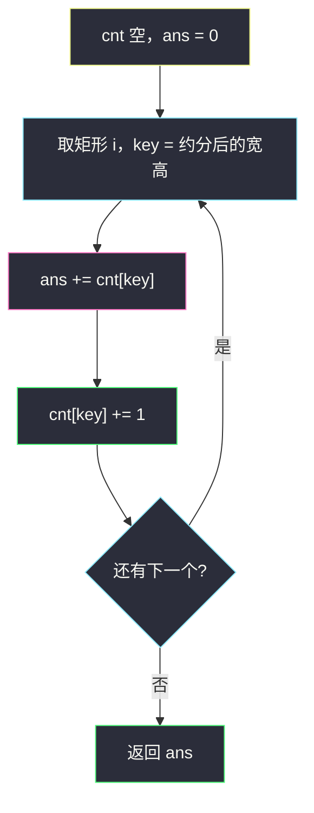
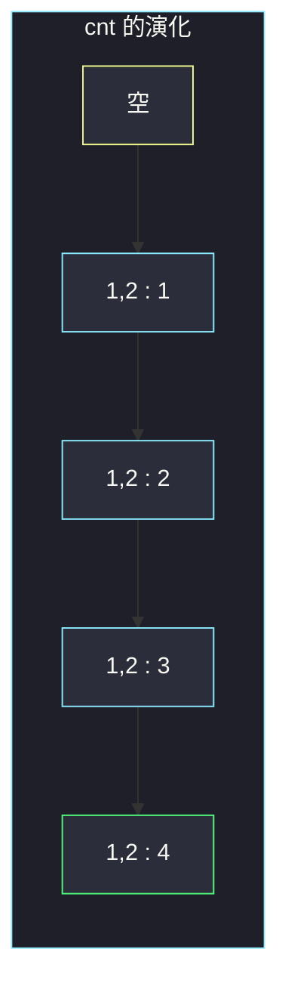

# 可互换矩形的组数

## 一、问题描述

`n` 个矩形，`rectangles[i] = [width_i, height_i]`。两个矩形 `i < j` 若宽高比相同（实数除法 `width_i / height_i == width_j / height_j`），则称为**可互换**。求有多少对可互换矩形。

> 🔗 LeetCode 2001：https://leetcode.cn/problems/number-of-pairs-of-interchangeable-rectangles/
>
> 数据范围：`1 ≤ n ≤ 10^5`，`1 ≤ width, height ≤ 10^5`。答案可能超过 32 位整数。

**示例 1**

```
输入：rectangles = [[4,8],[3,6],[10,20],[15,30]]
输出：6
解释：四个矩形宽高比都是 1/2，C(4,2) = 6，每对都可互换。
```

**示例 2**

```
输入：rectangles = [[4,5],[7,8]]
输出：0
解释：4/5 ≠ 7/8，没有可互换对。
```

**直观理解**

比例相同 = 约分后的整数对 `(w/g, h/g)` 相同。同组里任意两个都能配成一对。边枚举边用哈希表记「左边已经出现过多少个相同比例」，每来一个新矩形就加上当前组已有个数。

---

## 二、暴力解法

枚举所有 `i < j`，用交叉相乘避免浮点：

```python
class Solution:
    def interchangeableRectangles(self, rectangles: List[List[int]]) -> int:
        n = len(rectangles)
        ans = 0
        for i in range(n):
            w1, h1 = rectangles[i]
            for j in range(i + 1, n):
                w2, h2 = rectangles[j]
                if w1 * h2 == w2 * h1:
                    ans += 1
        return ans
```

交叉相乘是对的：`w1/h1 == w2/h2` ⇔ `w1 * h2 == w2 * h1`（边长都为正）。

### 复杂度

- **时间**：`O(n²)`。`n = 10^5` 超时。
- **空间**：`O(1)`。

乘积最大 `10^5 * 10^5 = 10^10`，Python 没问题；Java 要用 `long` 做乘法。

### 🔴 瓶颈在哪里

两两比较没有利用「相同比例可以分组」。把比例收成哈希键后，枚举右端点时左边同组个数直接查表，变成线性。

---

## 三、优化探索（核心章节）

> 📚 本题在灵茶题单中属于 **枚举右，维护左 · §0.1**。配对问题的标准骨架：右边来一个，先向左查「能和我配对的有多少」，再把自己放进表。

### 3.1 键怎么取

不要用 `w/h` 当 float 键：`1/3` 和某些约分前的分数在浮点里可能对不齐。用 gcd 约成最简整数对：

```
g = gcd(w, h)
key = (w/g, h/g)
```

`(4,8)`、`(3,6)`、`(10,20)`、`(15,30)` 都会变成 `(1,2)`。

### 3.2 枚举右，维护左

哈希表 `cnt[key]` = 当前下标左侧、比例为 `key` 的矩形个数。

扫到矩形 `i` 时：

1. 它能和左边 `cnt[key]` 个配成对，答案加上这么多；
2. 再 `cnt[key] += 1`，供更右边的人来查。

先查后加，保证只统计 `i < j` 这种有序对，不会自己和自己配、也不会算两次。

若最后再扫一遍表，对每组大小 `c` 加 `c*(c-1)/2`，结果相同。单趟「先查后存」更贴 §0.1 模板，也方便以后改成「带下标约束」的变体。



### 3.3 答案范围

最坏全部同一比例：`n*(n-1)/2`，`n=10^5` 时约 `5·10^9`。Python `int` 无上限；Java 必须返回 `long`，中间累加也用 `long`。

### 3.4 一句话核心

> **比例约分成整数对当 key；枚举右，答案加 `cnt[key]`，再 `cnt[key] += 1`。**

---

## 四、代码实现

### Python（主解：枚举右 + gcd 哈希）

```python
class Solution:
    def interchangeableRectangles(self, rectangles: List[List[int]]) -> int:
        cnt = {}
        ans = 0
        for w, h in rectangles:
            g = math.gcd(w, h)
            key = (w // g, h // g)
            ans += cnt.get(key, 0)
            cnt[key] = cnt.get(key, 0) + 1
        return ans
```

**变量含义**

| 变量 | 含义 |
|------|------|
| `key` | 约分后的 `(w/g, h/g)`，比例的唯一代表 |
| `cnt[key]` | 当前矩形左侧、同比例的个数 |
| `ans` | 可互换对的总数 |

提交时文件顶部加 `import math`。`collections.Counter` 也可以，先 `ans += cnt[key]` 再 `cnt[key] += 1`，逻辑一样。

### Java（注意 long）

```java
class Solution {
    public long interchangeableRectangles(int[][] rectangles) {
        Map<Long, Integer> cnt = new HashMap<>();
        long ans = 0;
        for (int[] rec : rectangles) {
            int w = rec[0], h = rec[1];
            int g = gcd(w, h);
            // 把 (w/g, h/g) 压成一个 long，避免自定义 pair
            long key = (((long) (w / g)) << 32) | (h / g);
            ans += cnt.getOrDefault(key, 0);
            cnt.merge(key, 1, Integer::sum);
        }
        return ans;
    }

    private int gcd(int a, int b) {
        while (b != 0) {
            int t = a % b;
            a = b;
            b = t;
        }
        return a;
    }
}
```

`h/g ≤ 10^5`，塞进低 32 位不会撞。Python 直接用元组更干净。

---

## 五、具体例子演示

以示例 1：`[[4,8],[3,6],[10,20],[15,30]]`。初始 `cnt` 空，`ans = 0`。

| 步 | 矩形 | gcd | key | 查表 cnt | 操作后 ans | 操作后 cnt |
|----|------|-----|-----|----------|------------|------------|
| 0 | (4,8) | 4 | (1,2) | 0 | 0 | `{(1,2): 1}` |
| 1 | (3,6) | 3 | (1,2) | 1 | 0+1=1 | `{(1,2): 2}` |
| 2 | (10,20) | 10 | (1,2) | 2 | 1+2=3 | `{(1,2): 3}` |
| 3 | (15,30) | 15 | (1,2) | 3 | 3+3=6 | `{(1,2): 4}` |

每一步「先加再存」：第 3 个矩形看见左边已经有 2 个同比例，贡献 2 对 `(0,2)`、`(1,2)`。



示例 2：`(4,5) → (4,5)` 入表；`(7,8) → (7,8)` 查到 0。答案 0。

最后一组大小 4，`4*3/2 = 6`，和单趟累加一致。

---

## 六、复杂度分析

| 方法 | 时间 | 空间 | 说明 |
|------|------|------|------|
| 两两交叉相乘 | `O(n²)` | `O(1)` | 超时 |
| 枚举右 + 哈希（主解） | `O(n)` | `O(n)` | gcd 可视为常数；不同比例最多 n 种 |

---

## 七、对比总结

| 维度 | 两两比较 | 枚举右维护左 |
|------|----------|----------------|
| 比例判定 | 每次交叉相乘 | 约分一次，相等就是同一 key |
| 计数 | 命中 +1 | 左边同组个数一次性加上 |
| 顺序 | 显式 `i < j` | 先查后存，自动保证 `i < j` |

**易错点**

1. **用 float 当 key**：优先 gcd 整数对。
2. **先存后查**：会把当前矩形算进自己的配对数，整组变成 `c*(c+1)/2`，多算了 `c`。
3. **Java 用 `int` 接答案**：`5·10^9` 溢出。
4. **约分漏了**：`(2,4)` 和 `(3,6)` 不约分就对不上，其实都是 1:2。

**模板（§0.1 枚举右，维护左）**

```python
ans += cnt[key]      # 先查左边
cnt[key] += 1        # 再把自己放进去
```

---

## 八、举一反三

| 题目 | 关系 |
|------|------|
| [1512. 好数对的数目](https://leetcode.cn/problems/number-of-good-pairs/) | 同值配对，key 就是数值本身 |
| [3185. 构成整天的下标对数目 II](https://leetcode.cn/problems/count-pairs-that-form-a-complete-day-ii/) | 同款 §0.1，key 是小时数模 24 |
| [2342. 数位和相等数对的最大和](https://leetcode.cn/problems/max-sum-of-a-pair-with-equal-sum-of-digits/) | 枚举右，左边只留同数位和的最大值 |
| [1128. 等价多米诺骨牌对的数量](https://leetcode.cn/problems/number-of-equivalent-domino-pairs/) | 无序对 `[a,b]` 归一成 key 再计数 |
| [1814. 统计一个数组中好对子的数目](https://leetcode.cn/problems/count-nice-pairs-in-an-array/) | `nums[i] - rev(i)` 相同则配对 |

**思想迁移**

- 「有多少对满足某种相等」几乎都是：设计一个能代表「相等」的 key，枚举右、查左。
- 口诀：**「约分成 key，先加表里的个数，再把自己登记进去。」**
