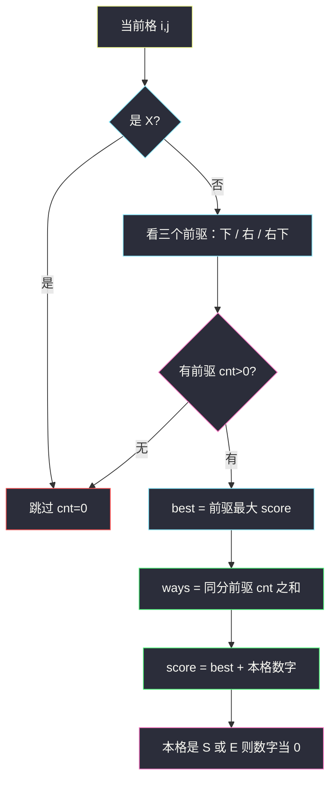

# 最大得分的路径数目（网格双数组 DP · 最大分 + 计数）

## 一、问题描述

`n × n` 字符棋盘。**右下角**是起点 `'S'`，**左上角**是终点 `'E'`，其余格子是数字 `'1'..'9'` 或障碍 `'X'`。

从 `S` 出发，每步只能走到没有障碍的相邻格，方向只允许：

- **上**（行号减 1）
- **左**（列号减 1）
- **左上**（行、列同时减 1）

路径得分 = 沿途所有**数字格子**之和（`S`、`E` 不是数字，计 0）。求「最大得分」以及「取得该最大得分的路径条数」，条数对 `10^9+7` 取模。如果从 `S` 到不了 `E`，返回 `[0, 0]`。

> 🔗 LeetCode 1301：https://leetcode.cn/problems/number-of-paths-with-max-score/
>
> 数据范围：`2 ≤ n ≤ 100`。`board[i]` 是长度为 `n` 的字符串。
>
> 📚 灵茶题单：**§2.2 进阶**。在「最小路径和 / 路径计数」上同时维护两张表：当前最大分、达到该分的方案数。

方法名 `pathsWithMaxScore`。Java 参数是 `List<String> board`。

**示例 1**

```
输入：board = ["E23","2X2","12S"]
输出：[7,1]
```

棋盘（行 0 在上）：

```
E 2 3
2 X 2
1 2 S
```

唯一最大分路径：`S → 2(上) → 3(上) → 2(左) → E(左)`，数字和 `2+3+2=7`。

**示例 2**

```
输入：board = ["E12","1X1","21S"]
输出：[4,2]
```

两条得分都是 4：右边走上去再左到 `E`；左边走过去再上到 `E`。

**示例 3**

```
输入：board = ["E11","XXX","11S"]
输出：[0,0]
```

中间一整行障碍，三种走法都进 `X`，到不了。

**直观理解**

只能往左上角「靠近」，不会走回头路，是一张 DAG。每个格子的最优来自它右下方向的三个前驱（那些格子走一步就能到这里）。一边记最大分，一边把「同分」的路径数加起来。

---

## 二、暴力解法

从 `S` DFS，三种方向，累加数字；走到 `E` 时更新全局最大分和计数。碰到 `X` 或出界就停。

```python
class Solution:
    def pathsWithMaxScore(self, board: list[str]) -> list[int]:
        MOD = 10**9 + 7
        n = len(board)
        best = -1
        ways = 0

        def val(i: int, j: int) -> int:
            c = board[i][j]
            return 0 if c in "SE" else int(c)

        def dfs(i: int, j: int, s: int) -> None:
            nonlocal best, ways
            if i == 0 and j == 0:
                if s > best:
                    best, ways = s, 1
                elif s == best:
                    ways = (ways + 1) % MOD
                return
            for di, dj in ((-1, 0), (0, -1), (-1, -1)):
                ni, nj = i + di, j + dj
                if 0 <= ni < n and 0 <= nj < n and board[ni][nj] != "X":
                    dfs(ni, nj, s + val(ni, nj))

        dfs(n - 1, n - 1, 0)
        return [0, 0] if best < 0 else [best, ways]
```

三例都能对拍。同一格子会被很多路径反复走进去，最坏接近指数。`n=100` 不可用。

### 🔴 瓶颈在哪里

到达格子 `(i,j)` 时，后面怎么走与「具体哪条路来的」无关，只与「来到这里的最大分」以及「有多少条路达到这个最大分」有关。两张 `n×n` 表即可。这和 64 最小路径和、62 路径数是同一张网格，只是目标从「最小」变成「最大」，并且多记一维计数。

---

## 三、优化探索（核心章节）

> 📚 灵茶 **§2.2 进阶**。网格路径 DP 的标准加料：`score[i][j]` 与 `cnt[i][j]` 同步更新。前驱不是「上和左」（那是从左上往右下走），本题从右下往左上走，前驱是 **下、右、右下**。

### 3.1 坐标系与方向（务必和官方一致）

数组第 0 行是棋盘**最上**一行。官方题面：

- `S` 在 **最右下**，即 `board[n-1][n-1]`
- `E` 在 **最左上**，即 `board[0][0]`
- 移动：**上 / 左 / 左上**（行减小、列减小，或两者一起）

走一步之后，曼哈顿距离到 `E` 严格变小（对角一步减 2，正交减 1），所以无环。

从格子 `(i,j)` 反推：谁能一步走到这里？是 `(i+1,j)`（向下的前驱，它向上走）、`(i,j+1)`（向右的前驱，它向左走）、`(i+1,j+1)`（右下的前驱，它走左上）。填表时必须先填行号、列号更大的格子，即 `i` 从 `n-1` 降到 `0`，`j` 从 `n-1` 降到 `0`。

### 3.2 两张表

- `score[i][j]`：从 `S` 走到 `(i,j)` 的最大数字和（含当前格的数字，若当前是 `S`/`E` 则加 0）
- `cnt[i][j]`：达到这个最大和的路径数，模 `10^9+7`

障碍：`cnt=0`，不参与转移。

初始化：`cnt[n-1][n-1] = 1`，`score[n-1][n-1] = 0`。其余 `cnt=0` 表示还不可达。

对每个非障碍、非起点的 `(i,j)`：

1. 看三个前驱里 `cnt>0` 的。
2. 令 `best` 为这些前驱 `score` 的最大值，`ways` 为所有达到 `best` 的前驱 `cnt` 之和（取模）。
3. 若 `ways==0`，此格不可达，跳过。
4. 否则 `score[i][j] = best + val(i,j)`，`cnt[i][j] = ways`。

`val`：`'S'`/`'E'` 为 0，数字字符转整数。**不要**把 `'S'` 的 ASCII 加进去。

终点：若 `cnt[0][0]==0` 返回 `[0,0]`，否则返回 `[score[0][0], cnt[0][0]]`。



### 3.3 到不了 vs 最大分为 0

`[0,0]` **只表示不可达**。存在合法路径但数字和为 0 时（例如 `2×2` 直接对角 `S → E`，沿途没有数字），应返回 `[0, 路径数]`，不能写成 `[0,0]`。

判定必须看 `cnt[E]`，不要看 `score[E]`。把所有 `score` 初值设成 0、又不看 `cnt`，会把「没人走到」和「走到了但分为 0」混在一起。

障碍 **挡不住对角**：从 `(i,j)` 走到 `(i-1,j-1)` 不经过旁边两格。示例 3 到不了，是因为中间行三个都是 `X`，正交和对角第一步都踩 `X`，不是「对角被两侧挡住」。

### 3.4 模数只作用在计数上

最大分上限：最长路径大约 `2n-1` 个格子，去掉 `S`/`E` 后数字 ≤ `9 × (2n-3)`，`n=100` 时大约 1800，`int` 够用。`cnt` 必须每步 `% (10^9+7)`，两条同分路径合并时就要模，不能留到最后。

### 3.5 从终点倒推也可以

`score'[i][j]` 表示从 `(i,j)` 走到 `E` 的最大分。起点在 `S`，转移方向改为看「上、左、左上」三个后继。初始化改到 `E`：`cnt'[0][0]=1`。两种写法镜像，答案相同。下文主解用从 `S` 正向填（前驱在右下），和「人从 S 出发」同一方向，例子里好对表。

### 3.6 一句话核心

> **从右下往左上填；每个格看下/右/右下三个前驱的最大分，同分把路径数加起来；S 和 E 加 0；cnt 为 0 就是到不了。**

---

## 四、代码实现

### Python（主解）

```python
class Solution:
    def pathsWithMaxScore(self, board: list[str]) -> list[int]:
        MOD = 10**9 + 7
        n = len(board)
        score = [[0] * n for _ in range(n)]
        cnt = [[0] * n for _ in range(n)]
        cnt[n - 1][n - 1] = 1  # 从 S 出发，1 条空路径

        def cell_val(i: int, j: int) -> int:
            c = board[i][j]
            return 0 if c in "SE" else int(c)

        # 前驱：下、右、右下（它们分别向上 / 向左 / 向左上走到当前格）
        preds = ((1, 0), (0, 1), (1, 1))
        for i in range(n - 1, -1, -1):
            for j in range(n - 1, -1, -1):
                if board[i][j] == "X":
                    continue
                if i == n - 1 and j == n - 1:
                    continue
                best, ways = -1, 0
                for di, dj in preds:
                    pi, pj = i + di, j + dj
                    if 0 <= pi < n and 0 <= pj < n and cnt[pi][pj]:
                        if score[pi][pj] > best:
                            best = score[pi][pj]
                            ways = cnt[pi][pj]
                        elif score[pi][pj] == best:
                            ways = (ways + cnt[pi][pj]) % MOD
                if ways == 0:
                    continue
                score[i][j] = best + cell_val(i, j)
                cnt[i][j] = ways
        if cnt[0][0] == 0:
            return [0, 0]
        return [score[0][0], cnt[0][0]]
```

### Java（最优解）

```java
import java.util.List;

class Solution {
    public int[] pathsWithMaxScore(List<String> board) {
        final int MOD = 1_000_000_007;
        int n = board.size();
        int[][] score = new int[n][n];
        int[][] cnt = new int[n][n];
        cnt[n - 1][n - 1] = 1;
        int[][] preds = {{1, 0}, {0, 1}, {1, 1}};
        for (int i = n - 1; i >= 0; i--) {
            for (int j = n - 1; j >= 0; j--) {
                char c = board.get(i).charAt(j);
                if (c == 'X') {
                    continue;
                }
                if (i == n - 1 && j == n - 1) {
                    continue;
                }
                int best = -1, ways = 0;
                for (int[] d : preds) {
                    int pi = i + d[0], pj = j + d[1];
                    if (pi < n && pj < n && cnt[pi][pj] > 0) {
                        if (score[pi][pj] > best) {
                            best = score[pi][pj];
                            ways = cnt[pi][pj];
                        } else if (score[pi][pj] == best) {
                            ways = (ways + cnt[pi][pj]) % MOD;
                        }
                    }
                }
                if (ways == 0) {
                    continue;
                }
                int val = (c == 'S' || c == 'E') ? 0 : c - '0';
                score[i][j] = best + val;
                cnt[i][j] = ways;
            }
        }
        if (cnt[0][0] == 0) {
            return new int[] {0, 0};
        }
        return new int[] {score[0][0], cnt[0][0]};
    }
}
```

---

## 五、具体例子演示

### 5.1 官方示例 1：`["E23","2X2","12S"]` → `[7,1]`

格子值（S/E 当 0）：

```
0 2 3
2 X 2
1 2 0
```

按从右下到左上填。每个格写出 `score / cnt`，不可达写 `—`。

|  | 列 0 | 列 1 | 列 2 |
|--|------|------|------|
| 行 2 | 3/1 | 2/1 | **0/1** S |
| 行 1 | 5/1 | X | 2/1 |
| 行 0 | **7/1** E | 7/1 | 5/1 |

逐步：

1. `S(2,2)`：`0/1`。
2. `(2,1)` 数字 2，前驱只有 `(2,2)` → `0+2=2`，`cnt=1`。
3. `(2,0)` 数字 1，前驱 `(2,1)` → `2+1=3`。
4. `(1,2)` 数字 2，前驱 `(2,2)` → `2`。
5. `(1,1)` 是 `X`，跳过。
6. `(1,0)` 数字 2。前驱：`(2,0)=3`、`(2,1)=2`、`(1,1)` 无。最大 3，`score=5`，`cnt=1`。
7. `(0,2)` 数字 3，前驱 `(1,2)=2` → `5`。
8. `(0,1)` 数字 2。前驱：`(1,1)` 无、`(0,2)=5`、`(1,2)=2`。最大 5，`score=7`。
9. `E(0,0)` 加 0。前驱：`(1,0)=5`、`(0,1)=7`、`(1,1)` 无。最大 7，`cnt=1`。

答案 `[7,1]`。那条路是 `S → (1,2) → (0,2) → (0,1) → E`。对拍官方。


另一条 `S → (2,1) → (2,0) → (1,0) → E` 得分 `2+1+2=5`，在 `E` 处被 7 比下去，**不计入** `cnt`。这就是「只加同分前驱」：5 不能和 7 混加。

### 5.2 官方示例 2：`["E12","1X1","21S"]` → `[4,2]`

```
0 1 2
1 X 1
2 1 0
```

|  | 列 0 | 列 1 | 列 2 |
|--|------|------|------|
| 行 2 | 3/1 | 1/1 | 0/1 S |
| 行 1 | 4/1 | X | 1/1 |
| 行 0 | **4/2** E | 4/1 | 3/1 |

`E` 的两个前驱 `(1,0)` 和 `(0,1)` 都是 score 4：

- `(1,0)`：`S → 1(左) → 2(左) → 1(上) → E`，和 `1+2+1=4`
- `(0,1)`：`S → 1(上) → 2(上) → 1(左) → E`，和 `1+2+1=4`

`ways = 1+1=2`。对拍官方 `[4,2]`。

中间 `X` 把棋盘分成左右两条走廊，对角也进不去 `(1,1)`，所以恰好两条、没有交叉捷径。

### 5.3 官方示例 3：整行墙 → `[0,0]`

```
E 1 1
X X X
1 1 S
```

`S` 的三步：上是 `X`，左上是 `X`，左是数字 1（底行还能动）。底行走到头之后，向上全是 `X`，`cnt[0][*]` 全 0。`cnt[E]=0`，返回 `[0,0]`。对拍官方。

注意：若把墙改成只挡正交、对角能穿过的布局，对角**可以直接**从下一行右一列过来。`X` 只禁止走进 `X` 自己，不禁止「跳过旁边两格」的对角步。

### 5.4 最大分为 0 但可达

```
E X
X S
```

`S` 对角一步到 `E`，沿途没有数字。`cnt[E]=1`，`score[E]=0`，应返回 **`[0,1]`**，不是 `[0,0]`。主解用 `cnt[0][0]==0` 判断不可达，这里不会误伤。

`n=2` 且无障碍时还有正交两条（带一个数字）和一条对角。最大分是两条正交里较大的那个数字，计数按是否相等合并。

---

## 六、复杂度分析

| 方法 | 时间 | 空间 | 说明 |
|------|------|------|------|
| DFS 全路径 | 指数 | `O(n)` 栈 | `n=100` 超时 |
| 双数组 DP（主解） | `O(n²)` | `O(n²)` | 每格常数个前驱 |

每格只看 3 个前驱，`100×100×3` 可忽略。

---

## 七、对比总结

| 维度 | 64 最小路径和 | 62 路径数 | 本题 |
|------|--------------|----------|------|
| 方向 | 右 / 下 | 右 / 下 | **左 / 上 / 左上** |
| 起点 | 左上 | 左上 | **右下 S** |
| 优化目标 | 最小和 | 条数 | **最大和 + 最大和的条数** |
| 障碍 | 无 / 63 有 | 63 有 | `'X'` |
| 格子值 | 全是数 | 无 | 数字；**S、E 为 0** |

**易错点**

1. **方向反了**：任务书有的草稿写成「左下 S、右上 E、向右走」，与力扣官方不符。以示例棋盘最后一格是 `S`、第一格是 `E` 为准。
2. **前驱写成上和左**：那是从左上出发的写法。本题填 `(i,j)` 时上和左还没算出来。
3. **把 S/E 当数字**：`int('S')` 或 ASCII 会炸分。一律当 0。
4. **不可达返回 `[score, 0]`**：必须 `[0,0]`。
5. **可达且分为 0 时返回 `[0,0]`**：应返回 `[0, cnt]`。
6. **同分却取 max 后只留一条**：三个前驱 score 相等要把 `cnt` 加起来。
7. **不同分的路径数也加**：只加等于 `best` 的前驱。
8. **计数忘取模**：合并 `ways` 时就要 `% MOD`。
9. **走进 X**：转移前判断，`X` 的 `cnt` 保持 0。
10. **双重计算当前格数字**：只在写入 `score[i][j]` 时加一次 `val`，前驱的 `score` 里已经含前驱自己的数字。

---

## 八、举一反三

| 题目 | 关系 |
|------|------|
| [64. 最小路径和](https://leetcode.cn/problems/minimum-path-sum/) | 网格最优路径，方向相反、求 min |
| [62. 不同路径](https://leetcode.cn/problems/unique-paths/) | 只计数 |
| [63. 不同路径 II](https://leetcode.cn/problems/unique-paths-ii/) | 计数 + 障碍 |
| [174. 地下城游戏](https://leetcode.cn/problems/dungeon-game/) | 从终点倒推更顺 |
| [1575. 统计所有可行路径](https://leetcode.cn/problems/count-all-possible-routes/) | 加油耗维度的路径计数 |
| [741. 摘樱桃](https://leetcode.cn/problems/cherry-pickup/) | 两条路径 / 两人同时 DP |
| [1463. 摘樱桃 II](https://leetcode.cn/problems/cherry-pickup-ii/) | 两人从上往下 |

**思想迁移**

- 「最优值 + 最优值的方案数」永远两张表，更新规则：更优则覆盖计数，同分则累加计数。
- 口诀：**「右下往左上填；三前驱比分；同分加路径；S/E 加零；cnt 零就是到不了。」**
