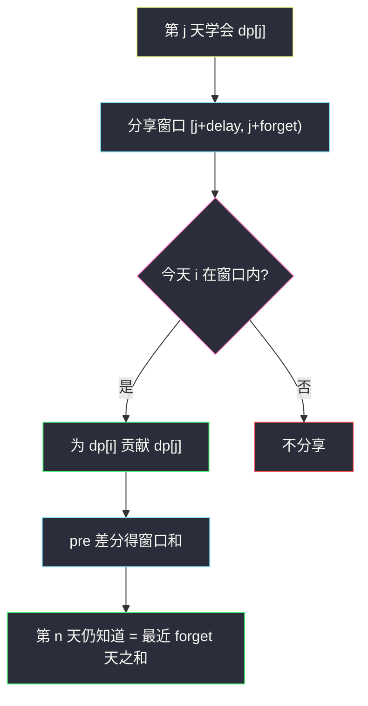

# 知道秘密的人数（前缀和优化分享窗口）

## 一、问题描述

第 1 天有 1 人知道秘密。每个人在得知之后的第 `delay` 天开始，**每天**把秘密分享给 **1 个新人**；得知之后的第 `forget` 天会忘记。忘记的那一天**不能**再分享。求第 `n` 天结束时仍然知道秘密的人数，对 `10^9+7` 取模。

> 🔗 LeetCode 2327：https://leetcode.cn/problems/number-of-people-aware-of-a-secret/
>
> 数据范围：`2 ≤ n ≤ 1000`，`1 ≤ delay < forget ≤ n`。
>
> 📚 灵茶题单：**§11.1 前缀和优化 DP**。`dp[i]` = 第 `i` 天**新得知**的人数。能分享的窗口是半开区间 `[i+delay, i+forget)`。第 `n` 天仍知道 = 最近 `forget` 天新得知之和。窗口求和用前缀和（或滑动窗口）从 `O(n·forget)` 降到 `O(n)`。

**示例 1**

```
输入：n = 6, delay = 2, forget = 4
输出：5
解释：第 1 天 A 得知；A 只在第 3、4 天分享。之后陆续有人学会，第 6 天仍记得的一共 5 人。
```

**示例 2**

```
输入：n = 4, delay = 1, forget = 3
输出：6
```

**直观理解**

不要按「每个人一条时间线」去模拟（人会指数增长）。按**学会日**分桶：同一天学会的人，分享窗口完全一样，人数乘上去即可。忘记当天不能分享，所以分享区间右端是开的。

---

## 二、暴力解法

`dp[i]` 为第 `i` 天新学会的人数。第 `i` 天能分享的人，学会日 `j` 满足 `j+delay ≤ i < j+forget`，即 `j ∈ [i-forget+1, i-delay]`。每人当天恰好教会 1 个新人，所以 `dp[i]` 等于该窗口内 `dp[j]` 之和。答案是 `[n-forget+1, n]` 的 `dp` 之和。

```python
class Solution:
    def peopleAwareOfSecret(self, n: int, delay: int, forget: int) -> int:
        MOD = 10**9 + 7
        dp = [0] * (n + 1)
        dp[1] = 1
        for i in range(2, n + 1):
            lo = max(1, i - forget + 1)
            hi = i - delay
            for j in range(lo, hi + 1):
                dp[i] = (dp[i] + dp[j]) % MOD
        ans = 0
        for j in range(max(1, n - forget + 1), n + 1):
            ans = (ans + dp[j]) % MOD
        return ans
```

官方两例都能过。内层扫窗口，时间 `O(n·forget)`。`n ≤ 1000` 也能过，但和本节「前缀和优化」对不上，窗口是固定长度的滑动和，没必要每次重加。

### 🔴 瓶颈在哪里

相邻两天的分享窗口几乎重叠：从算 `dp[i]` 到算 `dp[i+1]`，左端、右端各滑一格。用前缀和一次减法，或维护跑动和，都是 `O(1)` 转移。

---

## 三、优化探索（核心章节）

> 📚 本题在灵茶题单中属于 **§11.1 前缀和优化 DP**。模板：转移是一段连续下标的 `dp` 之和，先做 `pre[i] = dp[1]+…+dp[i]`，再 `dp[i] = pre[R] - pre[L-1]`。

### 3.1 状态

`dp[i]` = 第 `i` 天**新得知**秘密的人数。

第 1 天给定 1 人：`dp[1] = 1`。

第 `i` 天（`i ≥ 2`）新学会的人数 = 当天仍在分享的人数：

- 学会日 `j` 满足 `j + delay ≤ i` 且 `i < j + forget`
- 即 `i - forget < j ≤ i - delay`，也就是 `j ∈ [i-forget+1, i-delay]`

若右端 `i-delay < 1`，还没有人到期能分享，`dp[i] = 0`。

第 `n` 天仍知道：学会日 `j` 满足 `n < j + forget` 且 `j ≤ n`，即 `j ∈ [n-forget+1, n]`。

### 3.2 前缀和

`pre[i] = dp[1]+…+dp[i]`（`pre[0] = 0`）。

```
dp[i] = pre[i-delay] - pre[i-forget]     # 当 i-delay ≥ 1
答案   = pre[n] - pre[n-forget]
```

下标不够减时当作 0。减法后要取模，Java 里差可能为负，加 `MOD` 再模。

也可以不用前缀数组：维护「当前能分享的人数」`share`，第 `i` 天先加上刚到期的 `dp[i-delay]`，再减去刚忘记的 `dp[i-forget]`，`dp[i] = share`。和前缀和是同一件事。



### 3.3 忘记当天为什么不能算进窗口

题目：得知后第 `forget` 天忘记，**忘记当天不能分享**。学会日为 `j`，忘记日是 `j+forget`。能分享的最后一天是 `j+forget-1`。写成半开区间 `[j+delay, j+forget)` 不容易偏 1。

### 3.4 一句话核心

> **按学会日分桶；新学会人数 = 分享窗口内旧桶之和；仍记得 = 最近 forget 天的桶之和。**

---

## 四、代码实现

### Python（主解：前缀和）

```python
class Solution:
    def peopleAwareOfSecret(self, n: int, delay: int, forget: int) -> int:
        MOD = 10**9 + 7
        dp = [0] * (n + 1)
        pre = [0] * (n + 1)
        dp[1] = 1
        pre[1] = 1
        for i in range(2, n + 1):
            # dp[i] = 窗口 [i-forget+1, i-delay] 的和 = pre[i-delay] - pre[i-forget]
            r = i - delay
            l = i - forget
            if r >= 1:
                dp[i] = pre[r]
                if l >= 0:
                    dp[i] -= pre[l]
                dp[i] %= MOD
            pre[i] = (pre[i - 1] + dp[i]) % MOD
        # 仍知道 = [n-forget+1, n] = pre[n] - pre[n-forget]
        ans = pre[n] - pre[n - forget]
        return ans % MOD
```

`n-forget ≥ 0` 由约束 `forget ≤ n` 保证。Python 的 `%` 会把负数抬回 `[0, MOD)`。

**变量含义**

| 写法 | 含义 |
|------|------|
| `dp[i]` | 第 `i` 天新得知的人数 |
| `pre[i]` | `dp[1]+…+dp[i]` |
| `r = i-delay` | 今天能开始分享的最晚学会日 |
| `l = i-forget` | 今天已经忘记的最晚学会日（不含） |

### Java（最优解）

```java
class Solution {
    public int peopleAwareOfSecret(int n, int delay, int forget) {
        final int MOD = 1_000_000_007;
        long[] dp = new long[n + 1];
        long[] pre = new long[n + 1];
        dp[1] = 1;
        pre[1] = 1;
        for (int i = 2; i <= n; i++) {
            int r = i - delay;
            int l = i - forget;
            if (r >= 1) {
                long v = pre[r];
                if (l >= 0) {
                    v -= pre[l];
                }
                dp[i] = (v % MOD + MOD) % MOD;
            }
            pre[i] = (pre[i - 1] + dp[i]) % MOD;
        }
        long ans = pre[n] - pre[n - forget];
        return (int) ((ans % MOD + MOD) % MOD);
    }
}
```

---

## 五、具体例子演示

### 5.1 官方示例 1：`n=6, delay=2, forget=4` → 5

分享窗口长度 `forget-delay = 2` 天。

| 天 i | 窗口 `[i-3, i-2]` | 计算 | dp[i] | pre[i] | 备注 |
|------|-------------------|------|-------|--------|------|
| 1 | — | 给定 | 1 | 1 | A 学会 |
| 2 | 右端 0 | 无人能分享 | 0 | 1 | |
| 3 | `[1, 1]` | `pre[1]=1` | 1 | 2 | A 开始分享 |
| 4 | `[1, 2]` | `pre[2]-pre[0]=1` | 1 | 3 | A 继续分享（`dp[2]=0`） |
| 5 | `[2, 3]` | `pre[3]-pre[1]=1` | 1 | 4 | A 已忘；第 3 天的人开始分享 |
| 6 | `[3, 4]` | `pre[4]-pre[2]=2` | 2 | 6 | 第 3、4 天的人同时分享 |

仍知道：`pre[6]-pre[2] = 6-1 = 5`。对拍官方。

逐步对应到人：

1. 第 1 天 A 学会，分享日 3、4，第 5 天忘记。
2. 第 3 天 B 学会（A 教的），第 6 天仍记得。
3. 第 4 天 C 学会，第 6 天仍记得。
4. 第 5 天 D 学会（B 教的）。
5. 第 6 天 E、F 学会（B、C 各教一个）。

A 已忘，剩下 B、C、D、E、F 共 5 人。


### 5.2 官方示例 2：`n=4, delay=1, forget=3` → 6

`delay=1` 表示第二天就能分享。

| 天 i | dp[i] 计算 | dp[i] | pre[i] |
|------|------------|-------|--------|
| 1 | 给定 | 1 | 1 |
| 2 | `pre[1]=1` | 1 | 2 |
| 3 | `pre[2]-pre[0]=2` | 2 | 4 |
| 4 | `pre[3]-pre[1]=3` | 3 | 7 |

仍知道：`pre[4]-pre[1] = 6`（不含第 1 天那人，他第 4 天忘记）。对拍官方。

---

## 六、复杂度分析

| 方法 | 时间 | 空间 | 说明 |
|------|------|------|------|
| 双循环窗口求和 | `O(n·forget)` | `O(n)` | `n ≤ 1000` 可过 |
| 前缀和 / 滑动窗口（主解） | `O(n)` | `O(n)` | 每个 i 转移 `O(1)` |

---

## 七、对比总结

| 维度 | 按人模拟 | 按学会日 DP |
|------|----------|-------------|
| 状态 | 每个人的生日 | 每天新增人数 |
| 人数膨胀 | 指数级个体 | 一天一个桶 |
| 窗口和 | 无 | 前缀和 `O(1)` |

**易错点**

1. **忘记当天仍去分享**：窗口必须写成 `[j+delay, j+forget)`，右端开。
2. **答案加成了全部 `pre[n]`**：第 `n` 天已忘记的人要扣掉，只留最近 `forget` 天。
3. **约束写成 `n ≤ 100`**：官方是 `n ≤ 1000`。
4. **取模后减法变负**：Java 要 `(v % MOD + MOD) % MOD`。
5. **`delay` 天当天就开始分享**：是得知后再过 `delay` 天才开始，窗口左端是 `j+delay` 不是 `j+delay-1` 的另一种偏法——用「第 1 天学会、delay=2 → 第 3 天首次分享」校对。

---

## 八、举一反三

| 题目 | 关系 |
|------|------|
| [1425. 带限制的子序列和](https://leetcode.cn/problems/constrained-subsequence-sum/) | 转移也是一段窗口里的最优值，单调队列 / 前缀结构 |
| [1696. 跳跃游戏 VI](https://leetcode.cn/problems/jump-game-vi/) | 窗口 `[i-k, i-1]` 的 max，同属窗口优化 DP |
| [2944. 购买水果需要的最少金币数](https://leetcode.cn/problems/minimum-number-of-coins-for-fruits/) | 窗口 min 优化 |
| [629. K 个逆序对数组](https://leetcode.cn/problems/k-inverse-pairs-array/) | 经典「一段连续和」前缀和 DP |

**思想迁移**

- 转移长成「连续一段 `dp` 的和 / max / min」，先写暴力窗口，再换成前缀和或滑动窗口。
- 口诀：**「学会日分桶；分享是半开窗口；答案只加还没忘的那几桶。」**
