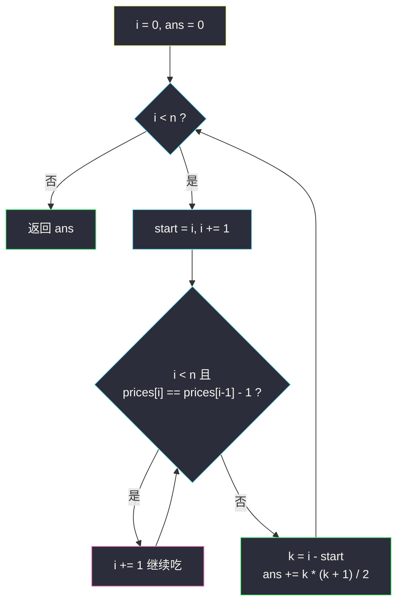
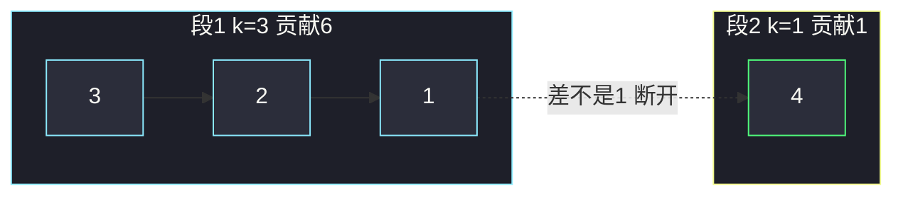

# 股票平滑下跌阶段的数目（分组循环 · 连续差为 1）

## 一、问题描述

给你一个整数数组 `prices`，表示一支股票每天的价格。**平滑下跌阶段**定义为一段连续子数组，满足：每一天的价格都比前一天**恰好少 1**。长度为 1 的单日也算一个阶段。

返回平滑下跌阶段的**总数目**。

> 🔗 LeetCode 2110：https://leetcode.cn/problems/number-of-smooth-descent-periods-of-a-stock/
>
> 数据范围：`1 <= prices.length <= 10^5`，`1 <= prices[i] <= 10^5`。

**示例 1**

```
输入：prices = [3,2,1,4]
输出：7
解释：7 个阶段是 [3]、[3,2]、[3,2,1]、[2]、[2,1]、[1]、[4]。
```

**示例 2**

```
输入：prices = [8,6,7,7]
输出：4
解释：相邻差都不是 1，四个单日各自贡献 1。
```

**示例 3**

```
输入：prices = [12,11,10,9,8,7]
输出：21
解释：整段都是「每天恰少 1」，长度 6，贡献 6+5+4+3+2+1 = 21。
```

**直观理解**

「每天恰少 1」有传递性：一段里只要**相邻**都差 1，任意子段也是平滑下跌。反过来，一旦某对相邻差不是 1，跨过这道缝的子数组一律非法。于是数组被切成若干互不相交的「下降段」，答案就是各段内部子数组个数之和。

单日（长度为 1）也算阶段，所以答案至少是 `n`。

> 📚 灵茶题单 **六、分组循环**：外层 `while i < n`，内层把「相邻差为 1」的同一段吃完，再对这一段结算。

---

## 二、暴力解法

枚举每个左端 `L`，向右扩张 `R`，一旦 `prices[R] != prices[R-1] - 1` 就停。每个合法 `[L, R]` 计 1。

```python
class Solution:
    def getDescentPeriods(self, prices: List[int]) -> int:
        n, ans = len(prices), 0
        for L in range(n):
            ans += 1                          # 单日 [L, L]
            for R in range(L + 1, n):
                if prices[R] != prices[R - 1] - 1:
                    break
                ans += 1
        return ans
```

### 复杂度

- **时间**：最坏整段都合法，`O(n²)`。`n = 10^5` 超时。
- **空间**：`O(1)`。

### 🔴 瓶颈在哪里

对每个 `L` 都重新往右走，但「从 `L` 能走到哪」完全由相邻关系决定，且相邻合法关系是**成段**的：一段内部每个左端的扩张长度可以闭式算出来，不必再扫。

---

## 三、优化探索（核心章节）

> 📚 本题在灵茶题单中属于 **六、分组循环**：把数组切成满足「相邻元素差恰好为 1」的极大段，每段长度为 `k` 时贡献 `k*(k+1)/2`。

### 3.1 观察特征

| 特征 | 说明 |
|------|------|
| 合法条件只看相邻 | `prices[i] == prices[i-1] - 1`，与更远的元素无额外约束 |
| 合法可传递 | 段内任意子数组都合法 |
| 非法是硬缝 | 差不是 1 的那条边，任何跨缝子数组都废 |

### 3.2 一段贡献多少

长度 `k` 的平滑段，子数组个数 = `1 + 2 + … + k = k*(k+1)/2`：

- 长 1 的有 `k` 个，长 2 的有 `k-1` 个，……，长 `k` 的有 1 个。

等价视角：以右端 `i` 结尾的阶段数，等于「从 `i` 往左能连多远」。若当前下降段已走了 `len` 天，则新右端贡献 `len`（所有以它结尾、且落在段内的子数组）。整段加总仍是 `1+2+…+k`。



### 3.3 正确性

- **不重**：不同下降段不相交，跨段子数组非法，不会被计入。
- **不漏**：每个合法子数组落在唯一极大下降段内，该段的 `k*(k+1)/2` 覆盖了它。
- **单日**：`k = 1` 时贡献 1，边界自然成立。

右端累计与分组是同一回事：段内第 1 天贡献 1，第 2 天贡献 2，……，第 `k` 天贡献 `k`，加起来仍是三角形数。断开时 `cnt` 重置为 1，相当于新段从单日起算。

### 3.4 一句话核心

> **相邻差为 1 的吃成一段，长度为 k 就加三角形数 `k*(k+1)/2`；缝两边各算各的。**

---

## 四、代码实现

### Python（主解：分组循环）

```python
class Solution:
    def getDescentPeriods(self, prices: List[int]) -> int:
        n, ans, i = len(prices), 0, 0
        while i < n:
            start = i
            i += 1
            while i < n and prices[i] == prices[i - 1] - 1:
                i += 1                          # 把这一段吃完
            k = i - start
            ans += k * (k + 1) // 2             # 段内所有子数组
        return ans
```

**等价写法（以右端累计，同复杂度）**

```python
class Solution:
    def getDescentPeriods(self, prices: List[int]) -> int:
        ans = cnt = 1                           # 第 0 天单独成段
        for i in range(1, len(prices)):
            if prices[i] == prices[i - 1] - 1:
                cnt += 1                        # 续上当前下降段
            else:
                cnt = 1                         # 断开，从单日重开
            ans += cnt                          # 以 i 结尾的阶段数
        return ans
```

**变量含义**

| 变量 | 含义 |
|------|------|
| `start` | 当前下降段左端 |
| `i` | 内层吃完后指向下一段起点 |
| `k` | 本段长度 |
| `cnt` | 变体里「以当前位置结尾的下降长度」 |

**循环不变式**：外层每次进入时 `i` 是下一段起点；内层结束后 `[start, i)` 是一段极大平滑下跌。

### Java（可选）

```java
class Solution {
    public long getDescentPeriods(int[] prices) {
        int n = prices.length, i = 0;
        long ans = 0;
        while (i < n) {
            int start = i++;
            while (i < n && prices[i] == prices[i - 1] - 1) i++;
            long k = i - start;
            ans += k * (k + 1) / 2;
        }
        return ans;
    }
}
```

注意返回类型是 `long`：`k` 最大 `10^5`，三角形数约 `5*10^9`，`int` 会溢出。

---

## 五、具体例子演示

以示例 1 `prices = [3,2,1,4]` 走分组循环。

**逐步跟踪**

| 段 | start | 内层吃到 | k | 贡献 `k*(k+1)/2` | 本段子数组 |
|----|-------|----------|---|------------------|------------|
| 1 | 0（值 3） | `3→2→1`，在 4 处断开 | 3 | 6 | [3]、[3,2]、[3,2,1]、[2]、[2,1]、[1] |
| 2 | 3（值 4） | 到末尾 | 1 | 1 | [4] |

`ans = 6 + 1 = 7` ✓。

**示例 2** `[8,6,7,7]`：8→6 差 2，6→7 上升，7→7 持平，三段缝把数组切成 4 个单日，每段 `k=1`，贡献 `1+1+1+1 = 4`。

**示例 3** `[12,11,10,9,8,7]` 右端累计：

| i | 值 | 差是否为 1 | cnt | ans（累加 cnt） |
|---|----|-----------|-----|-----------------|
| 0 | 12 | — | 1 | 1 |
| 1 | 11 | 是 | 2 | 3 |
| 2 | 10 | 是 | 3 | 6 |
| 3 | 9 | 是 | 4 | 10 |
| 4 | 8 | 是 | 5 | 15 |
| 5 | 7 | 是 | 6 | 21 |

与 `k=6` 的 `k*(k+1)/2 = 21` 一致。注意：若写成「只要递减就算」，会把差 2 的段错误并入，答案会偏大。



---

## 六、复杂度分析

| 方法 | 时间 | 空间 | 说明 |
|------|------|------|------|
| 枚举左右端 | `O(n²)` | `O(1)` | `n = 10^5` 超时 |
| 分组循环 / 右端累计（主解） | `O(n)` | `O(1)` | 每个下标进内层一次 |

两种 `O(n)` 写法只扫相邻对：分组在段尾一次性加三角形数，右端累计则每天把「以今日结尾的阶段数」加进答案，算术和相同。

---

## 七、对比总结

| 维度 | 暴力扩右端 | 分组循环 |
|------|------------|----------|
| 扫描次数 | 每个 `L` 重走 | 每个位置只走一次 |
| 段内计数 | 逐个子数组 +1 | 闭式 `k*(k+1)/2` |

**易错点**

1. **差必须是 1，不是 ≥1**：`[5,3]` 不是平滑下跌；`[8,6,7]` 在 8→6 处断开。
2. **返回值溢出**：Java / C++ 用 `long`。
3. **单日漏计**：分组时 `i += 1` 先走出起点，即使内层立刻停也有 `k ≥ 1`。
5. 别把「平滑下跌」理解成单调不增：`[3,3,2]` 的 `3→3` 差 0，必须断开。
6. `k*(k+1)/2` 用整数除法 `//`；Python `int` 无溢出，其它语言注意 `long`。

**模板（分组循环，Python）**

```python
i = 0
while i < n:
    start = i
    i += 1
    while i < n and 同一段(i):      # 本题：差恰好为 1
        i += 1
    结算 [start, i)
```

---

## 八、举一反三

| 题目 | 关系 |
|------|------|
| [1759. 统计同质子字符串的数目](https://leetcode.cn/problems/count-number-of-homogenous-substrings/) | 同色段长度 `k` 同样贡献 `k*(k+1)/2` |
| [1446. 连续字符](https://leetcode.cn/problems/consecutive-characters/) | 分组后取最大 `k`，不求和 |
| [2414. 最长的字母序连续子字符串的长度](https://leetcode.cn/problems/length-of-the-longest-alphabetical-continuous-substring/) | 相邻差为 +1 的分组，取最长 |
| [674. 最长连续递增序列](https://leetcode.cn/problems/longest-continuous-increasing-subsequence/) | 严格递增段，只关心最大 `k` |
| [228. 汇总区间](https://leetcode.cn/problems/summary-ranges/) | 连续关系分组后输出起止 |
| [830. 较大分组的位置](https://leetcode.cn/problems/positions-of-large-groups/) | 同值分组，`k ≥ 3` 才记录 |

**思想迁移**

- 子数组合法性只取决于相邻时，先切段再闭式计数，不要枚举每个子数组。
- 「恰少 1」比「递减」更严：分组条件写成 `== prices[i-1] - 1`，不要写成 `<`。
- 同类贡献：同色 / 连续 0 / 连续 1 的子串数目，都是段长的三角形数，只换分组谓词。
- 口诀：**「差 1 连成段，段长 k 加三角数；缝一刀，两头各自算。」**
