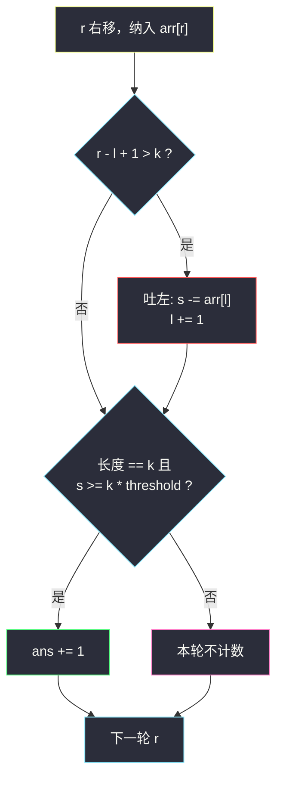
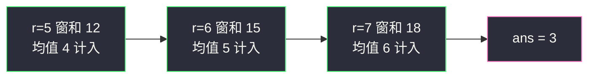

# 大小为 K 且平均值大于等于阈值的子数组数目（定长滑窗 · 窗口和）

## 一、问题描述

给你一个整数数组 `arr` 和两个整数 `k`、`threshold`。请返回长度为 `k` 且**平均值大于等于** `threshold` 的子数组数目。

> 🔗 LeetCode 1343：https://leetcode.cn/problems/number-of-sub-arrays-of-size-k-and-average-greater-than-or-equal-to-threshold/
>
> 数据范围：`1 <= arr.length <= 10^5`，`1 <= arr[i] <= 10^4`，`1 <= k <= arr.length`，`0 <= threshold <= 10^4`。

**示例 1**

```
输入：arr = [2,2,2,2,5,5,5,8], k = 3, threshold = 4
输出：3
解释：长度为 3 的窗口均值依次为 2, 2, 3, 4, 5, 6，后三个 ≥ 4。
```

**示例 2**

```
输入：arr = [11,13,17,23,29,31,7,5,2,3], k = 3, threshold = 5
输出：6
解释：前 6 个窗口均值都 ≥ 5，最后两个 14/3、10/3 小于 5。
```

**直观理解**

把一把长度为 `k` 的尺子从数组左端滑到右端，每滑一格看窗口平均值够不够 `threshold`。平均值 ≥ `threshold` 等价于窗口和 ≥ `k * threshold`——比较整数和，彻底躲开浮点。相邻窗口只差「左边出去一个、右边进来一个」，窗口和可以 `O(1)` 维护。

---

## 二、暴力解法

枚举每个长度为 `k` 的起点，当场求和再除以 `k`：

```python
class Solution:
    def numOfSubarrays(self, arr: List[int], k: int, threshold: int) -> int:
        n, ans = len(arr), 0
        for i in range(n - k + 1):
            if sum(arr[i:i + k]) / k >= threshold:
                ans += 1
        return ans
```

### 复杂度

- **时间**：`O(n·k)`——每个窗口重新求和。
- **空间**：`O(1)` 额外（切片在 Python 里会再花 `O(k)`）。

`n` 与 `k` 都到 `10^5` 时约 `10¹⁰` 次操作，超时。浮点除法还有精度隐患（本题数据还好，习惯上不要除）。

### 🔴 瓶颈在哪里

窗口 `arr[i..i+k-1]` 与 `arr[i+1..i+k]` 共享 `k - 1` 个数。暴力把共享部分全部重算。定长滑窗只对「进一个、出一个」做增量，每个元素进窗、出窗各一次。

---

## 三、优化探索（核心章节）

> 📚 本题在灵茶题单中属于 **01-滑动窗口与双指针 · §1.1 基础**。定长窗口骨架：**纳入 → 若 `r - l + 1 > k` 则吐左 → 更新答案。**

### 3.1 比较整数，不要除

```
avg ≥ threshold  ⟺  sum / k ≥ threshold  ⟺  sum ≥ k * threshold
```

`arr[i] ≥ 1`，和为非负整数；`k * threshold` 最大 `10^5 * 10^4 = 10^9`，32 位整数够用（Java 用 `int` 即可，和最大同样 `10^9`）。

### 3.2 定长骨架：纳入 / 吐左 / 更新

`r` 从 0 扫到 `n - 1`，`l` 是窗口左端，`s` 是窗口和：

1. **纳入**：`s += arr[r]`，右端进窗；
2. **吐左**：若 `r - l + 1 > k`，说明刚变得过长，`s -= arr[l]`，`l += 1`；
3. **更新**：窗口长度恰好为 `k` 时，若 `s ≥ k * threshold` 则 `ans += 1`。

前 `k - 1` 轮长度不足 `k`，既不吐也不更新；第 `k` 轮起每次纳入后先吐左（保持长度 `k`），再判断。



### 3.3 与「入-更新-出」只是吐左时机不同

灵神定长窗口还有一种常见写法：长度刚到 `k` 时**先更新、再把左端预吐掉**（给下一轮腾位置）。两种骨架一一对应：

| 本篇（纳入 / 过长吐左 / 更新） | 入-更新-出 |
|-------------------------------|------------|
| 每轮先加右端 | 同 |
| `r-l+1 > k` 时减左端 | 更新完后无条件减 `arr[r-k+1]` |
| 吐完后长度恰为 `k` 再比阈值 | 更新时长度已经是 `k` |

本题用「过长才吐」更贴 §1.1 口令，也更不容易在 `r < k-1` 时误减。不要两套混写：若已经按 `> k` 吐过，就不要再减一次 `arr[r-k+1]`。

### 3.4 为什么先吐再更新

纳入之后长度可能变成 `k + 1`。必须先吐掉旧左端，窗口才回到「当前右端对应的那一个长度为 `k` 的子数组」，此时更新才对应题目要的窗口。若先更新再吐，会拿长度为 `k + 1` 的和去跟 `k * threshold` 比，答案错。

### 3.5 循环不变式

第 `r` 轮执行完吐左后：若 `r ≥ k - 1`，窗口恰为 `arr[r-k+1 .. r]`，`s` 等于这段之和，`l = r - k + 1`；否则窗口是前缀 `arr[0..r]`，尚未形成完整尺子。

### 3.6 一句话核心

> **定长 k：右端纳入，过长就吐左，长度回到 k 再拿窗口和跟 `k * threshold` 比——比较整数，别除法。**

---

## 四、代码实现

### Python（主解：纳入 / 吐左 / 更新）

```python
class Solution:
    def numOfSubarrays(self, arr: List[int], k: int, threshold: int) -> int:
        ans = s = l = 0
        limit = k * threshold                   # 整数阈值，避免浮点
        for r, x in enumerate(arr):
            s += x                              # 1. 纳入
            if r - l + 1 > k:                   # 2. 过长则吐左
                s -= arr[l]
                l += 1
            if r - l + 1 == k and s >= limit:   # 3. 更新
                ans += 1
        return ans
```

窗口一旦达到长度 `k` 后就一直是 `k`，更新条件也可写成 `if r >= k - 1 and s >= limit`。

**前缀和写法（正确但多 O(n) 空间，不推荐当主解）**

```python
class Solution:
    def numOfSubarrays(self, arr: List[int], k: int, threshold: int) -> int:
        n, limit = len(arr), k * threshold
        pre = [0] * (n + 1)
        for i, x in enumerate(arr):
            pre[i + 1] = pre[i] + x
        return sum(1 for i in range(n - k + 1)
                   if pre[i + k] - pre[i] >= limit)
```

每个窗口和 `pre[i+k] - pre[i]` 一次算完，与滑窗答案相同。本题窗口相邻，滑窗少一段数组。

**变量含义**

| 变量 | 含义 |
|------|------|
| `r` | 窗口右端（循环变量） |
| `l` | 窗口左端 |
| `s` | 当前窗口元素之和 |
| `limit` | `k * threshold`，窗口和的及格线 |
| `ans` | 已统计的合法窗口数 |

**循环不变式**：见 3.5。`s` 与 `[l, r]` 严格对应，吐左与纳入成对出现，不会漏加减。

### Java（最优解同款）

```java
class Solution {
    public int numOfSubarrays(int[] arr, int k, int threshold) {
        int ans = 0, s = 0, l = 0, limit = k * threshold;
        for (int r = 0; r < arr.length; r++) {
            s += arr[r];                        // 纳入
            if (r - l + 1 > k) {                // 吐左
                s -= arr[l++];
            }
            if (r - l + 1 == k && s >= limit) { // 更新
                ans++;
            }
        }
        return ans;
    }
}
```

---

## 五、具体例子演示

以示例 1 `arr = [2,2,2,2,5,5,5,8]`，`k = 3`，`threshold = 4`，`limit = 12`。逐步跟踪**每轮窗口和 / 均值**：

| r | 纳入 | 吐左？ | 窗口 `[l, r]` | 窗口和 s | 均值 | s ≥ 12？ | ans |
|---|------|--------|---------------|----------|------|----------|-----|
| 0 | 2 | 否 | `[2]` | 2 | — | 长度不足 | 0 |
| 1 | 2 | 否 | `[2,2]` | 4 | — | 长度不足 | 0 |
| 2 | 2 | 否 | `[2,2,2]` | 6 | 2 | 否 | 0 |
| 3 | 2 | 吐 2 | `[2,2,2]` | 6 | 2 | 否 | 0 |
| 4 | 5 | 吐 2 | `[2,2,5]` | 9 | 3 | 否 | 0 |
| 5 | 5 | 吐 2 | `[2,5,5]` | 12 | 4 | **是** | 1 |
| 6 | 5 | 吐 2 | `[5,5,5]` | 15 | 5 | 是 | 2 |
| 7 | 8 | 吐 5 | `[5,5,8]` | 18 | 6 | 是 | **3** |

返回 **3** ✓，对应窗口 `[2,5,5]`、`[5,5,5]`、`[5,5,8]`。

示例 2 `arr = [11,13,17,23,29,31,7,5,2,3]`，`k = 3`，`limit = 15`，从第一扇完整窗口开始：

| r | 窗口 | s | 均值 | s ≥ 15 | ans |
|---|------|---|------|--------|-----|
| 2 | `[11,13,17]` | 41 | 13.67 | 是 | 1 |
| 3 | `[13,17,23]` | 53 | 17.67 | 是 | 2 |
| 4 | `[17,23,29]` | 69 | 23 | 是 | 3 |
| 5 | `[23,29,31]` | 83 | 27.67 | 是 | 4 |
| 6 | `[29,31,7]` | 67 | 22.33 | 是 | 5 |
| 7 | `[31,7,5]` | 43 | 14.33 | 是 | 6 |
| 8 | `[7,5,2]` | 14 | 4.67 | **否** | 6 |
| 9 | `[5,2,3]` | 10 | 3.33 | 否 | **6** |

前 6 窗过线、后两窗 14 与 10 都 `< 15`，答案 **6** ✓。注意 `r = 7` 的均值约 14.33 ≥ 5，但我们比较的是和与 `15`：43 ≥ 15 仍算过线——阈值 5 很低，真正卡住的是最后两窗。

边界：`k = 1` 时每纳入一个数都不吐左，`s >= threshold` 逐个计数；`k = n` 时全程不吐左，只在最后一轮判断整段和。



---

## 六、复杂度分析

| 方法 | 时间 | 空间 | 说明 |
|------|------|------|------|
| 每个窗口重新求和 | `O(n·k)` | `O(1)` | `n, k` 同阶时超时 |
| 定长滑窗（主解） | `O(n)` | `O(1)` | 每个元素进、出各一次 |
| 前缀和后查 `pre[i+k]-pre[i]` | `O(n)` | `O(n)` | 正确但多一段数组，本题不必要 |

---

## 七、对比总结

| 维度 | 暴力求和 | 定长滑窗 |
|------|----------|----------|
| 相邻窗口 | 重算 k 个数 | 只改两端两个数 |
| 均值判定 | `sum/k >= threshold` | `sum >= k * threshold` |
| 代码骨架 | 两层循环 | 单层纳入 / 吐左 / 更新 |

**易错点**

1. **先吐后更新**：纳入后长度可能是 `k + 1`，先减左端再比较。
2. **用浮点除**：写成 `s / k >= threshold` 在其它题会踩精度；本题统一整数比较。
3. **`limit = k * threshold` 溢出**：本题乘积 ≤ `10^9` 安全；换更大数据要提 `long`。
4. **`k = n`**：只有一个窗口，骨架仍然正确（从不吐左，最后一轮更新）。
5. **`k = 1`**：每个单元素自己就是窗口，`s >= threshold` 逐个判断。

**模板（§1.1 定长窗口）**

```python
s = l = 0
for r in range(n):
    s += arr[r]                 # 纳入
    if r - l + 1 > k:           # 吐左
        s -= arr[l]
        l += 1
    # 更新：此刻窗口长度为 min(r+1, k)
    if r - l + 1 == k:
        ...
```

---

## 八、举一反三

| 题目 | 关系 |
|------|------|
| [643. 子数组最大平均数 I](https://leetcode.cn/problems/maximum-average-subarray-i/) | 同一把尺子，本题计数、那题取最大均值 |
| [2090. 半径为 k 的子数组平均值](https://leetcode.cn/problems/k-radius-subarray-averages/) | 同批姊妹篇：窗口改成 `2k+1`，写回中心下标 |
| [1456. 定长子串中元音的最大数目](https://leetcode.cn/problems/maximum-number-of-vowels-in-a-substring-of-given-length/) | 窗口统计从「和」换成「元音个数」 |
| [2461. 长度为 K 子数组中的最大和](https://leetcode.cn/problems/maximum-sum-of-distinct-subarrays-with-length-k/) | 定长 + 哈希判互异，骨架仍是纳入 / 吐左 |
| [1052. 爱生气的书店老板](https://leetcode.cn/problems/grumpy-bookstore-owner/) | 定长窗口盖住一段「忍住不生气」 |
| [1652. 拆炸弹](https://leetcode.cn/problems/defuse-the-bomb/) | 定长（或环形）窗口和 |
| [1343. 本题](https://leetcode.cn/problems/number-of-sub-arrays-of-size-k-and-average-greater-than-or-equal-to-threshold/) | 及格线计数的原型 |

**思想迁移**

- 定长问题先问「窗口里要维护什么」（本题就是一个和），再套纳入 / 吐左 / 更新。
- 涉及平均值时优先改写成对整数和的不等式，从根上避开浮点。
- 口诀：**「右端纳入，过长吐左；和比 k 倍阈值，过线计一扇窗。」**
