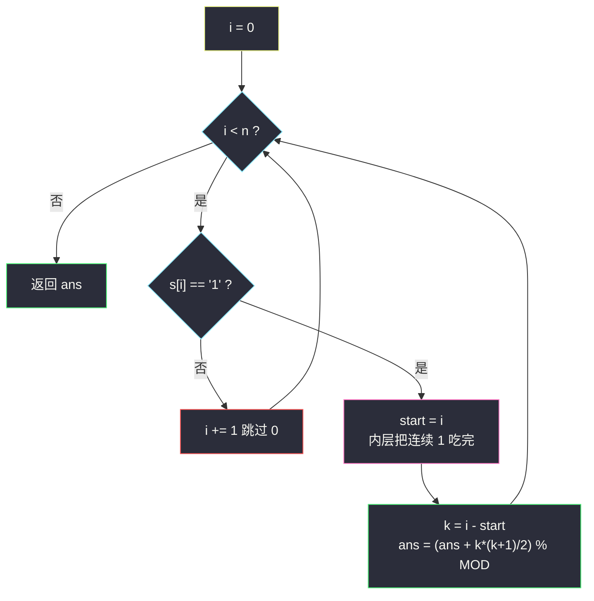
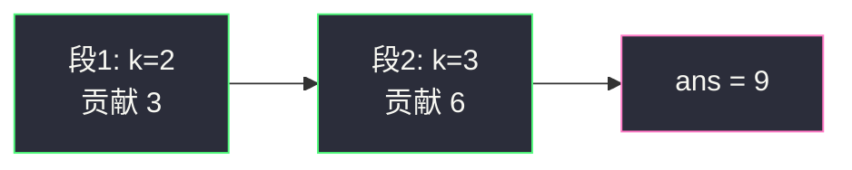

# 仅含 1 的子串数（分组循环 · 连续段组合数取模）

## 一、问题描述

给你一个二进制字符串 `s`（只含 `'0'` 和 `'1'`），返回全部**只包含 1** 的非空子串数目。答案可能很大，需要对 `10^9 + 7` 取模。

> 🔗 LeetCode 1513：https://leetcode.cn/problems/number-of-substrings-with-only-1s/
>
> 数据范围：`1 <= s.length <= 10^5`，`s[i]` 为 `'0'` 或 `'1'`。模数 `MOD = 10^9 + 7`。

**示例 1**

```
输入：s = "0110111"
输出：9
解释：一段 2 个 1 贡献 3，一段 3 个 1 贡献 6，合计 9。
```

**示例 2**

```
输入：s = "101"
输出：2
解释：两个单独的 "1"，没有更长的全 1 子串。
```

**示例 3**

```
输入：s = "111111"
输出：21
解释：整串 6 个 1，贡献 6 * 7 / 2 = 21。
```

**直观理解**

`'0'` 把字符串切成若干段全 1 的岛。一段连续 `k` 个 `'1'` 内部，任意子串都是全 1，贡献 `k * (k + 1) / 2`；跨过 `'0'` 的子串必然含 0，一律不合法。统计完每段再对 `10^9 + 7` 取模。它与 [#2348 全 0 子数组的数目](https://leetcode.cn/problems/number-of-zero-filled-subarrays/) 是同一公式的字符版，多一步取模。

---

## 二、暴力解法

枚举子串两端，检查是否全 1；碰到 `'0'` 即可打断当前左端：

```python
class Solution:
    def numSub(self, s: str) -> int:
        MOD, n, ans = 10**9 + 7, len(s), 0
        for L in range(n):
            for R in range(L, n):
                if s[R] == '0':
                    break
                ans += 1
        return ans % MOD
```

### 复杂度

- **时间**：`O(n²)`，全 1 串会把内层跑满。
- **空间**：`O(1)`。

`n = 10^5` 超时。即使加上取模，平方扫描也救不了。

### 🔴 瓶颈在哪里

连续 `k` 个 1 的贡献是闭式 `k * (k + 1) / 2`，与 2348 完全相同。暴力把这三角数里的每一项都点了一遍。分组循环按 `'1'` 段结算，每段 `O(1)`，整串 `O(n)`。

---

## 三、优化探索（核心章节）

> 📚 本题在灵茶题单中属于 **六、分组循环**：外层 `while i < n`，内层把同一段（连续的 `'1'`）吃完，组内套三角数公式，组间被 `'0'` 隔开互不影响。

### 3.1 一段连续 k 个 1 贡献多少

与全 0 子数组同一推导：长度为 1 的有 `k` 个，长度为 2 的有 `k - 1` 个，……长度为 `k` 的有 1 个：

```
k + (k-1) + … + 1 = k * (k + 1) / 2
```

从右端点看：第 `t` 个 1 作为右端，左边可以是当前段里它左边的任意 1（含自己），新增 `t` 个子串。

### 3.2 取模放在哪

`k ≤ 10^5` 时 `k * (k + 1) / 2 ≤ 5_000_050_000`，已超过 `10^9 + 7`，所以**每段加完都要取模**（或最后取一次也行，因为总和同阶）。Python 整数任意长，先加再 `% MOD` 即可；Java 要用 `long` 算乘法，再 `% MOD`。

整串全 1 且 `n = 10^5` 时答案就是 `5000050000 % (10^9+7) = 1000049972`，不取模会直接错。

### 3.3 分组循环怎么切段

`i` 扫字符串。`'0'` 跳过；碰到 `'1'` 记下 `start`，内层吃到这段 1 的尽头，`k = i - start`，`ans = (ans + k * (k + 1) // 2) % MOD`。



### 3.4 等价增量：ans += cnt

维护当前连续 1 的个数 `cnt`。遇到 `'1'`：`cnt += 1`，`ans = (ans + cnt) % MOD`（以当前字符为右端的新全 1 子串恰好 `cnt` 个）；遇到 `'0'`：`cnt = 0`。这是把三角数拆到每个右端点上，与分组公式逐段相加同解。

一段 `k` 个 1 上增量依次加 `1, 2, …, k`，段内小计仍是 `k * (k + 1) / 2`。取模满足 `(a + b) % MOD = ((a % MOD) + (b % MOD)) % MOD`，所以「每步取模」和「整段加完再取模」得同一余数。

### 3.5 一句话核心

> **0 是岛界。分组循环切出每段连续 k 个 1，贡献三角数再取模；或边走边 `ans += cnt`，记得 `% (10^9+7)`。**

---

## 四、代码实现

### Python（主解：分组循环）

```python
class Solution:
    def numSub(self, s: str) -> int:
        MOD = 10**9 + 7
        n, ans, i = len(s), 0, 0
        while i < n:                            # 外层
            if s[i] != '1':
                i += 1                          # 跳过 0
                continue
            start = i
            while i < n and s[i] == '1':        # 内层：吃完这一段 1
                i += 1
            k = i - start
            ans = (ans + k * (k + 1) // 2) % MOD
        return ans
```

**等价写法（增量 + 取模）**

```python
class Solution:
    def numSub(self, s: str) -> int:
        MOD = 10**9 + 7
        ans = cnt = 0
        for ch in s:
            if ch == '1':
                cnt += 1
                ans = (ans + cnt) % MOD
            else:
                cnt = 0
        return ans
```

**变量含义**

| 变量 | 含义 |
|------|------|
| `i` | 扫描指针 |
| `start` | 当前 1 段左端 |
| `k` | 当前 1 段长度 |
| `MOD` | `10^9 + 7` |
| `ans` | 已结算子串数（始终保持取模后） |

**循环不变式**：回到外层 `while` 时，`s[0..i)` 中所有全 1 子串已计入 `ans`（已取模）。内层结束后 `[start, i)` 是一段极大 1 段。

### Java（最优解同款）

```java
class Solution {
    public int numSub(String s) {
        final int MOD = 1_000_000_007;
        long ans = 0;
        int i = 0, n = s.length();
        while (i < n) {
            if (s.charAt(i) != '1') { i++; continue; }
            int start = i;
            while (i < n && s.charAt(i) == '1') i++;
            long k = i - start;                 // 先提 long 再乘
            ans = (ans + k * (k + 1) / 2) % MOD;
        }
        return (int) ans;
    }
}
```

`k * (k + 1)` 必须在 `long` 上做，否则 `k = 10^5` 时 32 位乘法溢出，取模也救不回。

---

## 五、具体例子演示

以示例 1 `s = "0110111"` 走分组循环，跟踪**每段长度与组合数**：

下标：`0:0  1:1  2:1  3:0  4:1  5:1  6:1`

| 轮 | i 起点 | 动作 | 段 | k | 本段 `k*(k+1)/2` | ans |
|----|--------|------|----|---|------------------|-----|
| 1 | 0 | `'0'`，跳过 | — | — | — | 0 |
| 2 | 1 | 吃 `'1'` 到下标 3 | `s[1..2]` `"11"` | 2 | 3 | 3 |
| 3 | 3 | `'0'`，跳过 | — | — | — | 3 |
| 4 | 4 | 吃 `'1'` 到下标 7 | `s[4..6]` `"111"` | 3 | 6 | **9** |

返回 **9** ✓。第一段 3 个子串：`"1"`、`"1"`、`"11"`；第二段 6 个：三个 `"1"`、两个 `"11"`、一个 `"111"`。

示例 3 整串一段 `k = 6`，`21 % MOD = 21`。

增量视角走同一串（每轮看两指针式的 `cnt` / `ans`）：

| i | ch | cnt | ans |
|---|-----|-----|-----|
| 0 | 0 | 0 | 0 |
| 1 | 1 | 1 | 1 |
| 2 | 1 | 2 | 3 |
| 3 | 0 | 0 | 3 |
| 4 | 1 | 1 | 4 |
| 5 | 1 | 2 | 6 |
| 6 | 1 | 3 | **9** |

与分组逐步相加一致。



---

## 六、复杂度分析

| 方法 | 时间 | 空间 | 说明 |
|------|------|------|------|
| 枚举子串 | `O(n²)` | `O(1)` | 全 1 时超时 |
| 分组循环（主解） | `O(n)` | `O(1)` | 每字符访问常数次 |
| 增量 `ans += cnt` | `O(n)` | `O(1)` | 与分组同阶，少一次乘法 |

---

## 七、对比总结

| 维度 | 本题 #1513 | 姊妹 #2348 |
|------|------------|------------|
| 目标字符 | 连续 `'1'` | 连续 `0` |
| 公式 | `k * (k + 1) / 2` | 同 |
| 取模 | 必须 `% (10^9+7)` | 不取模，但 Java 要 `long` |
| 输入 | 字符串 | 整型数组 |

**易错点**

1. **忘记取模**：全 1 长串答案超过 `10^9+7`。
2. **Java `int` 乘法溢出**：先 `long k = i - start`，再 `k * (k + 1) / 2`。
3. **除法与取模的顺序**：先算整数三角数再 `% MOD`；不要写成 `(k * (k + 1) % MOD) / 2`——模后再除 2 在模意义下要乘逆元，本题没必要自找麻烦（三角数本身能被 2 整除）。
4. **`'1'` 写成 `1`**：字符串里比较的是字符 `'1'`。
5. 子串必须连续，不要做成「子序列里全是 1」。

**模板（分组循环 + 三角数取模）**

```python
MOD = 10**9 + 7
i, ans = 0, 0
while i < n:
    if s[i] != '1':
        i += 1
        continue
    start = i
    while i < n and s[i] == '1':
        i += 1
    k = i - start
    ans = (ans + k * (k + 1) // 2) % MOD
```

---

## 八、举一反三

| 题目 | 关系 |
|------|------|
| [2348. 全 0 子数组的数目](https://leetcode.cn/problems/number-of-zero-filled-subarrays/) | 同批姊妹篇：同一公式，数组版、不取模 |
| [1759. 统计同质子字符串的数目](https://leetcode.cn/problems/count-number-of-homogenous-substrings/) | 连续相同字符都贡献三角数，且同样取模 |
| [485. 最大连续 1 的个数](https://leetcode.cn/problems/max-consecutive-ones/) | 只要最长段，分组后取 `max(k)` |
| [1446. 连续字符](https://leetcode.cn/problems/consecutive-characters/) | 不限字符，仍是分组取最长 |
| [1869. 哪种连续子字符串更长](https://leetcode.cn/problems/longer-contiguous-segments-of-ones-than-zeros/) | 同时维护 0 段、1 段的最长 |
| [696. 计数二进制子串](https://leetcode.cn/problems/count-binary-substrings/) | 相邻两段长度取 min，分组循环进阶 |
| [1004. 最大连续 1 的个数 III](https://leetcode.cn/problems/max-consecutive-ones-iii/) | 允许把最多 k 个 0 当 1，改滑窗 |

**思想迁移**

- 「二进制串里全 1 / 全 0 的子串计数」看到就拆段 + 三角数；题目写了取模就每段 `% MOD`。
- 增量 `ans += cnt` 与公式是一对：教学用公式，比赛用增量，结果必须一致。
- 口诀：**「外层 while 扫，内层把 1 吃完；三角数入袋，每段记得取模。」**
