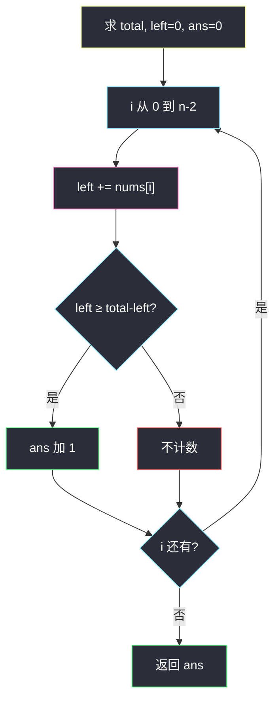
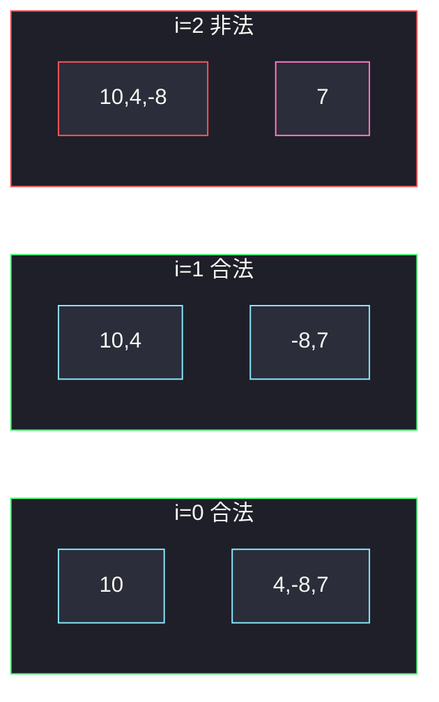

# 分割数组的方案数（前后缀和）

## 一、问题描述

把数组 `nums` 在下标 `i` 处分成两段（`0 ≤ i < n-1`）：左段 `nums[0..i]`，右段 `nums[i+1..n-1]`。两段都**非空**。统计有多少个 `i` 满足：**左段之和 ≥ 右段之和**。

> 🔗 LeetCode 2270：https://leetcode.cn/problems/number-of-ways-to-split-array/
>
> 数据范围：`2 ≤ n ≤ 10^5`，`-10^5 ≤ nums[i] ≤ 10^5`。前缀和用 64 位（Python 的 int 即可；Java 用 `long`）。
>
> 📚 灵茶题单：**专题：前后缀分解**。先求 `total`，扫到 `n-2`（保证右段非空），维护 `left`，判断 `left ≥ total - left`。切割画在**两个元素之间**，没有「中心元素不参与」这一格——和 724 中心下标差在这里。

**示例 1**

```
输入：nums = [10,4,-8,7]
输出：2
解释：
i=0：左 10，右 4-8+7=3，10≥3
i=1：左 10+4=14，右 -8+7=-1，14≥-1
i=2：左 10+4-8=6，右 7，6≥7 不成立
```

**示例 2**

```
输入：nums = [2,3,1,0]
输出：2
解释：
i=0：左 2，右 4，不成立
i=1：左 5，右 1，成立
i=2：左 6，右 0，成立
```

**直观理解**

合法切割是「一根竖线插在相邻两数中间」。左段至少含下标 0，右段至少含最后一个数。问有多少根竖线让左边和不少于右边和。元素可负，左段和不是单调的，每一刀都要查。

---

## 二、暴力解法

对每个切割 `i`，再 sum 左右两段。

```python
class Solution:
    def waysToSplitArray(self, nums: list[int]) -> int:
        n = len(nums)
        ans = 0
        for i in range(n - 1):
            left = sum(nums[: i + 1])
            right = sum(nums[i + 1 :])
            if left >= right:
                ans += 1
        return ans
```

两例对拍官方。每个 `i` 扫 `O(n)`，总共 `O(n²)`，`n=10^5` 超时。

### 🔴 瓶颈在哪里

相邻切割的左段只多一个 `nums[i]`。全体 `total` 固定，右段 = `total - left`，比较变成 `left ≥ total - left`，即 `2 * left ≥ total`。一遍滚动即可。注意 `left` 与 `total` 可达约 `10^5 × 10^5 = 10^{10}`，比较或翻倍时不要用 32 位 int。

---

## 三、优化探索（核心章节）

> 📚 本题在灵茶题单中属于 **专题：前后缀分解**。模板与中心下标同构：先 `total`，再滚 `left`。差别只有两点：切割在元素之间（`left` **含**当前 `nums[i]`），以及要计数而不是返回第一个。

### 3.1 分割点画在元素之间

```
 i 能取 0 .. n-2
          ↓ 这一刀
[ 0 .. i ]  |  [ i+1 .. n-1 ]
   left           right
要求 left ≥ right，且两段都非空
```

`i` 最大是 `n-2`：若扫到 `n-1`，右段空，非法。

### 3.2 判断式

```
left += nums[i]          # 先纳入，左段含 i
if left >= total - left:
    ans += 1
```

不要写成「只和邻居比」。负数会让左段和回落，前面合法不代表后面合法，必须枚举每一刀。



粉是「先加再比」——与 724「先比再加」正好相反，因为这里没有「自己不参与」的中心格。

### 3.3 和 724 的对照

| | 724 中心下标 | 本题 |
|--|-------------|------|
| 中间那个元素 | 不计入任何一侧 | 没有中间元素，切在缝上 |
| `left` 何时加当前值 | 判断**之后** | 判断**之前** |
| 循环上界 | `0 .. n-1` | `0 .. n-2` |
| 返回 | 最左下标或 -1 | 合法切割个数 |

### 3.4 一句话核心

> **先 total，扫到 n-2；left 先加上 nums[i]，再问 left ≥ total-left。**

---

## 四、代码实现

### Python（主解）

```python
class Solution:
    def waysToSplitArray(self, nums: list[int]) -> int:
        total = sum(nums)
        left = 0
        ans = 0
        for i in range(len(nums) - 1):
            left += nums[i]
            if left >= total - left:
                ans += 1
        return ans
```

### Java（最优解，前缀和用 long）

```java
class Solution {
    public int waysToSplitArray(int[] nums) {
        long total = 0;
        for (int x : nums) {
            total += x;
        }
        long left = 0;
        int ans = 0;
        for (int i = 0; i < nums.length - 1; i++) {
            left += nums[i];
            if (left >= total - left) {
                ans++;
            }
        }
        return ans;
    }
}
```

**变量含义**

| 写法 | 含义 |
|------|------|
| `total` | 全体之和 |
| `left` | `nums[0..i]` 之和（含 i） |
| `total - left` | 右段 `nums[i+1..n-1]` |
| `range(n-1)` | `i` 取到 `n-2`，右段非空 |

`if left >= total - left` 与 `if 2 * left >= total` 等价；后者在 Java 里同样要用 `long` 做乘法。

---

## 五、具体例子演示

### 5.1 官方示例 1：nums = [10, 4, -8, 7]

`total = 13`。切割只能插在 3 条缝上。

| i | 分割（竖线位置） | left 累加 | left | right | left ≥ right? |
|---|-----------------|-----------|------|-------|---------------|
| 0 | `10 \| 4,-8,7` | +10 | 10 | 3 | 是 |
| 1 | `10,4 \| -8,7` | +4 | 14 | -1 | 是 |
| 2 | `10,4,-8 \| 7` | +(-8) | 6 | 7 | 否 |

`ans = 2`。对拍官方。注意 i=1 之后左段因 `-8` 从 14 掉到 6，单调性不成立。



绿框两刀合法（10≥3、14≥-1）；红框 6≥7 失败。

### 5.2 官方示例 2：nums = [2, 3, 1, 0]

`total = 6`。

| i | 左段 | left | right | 成立? |
|---|------|------|-------|-------|
| 0 | [2] | 2 | 4 | 否 |
| 1 | [2,3] | 5 | 1 | 是 |
| 2 | [2,3,1] | 6 | 0 | 是 |

`ans = 2`。对拍官方。最后一刀右段是单独的 `0`，左段 6 ≥ 0，算合法——右段可以是 0，只要非空。

### 5.3 负数让左段回落

`[1, -5, 10]`，`total=6`。

| i | left | right | 成立? |
|---|------|-------|-------|
| 0 | 1 | 5 | 否 |
| 1 | 1-5=-4 | 10 | 否 |

答案 0。若误以为「加入正数后一直合法」，会在 i=0 就错；本题两刀都不行。前缀和必须用能装下 `±10^{10}` 的整数。

---

## 六、复杂度分析

| 方法 | 时间 | 空间 | 说明 |
|------|------|------|------|
| 每个 i 再 sum | `O(n²)` | `O(1)` | 超时 |
| 前缀和数组 | `O(n)` | `O(n)` | `pre[i] vs total-pre[i]` |
| 滚动 left（主解） | `O(n)` | `O(1)` | 一遍 total + 扫到 n-2 |

Java 的 `total`、`left` 用 `long`，否则 `n=10^5`、`nums[i]=10^5` 时 `int` 溢出，比较翻转。

---

## 七、对比总结

| 维度 | 724 中心下标 | 本题 |
|------|--------------|------|
| 切法 | 三段（中心不参与） | 两段（缝上切） |
| 当前元素 | 判断后再加入 left | 先加入再判断 |
| 循环 | 每个下标 | 到 n-2 |
| 答案 | 最左 / -1 | 计数 |

**易错点**

1. **`i` 取到 `n-1`**：右段空，题意不允许。
2. **先判断再加**（抄 724）：`i=0` 时 `left=0` 去比，空左非法且公式错。
3. **Java 用 int 存和**：溢出后 `≥` 乱跳。
4. **以为 left 单调、找到后后面全算**：有负数会回落。
5. **比较写成 `left > right`**：题是 `≥`，相等也算。示例 2 的 `6≥0` 是严格大于，但 `[1,1]` 的 `1≥1` 必须算。
6. **`2*left` 用 int**：翻倍更容易溢出，宁可写 `left >= total - left` 且两边都是 long。

---

## 八、举一反三

| 题目 | 关系 |
|------|------|
| [724. 寻找数组的中心下标](https://leetcode.cn/problems/find-pivot-index/)（`find-pivot-index.md`） | 同一套 total + left；中心元素不参与 |
| [238. 除自身以外数组的乘积](https://leetcode.cn/problems/product-of-array-except-self/)（`product-of-array-except-self.md`） | 分割成严格左 / 严格右，运算改成积 |
| [1712. 将数组分成三个子数组](https://leetcode.cn/problems/ways-to-split-array-into-three-subarrays/) | 两刀 + 有序前缀，二分加速 |
| [1480. 一维数组的动态和](https://leetcode.cn/problems/running-sum-of-1d-array/) | 前缀和定义 |
| [1991. 找到数组的中间位置](https://leetcode.cn/problems/find-the-middle-index-in-array/) | 724 换皮，用来对比「含不含中间格」 |

**思想迁移**

- 两段和的比较：`total` 一次，`left` 滚动；循环上界由「右段非空」决定。
- 口诀：**「先加再比扫到 n-2；2·left ≥ total，和用 64 位。」**
