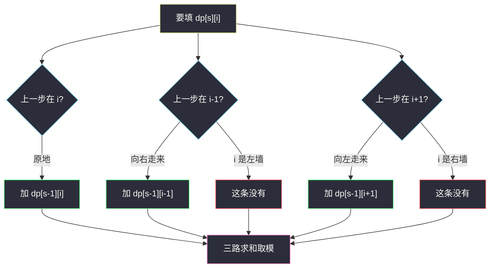
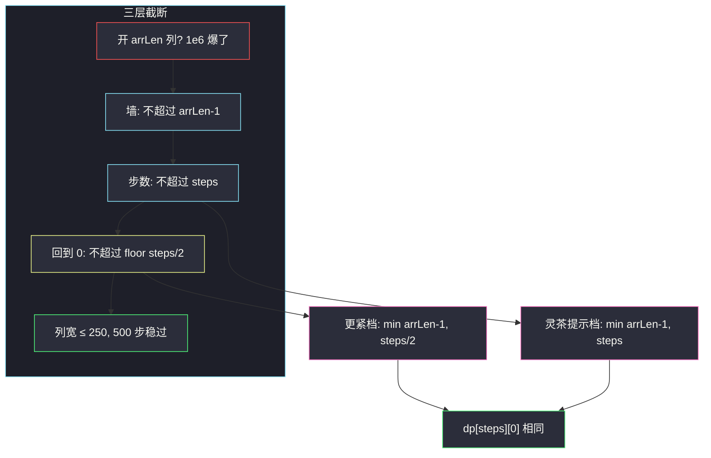

# 停在原地的方案数（多维 DP · 列宽截断）

## 一、问题描述

有一条长度为 `arrLen` 的数组，下标 `0 .. arrLen-1`。你站在下标 `0`，一共要走 `steps` 步。每一步只能选三种动作之一：向左一格（下标 `-1`）、原地不动、向右一格（下标 `+1`）。任何时刻都不能走出数组。问恰好走完 `steps` 步后**还停在下标 0** 的方案数，答案对 `10^9+7` 取模。

> 🔗 LeetCode 1269：https://leetcode.cn/problems/number-of-ways-to-stay-in-the-same-place-after-some-steps/
>
> 数据范围：`1 ≤ steps ≤ 500`，`1 ≤ arrLen ≤ 10^6`。
>
> 📚 灵茶题单：**§7.6 多维 DP**。状态是「走了几步、停在哪个下标」，典型的步数 × 位置二维表。本题 Hard 的真正难点不是转移本身，而是 **`arrLen` 高达 1e6，必须把位置这一维截断**，否则时间和空间都会爆。

方法名 `numWays`。

**示例 1**

```
输入：steps = 3, arrLen = 2
输出：4
解释：数组只有下标 0、1。四条合法路径（S=原地，R=右，L=左）：
  SSS : 0 → 0 → 0 → 0
  SRL : 0 → 0 → 1 → 0
  RLS : 0 → 1 → 0 → 0
  RSL : 0 → 1 → 1 → 0
```

**示例 2**

```
输入：steps = 2, arrLen = 4
输出：2
解释：SS、RL。不能 RR（停在 2 不是 0），也不能 LL（第一步就越界）。
```

**示例 3**

```
输入：steps = 4, arrLen = 2
输出：8
```

**直观理解**

把数组想成一条有墙的数轴。你从 0 出发，每步左/停/右，撞墙的走法直接作废。统计 `steps` 步后坐标为 0 的走法条数。

位置可以走到很远吗？不能。总共只有 `steps` 步，从 0 出发，最远物理可达下标 `min(arrLen-1, steps)`。而且本题还要求**回到 0**，能派上用场的下标更短：最多 `⌊steps/2⌋`。这就是后面截断列宽的全部理由。

---

## 二、暴力解法

三叉递归：当前步数 `s`、当前位置 `i`。`s == steps` 时看 `i` 是否为 0。每步尝试 `i-1 / i / i+1`，越界剪掉。

```python
class Solution:
    def numWays(self, steps: int, arrLen: int) -> int:
        MOD = 10**9 + 7

        def dfs(s: int, i: int) -> int:
            if i < 0 or i >= arrLen:
                return 0
            if s == steps:
                return 1 if i == 0 else 0
            return (
                dfs(s + 1, i - 1)
                + dfs(s + 1, i)
                + dfs(s + 1, i + 1)
            ) % MOD

        return dfs(0, 0)
```

官方三例都能过。每步 3 岔，`O(3^steps)`，`steps=500` 完全不可用。同一对 `(剩余步数, 位置)` 会被重复搜到。

### 🔴 瓶颈在哪里

决策只依赖「已经走了几步、现在在哪」，状态数是多项式的。记忆化以后变成填表。真正会卡死的是另一件事：位置这一维如果按 `arrLen=1e6` 开，单层就要一百万格，乘上 500 步就是五亿，时间和空间都过不了。必须先证明：**大部分下标永远到不了，更永远回不到 0**。

---

## 三、优化探索（核心章节）

> 📚 灵茶 §7.6：步数 × 位置。先写出完整转移，再把用不到的列砍掉，最后滚成一维。

### 3.1 状态

`dp[s][i]` = 走了 `s` 步之后，停在下标 `i` 的方案数。

目标：`dp[steps][0]`。

### 3.2 转移

第 `s` 步停在 `i`，上一步只可能在 `i-1`（向右走来）、`i`（原地）、`i+1`（向左走来）：

```
dp[s][i] = dp[s-1][i]           # 原地
         + dp[s-1][i-1]         # 从左边走过来（若 i-1 合法）
         + dp[s-1][i+1]         # 从右边走过来（若 i+1 合法）
```

全部模 `10^9+7`。

边界：

- `dp[0][0] = 1`，`dp[0][i] = 0`（i>0）。人一开始就在 0，还没走。
- `i < 0` 或 `i ≥ arrLen` 的格子不存在，贡献 0。

填表顺序：`s` 从小到大。同一层的 `i` 之间互相不依赖（都只看上一层），正反扫都可以。



### 3.3 为什么能截断列宽（Hard 必须写透）

朴素开 `dp[steps+1][arrLen]`，`arrLen=1e6` 直接爆。列宽可以从三层理由往里收。

**理由 1：墙。** 下标不能超过 `arrLen-1`。

**理由 2：步数不够走那么远。** 从 0 出发，每步最多 +1，走 `s` 步最多到下标 `s`。全程最多 `steps` 步，所以用到的下标不超过 `min(arrLen-1, steps)`。

这已经把 1e6 压到 ≤500。时间和空间变成 `O(steps * min(arrLen, steps)) ≤ 500×500`，可以通过。灵茶提示用的就是这一档：

```
maxPos = min(arrLen - 1, steps)
```

**理由 3（更紧）：还要回到 0。** 本题只要 `dp[steps][0]`。如果某条路径在过程中走到了下标 `k`，它至少花了 `k` 步才到 `k`，再花至少 `k` 步才能走回 0，所以 `2k ≤ steps`，即 `k ≤ ⌊steps/2⌋`。任何访问过 `k > ⌊steps/2⌋` 的路径，永远贡献不了「最终在 0」。

因此列宽还可以收到：

```
maxPos = min(arrLen - 1, steps // 2)
```

两档截断算出来的 `dp[steps][0]` 必须相同；中间格子可以不同。`steps=4`、数组足够长时：

| 走了 s 步 | 列宽收到 4（理由 2）下标 0..4 | 列宽收到 2（理由 3）下标 0..2 |
|-----------|-------------------------------|-------------------------------|
| 0 | `[1, 0, 0, 0, 0]` | `[1, 0, 0]` |
| 1 | `[1, 1, 0, 0, 0]` | `[1, 1, 0]` |
| 2 | `[2, 2, 1, 0, 0]` | `[2, 2, 1]` |
| 3 | `[4, 5, 3, 1, 0]` | `[4, 5, 3]` |
| 4 | `[9, 12, 9, 4, 1]` | `[9, 12, 8]` |

最终在 0 的方案都是 9。注意第 4 步下标 2：宽表是 9、窄表是 8。差的那 1 来自「曾经走到下标 3 再走回来」的路径（例如 `R R R L`：0→1→2→3→2）。这条路径第 4 步停在 2 而不是 0，对答案无贡献。窄表直接不给下标 3 开格子，这条路径从一开始就不存在，所以下标 2 少计 1，但下标 0 不受影响。



主解按提示用 `min(arrLen-1, steps)`，更紧的 `steps//2` 作为等价优化写出。面试时先讲理由 2，再补理由 3，说明你知道「答案在 0」还能再砍一半。

### 3.4 滚动数组

`dp[s][*]` 只依赖 `dp[s-1][*]`。开两个一维数组轮换，或每次 `ndp = [0]*(maxPos+1)` 再整体替换。

**不能原地从左到右覆盖。** 算 `i` 时还要用旧的 `i+1`；先覆盖 `i` 再算 `i` 的邻居会读到新值。必须整层拷贝，或先把旧层存下来。

右墙：当 `maxPos = arrLen-1` 时，下标 `maxPos` 不能从 `maxPos+1` 走来（墙外）。当 `maxPos` 是被步数截出来的、真实数组更长时，`maxPos+1` 在本层根本到不了，贡献也是 0。两种情况都用 `if i < maxPos: 加上 dp[i+1]` 即可。

### 3.5 一句话核心

> **`dp[s][i]`：s 步在 i；左停右三路加。列宽收到 `min(arrLen-1, steps)`，回到 0 还能收到 `⌊steps/2⌋`。**

---

## 四、代码实现

### Python（主解：滚动 + 提示档截断）

```python
class Solution:
    def numWays(self, steps: int, arrLen: int) -> int:
        MOD = 10**9 + 7
        # 最远物理可达；比 arrLen 小得多
        max_pos = min(arrLen - 1, steps)
        dp = [0] * (max_pos + 1)
        dp[0] = 1
        for _ in range(steps):
            ndp = [0] * (max_pos + 1)
            for i in range(max_pos + 1):
                ndp[i] = dp[i]
                if i > 0:
                    ndp[i] = (ndp[i] + dp[i - 1]) % MOD
                if i < max_pos:
                    ndp[i] = (ndp[i] + dp[i + 1]) % MOD
            dp = ndp
        return dp[0]
```

### Python（更紧截断 `⌊steps/2⌋`）

```python
class Solution:
    def numWays(self, steps: int, arrLen: int) -> int:
        MOD = 10**9 + 7
        max_pos = min(arrLen - 1, steps // 2)
        dp = [0] * (max_pos + 1)
        dp[0] = 1
        for _ in range(steps):
            ndp = [0] * (max_pos + 1)
            for i in range(max_pos + 1):
                ndp[i] = dp[i]
                if i > 0:
                    ndp[i] = (ndp[i] + dp[i - 1]) % MOD
                if i < max_pos:
                    ndp[i] = (ndp[i] + dp[i + 1]) % MOD
            dp = ndp
        return dp[0]
```

两版对拍官方三例都是 `4 / 2 / 8`，答案格相同。

**变量含义**

| 变量 | 含义 |
|------|------|
| `max_pos` | 开表的最右下标 |
| `dp[i]` | 上一层：走完当前步数之前，停在 `i` 的方案 |
| `ndp[i]` | 本层新值，整层算完再替换，避免读脏 |

### Java（最优解：滚动 + 提示档）

```java
class Solution {
    public int numWays(int steps, int arrLen) {
        final int MOD = 1_000_000_007;
        int maxPos = Math.min(arrLen - 1, steps);
        int[] dp = new int[maxPos + 1];
        dp[0] = 1;
        for (int s = 0; s < steps; s++) {
            int[] ndp = new int[maxPos + 1];
            for (int i = 0; i <= maxPos; i++) {
                long cur = dp[i];
                if (i > 0) {
                    cur += dp[i - 1];
                }
                if (i < maxPos) {
                    cur += dp[i + 1];
                }
                ndp[i] = (int) (cur % MOD);
            }
            dp = ndp;
        }
        return dp[0];
    }
}
```

Java 里三路求和先放进 `long`，避免 `int` 相加溢出再取模。

---

## 五、具体例子演示

### 5.1 官方示例 1：逐层填表

`steps=3`，`arrLen=2`。`max_pos = min(1, 3) = 1`。只有两列。

| 走了 s 步 \ 下标 | 0 | 1 |
|------------------|---|---|
| 0 | 1 | 0 |
| 1 | 1 | 1 |
| 2 | 2 | 2 |
| 3 | 4 | 4 |

逐格：

- `s=1, i=0`：原地 ← `dp[0][0]=1`；从 1 走回来 ← `dp[0][1]=0`。得 1。对应 `S`。
- `s=1, i=1`：原地 ← 0；从 0 向右 ← 1。得 1。对应 `R`。不能从 2 来（墙外，本表也没这列）。
- `s=2, i=0`：`1（停）+ 1（从 1 回来）= 2`。路径 `SS`、`RL`。
- `s=2, i=1`：`1（停）+ 1（从 0 过来）= 2`。路径 `RS`、`SR`。
- `s=3, i=0`：`2+2=4`。对拍官方。

四条回到 0 的完整路径：`SSS`、`SRL`、`RLS`、`RSL`。没有 `RRS`（第二步会到 2，越界）、没有 `LSL`（第一步越界）。

### 5.2 官方示例 2：右墙很远，步数截断

`steps=2`，`arrLen=4`。若不截断有下标 0,1,2,3。理由 2 给出 `max_pos = min(3, 2) = 2`，下标 3 两步到不了。理由 3 给出 `max_pos = min(3, 1) = 1`。

按提示档（列宽 2）填：

| 走了 s 步 \ 下标 | 0 | 1 | 2 |
|------------------|---|---|---|
| 0 | 1 | 0 | 0 |
| 1 | 1 | 1 | 0 |
| 2 | 2 | 2 | 1 |

`dp[2][0] = 2`，对拍官方：`SS`、`RL`。

下标 2 在第 2 步有 1 种（`RR`），但它不在 0，不计入答案。若用理由 3 只开到下标 1，第 2 步表是 `[2, 2]`，答案格仍是 2。`RR` 这条路径被直接丢掉，不影响回到 0。

### 5.3 官方示例 3：继续走两步

`steps=4`，`arrLen=2`。仍然只有两列，墙一直卡着。

| 走了 s 步 \ 下标 | 0 | 1 |
|------------------|---|---|
| 0 | 1 | 0 |
| 1 | 1 | 1 |
| 2 | 2 | 2 |
| 3 | 4 | 4 |
| 4 | 8 | 8 |

`dp[4][0] = 8`，对拍官方。

两条格子的数恰好每次都是「自己 + 邻居」。长度为 2 的数组上，0 和 1 互相喂养，每多一步方案数翻倍：1,2,4,8。这不是一般规律，只是这组数据墙太近、两边对称。

8 条路径（对拍穷举，S=原地，R=右，L=左）：

```
SSSS
SSRL  SRLS  SRSL
RLSS  RLRL  RSLS  RSSL
```

即 `(S,S,S,S)`、`(S,S,R,L)`、`(S,R,L,S)`、`(S,R,S,L)`、`(R,L,S,S)`、`(R,L,R,L)`、`(R,S,L,S)`、`(R,S,S,L)`。

### 5.4 截断对照：`arrLen` 很大时

`steps=4`，`arrLen=100`。提示档开 5 列（0..4），更紧档开 3 列（0..2）。答案格都是 9。中间格子可以不同（见 3.3 表）。这就是「截断只保证答案格，不保证每一个位置的方案数」。

若题目改成「输出每个下标的方案数」，就必须用理由 2，不能用理由 3。

---

## 六、复杂度分析

| 方法 | 时间 | 空间 | 说明 |
|------|------|------|------|
| 暴力 DFS | `O(3^steps)` | `O(steps)` 栈 | 超时 |
| 二维 DP 不截断 | `O(steps * arrLen)` | 同左 | `arrLen=1e6` 爆 |
| 滚动 + 提示档截断（主解） | `O(steps * min(arrLen, steps))` | `O(min(arrLen, steps))` | ≤ 500² |
| 滚动 + `⌊steps/2⌋` | `O(steps * min(arrLen, steps/2))` | 再小一半 | 答案格不变 |

`steps≤500`，主解大约 25 万次转移，远小于时限。

---

## 七、对比总结

| 维度 | 不截断 | 截到 `steps` | 截到 `⌊steps/2⌋` |
|------|--------|--------------|-------------------|
| 正确性（最终在 0） | 对 | 对 | 对 |
| 正确性（任意终点） | 对 | 对 | 错（远处格子少计） |
| `arrLen=1e6` | 不可用 | 可用 | 可用且更快 |

**易错点**

1. **按 `arrLen` 开表。** 这是本题会 Hard 的原因。看见 1e6 先问「真的能走到那么远吗」。
2. **原地滚动读脏。** 必须新开一层。`ndp[i]` 同时用旧的 `i-1, i, i+1`。
3. **模数。** 三路加起来可能超过 `2^31-1`，Java 用 `long` 再 `%`。
4. **第一步向左。** `i=0` 没有 `i-1`，漏判越界会下标越界或把墙外当 0。
5. **把 `max_pos` 写成 `min(arrLen, steps)`。** 下标最大是 `arrLen-1`，少减 1 会多开一列；多那列若当右墙处理，相当于数组被拉长一格，答案可能变大。必须是 `arrLen-1`。
6. **`steps//2` 用在「统计所有位置」上。** 只对「终点是 0」（或更一般地，终点 ≤ 某值）成立。

**模板**

步数 DP：`dp[步][位置或状态]`，滚一层。位置上界用「步数 / 必须回来」收紧，不要被题目给的数组长度吓到。

---

## 八、举一反三

| 题目 | 关系 |
|------|------|
| [576. 出界的路径数](https://leetcode.cn/problems/out-of-boundary-paths/) | 同样步数 × 位置，三路变四路，出界计数而不是禁止出界 |
| [688. 骑士在棋盘上的概率](https://leetcode.cn/problems/knight-probability-in-chessboard/) | 步数 × 坐标，八个方向 |
| [2400. 恰好移动 k 步到达某一位置的方法数目](https://leetcode.cn/problems/number-of-ways-to-reach-a-position-after-exactly-k-steps/) | 数轴上从 start 到 end，本质组合数；也可用本题 DP |
| [2770. 达到末尾下标的最大跳跃次数](https://leetcode.cn/problems/maximum-number-of-jumps-to-reach-the-last-index/) | 位置 DP，但优化目标不同 |
| [62. 不同路径](https://leetcode.cn/problems/unique-paths/) | 网格方案数；无「步数维」，因为每步强制向目标推进 |
| [70. 爬楼梯](https://leetcode.cn/problems/climbing-stairs/) | 一维步数方案；本题多了位置约束 |

**思想迁移**

- 方案数 DP 先写清「从哪些邻居走来」，再问每一维的实际上界。
- 口诀：**「步数乘位置；列宽不是 arrLen，是 min(墙, 步数, 回得去)。」**
