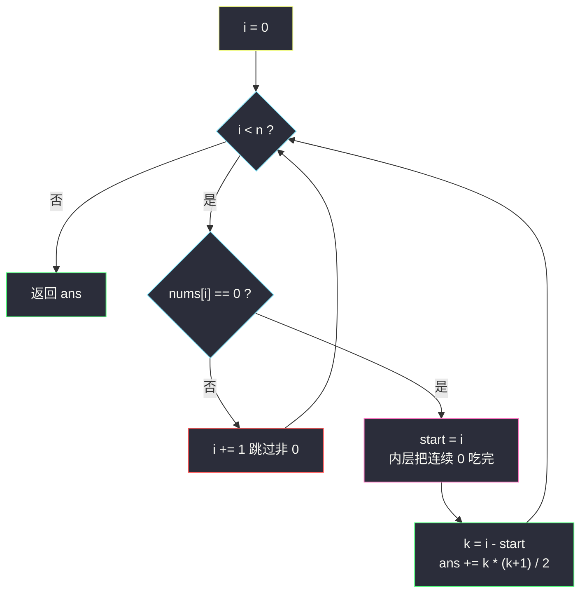
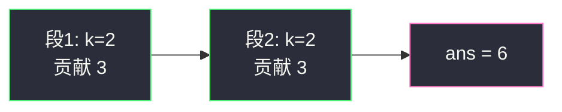

# 全 0 子数组的数目（分组循环 · 连续段组合数）

## 一、问题描述

给你一个整数数组 `nums`，返回全部由 `0` 组成的**连续子数组**的数目。子数组是数组中一段连续的非空区间。

> 🔗 LeetCode 2348：https://leetcode.cn/problems/number-of-zero-filled-subarrays/
>
> 数据范围：`1 <= nums.length <= 10^5`，`0 <= nums[i] <= 10^9`。

**示例 1**

```
输入：nums = [1,3,0,0,2,0,0,4]
输出：6
解释：两段连续 0 各长 2，每段贡献 3 个子数组：[0]、[0]、[0,0]，合计 6。
```

**示例 2**

```
输入：nums = [0,0,0,2,0,0]
输出：9
解释：长度为 3 的 0 段贡献 6，长度为 2 的 0 段贡献 3，合计 9。
```

**示例 3**

```
输入：nums = [2,10,2019]
输出：0
解释：一个 0 都没有，答案为 0。
```

**直观理解**

非 0 把数组切成若干段「互不相干的 0 岛」。每座岛内部，任意 `[L, R]` 都是合法的全 0 子数组；岛与岛之间隔着非 0，拼不成全 0。于是整题塌缩成：**找出每一段连续 0，把段长 `k` 换成组合数 `k * (k + 1) / 2`，再求和。**

---

## 二、暴力解法

枚举所有子数组左端 `L`、右端 `R`，再扫一遍检查是否全 0：

```python
class Solution:
    def zeroFilledSubarray(self, nums: List[int]) -> int:
        n, ans = len(nums), 0
        for L in range(n):
            for R in range(L, n):
                if all(nums[i] == 0 for i in range(L, R + 1)):
                    ans += 1
        return ans
```

稍作剪枝：一旦 `nums[R] != 0`，以 `L` 开头、右端再往右的子数组都不可能全 0，可以 `break`：

```python
class Solution:
    def zeroFilledSubarray(self, nums: List[int]) -> int:
        n, ans = len(nums), 0
        for L in range(n):
            for R in range(L, n):
                if nums[R] != 0:
                    break
                ans += 1                       # [L..R] 目前仍全 0
        return ans
```

### 复杂度

- **时间**：剪枝后仍是 `O(n²)`——全 0 数组会把内层跑满。
- **空间**：`O(1)`。

`n = 10^5` 时约 `10¹⁰` 次操作，必然超时。

### 🔴 瓶颈在哪里

同一段连续 `k` 个 0 里，合法子数组的个数有**闭式**：长度为 1 的有 `k` 个，长度为 2 的有 `k - 1` 个，……长度为 `k` 的有 1 个，合计 `k * (k + 1) / 2`。暴力却把这 `O(k²)` 个子数组一个个点名。分组循环按段结算，每座岛 `O(1)` 出答案。

---

## 三、优化探索（核心章节）

> 📚 本题在灵茶题单中属于 **六、分组循环**：外层 `while i < n`，内层把「同一段」吃完，组内一次性结算、组间互不影响。

### 3.1 一段连续 k 个 0 贡献多少

在长度为 `k` 的 0 段里任取两端 `0 ≤ l ≤ r < k`，对应一个全 0 子数组。这样的 `(l, r)` 共有：

```
1 + 2 + … + k = k * (k + 1) / 2
```

也可以从右端点看：以段内第 `t` 个 0 为右端点的全 0 子数组有 `t` 个（左端可以是这 `t` 个 0 中的任意一个）。两种看法同一公式。

以 `k = 3`、下标 `0,1,2` 全为 0 为例，全部 6 个子数组是：

| 左端 \ 右端 | 0 | 1 | 2 |
|-------------|---|---|---|
| 0 | `[0,0]` | `[0,1]` | `[0,2]` |
| 1 | — | `[1,1]` | `[1,2]` |
| 2 | — | — | `[2,2]` |

格子数 = 上三角，恰好 `3 * 4 / 2 = 6`。任意更长的 0 段都是这张表按 `k` 放大。

### 3.2 分组循环怎么切段

指针 `i` 从 0 走到 `n`。碰到非 0 就跳过；碰到 0 就记下 `start = i`，内层 `while` 一路吃到这段 0 的尽头，得到 `k = i - start`，累加 `k * (k + 1) / 2`。



### 3.3 等价视角：每来一个 0 就加当前段长

不必等整段吃完。维护「当前连续 0 的个数」`cnt`：遇到 0 则 `cnt += 1`，这个新 0 作为右端点，新增恰好 `cnt` 个全 0 子数组（左端落在当前这段里）；遇到非 0 则 `cnt = 0`。全程 `ans += cnt`，与分组公式逐段相加是同一回事——公式是整段求和，增量是把求和拆到每个右端点上。

### 3.4 循环不变式

外层每次回到 `while i < n` 时：`[0, i)` 里所有全 0 子数组已经计入 `ans`，且 `i` 要么是下一段的起点、要么已越界。内层吃完后 `[start, i)` 是一段**极大** 0 段（左右若还在界内必为非 0 或边界），因此不会漏计、也不会把两段拼在一起。

### 3.5 一句话核心

> **非 0 是岛界。分组循环切出每段连续 k 个 0，贡献 `k * (k + 1) / 2`；或边走边 `ans += cnt`，两种写法同一公式。**

---

## 四、代码实现

### Python（主解：分组循环）

```python
class Solution:
    def zeroFilledSubarray(self, nums: List[int]) -> int:
        n, ans, i = len(nums), 0, 0
        while i < n:                            # 外层：还没扫完
            if nums[i] != 0:
                i += 1                          # 非 0：跳过
                continue
            start = i
            while i < n and nums[i] == 0:       # 内层：把这一段 0 吃完
                i += 1
            k = i - start                       # 本段长度
            ans += k * (k + 1) // 2             # 本段贡献的子数组个数
        return ans
```

**等价写法（增量 `ans += cnt`）**

```python
class Solution:
    def zeroFilledSubarray(self, nums: List[int]) -> int:
        ans = cnt = 0
        for x in nums:
            if x == 0:
                cnt += 1
                ans += cnt                      # 以当前 0 为右端的新子数组
            else:
                cnt = 0
        return ans
```

**变量含义**

| 变量 | 含义 |
|------|------|
| `i` | 扫描指针，每个下标恰好访问一次 |
| `start` | 当前 0 段左端 |
| `k` | 当前 0 段长度 |
| `ans` | 已结算的全 0 子数组个数 |

**循环不变式**：见 3.4。增量写法里，扫完 `nums[0..i]` 后 `cnt` 是以 `i` 结尾的连续 0 个数，`ans` 是 `nums[0..i]` 内全部全 0 子数组数。

### Java（最优解同款）

```java
class Solution {
    public long zeroFilledSubarray(int[] nums) {
        long ans = 0;
        int i = 0, n = nums.length;
        while (i < n) {
            if (nums[i] != 0) { i++; continue; }
            int start = i;
            while (i < n && nums[i] == 0) i++;
            long k = i - start;                 // 乘法会爆 int，用 long
            ans += k * (k + 1) / 2;
        }
        return ans;
    }
}
```

全 0 时 `k = n = 10^5`，`k * (k + 1) / 2 = 5_000_050_000`，超出 32 位整数，Java 必须用 `long`。

---

## 五、具体例子演示

以示例 1 `nums = [1,3,0,0,2,0,0,4]` 走分组循环，跟踪**每段长度与组合数**：

| 轮 | i 起点 | 动作 | 段 `[start, i)` | k | 本段贡献 `k*(k+1)/2` | ans |
|----|--------|------|-----------------|---|----------------------|-----|
| 1 | 0 | `1 != 0`，跳过 | — | — | — | 0 |
| 2 | 1 | `3 != 0`，跳过 | — | — | — | 0 |
| 3 | 2 | 吃 0 段到下标 4 | `[2, 4)` 即两个 0 | 2 | 3 | 3 |
| 4 | 4 | `2 != 0`，跳过 | — | — | — | 3 |
| 5 | 5 | 吃 0 段到下标 7 | `[5, 7)` 即两个 0 | 2 | 3 | **6** |
| 6 | 7 | `4 != 0`，跳过 | — | — | — | 6 |

`i = 8 == n`，返回 **6** ✓。第一段 3 个子数组是 `[0]`、`[0]`、`[0,0]`（下标 `[2,2]`、`[3,3]`、`[2,3]`）；第二段同理。

增量写法走同一输入（每来一个 0 就加当前 `cnt`），与分段公式逐项展开一致：

| i | nums[i] | cnt | 本步 `ans += cnt` | ans | 本步新增的子数组 |
|---|---------|-----|-------------------|-----|------------------|
| 0 | 1 | 0 | — | 0 | — |
| 1 | 3 | 0 | — | 0 | — |
| 2 | 0 | 1 | +1 | 1 | `[2,2]` |
| 3 | 0 | 2 | +2 | 3 | `[3,3]`、`[2,3]` |
| 4 | 2 | 0 | — | 3 | 段断开 |
| 5 | 0 | 1 | +1 | 4 | `[5,5]` |
| 6 | 0 | 2 | +2 | **6** | `[6,6]`、`[5,6]` |
| 7 | 4 | 0 | — | 6 | — |

示例 2：`[0,0,0,2,0,0]` → 段长 3 贡献 6，段长 2 贡献 3，合计 **9** ✓。第一段 6 个即 `k=3` 上表那一格不漏。



---

## 六、复杂度分析

| 方法 | 时间 | 空间 | 说明 |
|------|------|------|------|
| 枚举子数组 | `O(n²)` | `O(1)` | 全 0 时跑满 |
| 分组循环（主解） | `O(n)` | `O(1)` | 每个下标进外层/内层各一次 |
| 增量 `ans += cnt` | `O(n)` | `O(1)` | 与分组等价，常数略小 |

---

## 七、对比总结

| 维度 | 分组循环 | 增量 cnt |
|------|----------|----------|
| 结算时机 | 整段吃完一次性加公式 | 每个 0 当场加当前段长 |
| 公式可见性 | `k * (k + 1) / 2` 写在脸上 | 把求和拆到右端点 |
| 适用 | 任何「按连续段闭式结算」 | 本题这种三角数尤其顺手 |

**易错点**

1. **Java 溢出**：`k * (k + 1)` 先乘再除，必须先把 `k` 提成 `long`。
2. **漏掉长度为 1 的段**：单 0 也贡献 1，公式 `1 * 2 / 2 = 1`，不要特判掉。
3. **两段之间的非 0**：内层只吃 `== 0`，不会跨过非 0 把两岛合成一岛。
4. **空段**：`nums[i] != 0` 时不要算 `k = 0` 的公式（加 0 无害，但会让人误以为在处理 0 段）。
5. 子数组必须连续——不要理解成「子序列里全是 0」。

**模板（分组循环切连续段）**

```python
i = 0
while i < n:
    if 不是目标段:
        i += 1
        continue
    start = i
    while i < n and 仍属同一段:
        i += 1
    k = i - start
    # 用 k 做 O(1) 结算
```

---

## 八、举一反三

| 题目 | 关系 |
|------|------|
| [1513. 仅含 1 的子串数](https://leetcode.cn/problems/number-of-substrings-with-only-1s/) | 同批姊妹篇：把 0 换成 1，再对 `10^9+7` 取模 |
| [1759. 统计同质子字符串的数目](https://leetcode.cn/problems/count-number-of-homogenous-substrings/) | 连续相同字符（不限 0/1）同样贡献 `k * (k + 1) / 2` |
| [1446. 连续字符](https://leetcode.cn/problems/consecutive-characters/) | 只要最长段，分组循环取 `max(k)` |
| [485. 最大连续 1 的个数](https://leetcode.cn/problems/max-consecutive-ones/) | 同上，目标段改成 1 |
| [830. 较大分组的位置](https://leetcode.cn/problems/positions-of-large-groups/) | 分组循环后按 `k ≥ 3` 输出区间 |
| [228. 汇总区间](https://leetcode.cn/problems/summary-ranges/) | 数字版「连续段」，内层吃 `nums[i] == nums[i-1] + 1` |
| [696. 计数二进制子串](https://leetcode.cn/problems/count-binary-substrings/) | 相邻两段长度取 min，仍是分组循环 |

**思想迁移**

- 问「连续段里有多少子数组 / 子串」，先写出段长 `k` 的闭式，再用分组循环把数组切成段。
- 增量 `ans += cnt` 是三角数的逐项展开，遇到「以 i 结尾」的计数题可直接默写。
- 口诀：**「外层 while 扫，内层把段吃完；k 个连续 0，贡献三角数。」**
