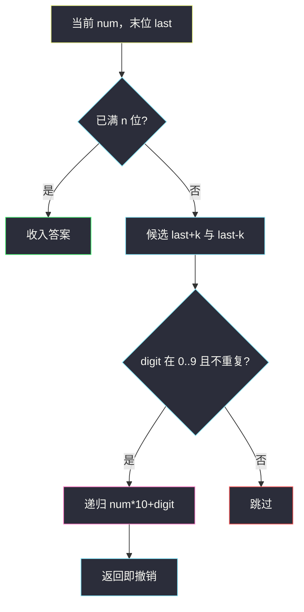
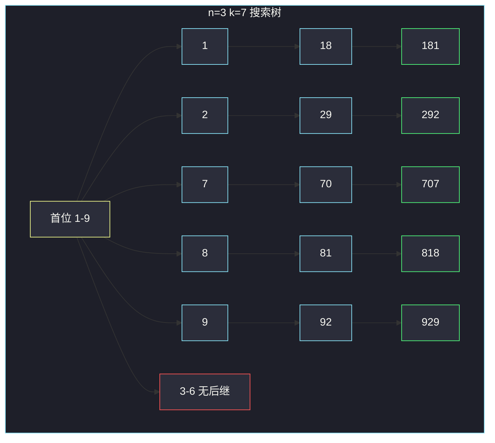

# 连续差相同的数字（回溯构造 n 位数）

## 一、问题描述

给定 `n` 和 `k`，返回所有 `n` 位整数，使得每一位与下一位的**绝对差**都等于 `k`。答案顺序任意。没有前导零（`n = 1` 时 `0` 合法）。

> 🔗 LeetCode 967：https://leetcode.cn/problems/numbers-with-same-consecutive-differences/
>
> 数据范围：`1 ≤ n ≤ 9`，`0 ≤ k ≤ 9`。
>
> 📚 灵茶题单：**回溯 · §4.7 搜索**（1433 分）。

**示例 1**

```
输入：n = 3, k = 7
输出：[181,292,707,818,929]
解释：181 中 |8-1|=7、|1-8|=7。070 有前导零，不合法。
```

**示例 2**

```
输入：n = 2, k = 1
输出：[10,12,21,23,32,34,43,45,54,56,65,67,76,78,87,89,98]
```

**直观理解**

从高位往低位填数字。第一位只能是 `1`–`9`（`n = 1` 时再加上 `0`）。之后每一位必须是「上一位 ± k」，且落在 `0`–`9`。这是 §4.7：**做选择 → 递归 → 撤销**；非法数字根本不进下一层。

`k = 0` 时 `+k` 和 `-k` 是同一个数，候选去重，否则同一条路会走两遍。

---

## 二、暴力解法

枚举全部 `n` 位数，逐对检查相邻差是否为 `k`：

```python
class Solution:
    def numsSameConsecDiff(self, n: int, k: int) -> List[int]:
        if n == 1:
            return list(range(10))
        ans = []
        start = 10 ** (n - 1)
        for x in range(start, 10 ** n):
            s = str(x)
            ok = True
            for i in range(1, n):
                if abs(int(s[i]) - int(s[i - 1])) != k:
                    ok = False
                    break
            if ok:
                ans.append(x)
        return ans
```

`n = 9` 时要扫 `9 × 10^8` 个数，必然超时。大量数字在第二位就已经差不对，后面的位数白枚举。

### 复杂度

- **时间**：`O(n · 10^n)`，`n = 9` 不可行。
- **空间**：`O(1)` 不计答案。

### 🔴 瓶颈在哪里

合法下一位最多两个（`last+k`、`last-k`）。从 9 个首位出发，深度 `n`、分支 ≤ 2，搜索树大小约 `9 × 2^{n-1}`，`n = 9` 时两千出头。按位构造，差不对的边直接不走。

---

## 三、优化探索（核心章节）

> 📚 本题在灵茶题单中属于 **回溯 · §4.7 搜索**。与生成不含相邻零的二进制串同一骨架：当前状态 = 已经填了几位 + 最后一位是谁；选一个合法 digit，递归，回来不用显式 pop（整数乘法进位，返回即自然撤销）。

### 3.1 状态

- `num`：已经拼好的前缀（整数，避免字符串）。
- `last`：前缀的个位，用来算下一位。
- 还要填 `remain` 位（或已填长度 `len` 达到 `n`）。

填满 `n` 位：把 `num` 放进答案。

### 3.2 下一位候选

```
nxt = last + k  或  last - k
要求 0 ≤ nxt ≤ 9
k == 0 时两个相同，只保留一个
```



### 3.3 首位与 n = 1

- `n = 1`：没有「相邻」，`0`–`9` 都合法，与 `k` 无关。
- `n ≥ 2`：第一位 `1`–`9`，再 DFS。

### 3.4 一句话核心

> **从 1–9 起填；下一位只能是末位 ± k（范围内、k=0 去重）；满 n 位就收。**

---

## 四、代码实现

### Python（主解：回溯拼整数）

```python
class Solution:
    def numsSameConsecDiff(self, n: int, k: int) -> List[int]:
        ans = []

        def dfs(num: int, last: int, filled: int) -> None:
            if filled == n:
                ans.append(num)
                return
            seen = set()
            for nxt in (last + k, last - k):
                if 0 <= nxt <= 9 and nxt not in seen:
                    seen.add(nxt)
                    dfs(num * 10 + nxt, nxt, filled + 1)

        if n == 1:
            return list(range(10))
        for d in range(1, 10):
            dfs(d, d, 1)
        return ans
```

**变量含义**

| 写法 | 含义 |
|------|------|
| `num` | 当前前缀，如 `18` 再接 `1` 变成 `181` |
| `last` | 前缀末位 |
| `filled` | 已经填了几位 |
| `seen` | `k = 0` 时 `last±k` 只走一次 |

`n = 1` 单独返回，避免首位循环从 1 开始漏掉 `0`。

列表版同样可以：`path.append` / `path.pop()`，叶子处 `int("".join(...))`。整数乘法省掉字符串，撤销是免费的。

### Java（可选）

```java
class Solution {
    public int[] numsSameConsecDiff(int n, int k) {
        List<Integer> ans = new ArrayList<>();
        if (n == 1) {
            for (int i = 0; i <= 9; i++) ans.add(i);
        } else {
            for (int d = 1; d <= 9; d++) {
                dfs(d, d, 1, n, k, ans);
            }
        }
        int[] res = new int[ans.size()];
        for (int i = 0; i < ans.size(); i++) res[i] = ans.get(i);
        return res;
    }

    private void dfs(int num, int last, int filled, int n, int k, List<Integer> ans) {
        if (filled == n) {
            ans.add(num);
            return;
        }
        int[] cand = (k == 0) ? new int[]{last} : new int[]{last + k, last - k};
        for (int nxt : cand) {
            if (nxt >= 0 && nxt <= 9) {
                dfs(num * 10 + nxt, nxt, filled + 1, n, k, ans);
            }
        }
    }
}
```

---

## 五、具体例子演示

**示例 1**：`n = 3, k = 7`。首位 1–9，每步列出选择与是否撤销（走不通则根本不递归）。

| 步骤 | 当前 num | 选择 nxt | 合法? | 动作 |
|------|----------|----------|-------|------|
| 1 | 1 | 1+7=8 | 是 | 进入 18 |
| 2 | 18 | 8+7=15 | 否 | 跳过 |
| 3 | 18 | 8-7=1 | 是 | 进入 181，满 3 位，**收入** |
| 4 | 18 | — | — | 返回，撤销到 1 |
| 5 | 1 | 1-7=-6 | 否 | 首位 1 结束 |
| 6 | 2 | 9 | 是 | 29 → 292 **收入** |
| 7–10 | 3,4,5,6 | ±7 均越界 | 否 | 整枝空 |
| 11 | 7 | 0（7-7） | 是 | 70 → 707 **收入** |
| 12 | 8 | 1 | 是 | 81 → 818 **收入** |
| 13 | 9 | 2 | 是 | 92 → 929 **收入** |

答案 `[181, 292, 707, 818, 929]`。没有前导零，因为从未从 0 起填。



**`k = 0, n = 2`**：每位只能重复自己。若不去重，`last±0` 会把 `11` 加两次。去重后答案为 `11,22,…,99`。

**`n = 1`**：回溯满 1 位即停，首位若从 1 循环会漏 `0`，所以特判 `list(range(10))`。

---

## 六、复杂度分析

| 方法 | 时间 | 空间 | 说明 |
|------|------|------|------|
| 枚举全部 n 位数 | `O(n · 10^n)` | `O(1)` | `n=9` 超时 |
| 回溯（主解） | `O(2^n)` 量级 | `O(n)` 递归栈 | 每层分支 ≤ 2；`n ≤ 9`，最多约 `9 × 2^8` 条路径 |

答案个数本身最多同阶，输出占用另计。`k = 0` 时答案只有 9 个（`n=1` 时 10 个），搜索几乎不分支。

---

## 七、对比总结

| 维度 | 本题 | #3211 不含相邻零的二进制串 |
|------|------|------------------------------|
| 模板 | §4.7 按位选择 | 同节，末位约束 |
| 字母表 | 十进制 0–9 | 二进制 0/1 |
| 约束 | `\|a-b\|=k` | 不能 `00` |
| 首位 | `n>1` 时 1–9 | 0、1 都行 |

**易错点**

1. **`k = 0` 重复加入**：`last+k` 与 `last-k` 相同，答案里每个数出现两次。用 `set` 或 `k==0` 只走一侧。
2. **漏掉 `n = 1` 的 0**：第一位循环 `1..9` 写死，`n=1` 会少一个 0。
3. **前导零**：`n≥2` 时从 0 开始 DFS，会造出 `070` 这种 3 位数的假象（整数 `70` 已不是 3 位，更会和真 70 冲突）。首位不要 0。
4. **下一位越界还继续**：`last+k=10` 必须丢弃，不能模 10。
5. **把差写成 `k` 而不是绝对差**：`last-k` 也要枚举，否则 181 只剩上升序列，会漏 707 这类先降后升。

---

## 八、举一反三

| 题目 | 关系 |
|------|------|
| [3211. 生成不含相邻零的二进制字符串](https://leetcode.cn/problems/generate-binary-strings-without-adjacent-zeros/) | 同节回溯，末位约束不同。见 `generate-binary-strings-without-adjacent-zeros.md` |
| [17. 电话号码的字母组合](https://leetcode.cn/problems/letter-combinations-of-a-phone-number/) | 按位选字母，经典回溯 |
| [1291. 顺次数](https://leetcode.cn/problems/sequential-digits/) | 相邻差固定为 1 的特殊情形 |
| [357. 统计各位数字都不同的数字个数](https://leetcode.cn/problems/count-numbers-with-unique-digits/) | 按位计数 / 回溯，注意前导零 |
| [980. 不同路径 III](https://leetcode.cn/problems/unique-paths-iii/) | 网格上的回溯：选择 → 走 → 撤销 |

**思想迁移**

- 位数小、每步合法分支少 → 直接搜，不要先生成再过滤。
- 口诀：**「首位 1–9；下一位末位 ± k；k=0 去重；满 n 位收进答案。」**
