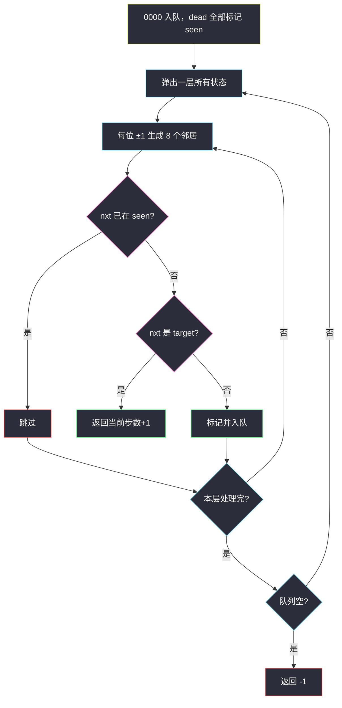
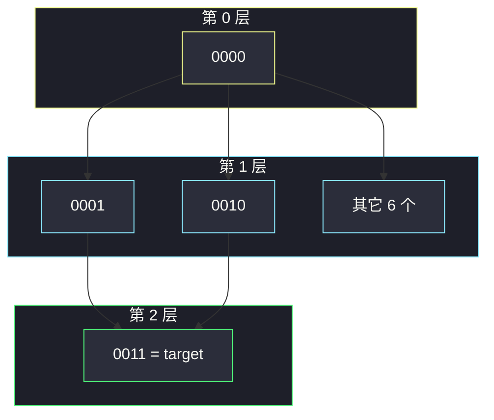

# 打开转盘锁（四位数字当点 · BFS 最短路）

## 一、问题描述

四位转盘锁，每位是 `0-9`，可向上或向下拨一格（`9` 再向上变成 `0`，`0` 再向下变成 `9`）。`deadends` 里的状态不能停留。从 `"0000"` 转到 `target`，求最少拨动次数；无法到达返回 `-1`。

> 🔗 LeetCode 752：https://leetcode.cn/problems/open-the-lock/
>
> 数据范围：`deadends.length <= 500`，`target` 与死锁都是 4 位数字串。
>
> 📚 灵茶题单：**图论 · §1.3 图论建模 + BFS 最短路**（1878 分）。

**示例 1**

```
输入：deadends = ["0201","0101","0102","1212","2002"], target = "0202"
输出：6
一条合法路径：
0000 → 1000 → 1100 → 1200 → 1201 → 1202 → 0202
走 0000 → 0001 → 0002 → 0102 会卡在死锁 0102。
```

**示例 2**

```
输入：deadends = ["8888"], target = "0009"
输出：1
最后一位向下拨：0000 → 0009。
```

**示例 3**

```
输入：deadends = ["8887","8889","8878","8898","8788","8988","7888","9888"], target = "8888"
输出：-1
8888 的 8 个邻居全是死锁，进不去。
```

**直观理解**

每个四位串是图上一个点，一共 `10000` 个。一个状态拨一下到达另一个状态，边权全是 1。最短拨动次数 = 无权图最短路 = **BFS 层数**。死锁点当作障碍：一开始就丢进 `visited`，永远不入队。

---

## 二、暴力解法

DFS 搜所有拨法，用 `seen` 防环，记录到达 `target` 的最小步数。先走远路会把答案定得很差，回溯还要再试其它分支。状态 1e4、出度 8，DFS 最坏远超线性，超时且难剪干净。

```python
# 伪代码：dfs(cur, step)；邻居 8 个；step >= ans 剪枝；见到 target 更新 ans
# 不按层扩展，第一次碰到 target 不一定最短，还必须回溯。
```

### 复杂度

- **时间**：远大于 `O(10000)`，最坏指数。
- **空间**：递归栈 + `seen`。

### 🔴 瓶颈在哪里

边权全是 1，**先到的一定步数更少**。BFS 第一次碰到 `target` 就是最少拨动。不该 DFS。

---

## 三、优化探索（核心章节）

> 📚 本题在灵茶题单中属于 **§1.3 图论建模 + BFS**。四位数字当顶点，每位 ±1（含 9↔0）为边；死锁加入 visited；从 0000 做 BFS。

### 3.1 隐式建图

不必把 10000 个点的邻接表预先建出来。弹出状态 `u` 时现场生成 8 个邻居：第 `i` 位 `(d+1)%10` 与 `(d-1)%10`。

特殊判定：

- 起点就是 `target` → 返回 0（一次都不用拨）。
- 起点在 `deadends` → 锁一上来就卡死，返回 `-1`。
- `target` 本身若在死锁里（少见），也会因为进不了该点而得到 `-1`。

### 3.2 BFS 层数 = 步数

队列存字符串，`step` 可以跟在状态旁，或按层 `for _ in range(len(q))` 每扩一层 `step += 1`。入队即标记 `seen`，避免同一密码进队两次。

死锁预处理进 `seen`：后面生成邻居时 `if nxt in seen: continue` 一条规则同时挡住「走过」和「死锁」。



### 3.3 规模

状态 ≤ 10000，每点 8 边，`O(10000)` 稳过。双向 BFS（从 0000 与 target 对向扩）能再砍常数，不是默写重点。

### 3.4 一句话核心

> **四位串当点、拨一下当边权 1；死锁预先视为已访问；BFS 第一次碰到 target 的层数就是答案。**

---

## 四、代码实现

### Python（主解：BFS）

```python
from collections import deque

class Solution:
    def openLock(self, deadends: list[str], target: str) -> int:
        if target == "0000":
            return 0
        seen = set(deadends)
        if "0000" in seen:
            return -1

        def neighbors(s: str):
            for i in range(4):
                x = int(s[i])
                for d in (1, -1):
                    yield s[:i] + str((x + d) % 10) + s[i + 1:]

        q = deque(["0000"])
        seen.add("0000")
        step = 0
        while q:
            for _ in range(len(q)):
                u = q.popleft()
                for nxt in neighbors(u):
                    if nxt in seen:
                        continue
                    if nxt == target:
                        return step + 1
                    seen.add(nxt)
                    q.append(nxt)
            step += 1
        return -1
```

**变量含义**

| 变量 | 含义 |
|------|------|
| `seen` | 死锁 ∪ 已入队密码 |
| `q` | 当前待扩展状态 |
| `step` | 已拨次数 = BFS 层号 |

入队即加入 `seen`，保证每个密码最多扩展一次。`(x+d)%10` 自动处理 `0↔9`。

### Java（可选）

```java
class Solution {
    public int openLock(String[] deadends, String target) {
        if (target.equals("0000")) return 0;
        Set<String> seen = new HashSet<>(Arrays.asList(deadends));
        if (seen.contains("0000")) return -1;
        ArrayDeque<String> q = new ArrayDeque<>();
        q.add("0000");
        seen.add("0000");
        int step = 0;
        while (!q.isEmpty()) {
            int sz = q.size();
            for (int i = 0; i < sz; i++) {
                String u = q.poll();
                char[] cs = u.toCharArray();
                for (int k = 0; k < 4; k++) {
                    char old = cs[k];
                    for (int d = -1; d <= 1; d += 2) {
                        cs[k] = (char) ('0' + (old - '0' + d + 10) % 10);
                        String nxt = new String(cs);
                        if (seen.contains(nxt)) continue;
                        if (nxt.equals(target)) return step + 1;
                        seen.add(nxt);
                        q.add(nxt);
                    }
                    cs[k] = old;
                }
            }
            step++;
        }
        return -1;
    }
}
```

---

## 五、具体例子演示

### 示例 2（一层就结束）

`dead = {8888}`，`target = 0009`。起点不是死锁。

| 层 step | 弹出 | 8 个邻居里新状态 | 命中? |
|---------|------|------------------|-------|
| 0 | 0000 | 1000,9000,0100,0900,0010,0090,**0001**,**0009** | 0009 是 target，返回 `0+1=1` |

向下拨个位：`0-1 → 9`。不必真拨 9 次 `+1`。

### 示例 1（死锁挡住近路）

`dead = {0201,0101,0102,1212,2002}`，这些一开始就在 `seen` 里。

**第 0 层**：弹出 `0000`。8 个邻居全部合法，入队（无 target）。

**第 1 层**（`step` 仍为 0 扩完后变成 1）：弹出 `1000,9000,0100,...`。从 `0100` 会生成 `0101`（死锁，跳过）、`0102`（死锁，跳过）。近路 `0000→0001→0002→0102` 在第三步被墙拦住，BFS 不会把 `0102` 入队。

继续向外扩。一条最短合法链长度为 6，第一次把 `0202` 从某邻居生成时 `step+1 == 6` 返回。

用更短的自造例子看清「按层」：`deadends=[]`，`target=0011`。

| 层 | 队列（部分） | 说明 |
|----|--------------|------|
| 0 | `0000` | 起点 |
| 1 | `1000,9000,0100,0900,0010,0090,0001,0009` | 只动一位 |
| 2 | 含 `0011`（由 `0010` 拨个位，或 `0001` 拨十位） | 第一次见到 0011，返回 2 |

不可能 1 步得到两位都变，所以 2 是最少。



---

## 六、复杂度分析

| 方法 | 时间 | 空间 | 说明 |
|------|------|------|------|
| DFS 回溯 | 最坏远超 1e4 | `O(10000)` | 不保证先找到最短 |
| BFS（主解） | `O(10000)` | `O(10000)` | 每状态最多入队一次，出度 8 |

更精确：`O(d^n · n)`，`d=10` 进制、`n=4` 位，生成邻居时拼字符串再乘常数。

---

## 七、对比总结

| 维度 | DFS | BFS |
|------|-----|-----|
| 第一次碰到 target | 未必最短 | 一定最短（边权 1） |
| 死锁 | 同样要禁 | 预处理进 seen |
| 默写 | 还要回溯改 ans | 队列 + 层数 |

**易错点**

1. **起点是死锁没判**：`0000 in deadends` 必须先返回 `-1`，不能入队。
2. **起点等于 target 返回了 -1**：应返回 0；建议最先判断。
3. **拨位用 `±1` 却忘了模 10**：`0` 的下一位不是 `-1`，是 `9`。
4. **出队再标记**：同一密码会被多个前驱重复入队，队列膨胀。
5. **把死锁当可以经过、只是不能当终点**：题目是不能停在死锁，经过即停在该状态，必须完全禁止。
6. 字符串拼接下标写错，只改了一位却拼错其它位。

---

## 八、举一反三

| 题目 | 关系 |
|------|------|
| [127. 单词接龙](https://leetcode.cn/problems/word-ladder/) | 单词当点、改一个字母当边，同样 BFS 最短 |
| [433. 最小基因变化](https://leetcode.cn/problems/minimum-genetic-mutation/) | 锁盘的基因版，银行当合法邻居 |
| [1091. 二进制矩阵中的最短路径](https://leetcode.cn/problems/shortest-path-in-binary-matrix/) | 网格隐式图 + BFS |
| [815. 公交路线](https://leetcode.cn/problems/bus-routes/) | 建模：车站/线路当点，再 BFS |
| [207. 课程表](https://leetcode.cn/problems/course-schedule/) | 另一种图建模（有向边 = 先修），问的是能否完成而不是步数 |

同目录：[1631. 最小体力消耗路径](https://leetcode.cn/problems/path-with-minimum-effort/) 边权不再是 1，改 Dijkstra，不是朴素队列。

**思想迁移**

- 状态少而转移局部时，把状态当点、转移当边，最短步数直接 BFS。
- 口诀：**「四位密码是节点，拨一下走一步；死锁丢进 seen，BFS 层数即答案。」**
