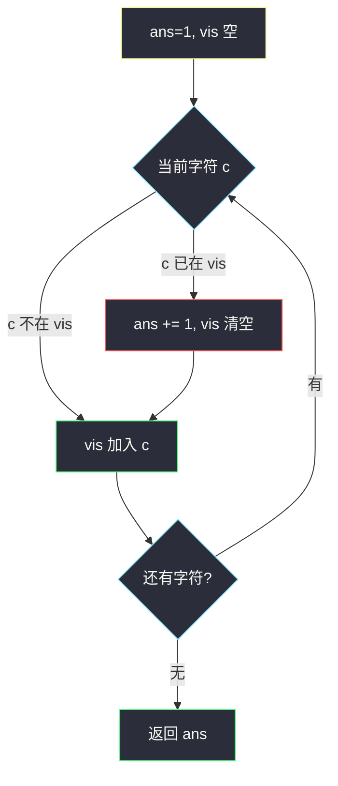
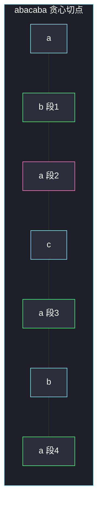

# 子字符串的最优划分（划分型贪心 · 每段尽量长）

## 一、问题描述

把字符串 `s` 划分成一段或多段**连续子串**，要求每一段内部字符都**互不相同**（同一段里每个字母最多出现一次）。求最少要划成多少段。原串每个字符必须恰好属于一段。

> 🔗 LeetCode 2405：https://leetcode.cn/problems/optimal-partition-of-string/
>
> 数据范围：`1 ≤ s.length ≤ 10^5`，`s` 只含小写字母。
>
> 📚 灵茶题单：**§1.5 划分型贪心**（1355 分）。

**示例 1**

```
输入：s = "abacaba"
输出：4
解释：一种划分是 "ab" | "a" | "ca" | "ba"；另一种是 "a" | "ba" | "cab" | "a"。
可以证明 4 是最少段数。
```

**示例 2**

```
输入：s = "ssssss"
输出：6
解释：每个 s 都和前一个重复，只能切成 6 个单字符段。
```

**直观理解**

要的是**段数最少**，所以每一段都该尽量长：能再吃一个字符就吃，直到再吃就会在本段里出现重复，才被迫切一刀、新开一段。

同目录的 [分割平衡字符串](https://leetcode.cn/problems/split-a-string-in-balanced-strings/) 是反面：那边要段数**最多**，所以能切就立刻切（每段尽量短）。本题目标相反，切刀越晚越好。

---

## 二、暴力解法

在 `n-1` 个缝里选切点，检查每段是否无重复字符，取合法划分的最小段数。切点指数级。

也可以 DP：`f[i]` = 前缀 `s[0..i)` 的最少段数。枚举最后一段起点 `j`，若 `s[j..i)` 无重复则 `f[i] = min(f[j]+1)`。一段最长 26，转移是 `O(26n)`，能过，但没有抓住「最优切法可以从左到右贪心」的结构。

```python
class Solution:
    def partitionString(self, s: str) -> int:
        n = len(s)
        inf = n + 1
        f = [inf] * (n + 1)
        f[0] = 0
        for i in range(1, n + 1):
            seen = set()
            for j in range(i - 1, -1, -1):
                if s[j] in seen:
                    break
                seen.add(s[j])
                f[i] = min(f[i], f[j] + 1)
        return f[n]
```

`n = 10^5` 时若最后一段很长仍可能走到 26 就 break，实际是 `O(26n)`，可过；但面试里应直接写贪心。

### 🔴 瓶颈在哪里

DP 在枚举「最后一段还可以更短」。对「最少段数」来说，缩短当前段只会把字符扔给后面，段数不会变少。所以当前段应该伸到**不能再伸**为止——这正是划分型贪心的「最少段 → 每段尽量长」。

---

## 三、优化探索（核心章节）

> 📚 本题在灵茶题单中属于 **§1.5 划分型贪心**。对照同节「最多段」模板（如 1221）：最多段 → 局部一合法就切；最少段 → 局部还能延就延，直到再吃就违规。

### 3.1 当前段用集合记下出现过的字符

从左往右扫。维护本段已出现字符的集合 `vis`。

- 若当前字符不在 `vis` 里：吃进本段，加入 `vis`。
- 若已经在 `vis` 里：本段不能再要它，**必须**在它前面切一刀；`ans += 1`，清空 `vis`，这个字符作为新段的第一个字符。

第一段在开始时已经算上，所以 `ans` 初值为 1（或扫完后把最后一段计入，两种写法等价）。

### 3.2 为什么「尽量长」最优

设从左扫时，第一段在贪心下会伸到下标 `r`（`s[r+1]` 与 `s[0..r]` 某字符重复，或已到末尾）。

- 若在更早的 `t < r` 处切：前半只贡献 1 段，但少吃了 `s[t+1..r]`，这些字符还要占用后面的段，总段数 ≥ `1 + 后缀最少段`，不会比在 `r` 处切更好。
- 在 `r` 之后切不合法：`s[r+1]` 已经和本段重复。

所以第一刀的位置可以固定为贪心右端点，后面归纳。这与 1221「第一刀必须切在最短合法前缀」对称：那里切早最优，这里切晚最优。



小写字母只有 26 个，`vis` 也可用整型 bitmask：`bit = 1 << (ord(c)-97)`，`mask & bit` 非 0 表示重复。

### 3.3 一句话核心

> **当前段用集合记出现过的字母；碰到重复就切一刀、清空集合、新开一段。段数最少 = 每段撑到不能再撑。**

---

## 四、代码实现

### Python（主解：集合 + 遇重复切段）

```python
class Solution:
    def partitionString(self, s: str) -> int:
        ans = 1
        vis = set()
        for c in s:
            if c in vis:
                ans += 1
                vis.clear()
            vis.add(c)
        return ans
```

**变量含义**

| 写法 | 含义 |
|------|------|
| `vis` | 当前这一段已经出现过的字符 |
| `c in vis` | 再吃 `c` 本段就会有重复，必须开新段 |
| `ans` | 已经开了多少段（含当前正在填的这一段） |
| `ans = 1` | 一开始就有第一段，空串不会出现在数据里 |

位运算版（`O(1)` 额外空间，26 位够用）：

```python
class Solution:
    def partitionString(self, s: str) -> int:
        ans = 1
        mask = 0
        for c in s:
            bit = 1 << (ord(c) - 97)
            if mask & bit:
                ans += 1
                mask = 0
            mask |= bit
        return ans
```

### Java（可选）

```java
class Solution {
    public int partitionString(String s) {
        int ans = 1, mask = 0;
        for (int i = 0; i < s.length(); i++) {
            int bit = 1 << (s.charAt(i) - 'a');
            if ((mask & bit) != 0) {
                ans++;
                mask = 0;
            }
            mask |= bit;
        }
        return ans;
    }
}
```

---

## 五、具体例子演示

**示例 1**：`s = "abacaba"`。贪心「每段尽量长」的切法逐步如下。

| 步 | 字符 | 当前 vis | 动作 | 当前段 | ans |
|----|------|----------|------|--------|-----|
| 1 | a | {} | 加入 | a | 1 |
| 2 | b | {a} | 加入 | ab | 1 |
| 3 | a | {a,b} | **重复，切**，a 作为新段 | a | 2 |
| 4 | c | {a} | 加入 | ac | 2 |
| 5 | a | {a,c} | **重复，切** | a | 3 |
| 6 | b | {a} | 加入 | ab | 3 |
| 7 | a | {a,b} | **重复，切** | a | 4 |

划分结果：`"ab" | "ac" | "ab" | "a"`，共 4 段。

官方还给出 `"a"|"ba"|"cab"|"a"` 和 `"ab"|"a"|"ca"|"ba"`，段数同为 4。贪心得到的是其中一种「每段撑满」的方案，不必与官方某一种切点逐字相同，**段数对拍为 4**。



绿格是一段的结尾（下一步因重复而切开，或已到末尾）。粉格是新段起点。

**示例 2**：`s = "ssssss"`。

| 步 | 字符 | vis | 动作 | ans |
|----|------|-----|------|-----|
| 1 | s | {} | 加入 | 1 |
| 2 | s | {s} | 切，新段 s | 2 |
| 3 | s | {s} | 切 | 3 |
| 4 | s | {s} | 切 | 4 |
| 5 | s | {s} | 切 | 5 |
| 6 | s | {s} | 切 | 6 |

每一步第二个 `s` 都撞车，只能 6 段。

若错误地套用 1221 的「能切就切」：在 `"ab"` 这种已经合法的前缀处提前切，`"abacaba"` 会切得比 4 更碎，段数变多，与本题最小化相反。划分型贪心的方向必须先看目标是最多段还是最少段，再决定切早还是切晚。

---

## 六、复杂度分析

| 方法 | 时间 | 空间 | 说明 |
|------|------|------|------|
| 枚举切点 | 指数级 | `O(n)` | 不可用 |
| DP 枚举最后一段 | `O(26n)` | `O(n)` | 能过，非必要 |
| 贪心扫描（主解） | `O(n)` | `O(1)` | 集合最多 26 个字母；bitmask 更干净 |

---

## 七、对比总结

| 维度 | 1221 平衡字符串（最多段） | 本题（最少段） |
|------|---------------------------|----------------|
| 目标 | 段数尽量多 | 段数尽量少 |
| 每段长度 | 尽量短，能切就切 | 尽量长，能延就延 |
| 切点信号 | 计数器回到 0（已经合法） | 再吃一个就会重复（即将非法） |
| 实现 | 一个 `cnt` | 一个 `set` / bitmask |

**易错点**

1. **`ans` 初值写成 0**：忘记当前正在构造的第一段，空结果会少 1；若改成「切的时候才 +1」，扫完后还要再加最后一段。
2. **切段后忘记把当前字符放进新 `vis`**：下一格会把这个字符弄丢，可能少切。
3. **真的去 `split` 字符串**：只需要计数，不需要保存每一段。
4. **和「无重复字符的最长子串」搞混**：第 3 题窗口可以左端收缩后继续同一段；本题划分后左端不能回头把字符分给两段。
5. **官方某一种划分和贪心切点不同就怀疑写错**：最少段数可以有多种划分，对拍的是段数 4，不是某一种具体切法。

---

## 八、举一反三

| 题目 | 关系 |
|------|------|
| [1221. 分割平衡字符串](https://leetcode.cn/problems/split-a-string-in-balanced-strings/) | 同节反面：最多段 → 能切就切 |
| [763. 划分字母区间](https://leetcode.cn/problems/partition-labels/) | 划分型：每段必须覆盖该段字母的最远出现位置 |
| [3. 无重复字符的最长子串](https://leetcode.cn/problems/longest-substring-without-repeating-characters/) | 同样维护「段内字符唯一」，但是滑动窗口求最长，不是切段计数 |
| [915. 分割数组](https://leetcode.cn/problems/partition-array-into-disjoint-intervals/) | 划分成两段，左侧 max ≤ 右侧 min |
| [2405. 子字符串的最优划分](https://leetcode.cn/problems/optimal-partition-of-string/) | 本题 |

**思想迁移**

- 划分型贪心先问目标：最少段 → 违规前一刻再切；最多段 → 合法第一刻就切。
- 口诀：**「集合记本段字母；重复就切，新开一段。」**
