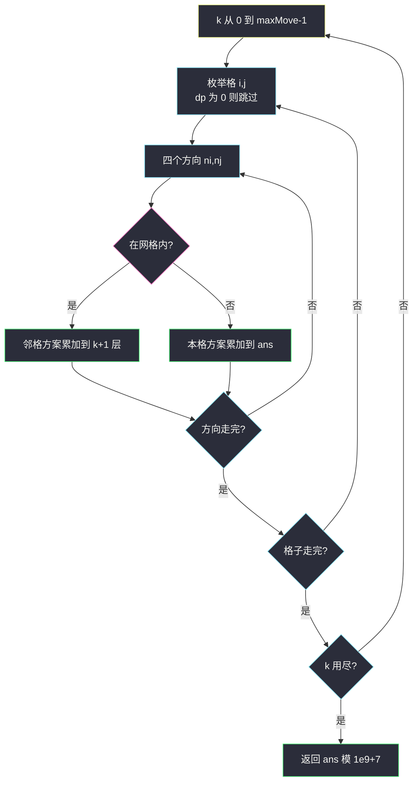
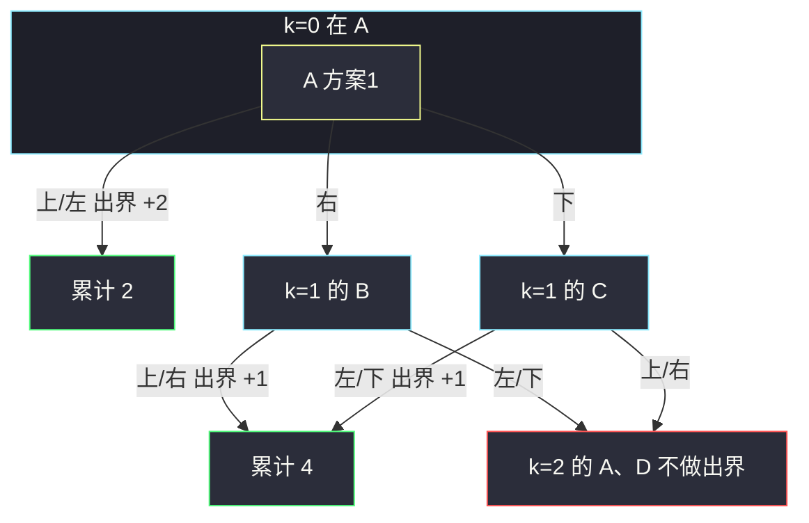

# 出界的路径数（三维网格 DP · 走 k 步在格上）

## 一、问题描述

`m × n` 的网格，球从 `(startRow, startColumn)` 出发，最多走 `maxMove` 步，每步上/下/左/右一格。走出网格边界的路径算一条出界路径。求路径数，对 `10^9+7` 取模。在网格内走满 `maxMove` 步仍未出界的，**不算**。

> 🔗 LeetCode 576：https://leetcode.cn/problems/out-of-boundary-paths/
>
> 数据范围：`1 ≤ m, n, maxMove ≤ 50`。
>
> 📚 灵茶题单：**§7.6 多维 DP**。三个可变参数：已走步数 `k`、行 `i`、列 `j`。`dp[k][i][j]` = 走了恰好 `k` 步后停在 `(i,j)` 的方案数。从某格再走一步若越界，把该格的方案累加进答案。滚动数组可压掉 `k` 这一维。

**示例 1**

```
输入：m = 2, n = 2, maxMove = 2, startRow = 0, startColumn = 0
输出：6
```

**示例 2**

```
输入：m = 1, n = 3, maxMove = 3, startRow = 0, startColumn = 1
输出：12
```

**直观理解**

不是「最短路」，是**计数**。每一步四个方向都要走，出界就记下来并停止这条路径（出界后不能再走回来）。步数上限很小，按「走了几步」分层转移。

---

## 二、暴力解法

从起点 DFS，剩余步数为 0 还在格内则这条路贡献 0；越界贡献 1。

```python
class Solution:
    def findPaths(self, m: int, n: int, maxMove: int, startRow: int, startColumn: int) -> int:
        MOD = 10**9 + 7
        dirs = ((-1, 0), (1, 0), (0, -1), (0, 1))

        def dfs(i: int, j: int, left: int) -> int:
            if i < 0 or i >= m or j < 0 or j >= n:
                return 1
            if left == 0:
                return 0
            ans = 0
            for di, dj in dirs:
                ans += dfs(i + di, j + dj, left - 1)
            return ans % MOD

        return dfs(startRow, startColumn, maxMove)
```

官方两例都能过。同一位置、同一剩余步数被重复搜到，时间约 `O(4^{maxMove})`，`maxMove = 50` 不可用。

### 🔴 瓶颈在哪里

`(剩余步数, i, j)` 状态只有 `maxMove * m * n ≤ 50³ = 125000` 个。记忆化或递推即可。

---

## 三、优化探索（核心章节）

> 📚 灵茶 **§7.6 多维 DP**。网格计数惯用「第 k 步在哪一格」。从 `dp[k][i][j]` 向四邻扩散：邻格在界内则加到 `dp[k+1][ni][nj]`；邻格越界则加到答案。答案在转移时统计，不必给界外单独开数组。

### 3.1 状态

`dp[k][i][j]` = 恰好走 `k` 步后，球仍在格子 `(i,j)` 的路径数。

- 初值：`dp[0][startRow][startColumn] = 1`。
- 转移：对每个 `k = 0..maxMove-1`、每个格子、每个方向 `(ni, nj)`：
  - 在界内：`dp[k+1][ni][nj] += dp[k][i][j]`
  - 出界：`ans += dp[k][i][j]`

模 `10^9+7`。走满 `maxMove` 步后不再往外迈，所以循环只到 `maxMove-1`。

### 3.2 为什么出界时计数、不继续走

题意是「移动过程中出界」。球一旦出界，这条路径已经完成，不会再从界外走回网格。所以越界只 `+ans`，不写进任何 `dp`。

### 3.3 滚动数组

`dp[k+1]` 只读 `dp[k]`。两张 `m×n` 表轮换，空间从 `O(maxMove·m·n)` 降到 `O(m·n)`。



### 3.4 一句话核心

> **dp[k][i][j] 是走 k 步仍在格内的方案；再迈一步，出界就加 ans，不出界就累到下一步的格子。**

---

## 四、代码实现

### Python（主解：三维 DP）

```python
class Solution:
    def findPaths(self, m: int, n: int, maxMove: int, startRow: int, startColumn: int) -> int:
        MOD = 10**9 + 7
        dirs = ((-1, 0), (1, 0), (0, -1), (0, 1))
        # dp[k][i][j]: 走了 k 步后位于 (i,j) 的方案数
        dp = [[[0] * n for _ in range(m)] for _ in range(maxMove + 1)]
        dp[0][startRow][startColumn] = 1
        ans = 0
        for k in range(maxMove):
            for i in range(m):
                for j in range(n):
                    if dp[k][i][j] == 0:
                        continue
                    for di, dj in dirs:
                        ni, nj = i + di, j + dj
                        if 0 <= ni < m and 0 <= nj < n:
                            dp[k + 1][ni][nj] = (dp[k + 1][ni][nj] + dp[k][i][j]) % MOD
                        else:
                            ans = (ans + dp[k][i][j]) % MOD
        return ans
```

滚动数组（空间更优，逻辑相同）：

```python
class Solution:
    def findPaths(self, m: int, n: int, maxMove: int, startRow: int, startColumn: int) -> int:
        MOD = 10**9 + 7
        dirs = ((-1, 0), (1, 0), (0, -1), (0, 1))
        cur = [[0] * n for _ in range(m)]
        cur[startRow][startColumn] = 1
        ans = 0
        for _ in range(maxMove):
            nxt = [[0] * n for _ in range(m)]
            for i in range(m):
                for j in range(n):
                    if cur[i][j] == 0:
                        continue
                    for di, dj in dirs:
                        ni, nj = i + di, j + dj
                        if 0 <= ni < m and 0 <= nj < n:
                            nxt[ni][nj] = (nxt[ni][nj] + cur[i][j]) % MOD
                        else:
                            ans = (ans + cur[i][j]) % MOD
            cur = nxt
        return ans
```

**变量含义**

| 写法 | 含义 |
|------|------|
| `dp[k][i][j]` | k 步后在格内 (i,j) |
| 越界分支 | 这条路在第 k+1 步出界，计入 ans |
| `maxMove` 层循环 | 最多再迈 maxMove 步 |

### Java（最优解：滚动）

```java
class Solution {
    public int findPaths(int m, int n, int maxMove, int startRow, int startColumn) {
        final int MOD = 1_000_000_007;
        int[][] dirs = {{-1, 0}, {1, 0}, {0, -1}, {0, 1}};
        int[][] cur = new int[m][n];
        cur[startRow][startColumn] = 1;
        int ans = 0;
        for (int step = 0; step < maxMove; step++) {
            int[][] nxt = new int[m][n];
            for (int i = 0; i < m; i++) {
                for (int j = 0; j < n; j++) {
                    if (cur[i][j] == 0) {
                        continue;
                    }
                    for (int[] d : dirs) {
                        int ni = i + d[0], nj = j + d[1];
                        if (ni >= 0 && ni < m && nj >= 0 && nj < n) {
                            nxt[ni][nj] = (nxt[ni][nj] + cur[i][j]) % MOD;
                        } else {
                            ans = (ans + cur[i][j]) % MOD;
                        }
                    }
                }
            }
            cur = nxt;
        }
        return ans;
    }
}
```

---

## 五、具体例子演示

### 5.1 官方示例 1：每步每格

`m=2, n=2, maxMove=2`，起点 `(0,0)`。格子记为 A B / C D。

```
A(0,0)  B(0,1)
C(1,0)  D(1,1)
```

**k = 0**

| 格 | dp |
|----|-----|
| A | 1 |
| B,C,D | 0 |

从 A 四方向：上出界、左出界、右→B、下→C。本步出界 **2**。

**k = 1**

| 格 | dp |
|----|-----|
| B | 1 |
| C | 1 |
| A,D | 0 |

从 B：上出界、右出界、左→A、下→D。出界 1。  
从 C：左出界、下出界、上→A、右→D。出界 1。  
本步出界 **2**。

**k = 2**（到达后不再迈步，这一层只展示位置，出界已在从 k=1 迈出时计入）

| 格 | dp |
|----|-----|
| A | 2 |
| D | 2 |
| B,C | 0 |

总出界 `2+2 = 6`。对拍官方。注意：k=2 停在格内的 4 条路**不计入**，因为没有再出界。



红节点：走满 2 步仍在格内，本题不算。

### 5.2 官方示例 2：1×3 逐步

网格 `[X, S, Y]`，起点中间 S，`maxMove=3`。

| k | 格子方案 (X, S, Y) | 本步出界（从 k-1 迈出） | 累计 |
|---|-------------------|------------------------|------|
| 0 | (0, 1, 0) | — | 0 |
| 1 | (1, 0, 1) | S 的上、下各 1 → 2 | 2 |
| 2 | (0, 2, 0) | X 三角（上/下/左）+ Y 三角（上/下/右）→ 6 | 8 |
| 3 | (2, 0, 2) | S 的上、下各 2 → 4 | 12 |

第 3 步出界 4 之后停止。格内还剩 4 条（停在 X 或 Y），不计入。对拍官方 **12**。

细算 k=0→1：S 四方向 = 上出、下出、左 X、右 Y。  
k=1→2：X 的三个出界方向各 1，Y 同理，S 得到 `1+1=2`。  
k=2→3：S 有 2 条路，上出 2、下出 2，左右回到 X/Y。

---

## 六、复杂度分析

| 方法 | 时间 | 空间 | 说明 |
|------|------|------|------|
| 无记忆 DFS | `O(4^{maxMove})` | `O(maxMove)` 栈 | 超时 |
| 三维 DP（主解） | `O(maxMove · m · n)` | `O(maxMove · m · n)` | 每格四方向 |
| 滚动数组 | `O(maxMove · m · n)` | `O(m · n)` | 只留两层 |

---

## 七、对比总结

| 维度 | #62 不同路径 | 本题 |
|------|--------------|------|
| 方向 | 只能右/下 | 四向，可走回头 |
| 计数对象 | 到达终点 | **中途越界** |
| 维度 | 二维 (i,j) | 三维 (k,i,j)，k 是步数 |

**易错点**

1. **停在格内也加答案**：只有迈出边界才算。
2. **出界后继续 DFS**：球出界即路径结束，不要从 −1 走回来。
3. **循环写成 `k <= maxMove` 还往外扩**：最多 `maxMove` 步，从 k 迈出时 k 最大是 `maxMove-1`。
4. **忘记取模**：方案数很大，每加一次都 `% MOD`。
5. **原地覆盖当前层**：`dp[k+1]` 必须用新数组（或滚动），不能边读边改同一张表。

---

## 八、举一反三

| 题目 | 关系 |
|------|------|
| [688. 骑士在棋盘上的概率](https://leetcode.cn/problems/knight-probability-in-chessboard/) | 同构：k 步仍在棋盘；本题改成计数出界 |
| [62. 不同路径](https://leetcode.cn/problems/unique-paths/) | 网格计数，无步数维、不出界 |
| [63. 不同路径 II](https://leetcode.cn/problems/unique-paths-ii/) | 网格计数 + 障碍 |
| [935. 骑士拨号器](https://leetcode.cn/problems/knight-dialer/) | 步数 × 位置的多维计数 |
| [576. 出界的路径数](https://leetcode.cn/problems/out-of-boundary-paths/) | 本题 |
| [638. 大礼包](https://leetcode.cn/problems/shopping-offers/) | 同批 §7.6，状态是需求元组，见 `shopping-offers.md` |

**思想迁移**

- 网格 + 步数限制 + 计数/概率，一律 `f(k, 位置)`；出界在转移边上进行，不要给界外开状态。
- 口诀：**「k 步在格内；再走一步，出界加 ans，不出界加到下一层。」**
