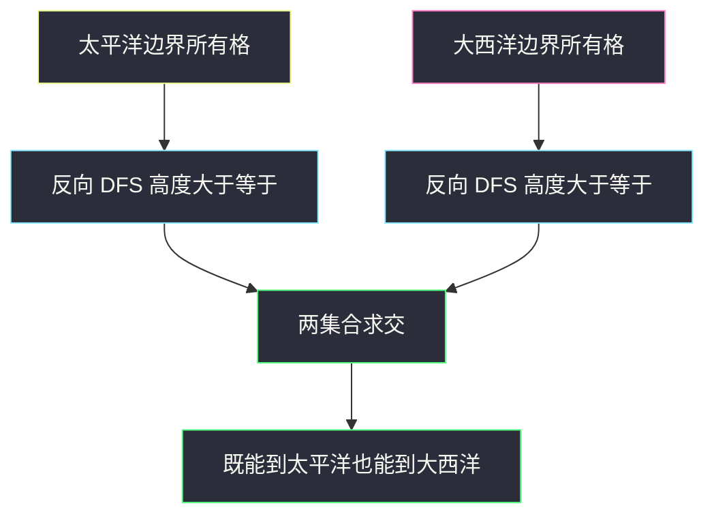
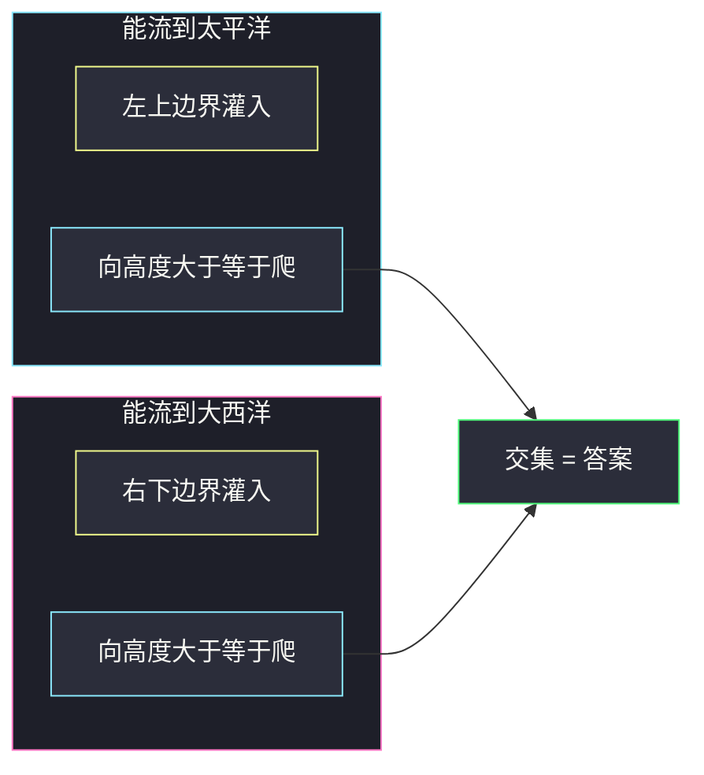

# 太平洋大西洋水流问题（从两洋边界反向 DFS）

## 一、问题描述

`m × n` 高度矩阵。左、上两边是太平洋，右、下两边是大西洋。水只能流向**高度 ≤ 当前格**的四邻（等高可以流）。求所有格子：从该格出发，水**既能流入太平洋，也能流入大西洋**。

水可以从紧贴海洋的格子直接入海。四角同时挨着两个洋。

> 🔗 LeetCode 417：https://leetcode.cn/problems/pacific-atlantic-water-flow/
>
> 数据范围：`1 ≤ m, n ≤ 200`，高度 `[0, 10^5]`。
>
> 📚 灵茶题单：**一、网格图 DFS**。

**示例 1**

```
输入：heights = [[1,2,2,3,5],[3,2,3,4,4],[2,4,5,3,1],[6,7,1,4,5],[5,1,1,2,4]]
输出：[[0,4],[1,3],[1,4],[2,2],[3,0],[3,1],[4,0]]

高度图：
1 2 2 3 5
3 2 3 4 4
2 4 5 3 1
6 7 1 4 5
5 1 1 2 4
```

**示例 2**

```
输入：heights = [[2,1],[1,2]]
输出：[[0,0],[0,1],[1,0],[1,1]]
四个格子都能流到两个洋。
```

**直观理解**

从一座山往低处流，看溪流能不能同时摸到左上「太平洋」和右下「大西洋」。正向从每个格子模拟，会把同一条下坡走很多遍。反过来：从海边往**更高或等高**的格子爬，能爬到的格子就是「可以流到这个洋」的集合。两集合的交集即答案。

---

## 二、暴力解法

对每个格子做一次下山 DFS：能否走到左/上边界，以及能否走到右/下边界。

```python
class Solution:
    def pacificAtlantic(self, heights: List[List[int]]) -> List[List[int]]:
        m, n = len(heights), len(heights[0])
        DIRS = ((0, 1), (0, -1), (1, 0), (-1, 0))

        def can_reach(si: int, sj: int) -> tuple[bool, bool]:
            pac = atl = False
            seen = set()

            def dfs(i: int, j: int) -> None:
                nonlocal pac, atl
                if (i, j) in seen:
                    return
                seen.add((i, j))
                if i == 0 or j == 0:
                    pac = True
                if i == m - 1 or j == n - 1:
                    atl = True
                if pac and atl:
                    return
                for di, dj in DIRS:
                    ni, nj = i + di, j + dj
                    if 0 <= ni < m and 0 <= nj < n and heights[ni][nj] <= heights[i][j]:
                        dfs(ni, nj)

            dfs(si, sj)
            return pac, atl

        ans = []
        for i in range(m):
            for j in range(n):
                p, a = can_reach(i, j)
                if p and a:
                    ans.append([i, j])
        return ans
```

每个起点最坏走遍全图，时间 `O((mn)²)`。等高会形成环，必须用 `seen`，不能靠「高度严格下降」当终止条件。

### 🔴 瓶颈在哪里

「能流到太平洋」是从海洋反推更稳：从太平洋边界出发，走向高度 ≥ 当前的邻格，标出所有能流进太平洋的格子。大西洋同理。每个格子对每个洋只进一次。

正向加记忆化也可以做到 `O(mn)`，但等高环要把状态分成「搜索中 / 已算完」，比反向灌水难写。题单标准是**反向**。

---

## 三、优化探索（核心章节）

> 📚 本题在灵茶题单中属于 **一、网格图 DFS**。与 `surrounded-regions.md` 一样从边界出发；这里有**两个源**，答案是两个可达集合的交。

### 3.1 正向流 vs 反向爬

| 方向 | 邻格条件 | 起点 |
|------|----------|------|
| 水往下流 | `heights[邻] ≤ heights[当前]` | 每个格子 |
| 从海往回爬 | `heights[邻] ≥ heights[当前]` | 该洋的整条边界 |

反向爬到的格子，顺着原方向就能流回这片海。

### 3.2 两次 DFS

- 太平洋起点：第 0 行 + 第 0 列（四角重复没关系）。
- 大西洋起点：第 `m-1` 行 + 第 `n-1` 列。
- 各维护一份 `visited`。两份都为真的坐标加入答案。



### 3.3 一句话核心

> **从两洋边界分别向「更高或等高」爬；两边都能爬到的格子就是答案。**

---

## 四、代码实现

### Python（主解：两次反向 DFS）

```python
from typing import List

class Solution:
    def pacificAtlantic(self, heights: List[List[int]]) -> List[List[int]]:
        m, n = len(heights), len(heights[0])
        DIRS = ((0, 1), (0, -1), (1, 0), (-1, 0))

        def dfs(i: int, j: int, vis: List[List[bool]]) -> None:
            vis[i][j] = True
            for di, dj in DIRS:
                ni, nj = i + di, j + dj
                if 0 <= ni < m and 0 <= nj < n and not vis[ni][nj] and heights[ni][nj] >= heights[i][j]:
                    dfs(ni, nj)

        pac = [[False] * n for _ in range(m)]
        atl = [[False] * n for _ in range(m)]
        for j in range(n):
            dfs(0, j, pac)
            dfs(m - 1, j, atl)
        for i in range(m):
            dfs(i, 0, pac)
            dfs(i, n - 1, atl)

        return [[i, j] for i in range(m) for j in range(n) if pac[i][j] and atl[i][j]]
```

进入 `dfs` 前保证当前格尚未标记；函数开头立刻 `vis[i][j] = True`。邻格条件是**未访问且高度 ≥ 当前**。

### Java（可选）

```java
class Solution {
    private static final int[][] DIRS = {{0, 1}, {0, -1}, {1, 0}, {-1, 0}};

    public List<List<Integer>> pacificAtlantic(int[][] heights) {
        int m = heights.length, n = heights[0].length;
        boolean[][] pac = new boolean[m][n], atl = new boolean[m][n];
        for (int j = 0; j < n; j++) {
            dfs(heights, 0, j, pac);
            dfs(heights, m - 1, j, atl);
        }
        for (int i = 0; i < m; i++) {
            dfs(heights, i, 0, pac);
            dfs(heights, i, n - 1, atl);
        }
        List<List<Integer>> ans = new ArrayList<>();
        for (int i = 0; i < m; i++) {
            for (int j = 0; j < n; j++) {
                if (pac[i][j] && atl[i][j]) ans.add(List.of(i, j));
            }
        }
        return ans;
    }

    private void dfs(int[][] h, int i, int j, boolean[][] vis) {
        vis[i][j] = true;
        for (int[] d : DIRS) {
            int ni = i + d[0], nj = j + d[1];
            if (ni >= 0 && ni < h.length && nj >= 0 && nj < h[0].length
                    && !vis[ni][nj] && h[ni][nj] >= h[i][j]) {
                dfs(h, ni, nj, vis);
            }
        }
    }
}
```

---

## 五、具体例子演示

示例 1 反向爬完后（P = 仅太平洋，A = 仅大西洋，B = 两者）：

```
高度     归属
1 2 2 3 5     P P P P B
3 2 3 4 4     P P P B B
2 4 5 3 1     P P B A A
6 7 1 4 5     B B A A A
5 1 1 2 4     B A A A A
```

B 的坐标即 `[[0,4],[1,3],[1,4],[2,2],[3,0],[3,1],[4,0]]`，与官方输出一致。

**中间峰 (2,2)=5 为什么是 B**

- 太平洋：从左边/上边一路爬高，能经 `(2,1)=4` 或 `(1,2)=3` 到达 5。
- 大西洋：从右边/下边能经 `(2,3)=3`、`(1,3)=4` 等爬到 5。
- 正向看：5 可流向更低的两边，最终分别入海。

**左下 (3,0)=6 为什么是 B**

格子在左边界，已经能进太平洋；高度 6，向右/上能走到更高或沿下边界进大西洋（例如经 `(4,0)=5` 贴底边）。

**右上 (0,4)=5 为什么是 B**

在上边界进太平洋，同时在右边界进大西洋——四角或边角经常直接是 B。



示例 2 的 2×2：每个格子都贴着至少一个洋，且 2 能流到邻格 1，1 本身贴另一条边，四个点都在交集里。

---

## 六、复杂度分析

| 方法 | 时间 | 空间 | 说明 |
|------|------|------|------|
| 每格正向下山 | `O((mn)²)` | `O(mn)` | 等高环还要 vis |
| 两洋反向 DFS（主解） | `O(mn)` | `O(mn)` 两份 vis + 栈 | 每格对每个洋最多一次 |

---

## 七、对比总结

| 维度 | 正向每格搜 | 反向从海搜 |
|------|------------|------------|
| 邻格 | 高度 ≤ | 高度 ≥ |
| 次数 | `mn` 次独立 DFS | 2 次「多源」DFS |
| 环 | 难记口 | vis 即可 |

**易错点**

1. **反向时仍写成 `≤`**：方向没翻过来，集合是空的或错的。
2. **漏掉一条边**：太平洋必须含第 0 行**和**第 0 列。
3. **用严格 `<` / `>`**：题目允许等高流动。
4. **每个格子正向搜到两边**：能过小数据，`200 × 200` 会爆；不要这么写。

---

## 八、举一反三

| 题目 | 关系 |
|------|------|
| [130. 被围绕的区域](https://leetcode.cn/problems/surrounded-regions/) | 单源「从边界灌」，见 `surrounded-regions.md` |
| [1020. 飞地的数量](https://leetcode.cn/problems/number-of-enclaves/) | 边界灌水后数剩下的陆地 |
| [733. 图像渲染](https://leetcode.cn/problems/flood-fill/) | 单点灌水，见 `flood-fill.md` |
| [778. 水位上升的泳池中游泳](https://leetcode.cn/problems/swim-in-rising-water/) | 高度约束下的连通，改二分 + DFS 或堆 |

**思想迁移**

- 问「从哪些点能到达指定边界」→ 从那些边界反着走，条件取反。
- 口诀：**「两洋分别往高处爬；两边 vis 都真才入答案。」**
