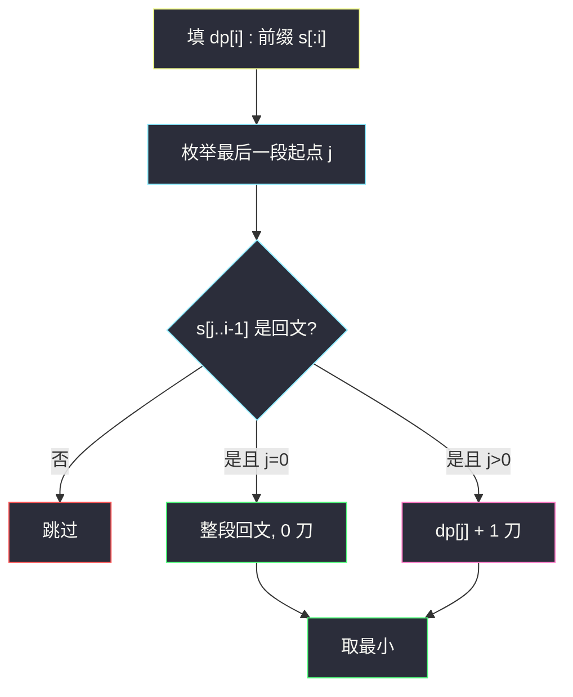
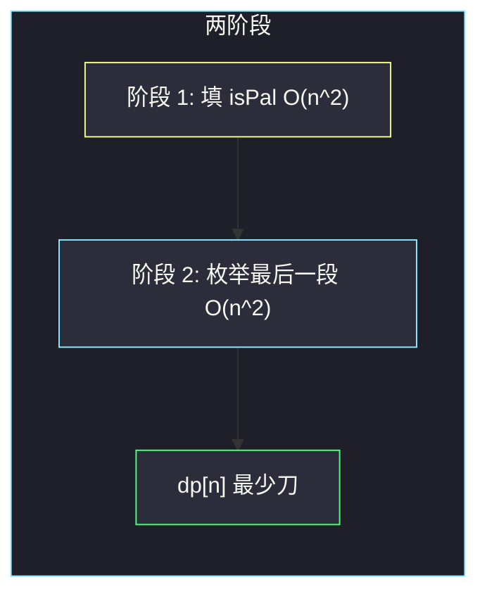

# 分割回文串 II（最优划分）

## 一、问题描述

给定字符串 `s`，把它分割成若干段，每一段都是回文串。求**最少切割次数**。切 0 次表示整串已经是回文。

> 🔗 LeetCode 132：https://leetcode.cn/problems/palindrome-partitioning-ii/
>
> 数据范围：`1 ≤ len(s) ≤ 2000`。必须做到 `O(n²)`：若每次用 `O(n)` 判断回文，再套一层划分，会到 `O(n³)`，2000 过不了。
>
> 📚 灵茶题单：**§5.2 最优划分**。典型「枚举最后一段」：`dp[i]` = 前缀 `s[:i]` 的最少刀数，最后一段是某个回文 `s[j:i]`，则从 `dp[j]` 转移。回文判定全部预处理成 `O(1)`。

方法名 `minCut`。

**示例 1**

```
输入：s = "aab"
输出：1
解释：一次切开 "aa" | "b"。两段都是回文。无法 0 刀（整串不是回文）。
```

**示例 2**

```
输入：s = "a"
输出：0
解释：单字符本来就是回文，不用切。
```

**示例 3**

```
输入：s = "ab"
输出：1
解释：只能 "a" | "b"。
```

**直观理解**

第 131 题「分割回文串」要列出所有切法；本题只要最少刀。刀数 = 段数 - 1。整段回文时段数为 1，刀数为 0。

最坏情况每个字符单独成段，`n` 个字符切 `n-1` 刀。能合并的相邻回文越多，刀越少。DP 自动在所有合法切点里取最小。

---

## 二、暴力解法

从左往右枚举第一段结束位置，第一段是回文才继续切右边，记录最少刀。

```python
class Solution:
    def minCut(self, s: str) -> int:
        n = len(s)

        def is_pal(l: int, r: int) -> bool:
            while l < r:
                if s[l] != s[r]:
                    return False
                l += 1
                r -= 1
            return True

        def dfs(i: int) -> int:
            if i == n:
                return 0
            ans = n
            for j in range(i, n):
                if is_pal(i, j):
                    # 这一段后面还要切 dfs(j+1) 刀，段与段之间再加 1 刀
                    rest = dfs(j + 1)
                    ans = min(ans, rest + (0 if j + 1 == n else 1))
            return ans

        return dfs(0)
```

官方三例：1 / 0 / 1。每次判断回文 `O(n)`，划分指数级，`n=2000` 不可用。同一后缀被重复计算。

### 🔴 瓶颈在哪里

最优子结构：前缀怎么切，只通过「切了多少刀」影响后面，与具体切法无关。状态是前缀长度，`O(n)` 个。每个状态枚举最后一段起点 `O(n)`。回文判断若每次 `O(n)` 就 `O(n³)`；预处理 `isPal[l][r]` 之后是 `O(n²)`。这是长度 2000 的目标复杂度。

---

## 三、优化探索（核心章节）

> 📚 §5.2：`dp[i] = min(dp[j] + 代价)`，其中 `s[j:i]` 是合法最后一段。本题代价是「多一刀」，最后一段是回文时才能切。

### 3.1 预处理：所有子串是不是回文

`isPal[l][r] = s[l..r]`（闭区间，含两端）是否回文。

短的决定长的：

```
s[l]==s[r] 且 (r-l≤1 或 isPal[l+1][r-1])
```

- `r-l==0`：单字符，一定回文。
- `r-l==1`：两个字符，相等即回文（`aa`），不必看中间。
- 更长：两端相等且去掉两端后仍是回文。

填表必须让 `isPal[l+1][r-1]` 先好。`l` 从大到小、`r` 从小到大（`r` 从 `l` 走到 `n-1`）。

中心扩展也能 `O(n²)` 列出所有回文，后面 `dp` 一样用。二维布尔表更好讲。

### 3.2 状态：最少段数或最少刀数

两种等价写法。

**写法 A（推荐，刀数直观）**

`dp[i]` = 把前缀 `s[:i]`（长 i，下标 `0..i-1`）切成回文的最少刀数。

枚举最后一段 `[j, i)`（即 `s[j..i-1]`）：

- 若 `isPal[j][i-1]` 为假，不能作为最后一段。
- 若 `j == 0`：整段前缀就是回文，`dp[i] = 0`。
- 若 `j > 0`：前面已经用了 `dp[j]` 刀，再在 `j` 前面补一刀，`dp[i] = min(dp[i], dp[j] + 1)`。

边界：`dp[0] = 0`（空前缀，0 刀）。答案 `dp[n]`。

**写法 B（段数）**

`f[i]` = `s[:i]` 最少分成几段回文。`f[0]=0`。`isPal[j][i-1]` 时 `f[i] = min(f[j] + 1)`。答案 `f[n] - 1`（k 段要 k-1 刀）。

**写法 C（-1 技巧）**

`dp[0] = -1`，转移统一成 `dp[i] = min(dp[j] + 1)`。`j=0` 时得到 0。少一个分支，阅读成本是「空前缀刀数是 -1」不太直观。主解用写法 A。



### 3.3 为什么对

任意一种最优切法，最后一段一定是回文（题目要求每一段都是）。把它剥掉，前面那一截的切法必须也是最优的——否则换一种前面的切法，总刀数更小。这就是最优划分的标准论证。

`dp[i]` 的上界：`i-1`（每个字符一刀切开）。初始化成这个值或 `+∞` 都可以；枚举 `j=i-1` 时最后一段是单字符，一定合法，不会丢解。

### 3.4 下标约定（0/1 混用时必须说清）

字符串 0-based。`s[:i]` 是半开前缀，最后一段写成 `[j, i)` 也是半开，对应闭区间 `[j, i-1]`。`isPal` 用闭区间，所以判断写 `isPal[j][i-1]`。不要把 `isPal[j][i]` 写成开区间，会越界或看错一个字符。

### 3.5 中心扩展可以省掉 isPal 数组吗

可以：对每个中心把回文尽量撑开，在撑开的同时更新 `dp`。空间 `O(n)`。第一次写建议保留 `isPal`，正确性更好查。下面 Java / Python 主解都用预处理表。



### 3.6 一句话核心

> **先标记所有回文子串；`dp[i]` 枚举最后一段 `[j,i)` 是回文，整段 0 刀，否则 `dp[j]+1`。**

---

## 四、代码实现

### Python（主解：isPal + 枚举最后一段）

```python
class Solution:
    def minCut(self, s: str) -> int:
        n = len(s)
        is_pal = [[False] * n for _ in range(n)]
        for l in range(n - 1, -1, -1):
            for r in range(l, n):
                if s[l] == s[r] and (r - l <= 1 or is_pal[l + 1][r - 1]):
                    is_pal[l][r] = True

        INF = n  # 最多 n-1 刀
        dp = [0] + [INF] * n
        for i in range(1, n + 1):
            for j in range(i):
                if is_pal[j][i - 1]:
                    if j == 0:
                        dp[i] = 0
                    else:
                        dp[i] = min(dp[i], dp[j] + 1)
        return dp[n]
```

对拍：`"aab"→1`，`"a"→0`，`"ab"→1`。

### Python（段数写法，答案减一）

```python
class Solution:
    def minCut(self, s: str) -> int:
        n = len(s)
        is_pal = [[False] * n for _ in range(n)]
        for l in range(n - 1, -1, -1):
            for r in range(l, n):
                if s[l] == s[r] and (r - l <= 1 or is_pal[l + 1][r - 1]):
                    is_pal[l][r] = True
        f = [0] + [n] * n
        for i in range(1, n + 1):
            for j in range(i):
                if is_pal[j][i - 1]:
                    f[i] = min(f[i], f[j] + 1)
        return f[n] - 1
```

### Java

```java
class Solution {
    public int minCut(String s) {
        int n = s.length();
        boolean[][] isPal = new boolean[n][n];
        for (int l = n - 1; l >= 0; l--) {
            for (int r = l; r < n; r++) {
                if (s.charAt(l) == s.charAt(r)
                        && (r - l <= 1 || isPal[l + 1][r - 1])) {
                    isPal[l][r] = true;
                }
            }
        }
        int[] dp = new int[n + 1];
        for (int i = 1; i <= n; i++) {
            dp[i] = i; // 上界偏松，下面一定会降下来
            for (int j = 0; j < i; j++) {
                if (isPal[j][i - 1]) {
                    if (j == 0) {
                        dp[i] = 0;
                    } else {
                        dp[i] = Math.min(dp[i], dp[j] + 1);
                    }
                }
            }
        }
        return dp[n];
    }
}
```

**变量含义**

| 变量 | 含义 |
|------|------|
| `is_pal[l][r]` | 闭区间 `s[l..r]` 是否回文 |
| `dp[i]` | 前缀 `s[:i]` 最少刀数 |
| `j` | 最后一段的起点 |

---

## 五、具体例子演示

`isPal` 用 1/0；`dp` 按下标 i（前缀长度）填。

### 5.1 官方示例 1：`s = "aab"` 端到端

下标：`0:a  1:a  2:b`。

**阶段 1：isPal（行 l、列 r）**

| l \ r | 0 a | 1 a | 2 b |
|-------|-----|-----|-----|
| 0 a | 1 | 1 | 0 |
| 1 a |  | 1 | 0 |
| 2 b |  |  | 1 |

推导：

- 对角线单字符全 1。
- `[0,1]`：`s[0]==s[1]=='a'` 且长度 2 → 1。子串 `"aa"`。
- `[1,2]`：`a` 对 `b` → 0。
- `[0,2]`：`a` 对 `b` → 0。整串不是回文。

**阶段 2：dp**

`dp[0]=0`。

前缀长 1，`s[:1]="a"`：

- `j=0`，`isPal[0][0]` 真，整段 → `dp[1]=0`。

前缀长 2，`s[:2]="aa"`：

- `j=0`，`isPal[0][1]` 真，整段 `"aa"` → `dp[2]=0`。
- `j=1`，最后一段 `"a"`，`dp[1]+1=1`，比 0 差。

前缀长 3，`s[:3]="aab"`：

- `j=0`，`isPal[0][2]` 假，跳过。
- `j=1`，最后一段 `"ab"`，`isPal[1][2]` 假，跳过。
- `j=2`，最后一段 `"b"`，真，`dp[2]+1=1`。

`dp = [0, 0, 0, 1]`。答案 1，对拍官方。切点在下标 2 前：`"aa"|"b"`。

没有别的合法最后一段，所以最少就是 1，不能 0。

### 5.2 官方示例 2：`s = "a"`

`isPal = [[1]]`。`i=1, j=0` 整段回文，`dp[1]=0`。对拍官方。

### 5.3 官方示例 3：`s = "ab"`

| l \ r | 0 a | 1 b |
|-------|-----|-----|
| 0 a | 1 | 0 |
| 1 b |  | 1 |

`dp[1]=0`（`"a"`）。  
`dp[2]`：`j=0` 整段 `"ab"` 非回文；`j=1` 最后 `"b"`，`dp[1]+1=1`。答案 1，对拍官方。

### 5.4 整段回文会在中途归零：`s = "abbab"`

`isPal` 闭区间（只列出 true 的有意义段）：

- 单字符全 true；
- `[1,2]="bb"` true；
- `[0,3]="abba"` true（两端 a，中间 `bb`）；
- `[2,4]="bab"` true。

`dp` 前缀：

| 前缀 | 串 | 关键转移 | dp |
|------|----|----------|----|
| 1 | a | 整段 | 0 |
| 2 | ab | 只能 a\|b | 1 |
| 3 | abb | a\|bb 或 ab\|b → 1 | 1 |
| 4 | abba | **整段回文** | **0** |
| 5 | abbab | abba\|b → 0+1=1；bab 作最后一段 → dp[2]+1=2 | 1 |

答案 1：`"abba"|"b"`。对拍自检（整串不是回文，至少 1 刀；这一刀够用）。

注意 `dp[4]` 被整段回文**重置为 0**。如果漏写 `j==0` 分支，会错误地认为前面已经切过，刀数降不下来。

### 5.5 `"aaabaa"`：长回文 vs 短切

`aaa` 是回文，`aa` 是回文，中间一个 `b`。

| 前缀 | dp | 一种最优 |
|------|----|----------|
| a / aa / aaa | 0 | 自身回文 |
| aaab | 1 | aaa\|b |
| aaaba | 1 | 最后一段 `"aba"`（`isPal[2][4]`），`dp[2]+1=1`，切法 `"aa"|"aba"` |
| aaabaa | 1 | 最后一段 `"aabaa"`（`isPal[1][5]`），`dp[1]+1=1`，切法 `"a"|"aabaa"` |

答案 1。说明 DP 会自动选「很长的最后一段」把刀数压下去，不必人肉找切点。

---

## 六、复杂度分析

| 方法 | 时间 | 空间 | 说明 |
|------|------|------|------|
| 暴力 + 每次判回文 | 指数 × `O(n)` | `O(n)` | 超时 |
| 记忆化但不预处理 | `O(n³)` | `O(n)` | n=2000 紧或超时 |
| isPal + 划分 DP（主解） | `O(n²)` | `O(n²)` | 目标解 |
| 中心扩展更新 dp | `O(n²)` | `O(n)` | 空间更优 |

`n=2000` 时 `n²=4e6`，稳定通过。

---

## 七、对比总结

| 维度 | 131 分割回文串 | 本题 |
|------|----------------|------|
| 问什么 | 所有方案 | 最少刀 |
| 主体 | 回溯拼路径 | `dp[i]` 取 min |
| 回文预处理 | 同样能用 | **必须**，否则 TLE |

**易错点**

1. **`isPal` 填表顺序。** `l` 必须从右往左，否则 `isPal[l+1][r-1]` 还是默认 false，长回文全判错。
2. **长度 2 漏了。** `r-l<=1` 要写上，否则 `"aa"` 会去看空的「中间」，有的语言中间下标非法；即使不越界，逻辑上也该短路。
3. **`dp` 与 `isPal` 下标差一。** 前缀长度 `i` 对应最后字符下标 `i-1`。
4. **整段回文忘记给 0。** `j==0` 必须单独置 0，不能写成 `dp[0]+1`（除非采用 -1 技巧）。
5. **刀数和段数混用。** `f[n]` 是段数时要减 1 才是刀数。单字符答案应为 0 不是 1。
6. **初始化太大或太小。** 太小（0）会导致一次都切不了时答案错；用 `n` 或 `i` 作上界安全。

**模板**

最优划分：预处理合法段 → `for i: for j: 若 s[j:i] 合法则 dp[i] = min(dp[i], dp[j] + w)`。回文、拆分单词、戳气球都是这套壳。

---

## 八、举一反三

| 题目 | 关系 |
|------|------|
| [131. 分割回文串](https://leetcode.cn/problems/palindrome-partitioning/) | 同一预处理，回溯输出方案 |
| [1278. 分割回文串 III](https://leetcode.cn/problems/palindrome-partitioning-iii/) | 最多 k 段，还允许改字符 |
| [5. 最长回文子串](https://leetcode.cn/problems/longest-palindromic-substring/) | 同一张 `isPal` / 中心扩展 |
| [647. 回文子串](https://leetcode.cn/problems/palindromic-substrings/) | 统计 `isPal` 里 true 的个数 |
| [139. 单词拆分](https://leetcode.cn/problems/word-break/) | §5.2 同一壳：最后一段在字典里 |
| [140. 单词拆分 II](https://leetcode.cn/problems/word-break-ii/) | 划分 + 输出方案 |
| [1745. 分割回文串 IV](https://leetcode.cn/problems/palindrome-partitioning-iv/) | 恰好 3 段回文，布尔版 |
| [1312. 让字符串成为回文串的最少插入次数](https://leetcode.cn/problems/minimum-insertion-steps-to-make-a-string-palindrome/) | 也带「回文」二字，但是 LCS，不要和切分搞混 |

**思想迁移**

- 子串合法性 `O(1)` 查询，一定先 `O(n²)` 预处理。
- 口诀：**「先标回文；dp[i] 看最后一段，整段 0 刀，否则前缀刀数加一。」**
