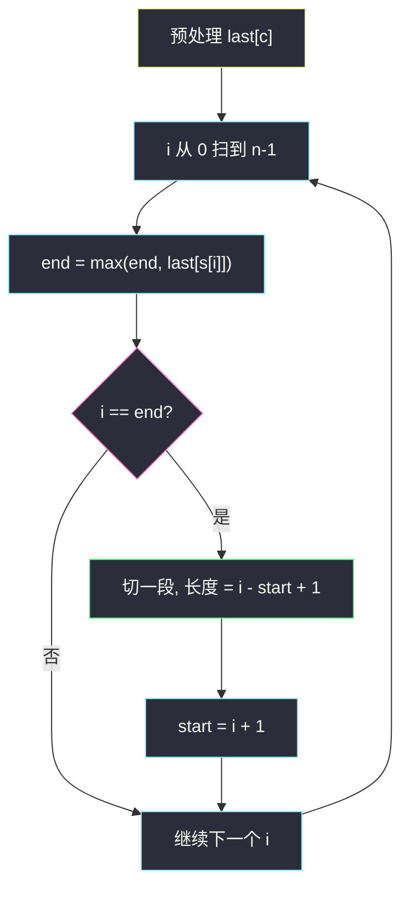
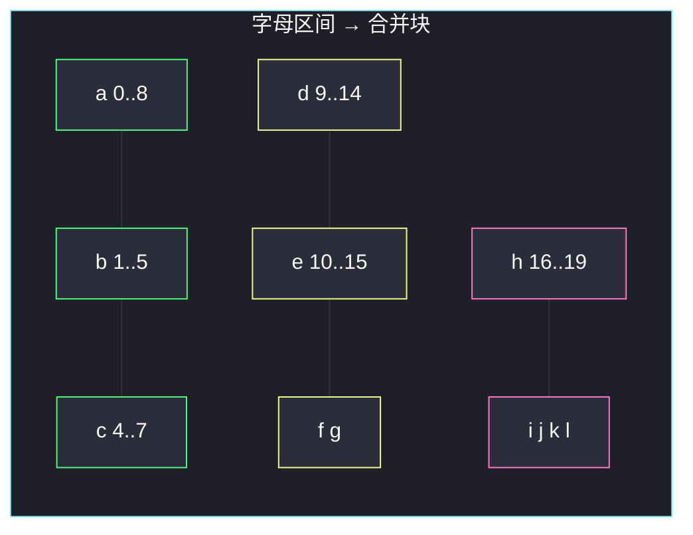

# 划分字母区间（合并区间 · 最远右端切段）

## 一、问题描述

给你一个字符串 `s`。请把 `s` 划分成**尽可能多**的片段，使同一字母只出现在其中一段。返回一个列表，表示每个片段的长度。

> 🔗 LeetCode 763：https://leetcode.cn/problems/partition-labels/
>
> 数据范围：`1 ≤ s.length ≤ 500`，`s` 只含小写英文字母。
>
> 📚 灵茶题单：**§2.5 合并区间**（1443 分）。每个字母对应一段「首次出现～末次出现」的闭区间，相交就并成一段。

**示例 1**

```
输入：s = "ababcbacadefegdehijhklij"
输出：[9,7,8]
解释：划分成 "ababcbaca"、"defegde"、"hijhklij"。
     每个字母最多出现在其中一段；再多切一刀就会把某个字母劈开。
```

**示例 2**

```
输入：s = "eccbbbbdec"
输出：[10]
解释：e、c 分别出现在串头和串尾，整段必须并成一块。
```

**直观理解**

字母 `a` 一旦在某段里出现过，它在 `s` 里的**最后一次出现**也必须落在同一段——否则「同一字母只出现在一段」就破了。所以每个字母自己先画一条区间 `[first[c], last[c]]`；两条区间只要相交（或端点相接），就得并成更大的一段。切点只能落在这些合并块的缝上。要段数最多，就是**能切就切**：合并完有几块就切几段。

---

## 二、暴力解法

枚举所有切法：在 `n-1` 个缝里选若干刀，检查每段出现过的字母是否与其它段冲突。

```python
class Solution:
    def partitionLabels(self, s: str) -> list[int]:
        n = len(s)
        best: list[int] | None = None

        def ok(parts: list[str]) -> bool:
            seen: dict[str, int] = {}
            for i, p in enumerate(parts):
                for ch in p:
                    if ch in seen and seen[ch] != i:
                        return False
                    seen[ch] = i
            return True

        def dfs(i: int, parts: list[str]) -> None:
            nonlocal best
            if i == n:
                if ok(parts) and (best is None or len(parts) > len(best)):
                    best = [len(p) for p in parts]
                return
            for j in range(i + 1, n + 1):
                parts.append(s[i:j])
                dfs(j, parts)
                parts.pop()

        dfs(0, [])
        return best or [n]
```

切点指数级，还要反复扫各段字母。`n ≤ 500` 会超时。

### 🔴 瓶颈在哪里

「同一字母只能在一段」其实只依赖每个字母的**最右出现位置**。不必枚举切点：从左往右走，把当前段右端不断推到段内字母的最远 `last`；一旦下标追上这个右端，再往后的字符都是新字母，可以安全切一刀。区间合并的线性扫描版。

---

## 三、优化探索（核心章节）

> 📚 本题在灵茶题单中属于 **§2.5 合并区间**。标准「合并区间」是：把每个字母看成 `[first, last]`，按左端排序后把相交区间并掉。字符串从左到右已经按左端有序，所以**不必真的建区间数组**——一遍扫描等价于在线合并。

### 3.1 每个字母是一条区间

先扫一遍，记下 `last[c]` = 字母 `c` 最后出现的下标。对示例 1：

| 字母 | last |
|------|------|
| a | 8 |
| b | 5 |
| c | 7 |
| d | 14 |
| e | 15 |
| f | 11 |
| g | 13 |
| h | 19 |
| i | 22 |
| j | 23 |
| k | 20 |
| l | 21 |

若再记 `first[c]`，字母区间就是 `[first[c], last[c]]`。`a` 是 `[0,8]`，`b` 是 `[1,5]`，`c` 是 `[4,7]`……它们两两相交，必须并成 `[0,8]`。

### 3.2 从左扫：维护当前段的右端 `end`

不必显式排序。维护：

- `start`：当前段左端
- `end`：当前段必须覆盖到的最右位置，初始为 0

扫到下标 `i` 时，把 `end` 更新为 `max(end, last[s[i]])`。含义：这段已经「吃进」了 `s[i]`，就得把 `s[i]` 的最后一次出现也吞进来。

当 `i == end` 时：`[start, i]` 里出现过的每个字母，其最后一次出现都不超过 `i`，而 `i+1` 往后的字符此前都没在这段里出现过。这里可以切，长度 `i - start + 1`，然后 `start = i + 1`。

为什么「能切就切」最优？切点只能在合并块的边界上。提前切会把某个字母劈开；推迟切只会把两块并成一块，段数变少。所以每到 `i == end` 必须立刻切。



### 3.3 和「跳跃游戏」同一根指针

`end` 很像跳跃游戏里的「当前最远可达」。区别只是：跳跃用 `i + nums[i]` 外推，本题用 `last[s[i]]` 外推。碰到 `i == end` 就结算一段（跳跃 II 里则是段数加一、更新边界）。

### 3.4 一句话核心

> **先记下每个字母最后出现的位置；从左扫，用 `end` 吃进段内字母的最远 `last`；`i` 追上 `end` 就切一刀。**

---

## 四、代码实现

### Python（主解：last + 线性扫描）

```python
class Solution:
    def partitionLabels(self, s: str) -> list[int]:
        last = {ch: i for i, ch in enumerate(s)}
        ans = []
        start = end = 0
        for i, ch in enumerate(s):
            end = max(end, last[ch])
            if i == end:
                ans.append(i - start + 1)
                start = i + 1
        return ans
```

**变量含义**

| 写法 | 含义 |
|------|------|
| `last[ch]` | 字母 `ch` 在 `s` 中最后一次出现的下标 |
| `start` | 当前段左端（含） |
| `end` | 当前段必须覆盖到的最右下标 |
| `i == end` | 当前段已经自洽，可以切 |

`last` 也可以开长度 26 的数组：`last[ord(ch) - 97] = i`。`n ≤ 500` 两种写法都无压力。

等价的「真合并区间」写法：先收集 26 条 `[first, last]`，按左端排序后按 §2.5 模板合并，最后把每块长度吐出来。结果一样，常数更大，面试写扫描版即可。

---

## 五、具体例子演示

**示例 1**：`s = "ababcbacadefegdehijhklij"`。

先看字母区间如何并成三块：



绿块并成 `[0,8]`（长 9），黄块并成 `[9,15]`（长 7），粉块并成 `[16,23]`（长 8）。

逐步扫描（只列出 `end` 变化和切点）：

| i | s[i] | last[s[i]] | end | i == end? | 切出长度 |
|---|------|------------|-----|-----------|----------|
| 0 | a | 8 | 8 | 否 | |
| 1 | b | 5 | 8 | 否 | |
| 2 | a | 8 | 8 | 否 | |
| 3 | b | 5 | 8 | 否 | |
| 4 | c | 7 | 8 | 否 | |
| 5 | b | 5 | 8 | 否 | |
| 6 | a | 8 | 8 | 否 | |
| 7 | c | 7 | 8 | 否 | |
| 8 | a | 8 | 8 | **是** | **9** |
| 9 | d | 14 | 14 | 否 | |
| 10 | e | 15 | 15 | 否 | |
| 11 | f | 11 | 15 | 否 | |
| 12 | e | 15 | 15 | 否 | |
| 13 | g | 13 | 15 | 否 | |
| 14 | d | 14 | 15 | 否 | |
| 15 | e | 15 | 15 | **是** | **7** |
| 16 | h | 19 | 19 | 否 | |
| … | … | … | 被 i/j 推到 23 | 否 | |
| 23 | j | 23 | 23 | **是** | **8** |

答案 `[9, 7, 8]`，与官方一致。

**示例 2**：`s = "eccbbbbdec"`。`e` 的 last 是 8，`c` 的 last 是 9。从 `i=0` 起 `end` 被推到至少 8，随后 `c` 再推到 9，只在最后一格 `i == end`，整串一段，长度 10。

**边界**：单字符 `"a"` → `[1]`；全相同 `"aaaa"` → `[4]`；26 个字母各出现一次 → 26 个 `1`。

扫描时 `end` 始终满足 `end ≥ i`：因为 `last[s[i]] ≥ i`（最后出现不会早于当前）。所以循环不会出现 `i` 越过 `end` 还没切的情况；切点判定写 `i == end` 即可。

---

## 六、复杂度分析

| 方法 | 时间 | 空间 | 说明 |
|------|------|------|------|
| 枚举切点 | 指数级 | `O(n)` 递归栈 | 每个缝切或不切 |
| 建区间再合并 | `O(n + σ log σ)` | `O(σ)` | `σ = 26`，排序可忽略 |
| last + 线性扫描（主解） | `O(n)` | `O(σ)` 或 `O(1)` | 每个字符看两次：建 last + 扫描 |

---

## 七、对比总结

| 维度 | 本题 | 真合并区间（如 56） | 划分型最多段（如 1221） |
|------|------|---------------------|-------------------------|
| 对象 | 字母出现范围 | 给定的一批区间 | L/R 配平前缀 |
| 排序 | 下标从左到右已有序 | 按左端排序 | 不需要 |
| 切/并信号 | `i` 追上 `end` | 当前右端盖不住下一段左端 | 计数器归零 |
| 目标 | 段数最多 = 合并块个数 | 合并后的区间列表 | 平衡段个数 |

**易错点**

1. **用「首次出现」当切点**：必须看**最后**一次。`abab` 里 `a` 的 first 是 0，若在 0 切就错了。
2. **切完忘了更新 `start`**：下一段长度会算成从 0 起的总长。
3. **写成 `i >= end`**：`i` 是下标，循环里 `i` 不会超过 `end`（`end` 始终 ≥ `i`），写 `==` 更贴切。
4. **和 56 题搞混排序键**：本题扫描已经按左端走；若真建区间，必须按 `first` 升序，不能按 `last`。
5. **以为要字典序或固定段数**：段数由数据决定，能切就切。

---

## 八、举一反三

| 题目 | 关系 |
|------|------|
| [1221. 分割平衡字符串](https://leetcode.cn/problems/split-a-string-in-balanced-strings/)（`split-a-string-in-balanced-strings.md`） | 同样「能切就切」；信号从 `last` 换成计数器归零 |
| [56. 合并区间](https://leetcode.cn/problems/merge-intervals/) | §2.5 模板题：按左端排序后合并相交区间 |
| [2405. 子字符串的最优划分](https://leetcode.cn/problems/optimal-partition-of-string/) | 最多段：字符在当前段重复就立刻新开一段 |
| [45. 跳跃游戏 II](https://leetcode.cn/problems/jump-game-ii/) | 同一套「用 `end` 外推、追上就结算」 |
| [228. 汇总区间](https://leetcode.cn/problems/summary-ranges/) | 有序数组上的区间合并，切点信号更简单 |

**思想迁移**

- 把「同一类元素必须落在同一段」翻译成区间，相交就并——这就是 §2.5。
- 口诀：**「先记每个字母最右下标；扫到 `i == end` 就切。」**
