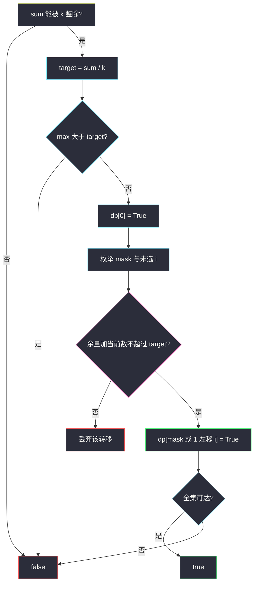
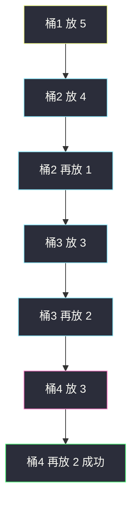

# 划分为 k 个相等的子集（回溯剪枝 · 状压划分）

## 一、问题描述

给定整数数组 `nums` 和正整数 `k`，判断能否把数组分成 **恰好 `k` 个非空子集**，且这 `k` 个子集的元素和相等。每个元素必须用一次、只能用一次。

> 🔗 LeetCode 698：https://leetcode.cn/problems/partition-to-k-equal-sum-subsets/
>
> 数据范围：`1 ≤ k ≤ n ≤ 16`，`1 ≤ nums[i] ≤ 10^4`。
>
> 📚 灵茶题单：**§9.7 其他状压 DP**。`n ≤ 16` 是状压信号：`2^n ≤ 65536`。也可以回溯填桶，但**不剪枝会超时**。两种写法都要会。

子集不要求连续，也不要求内部有序。`k` 个子集之间没有编号差异（无序划分）。

**示例 1**

```
输入：nums = [4,3,2,3,5,2,1], k = 4
输出：true
解释：和为 20，target = 5。一种分法：(5) | (1,4) | (2,3) | (2,3)。
```

**示例 2**

```
输入：nums = [1,2,3,4], k = 3
输出：false
解释：和为 10，不能被 3 整除，直接 false。
```

**直观理解**

先看总和能不能被 `k` 整除，目标值 `target = sum / k`。问题变成：能否找出 `k` 组互不相交的子集合，每组和都是 `target`。`n = 16` 时枚举 `k^n` 种「每个数进哪个桶」会炸，必须用「填满一个桶再填下一个」或「用 bitmask 表示已选集合」。

---

## 二、暴力解法

每个数分到 `k` 个桶之一，最后检查每个桶是否为 `target`。

```python
class Solution:
    def canPartitionKSubsets(self, nums: list[int], k: int) -> bool:
        total = sum(nums)
        if total % k:
            return False
        target = total // k
        n = len(nums)
        buckets = [0] * k

        def dfs(i: int) -> bool:
            if i == n:
                return True
            for b in range(k):
                if buckets[b] + nums[i] > target:
                    continue
                buckets[b] += nums[i]
                if dfs(i + 1):
                    return True
                buckets[b] -= nums[i]
                if buckets[b] == 0:
                    break  # 空桶对称：当前数放进哪个空桶都一样
            return False

        nums.sort(reverse=True)
        if nums[0] > target:
            return False
        return dfs(0)
```

官方两例能过。空桶对称已经剪了一层，但最坏仍接近指数且常数大，`n = 16` 的坏数据容易超时。瓶颈：同一集合被不同装填顺序重复搜索。

### 🔴 瓶颈在哪里

1. 总和不能整除 `k`、最大值 `> target`：应立刻 false。
2. 相同失败：同一个桶里连续相同的数，前面那个放失败，后面那个不用再放。
3. 子集无序：第 `t` 个桶的「第一个数」固定成当前还没用的某个数（通常是最大的），失败则整题失败。
4. 状压：把「已选用过的下标集合」做成 `mask`，每个 mask 只处理一次。

---

## 三、优化探索（核心章节）

> 📚 本题在灵茶题单中属于 **§9.7 其他状压 DP**。划分问题的状压模板：`dp[mask]` 表示子集 `mask` 能否划分成若干个和为 `target` 的组（最后一组可以还没满）；往 `mask` 里加元素时，**当前未完成桶装不下就不要加**。`n = 16` 必须靠这层「装不下就停」以及回溯里的对称剪枝。

### 3.1 回溯填桶：状态与剪枝

一次只填 **一个桶**。`remain` 是当前桶还差多少才到 `target`，`remain_k` 是还剩几个桶（含当前这个）。`used` 用 bitmask 标记已用下标。

剪枝清单（少一条都可能 TLE）：

| 剪枝 | 做法 | 为什么对 |
|------|------|----------|
| 整除 | `sum % k != 0 → false` | 目标和不是整数 |
| 超大 | 降序后 `nums[0] > target → false` | 这个数哪桶都放不下 |
| 降序 | `sort(reverse=True)` | 大数先放，超 `target` 更早失败 |
| 超桶 | `nums[i] > remain` 则跳过；降序时可 `break` | 后面更大，更放不下 |
| 相同失败 | `nums[i] == nums[i-1]` 且 `i-1` 没用过，跳过 | 同一层相同选择 |
| 空桶对称 | 当前 `remain == target`（新开桶）时，第一个尝试失败就 `return False` | `k` 个桶无编号，剩下的数必须有一个桶装当前这个数；当前桶就是那个桶 |

最后一条最容易漏。新开桶时，剩余元素是无序划分。把「还没用的最大数」塞进当前桶；如果这样都划不成，换成塞一个更小的数当桶头、把大数留给后面，只是给桶重新贴标签，不会多出新划分。

### 3.2 状压：`dp[mask]`

`n ≤ 16`，`mask` 的第 `i` 位表示 `nums[i]` 是否已选。

- `dp[mask] = True`：存在一种添加顺序，使得沿途每一段「当前桶」都从未超过 `target`，并且每满一次 `target` 就自动开下一桶。
- 当前未完成桶的已装量 = `sum(mask) % target`（`0` 表示刚好整桶结束，下一件东西开新桶）。
- 转移：对 `dp[mask] = True` 的集合，枚举未选的 `i`，若 `sum(mask) % target + nums[i] ≤ target`，则 `dp[mask | (1<<i)] = True`。

初值 `dp[0] = True`。答案 `dp[(1<<n) - 1]`。

关键约束 **`余量 + nums[i] ≤ target`**：没有它的话，从空集随便加元素总能走到全集（只是「能选完」），并不保证中途能按 `target` 切开。这层判断强迫你始终在填「当前这一桶」，溢出的加法则直接丢掉。



`sum(mask)` 可以一边转移一边累加，不必每次从头加。`n = 16` 时 `16 × 2^16 = 1048576`，足够过。

### 3.3 一句话核心

> **目标和 target；回溯按桶填并剪空桶对称与相同失败；状压只允许「当前桶装得下」的加点。**

---

## 四、代码实现

### Python（主解：状压）

```python
class Solution:
    def canPartitionKSubsets(self, nums: list[int], k: int) -> bool:
        total = sum(nums)
        if total % k:
            return False
        target = total // k
        if max(nums) > target:
            return False
        n = len(nums)
        m = 1 << n
        dp = [False] * m
        dp[0] = True
        # bucket[mask] = 当前未完成桶已装多少（0 .. target-1）
        bucket = [0] * m
        for mask in range(m):
            if not dp[mask]:
                continue
            for i, x in enumerate(nums):
                if mask >> i & 1:
                    continue
                # 当前桶装不下 x，不能转移
                if bucket[mask] + x > target:
                    continue
                nxt = mask | (1 << i)
                if dp[nxt]:
                    continue
                dp[nxt] = True
                bucket[nxt] = bucket[mask] + x
                if bucket[nxt] == target:
                    bucket[nxt] = 0  # 刚好满桶，下一件开新桶
        return dp[m - 1]
```

`bucket[nxt] = (bucket[mask] + x) % target` 与「满了清零」等价。先判 `dp[nxt]` 再写，避免无意义重复覆盖（值本来就该一样）。

### Python（回溯 + 全套剪枝）

```python
class Solution:
    def canPartitionKSubsets(self, nums: list[int], k: int) -> bool:
        total = sum(nums)
        if total % k:
            return False
        target = total // k
        nums.sort(reverse=True)
        if nums[0] > target:
            return False
        n = len(nums)
        used = 0

        def dfs(start: int, remain_k: int, remain: int) -> bool:
            nonlocal used
            if remain_k == 0:
                return True
            if remain == 0:
                # 当前桶已满，开下一桶；下标从 0 再扫未用元素
                return dfs(0, remain_k - 1, target)
            for i in range(start, n):
                if used >> i & 1:
                    continue
                if nums[i] > remain:
                    continue
                # 同一层相同数字：前一个没用过说明刚失败过
                if i > 0 and nums[i] == nums[i - 1] and not (used >> (i - 1) & 1):
                    continue
                used |= 1 << i
                if dfs(i + 1, remain_k, remain - nums[i]):
                    return True
                used ^= 1 << i
                # 新开桶的第一个数失败：桶无编号，整题失败
                if remain == target:
                    return False
            return False

        return dfs(0, k, target)
```

`n = 16` 必须带齐剪枝。空桶失败直接 `False` 不是「少搜几个」，是正确性上的对称，不会漏解。

### Java（最优解：状压）

```java
class Solution {
    public boolean canPartitionKSubsets(int[] nums, int k) {
        int total = 0;
        int max = 0;
        for (int x : nums) {
            total += x;
            max = Math.max(max, x);
        }
        if (total % k != 0) {
            return false;
        }
        int target = total / k;
        if (max > target) {
            return false;
        }
        int n = nums.length;
        int m = 1 << n;
        boolean[] dp = new boolean[m];
        int[] bucket = new int[m];
        dp[0] = true;
        for (int mask = 0; mask < m; mask++) {
            if (!dp[mask]) {
                continue;
            }
            for (int i = 0; i < n; i++) {
                if ((mask >> i & 1) == 1) {
                    continue;
                }
                if (bucket[mask] + nums[i] > target) {
                    continue;
                }
                int nxt = mask | (1 << i);
                if (dp[nxt]) {
                    continue;
                }
                dp[nxt] = true;
                int b = bucket[mask] + nums[i];
                bucket[nxt] = b == target ? 0 : b;
            }
        }
        return dp[m - 1];
    }
}
```

---

## 五、具体例子演示

### 5.1 官方示例 1：回溯每一步子集

`nums = [4,3,2,3,5,2,1]`，`k = 4`。`sum = 20`，`target = 5`。降序后 `[5,4,3,3,2,2,1]`，下标 `0..6`。

下面 `used` 用已选数字表示，不是二进制。

| 步 | remain_k | remain | 动作 | 当前桶 |
|----|----------|--------|------|--------|
| 1 | 4 | 5 | 放 5 | `(5)` 满 |
| 2 | 3 | 5 | 放 4 | `(4)` 还差 1 |
| 3 | 3 | 1 | 放 1 | `(4,1)` 满 |
| 4 | 2 | 5 | 放 3 | `(3)` 还差 2 |
| 5 | 2 | 2 | 放 2 | `(3,2)` 满 |
| 6 | 1 | 5 | 放 3 | `(3)` 还差 2 |
| 7 | 1 | 2 | 放 2 | `(3,2)` 满 |
| 8 | 0 | — | 成功 | 四个桶齐 |

对应官方：`(5)`、`(1,4)`、`(2,3)`、`(2,3)`。对拍 `true`。

若第 2 桶在「还差 1」时不去拿 `1` 而去拿别的，全部 `> 1`，该分支失败，回溯换组合。因为有 `1`，这条路能走通，不会退到「空桶对称剪枝」。



### 5.2 同一例子：状压的一条成功链

`nums` 仍用降序 `[5,4,3,3,2,2,1]`。`mask` 从低到高对应下标 0 到 6。`bucket` 是当前未满桶的和。

| mask 二进制（低位在右，bit0=5） | 新加入 | bucket | 含义 |
|------|--------|--------|------|
| `0000000` | — | 0 | 空 |
| `0000001` | 5 | 0 | 第一桶满 |
| `0000011` | 4 | 4 | 第二桶装了 4 |
| `1000011` | 1 | 0 | 第二桶满 |
| `1000111` | 3 | 3 | 第三桶装了 3 |
| `1010111` | 2 | 0 | 第三桶满 |
| `1011111` | 3 | 3 | 第四桶装了 3 |
| `1111111` | 2 | 0 | 全集，满 |

每一步都满足 `bucket + x ≤ 5`。全集 `dp[127] = True`。

### 5.3 官方示例 2：整除剪枝

`[1,2,3,4]`，`k = 3`，`sum = 10`，`10 % 3 != 0`，直接 `false`。对拍官方。不用搜。

### 5.4 剪枝反例直觉

假设新开桶时最大剩余数是 `4`，`target = 5`。把 `4` 放进当前桶后，剩下的怎么分都失败。此时**不要**改成「当前桶先放 3，把 4 留给后面」——后面某个桶还是得消化这个 `4`，只是桶的编号换了。空桶对称剪枝在这里直接返回 `False`。

相同数字：当前桶尝试过一个 `2` 失败，紧挨着的下一个 `2` 在同一层且前一个 `2` 仍未使用，跳过。否则 `n` 个相同数会变成阶乘级重复。

---

## 六、复杂度分析

| 方法 | 时间 | 空间 | 说明 |
|------|------|------|------|
| 每数选 k 桶 | 最坏 `O(k^n)` | `O(n)` | `n=16` 不可用 |
| 回溯 + 剪枝 | 最坏仍指数，实践远小 | `O(n)` | 依赖剪枝，不能省 |
| 状压（主解） | `O(n 2^n)` | `O(2^n)` | `16 × 65536` 稳定 |

---

## 七、对比总结

| 维度 | 416 等和划分 | 本题 |
|------|-------------|------|
| k | 固定 2 | 任意 k |
| 典型做法 | 0-1 背包 `O(n·sum)` | `n≤16` 用状压 / 回溯 |
| 子集个数 | 两个互补 | 必须恰好 k 个非空 |

**易错点**

1. **只检查 `sum % k == 0` 就返回 true**：整除是必要不充分，示例 2 是反面；还有整除仍划不成的数据。
2. **状压忘记「当前桶装不下就不转移」**：全集总会被「随便加数」标成 True。
3. **回溯不剪空桶对称 / 相同值**：`n = 16` 超时。
4. **允许空子集**：题面非空；`target = 0` 在本题不会出现（`nums[i] ≥ 1`）。
5. **`k > n`**：每个子集至少一个数，直接 false（也可被 `max > target` 或搜不到覆盖）。

---

## 八、举一反三

| 题目 | 关系 |
|------|------|
| [416. 分割等和子集](https://leetcode.cn/problems/partition-equal-subset-sum/) | `k = 2`，背包即可；见 `solutions/base/partition-equal-subset-sum.md` |
| [473. 火柴拼正方形](https://leetcode.cn/problems/matchsticks-to-square/) | 本题 `k = 4` 特化，同一套剪枝 |
| [2397. 被列覆盖的最多行数](https://leetcode.cn/problems/maximum-rows-covered-by-columns/) | §9.x 状压枚举子集 |
| [1723. 完成所有工作的最短时间](https://leetcode.cn/problems/find-minimum-time-to-finish-all-jobs/) | 划分成 k 组，改成最小化最大和 |

**思想迁移**

- `n ≤ 16` 先想 `2^n`；划分问题在转移里卡住「当前组的容量」。
- 口诀：**「先整除再 target；回溯剪对称；状压只加装得下的数。」**
