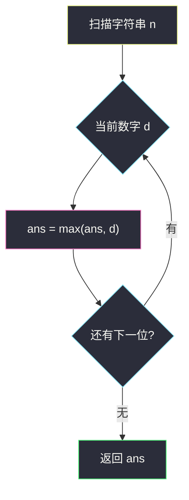
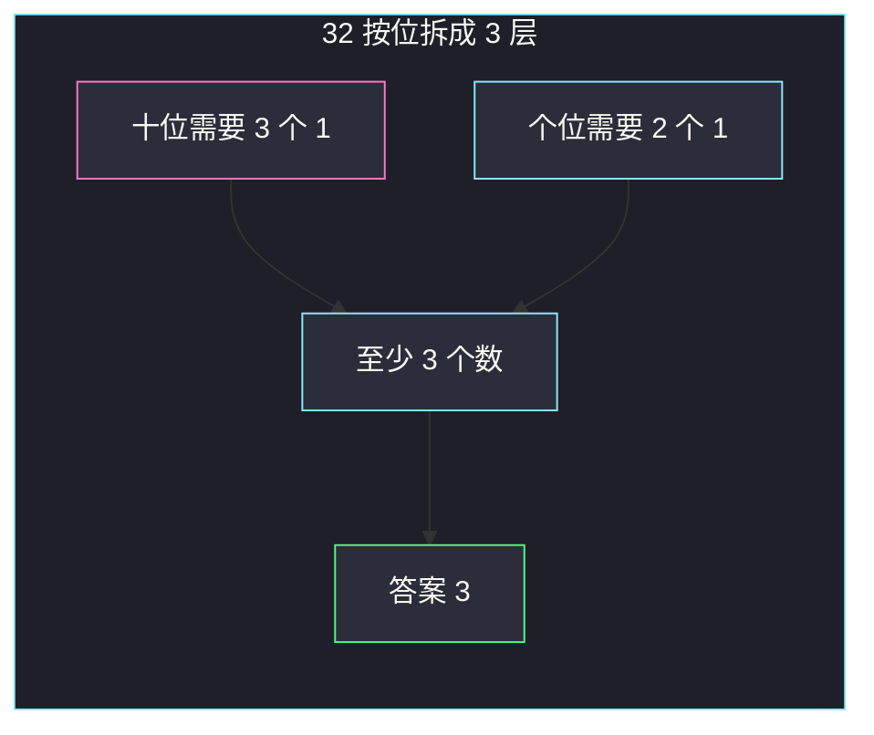

# 十-二进制数的最少数目（脑筋急转弯 · 答案就是最大数位）

## 一、问题描述

**十-二进制数**：十进制写法里每一位只能是 `0` 或 `1`，且没有前导零（单独的 `0` 不算本题要用的加数）。例如 `101`、`1100` 合法，`112`、`3001` 不合法。

给定一个表示正整数的十进制字符串 `n`，要用若干个十-二进制数**相加**得到 `n`。求最少需要几个。

> 🔗 LeetCode 1689：https://leetcode.cn/problems/partitioning-into-minimum-number-of-deci-binary-numbers/
>
> 数据范围：`1 ≤ n.length ≤ 10^5`，`n` 只含数字、无前导零、表示正整数。
>
> 📚 灵茶题单：**§5.2 脑筋急转弯**（1355 分）。

**示例 1**

```
输入：n = "32"
输出：3
解释：10 + 11 + 11 = 32。
```

**示例 2**

```
输入：n = "82734"
输出：8
```

**示例 3**

```
输入：n = "27346209830709182346"
输出：9
```

**直观理解**

把 `n` 的每一位拆开看：某一位是数字 `d`，就表示这一位上要叠 `d` 个 `1`。十-二进制每次在某一位最多贡献一个 `1`，所以那一位至少要 `d` 个数。全局最少个数 = 各位 `d` 的最大值。

---

## 二、暴力解法

从 1 开始枚举加数个数 `k`，检查能否找出 `k` 个十-二进制数之和为 `n`。每个加数长度最多与 `n` 相同，每位 0/1，状态 `2^{len}`，`len` 到 `10^5` 完全不可行。

也可以按位模拟「还缺多少」，每次构造一个尽量多填 1 的十-二进制去减——本质已经在做贪心，但真正要模拟大整数减法，代码又长又慢。

```python
class Solution:
    def minPartitions(self, n: str) -> int:
        # 模拟：反复减去一个「能减则减 1」的十-二进制，直到变成 0
        digits = [int(c) for c in n]
        ans = 0
        while any(digits):
            ans += 1
            started = False
            for i, d in enumerate(digits):
                if d > 0:
                    digits[i] -= 1
                    started = True
                elif started:
                    # 已经开始写这个加数后不能再出前导结构问题；中间 0 保持 0
                    pass
        return ans
```

上面每次扫描整串，答案最大是 9，所以是 `O(9 · |n|)`，能过，但完全没必要：循环次数恰好等于最大数位。

### 🔴 瓶颈在哪里

加法按位独立（我们刻意不制造进位）。每一位需要的「1 的层数」互不影响，答案被**最大的那一位**卡住。模拟减法只是把「层数」一层层剥掉，最终剥的层数就是 `max(digit)`。

---

## 三、优化探索（核心章节）

> 📚 本题在灵茶题单中属于 **§5.2 脑筋急转弯**。先想一位数：`n="7"` 就必须加 7 个 `1`。多位数时每位独立，取最大位即可，不要真的去构造那一堆 1010…。

### 3.1 下界：最大数位

设 `n` 第 `i` 位数字是 `d_i`（从左到右，不含进位干扰）。任意一个十-二进制在第 `i` 位只能贡献 `0` 或 `1`。若一共用 `k` 个加数，则第 `i` 位的和 ≤ `k`（即便考虑从更低位进位，那是「别的位多出来的」，不能减少**这一位至少要凑够 `d_i`** 的需求——见下）。

更干净的论证：我们总可以规定加数之间**不产生进位**——每位上恰好放 `d_i` 个 `1`、其余 `0`。这需要 `k ≥ max d_i` 个加数。于是 `max d_i` 是下界。

### 3.2 上界：按位叠 1，不进位

取 `k = max d_i`。对每一位独立地放 `d_i` 个 `1`（前 `d_i` 个加数在这一位写 1，其余写 0）。没有进位，相加恰好得到 `n`。每个加数的各位都是 0/1，去掉前导零后仍是合法十-二进制（最高位至少有一个加数在写 1，因为 `n` 无前导零）。

下界 = 上界，答案就是 `max(n 的各位数字)`。

为什么不靠「低位进位」减少个数？若某位已经是 9，你还想用更少的加数，低位必须进位进来补。低位进 1 意味着低位至少加出 10，那低位自己就要更多的 1，`k` 不会变小。所以进位帮不上忙。



### 3.3 一句话核心

> **每位数字 d 需要 d 层 1；最少层数 = 整个字符串里最大的那个数字。不要模拟加法。**

---

## 四、代码实现

### Python（主解：一次扫描求最大字符）

```python
class Solution:
    def minPartitions(self, n: str) -> int:
        return int(max(n))
```

字符 `'0'`…`'9'` 的码点顺序与数值一致，`max(n)` 就是最大数位的字符，再转 `int`。

不想依赖码点，也可以：

```python
class Solution:
    def minPartitions(self, n: str) -> int:
        ans = 0
        for ch in n:
            if ch == "9":
                return 9
            ans = max(ans, int(ch))
        return ans
```

扫到 `9` 可以提前返回（答案不可能超过 9）。

`n.length` 最大 `10^5`，**不能** `int(n)` 再逐位取模——Python 大整数能算，但没必要，字符串上求 max 才是本题意图。

### Java（可选）

```java
class Solution {
    public int minPartitions(String n) {
        int ans = 0;
        for (int i = 0; i < n.length(); i++) {
            ans = Math.max(ans, n.charAt(i) - '0');
        }
        return ans;
    }
}
```

---

## 五、具体例子演示

**示例 1**：`n = "32"`，最大位是 3。

按位叠 1（3 层）：

| 加数 | 十位 | 个位 | 值 |
|------|------|------|----|
| 第 1 个 | 1 | 1 | 11 |
| 第 2 个 | 1 | 1 | 11 |
| 第 3 个 | 1 | 0 | 10 |
| 求和 | 3 | 2 | 32 |

个位只需 2 层 1，第 3 个加数个位写 0。官方给出的 `10+11+11` 就是这三行（顺序无关）。



**示例 2**：`n = "82734"`。各位 `8,2,7,3,4`，最大是 **8**。

扫描过程：

| 下标 | 数字 | 目前见到的 max |
|------|------|----------------|
| 0 | 8 | 8 |
| 1 | 2 | 8 |
| 2 | 7 | 8 |
| 3 | 3 | 8 |
| 4 | 4 | 8 |

答案 8。若坚持构造，第 `k` 个加数（`k = 0..7`）在第 `i` 位写 `1` 当且仅当 `k < n[i]`：

| 加数 k | 万位 8 | 千位 2 | 百位 7 | 十位 3 | 个位 4 |
|--------|--------|--------|--------|--------|--------|
| 0 | 1 | 1 | 1 | 1 | 1 |
| 1 | 1 | 1 | 1 | 1 | 1 |
| 2 | 1 | 0 | 1 | 1 | 1 |
| 3 | 1 | 0 | 1 | 0 | 1 |
| 4 | 1 | 0 | 1 | 0 | 0 |
| 5 | 1 | 0 | 1 | 0 | 0 |
| 6 | 1 | 0 | 1 | 0 | 0 |
| 7 | 1 | 0 | 0 | 0 | 0 |
| 列求和 | 8 | 2 | 7 | 3 | 4 |

最高位 8 层全是 1，8 个加数都没有前导零。列求和恰好是原串，验证了「max 位 = 加数个数」够用。

**示例 3**：官方 `n = "27346209830709182346"`（任务书里的 `"2734620983070910"` 同样含 9，答案也是 9）。从左扫到第一次碰到 `9` 就可以停：

| 片段 | 最大位 | 备注 |
|------|--------|------|
| `2734620` | 7 | 还没到 9 |
| `9` | 9 | 已经封顶，后面不必看 |

长度 20，模拟 9 次大整数减法也能得到 9，一次 `max` 即可。

进位为什么帮不上忙：`n="9"` 至少要 9 个 `1`。若写 10 个 `1` 让个位进成 10，得到的是 `10` 不是 `9`，还多浪费一个加数。多位数同理——某位已经是全局最大需求，再靠邻居进位只会抬高别的位，`k` 不会下降。

---

## 六、复杂度分析

| 方法 | 时间 | 空间 | 说明 |
|------|------|------|------|
| 反复减一个十-二进制 | `O(9 · \|n\|)` | `O(\|n\|)` | 能过，但是把答案展开来算 |
| 求最大数位（主解） | `O(\|n\|)` | `O(1)` | 扫一遍字符 |

答案上界是 9，与 `n` 的数值大小无关，只与数位有关。

---

## 七、对比总结

| 维度 | 模拟加法 / 减法 | 脑筋急转弯 |
|------|-----------------|------------|
| 在做什么 | 真的构造 k 个 0-1 串 | 只问 k 的最小值 |
| 关键量 | 每一层减 1 | 最大数位 |
| 进位 | 容易想歪 | 最优方案不进位 |

**易错点**

1. **把 `n` 转成 `int`**：长度 `10^5`，语言若用 32/64 位整数会溢出；Python 能转但慢且多余。
2. **以为要 DP / 最小加数个数搜索**：状态空间在吓人，答案却是一位数。
3. **把十-二进制理解成二进制数值**：`101` 在本题里是一百零一，不是 5。
4. **漏掉 0 位**：`0` 不需要 1，但也不降低被 9 卡住的全局答案。

---

## 八、举一反三

| 题目 | 关系 |
|------|------|
| [2578. 最小和分割](https://leetcode.cn/problems/split-with-minimum-sum/) | 也是拆数位再重排，贪心分配数字 |
| [670. 最大交换](https://leetcode.cn/problems/maximum-swap/) | 数位重排 / 数位观察，不真的枚举全排列 |
| [1688. 比赛中的配对次数](https://leetcode.cn/problems/count-of-matches-in-tournament/) | 同节脑筋急转弯：答案直接等于 `n-1` |
| [1518. 换水问题](https://leetcode.cn/problems/water-bottles/) | 看起来要模拟，闭式或短循环即可 |
| [258. 各位相加](https://leetcode.cn/problems/add-digits/) | 数位根：模拟多轮 vs 一句公式 |

**思想迁移**

- 加数在每一位的贡献互相独立时，瓶颈就是「需求最大的那一位」。
- 口诀：**「十-二进制每次每位最多一个 1；答案 = 最大数位。」**
