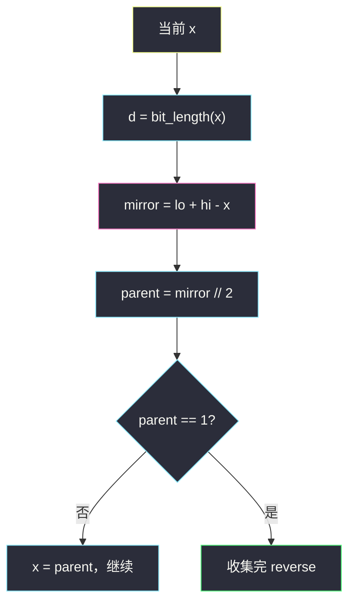
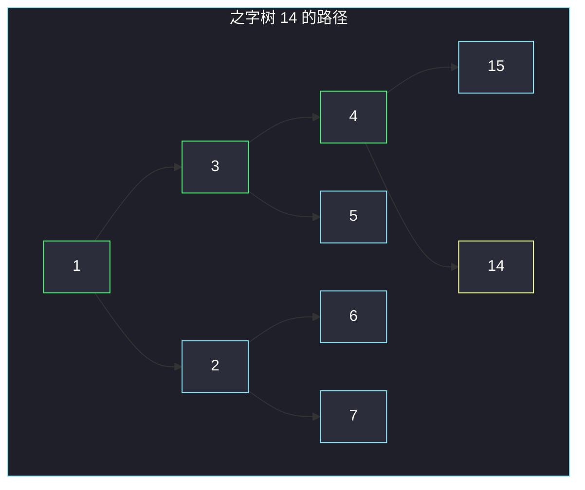

# 二叉树寻路（之字形编号 · 对称映射求父）

## 一、问题描述

在一棵**无限**完全二叉树里，节点按层**之字形**编号：

- 第 1 层（根）从左到右：`1`
- 第 2 层从右到左：`3, 2`
- 第 3 层从左到右：`4, 5, 6, 7`
- 第 4 层从右到左：`15, 14, 13, 12, 11, 10, 9, 8`
- 之后奇层从左到右，偶层从右到左，交替下去

给你一个节点的编号 `label`，返回从根 `1` 走到该节点的路径上**所有节点编号**（含两端）。

> 🔗 LeetCode 1104：https://leetcode.cn/problems/path-in-zigzag-labelled-binary-tree/
>
> 数据范围：`1 ≤ label ≤ 10^6`。不能真的建树。
>
> 📚 灵茶题单：**二叉树 · §2.16 其他**。完全二叉树的层编号、父子换算；之字只是把每一层的编号左右翻转。

**示例 1**

```
输入：label = 14
输出：[1,3,4,14]

            1
         /     \
       3         2
     /   \     /   \
    4     5   6     7
   / \   / \ / \   / \
 15 14 13 12 11 10 9  8

14 的父是 4，4 的父是 3，3 的父是 1。
```

**示例 2**

```
输入：label = 26
输出：[1,2,6,10,26]
```

**直观理解**

若按普通完全二叉树从 1 开始从左到右连续编号，父节点就是 `label // 2`。之字编号只是把**偶数层**（或按题意交替的那一层）左右颠倒，树的形状没变。所以：先把当前编号对称映射回「普通编号」，再 `// 2` 得到父；因为相邻两层方向相反，这个 `mirror(label) // 2` **直接就是父节点的之字编号**，不必再建树。

---

## 二、暴力解法

层序建树直到编号覆盖 `label`，再从该节点沿 `parent` 指针爬到根。`label ≤ 10^6` 时节点数也是 `10^6` 量级，能过但浪费，而且完全没必要存整棵树。

```python
class Solution:
    def pathInZigZagTree(self, label: int) -> List[int]:
        from collections import deque

        class Node:
            def __init__(self, v):
                self.val = v
                self.parent = None

        q = deque([Node(1)])
        found = None
        start, step, lvl = 1, 1, 1
        while found is None:
            nxt = deque()
            vals = list(range(start, start + step))
            if lvl % 2 == 0:
                vals.reverse()
            i = 0
            while q and i < len(vals):
                p = q.popleft()
                for _ in range(2):
                    if i >= len(vals):
                        break
                    c = Node(vals[i])
                    c.parent = p
                    nxt.append(c)
                    if c.val == label:
                        found = c
                    i += 1
            start += step
            step *= 2
            lvl += 1
            q = nxt

        path = []
        while found:
            path.append(found.val)
            found = found.parent
        path.reverse()
        return path
```

这段只为说明「真去建树」有多笨：层号、方向、父子指针全要自己维护。

### 复杂度

- **时间 / 空间**：`O(label)`，建出约 `label` 个节点。

### 🔴 瓶颈在哪里

父子关系是纯算术。第 `d` 层编号范围是 `[2^(d-1), 2^d - 1]`，之字只是把这段区间对称翻转。从 `label` 向上走 `O(log label)` 步即可，每步一次对称 + 一次整除。

---

## 三、优化探索（核心章节）

> 📚 本题在灵茶题单中属于 **二叉树 · §2.16 其他**。完全二叉树层编号；之字形只多一步「区间对称」。

### 3.1 层号与对称公式

`label` 所在层（从 1 起）：`d = label.bit_length()`，即满足 `2^(d-1) ≤ label ≤ 2^d - 1` 的 `d`。

该层区间左右端点：

- `lo = 2^(d-1)`
- `hi = 2^d - 1`

区间内对称：位置 `x` 的镜像是「左右端点之和减去 x」：

```
mirror(x) = lo + hi - x = 3 * 2^(d-1) - 1 - x
```

普通编号下父节点是 `x // 2`。之字树里父节点公式压缩成一句：

```
parent(label) = mirror(label) // 2
```

从 `label` 循环做到 `1`，沿途记下编号，最后 `reverse`。

### 3.2 为什么「永远先对称再 //2」也对

相邻两层方向相反，所以无论当前层是不是翻转层，`mirror(label) // 2` 都恰好等于父节点的之字编号。用前四层核对：

| label | 层 | lo..hi | mirror | mirror//2 | 真实父 |
|-------|----|--------|--------|-----------|--------|
| 14 | 4 | 8..15 | 9 | 4 | 4 |
| 4 | 3 | 4..7 | 7 | 3 | 3 |
| 3 | 2 | 2..3 | 2 | 1 | 1 |
| 26 | 5 | 16..31 | 21 | 10 | 10 |
| 10 | 4 | 8..15 | 13 | 6 | 6 |
| 6 | 3 | 4..7 | 5 | 2 | 2 |
| 2 | 2 | 2..3 | 3 | 1 | 1 |

若**不做**对称、直接 `14 // 2 = 7`，会走到错误的 7（之字树里 14 的父是 4 不是 7）。



### 3.3 不必建树

`label ≤ 10^6` 时高度不超过 20（`2^19 = 524288`，`2^20 - 1 = 1048575`）。循环最多 20 次。

### 3.4 一句话核心

> **先定位层区间，对称映射后再整除 2，得到之字父节点；向上收集后翻转。**

---

## 四、代码实现

### Python（主解：向上映射，不建树）

```python
class Solution:
    def pathInZigZagTree(self, label: int) -> List[int]:
        path = []
        while label >= 1:
            path.append(label)
            if label == 1:
                break
            d = label.bit_length()
            lo = 1 << (d - 1)
            hi = (1 << d) - 1
            mirror = lo + hi - label
            label = mirror // 2
        path.reverse()
        return path
```

**变量含义**

| 写法 | 含义 |
|------|------|
| `bit_length()` | 层号 `d`：`14` 的二进制 `1110` 长度为 4 |
| `lo + hi - label` | 该层闭区间上的对称点 |
| `mirror // 2` | 之字编号下的父节点 |
| 最后 `reverse` | 向上收集是从叶到根，题目要根到叶 |

`label = 1` 时路径就是 `[1]`，循环里先 append 再 break。

### Java（可选）

```java
class Solution {
    public List<Integer> pathInZigZagTree(int label) {
        List<Integer> path = new ArrayList<>();
        while (label >= 1) {
            path.add(label);
            if (label == 1) {
                break;
            }
            int d = Integer.SIZE - Integer.numberOfLeadingZeros(label);
            int lo = 1 << (d - 1);
            int hi = (1 << d) - 1;
            int mirror = lo + hi - label;
            label = mirror / 2;
        }
        Collections.reverse(path);
        return path;
    }
}
```

Java 没有 `bit_length`，用前导零个数算二进制长度，等价。

---

## 五、具体例子演示

**示例 1**：`label = 14`，从下往上走。

```
第 4 层普通编号：  8  9 10 11 12 13 14 15
第 4 层之字编号： 15 14 13 12 11 10  9  8
14 的对称点是 9（普通编号里 14 的镜像位置）
parent = 9 // 2 = 4
```

| 当前 label | 层 d | lo | hi | mirror | 下一步 parent |
|------------|------|----|----|--------|----------------|
| 14 | 4 | 8 | 15 | 9 | 4 |
| 4 | 3 | 4 | 7 | 7 | 3 |
| 3 | 2 | 2 | 3 | 2 | 1 |
| 1 | 1 | — | — | — | 停止 |

收集顺序：`14, 4, 3, 1`，翻转后 `[1, 3, 4, 14]`。

父节点换算可以看成：先在本层做一次左右翻转，再按完全二叉树的「下标减半」爬一层。



绿节点即答案路径。注意第 2 层是 `3` 在左、`2` 在右——若用普通公式 `4//2=2` 会爬到右边那个 2，错。

**示例 2 逐步**：`26`

| 当前 | d | lo..hi | mirror | parent |
|------|---|--------|--------|--------|
| 26 | 5 | 16..31 | 21 | 10 |
| 10 | 4 | 8..15 | 13 | 6 |
| 6 | 3 | 4..7 | 5 | 2 |
| 2 | 2 | 2..3 | 3 | 1 |
| 1 | 1 | — | — | 停 |

翻转得 `[1, 2, 6, 10, 26]`。

---

## 六、复杂度分析

| 方法 | 时间 | 空间 | 说明 |
|------|------|------|------|
| 建树再爬父指针 | `O(label)` | `O(label)` | `label` 到 1e6 勉强 |
| 对称映射向上（主解） | `O(log label)` | `O(log label)` 存路径 | 高度 ≤ 20；只需答案数组 |

---

## 七、对比总结

| 维度 | 普通完全二叉树编号 | 本题之字编号 |
|------|-------------------|--------------|
| 父节点 | `x // 2` | `mirror(x) // 2` |
| 层范围 | 仍是 `[2^(d-1), 2^d-1]` | 范围相同，层内左右颠倒 |
| 是否建树 | 编号题通常不需要 | 同样不需要 |

**易错点**

1. **层从 0 还是从 1**：`bit_length()` 已经是从 1 起的层号；`lo = 1 << (d-1)` 不要写成 `1 << d`。
2. **只在「翻转层」做 mirror**：漏掉后，LTR 层的父会错（如 `4//2=2` 而不是 3）。统一每次都 mirror 更不容易写错。
3. **忘记 reverse**：向上走是叶→根。
4. **`label=1`**：不要对 1 再 mirror，直接返回 `[1]`。
5. 路径要包含 `label` 自己和根。

---

## 八、举一反三

| 题目 | 关系 |
|------|------|
| [222. 完全二叉树的节点个数](https://leetcode.cn/problems/count-complete-tree-nodes/) | 同样用层编号 / 左右高度，不遍历全部节点 |
| [919. 完全二叉树插入器](https://leetcode.cn/problems/complete-binary-tree-inserter/) | 层序编号找下一个空位的父：`n // 2` |
| [662. 二叉树最大宽度](https://leetcode.cn/problems/maximum-width-of-binary-tree/) | 层内编号差；编号溢出时要改成相对下标 |
| [958. 二叉树的完全性检验](https://leetcode.cn/problems/check-completeness-of-a-binary-tree/) | 层序编号连续 ⇔ 完全 |
| [116. 填充每个节点的下一个右侧节点指针](https://leetcode.cn/problems/populating-next-right-pointers-in-each-node/) | 完美二叉树层内从左到右，与之字方向相反但都是层结构 |

**思想迁移**

- 完全二叉树的父子是算术，不是指针。层方向翻转 = 区间对称。
- 口诀：**「定位层区间；对称后再除以 2；向上收集再翻转。」**
