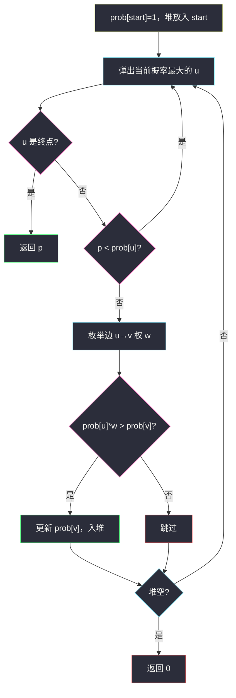
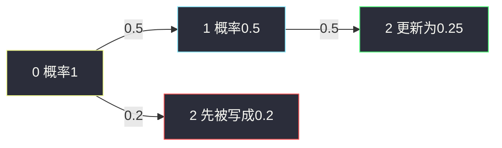

# 概率最大的路径（Dijkstra 变形 · 最大堆乘边权）

## 一、问题描述

`n` 个节点的无向图，边 `edges[i] = [a, b]` 的成功概率是 `succProb[i]`。从 `start` 走到 `end`，路径成功概率为沿途边权**相乘**。求最大成功概率；不可达返回 `0`。

> 🔗 LeetCode 1514：https://leetcode.cn/problems/path-with-maximum-probability/
>
> 数据范围：`2 <= n <= 10^4`，边数 `m <= 2·10^4`，`0 <= succProb[i] <= 1`，无重边、无自环，`start != end`。
>
> 📚 灵茶题单：**图论 · §3.1 单源最短路：Dijkstra 算法**（1846 分）。

**示例 1**

```
输入：n = 3, edges = [[0,1],[1,2],[0,2]], succProb = [0.5,0.5,0.2], start = 0, end = 2
输出：0.25000
0→1→2：0.5 * 0.5 = 0.25
0→2：0.2
最大 0.25。
```

**示例 2**

```
输入：同上边，succProb = [0.5,0.5,0.3]，start = 0, end = 2
输出：0.30000
直边 0.3 大于 0.25，选直达。
```

**示例 3**

```
输入：n = 3, edges = [[0,1]], succProb = [0.5], start = 0, end = 2
输出：0.00000
2 不可达。
```

**直观理解**

边权是 `(0, 1]` 上的概率（也可以为 0）。「最短路」要的是权**相加最小**；本题要权**相乘最大**。因为乘上一个 ≤ 1 的数不会让概率变大，贪心结构与 Dijkstra 相同：每次取出当前概率最大的点，用它去松弛邻居。

---

## 二、暴力解法

DFS/BFS 枚举所有简单路径，把边权乘起来取 max：

```python
class Solution:
    def maxProbability(self, n, edges, succProb, start_node, end_node):
        g = [[] for _ in range(n)]
        for (a, b), w in zip(edges, succProb):
            g[a].append((b, w))
            g[b].append((a, w))

        ans = 0.0

        def dfs(u: int, p: float, seen: set) -> None:
            nonlocal ans
            if u == end_node:
                ans = max(ans, p)
                return
            for v, w in g[u]:
                if v not in seen and p * w > ans:
                    seen.add(v)
                    dfs(v, p * w, seen)
                    seen.remove(v)

        dfs(start_node, 1.0, {start_node})
        return ans
```

剪枝 `p * w > ans` 仍挡不住指数条路径。`n=1e4` 必超时。环不能白走（乘 ≤ 1 只降不升），但简单路径数量仍可能爆炸。

### 复杂度

- **时间**：最坏指数级。
- **空间**：递归栈 `O(n)`。

### 🔴 瓶颈在哪里

需要的是「从 start 到每个点的**最大**成功概率」，不是列出全部路径。这是单源最优路，应当 Dijkstra，不要 DFS 搜索。

---

## 三、优化探索（核心章节）

> 📚 本题在灵茶题单中属于 **§3.1 Dijkstra**。无向图先建邻接表；最大堆弹出当前概率最大的点；松弛条件 `prob[v] < prob[u] * w`。

### 3.1 为什么能用 Dijkstra

普通 Dijkstra：边权非负，弹出的点距离不再变小。本题边权 `w ∈ [0, 1]`，新概率 `prob[u] * w ≤ prob[u]`，从已确定最大概率的 `u` 走出去，不可能再绕一圈把 `u` 自己变大。对邻居而言，第一次以「当前全局最大可达概率」弹出某点时，这条到达已经是最优——再晚弹出的点概率更小，乘上 ≤ 1 的边也追不上。

取对数 `dist = -log(prob)` 会把「乘最大」变成「加最小」，边权 `-log(w) ≥ 0`，就是教科书最短路。主解直接乘更直观，少一层对数和 `w=0` 的特判。

### 3.2 松弛与堆

`prob[u]` = 从 start 到 `u` 目前找到的最大成功概率，初值 `prob[start]=1`，其余 `0`。

从 `u` 走边权 `w` 到 `v`，候选 `np = prob[u] * w`。若 `np > prob[v]`，更新并把 `(-np, v)` 入堆（Python `heapq` 是小根堆，塞负数模拟大根堆）。

弹出时若 `p < prob[u]`，是过期记录，跳过。弹出 `end` 时可以直接返回：堆按概率从大到小弹出，第一次拿出终点就是答案。



### 3.3 浮点

概率比较用 `>` 即可，不要加 eps：更新条件是严格变大，LeetCode 按相对/绝对误差判答案。`w=0` 的边会把概率打成 0，与「不可达」一样，不会被 `> prob[v]` 更新（除非对面还是初值 0——`0 > 0` 为假，保持 0）。

### 3.4 一句话核心

> **建无向邻接表；最大堆 Dijkstra，松弛 `prob[v] = max(prob[v], prob[u]*w)`；堆空仍未到终点则 0。**

---

## 四、代码实现

### Python（主解：最大堆乘边权）

```python
import heapq

class Solution:
    def maxProbability(
        self,
        n: int,
        edges: list[list[int]],
        succProb: list[float],
        start_node: int,
        end_node: int,
    ) -> float:
        g = [[] for _ in range(n)]
        for (a, b), w in zip(edges, succProb):
            g[a].append((b, w))
            g[b].append((a, w))

        prob = [0.0] * n
        prob[start_node] = 1.0
        h = [(-1.0, start_node)]
        while h:
            p, u = heapq.heappop(h)
            p = -p
            if u == end_node:
                return p
            if p < prob[u]:
                continue
            for v, w in g[u]:
                np = p * w
                if np > prob[v]:
                    prob[v] = np
                    heapq.heappush(h, (-np, v))
        return 0.0
```

**变量含义**

| 变量 | 含义 |
|------|------|
| `g` | 邻接表，元素 `(邻居, 概率)` |
| `prob[i]` | start 到 i 的最大成功概率 |
| `h` | 最大堆，存 `(-概率, 节点)` |

入堆用更新后的 `np`，弹出用 `p` 做松弛，与「当前确定值」一致。过期项靠 `p < prob[u]` 丢掉。

### Java（可选）

```java
class Solution {
    public double maxProbability(int n, int[][] edges, double[] succProb, int start, int end) {
        List<double[]>[] g = new ArrayList[n];
        Arrays.setAll(g, i -> new ArrayList<>());
        for (int i = 0; i < edges.length; i++) {
            int a = edges[i][0], b = edges[i][1];
            g[a].add(new double[]{b, succProb[i]});
            g[b].add(new double[]{a, succProb[i]});
        }
        double[] prob = new double[n];
        prob[start] = 1;
        PriorityQueue<double[]> h = new PriorityQueue<>((x, y) -> Double.compare(y[0], x[0]));
        h.add(new double[]{1, start});
        while (!h.isEmpty()) {
            double[] cur = h.poll();
            double p = cur[0];
            int u = (int) cur[1];
            if (u == end) return p;
            if (p < prob[u]) continue;
            for (double[] e : g[u]) {
                int v = (int) e[0];
                double np = p * e[1];
                if (np > prob[v]) {
                    prob[v] = np;
                    h.add(new double[]{np, v});
                }
            }
        }
        return 0;
    }
}
```

---

## 五、具体例子演示

示例 1：边 `0-1: 0.5`，`1-2: 0.5`，`0-2: 0.2`。`prob` 初值 `[1, 0, 0]`。

| 步 | 弹出 (p, u) | 过期? | 松弛 | 堆（按弹出序） | prob |
|----|-------------|-------|------|----------------|------|
| 开始 | — | — | — | `(1.0, 0)` | `[1, 0, 0]` |
| 1 | (1.0, 0) | 否 | 1：0.5>0 更新；2：0.2>0 更新 | `(0.5,1), (0.2,2)` | `[1, 0.5, 0.2]` |
| 2 | (0.5, 1) | 否 | 0：0.25<1 跳过；2：0.25>0.2 更新 | `(0.25,2), (0.2,2)` | `[1, 0.5, 0.25]` |
| 3 | (0.25, 2) | 否 | **u 即终点**，返回 0.25 | 剩下过期 `(0.2,2)` 不必看 | — |

过期的 `(0.2, 2)` 若被弹出，`0.2 < prob[2]=0.25`，直接丢。

示例 2 直边改成 0.3：第 1 步 `prob[2]=0.3`；第 2 步 `0.5*0.5=0.25` 不再大于 0.3；接着弹出的最大终点记录是 0.3。

示例 3：只有 `0-1`，堆处理完 0 和 1 后空，从未弹出 2，返回 0。



绿的 0.25 盖掉红的 0.2，这就是一次成功松弛。

---

## 六、复杂度分析

| 方法 | 时间 | 空间 | 说明 |
|------|------|------|------|
| 枚举简单路径 | 指数 | `O(n)` | `n=1e4` 不可用 |
| 最大堆 Dijkstra（主解） | `O((n+m) log n)` | `O(n+m)` | 二叉堆；每个更新一次入堆 |
| `-log` 转最短路 | 同阶 | 同阶 | 要处理 `w=0` |

堆里可能有同一顶点的多条记录，次数仍是 `O(m log n)` 量级。

---

## 七、对比总结

| 维度 | DFS 枚举 | Dijkstra 乘概率 |
|------|----------|-----------------|
| 找的是 | 所有路径 | 每个点的最优到达 |
| 乘法 | 路径末尾才比 | 边松弛即时比 |
| 环 | 要 vis 防环 | 乘 ≤1 自然不走亏环 |

**易错点**

1. **建成有向图**：题目是无向的，必须双向加边。
2. **用最小堆存原概率**：会先弹出接近 0 的点，贪心反了。必须最大堆（或塞负数）。
3. **松弛写成 `prob[v] = prob[u] + w`**：这是最短路加法，本题是乘法。
4. **不可达返回 `prob[end]` 的初值却忘了置 0**：初值必须是 0，成功时从 1 往外乘。
5. 把 `==` 当更新条件：浮点相等不应入堆，用严格 `>`。
6. 没丢过期堆项也能过，但会多松弛；建议留下 `p < prob[u]`。

---

## 八、举一反三

| 题目 | 关系 |
|------|------|
| [1631. 最小体力消耗路径](https://leetcode.cn/problems/path-with-minimum-effort/) | 边权改成「高度差」，目标改成路径最大边权的最小；仍可用 Dijkstra |
| [743. 网络延迟时间](https://leetcode.cn/problems/network-delay-time/) | 标准加法最短路 Dijkstra |
| [787. K 站中转内最便宜的航班](https://leetcode.cn/problems/cheapest-flights-within-k-stops/) | 最短路 + 限制边数，Bellman-Ford / 分层 Dijkstra |
| [1976. 到达目的地的方案数](https://leetcode.cn/problems/number-of-ways-to-arrive-at-destination/) | Dijkstra 同时累计最短路条数 |
| [1514. 概率最大的路径](https://leetcode.cn/problems/path-with-maximum-probability/) | 本题 |

**思想迁移**

- 最优路的「比较/合并」换了：加 → 乘、min → max，堆的方向跟着换。
- 口诀：**「概率相乘、堆取最大；`prob[v] < prob[u]*w` 才更新；到不了就是 0。」**
