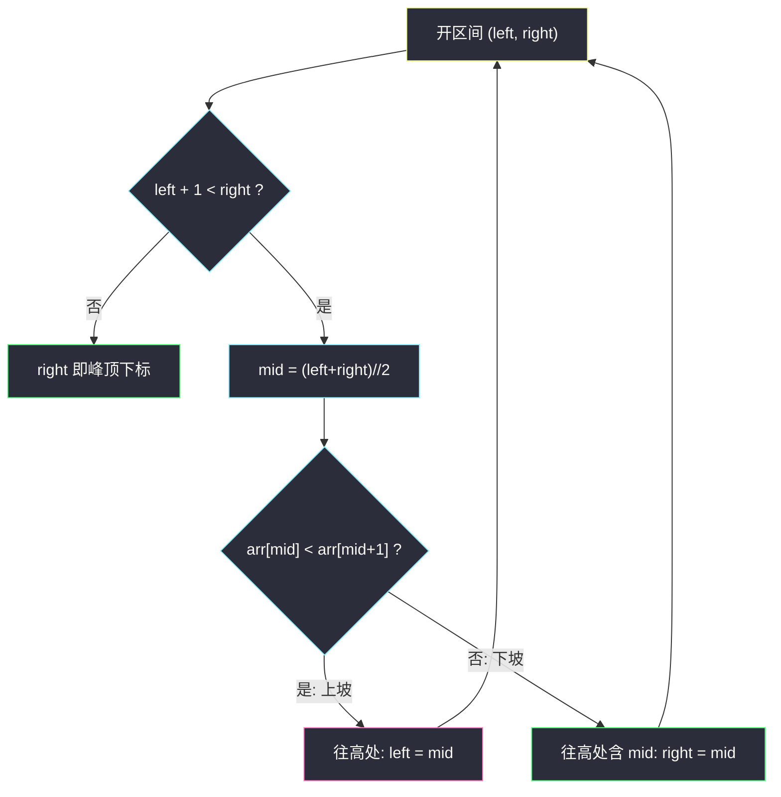
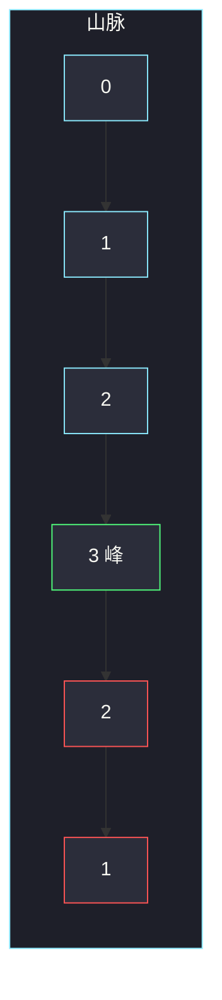

# 山脉数组的峰顶索引（二分往高处走）

## 一、问题描述

符合下列性质的数组叫**山脉数组**：

- 长度 ≥ 3；
- 存在下标 `i`（`0 < i < n-1`），使得 `arr[0] < arr[1] < … < arr[i-1] < arr[i]`，且 `arr[i] > arr[i+1] > … > arr[n-1]`。

也就是**严格先增后减**，峰顶唯一。返回峰顶下标。题目要求 `O(log n)`。

> 🔗 LeetCode 852：https://leetcode.cn/problems/peak-index-in-a-mountain-array/
>
> 数据范围：`3 <= arr.length <= 10^5`，`0 <= arr[i] <= 10^6`，保证 `arr` 是山脉数组。

**示例 1**

```
输入：arr = [0,1,0]
输出：1
```

**示例 2**

```
输入：arr = [0,2,1,0]
输出：1
```

**示例 3**

```
输入：arr = [0,1,2,3,2,1]
输出：3
解释：0→1→2→3 严格上升，随后 3→2→1 严格下降，峰在下标 3。
```

**直观理解**

把数组画成一座山：左侧上坡，右侧下坡，山顶只有一个。线性扫一遍找 `max` 也能过数据，但复杂度是 `O(n)`，不满足题面。二分每次看中点是在上坡还是下坡：**往高的一侧走，那边一定还有峰**——因为这座山保证有且仅有一个峰顶。

`n` 到 `10^5` 时线性其实也过，强制 `O(log n)` 是为了练峰值二分，并给 1095（山脉上查找）当子程序：先 `log n` 找峰，再左右各一次二分。

---

## 二、暴力解法

从左到右找第一个下降处，或直接取最大值下标。

```python
class Solution:
    def peakIndexInMountainArray(self, arr: List[int]) -> int:
        for i in range(1, len(arr) - 1):
            if arr[i] > arr[i - 1] and arr[i] > arr[i + 1]:
                return i
        return -1
```

或 `return arr.index(max(arr))`。

### 复杂度

- **时间**：`O(n)`。
- **空间**：`O(1)`。

`n = 10^5` 线性能过，但本题明确要对数时间，面试按线性交容易被追问。**不要把线性扫描当主解。**

### 🔴 瓶颈在哪里

山脉只有一个转折。`arr[mid]` 与 `arr[mid+1]` 的大小关系已经告诉你：当前在上坡还是下坡。另一半可以被整段扔掉，不必再看。这和「有序数组二分」同一类：一次比较丢掉一半。

---

## 三、优化探索（核心章节）

> 📚 本题在灵茶题单中属于 **04-二分查找 · 四、其他**（单峰 / 峰值）。二维推广见同目录 [寻找峰值 II](find-a-peak-element-ii.md)。

本文二分**全程开区间 `(left, right)`**，与同批窗口左端点、二分答案同一套更新：只改 `left = mid` 或 `right = mid`。

### 3.1 比较谁：`arr[mid]` 和 `arr[mid+1]`

- `arr[mid] < arr[mid+1]`：还在**上坡**。峰在 `mid` 右边（至少在 `mid+1`）。开区间里丢掉 `mid` 及左侧：`left = mid`。
- `arr[mid] > arr[mid+1]`：已经在**下坡**（或 `mid` 就是峰）。峰在 `mid` 或左侧：`right = mid`。

山脉严格增减，不会出现 `arr[mid] == arr[mid+1]`。不要改成和 `arr[0]` 比大小：那只能知道「整体偏高还是偏低」，丢不掉一半。必须看**相邻**，才能判断上坡还是下坡。

### 3.2 正确性：往高处走一定有峰

这是峰值题的核心句，不是口号：

1. 题目保证存在唯一峰，且两端不是峰（`arr[0] < arr[1]`，`arr[n-2] > arr[n-1]`）。
2. 若 `arr[mid] < arr[mid+1]`，从 `mid` 向右是严格上升。右侧最终必须降下来（山脉定义），所以在 `mid` 右边一定还能碰到「比左边高、比右边高」的顶。把左半扔掉，峰仍在剩下的开区间里。
3. 若 `arr[mid] > arr[mid+1]`，从 `mid` 向右已经下降。峰不可能在 `mid` 右边（右边都比 `mid` 更低且继续往低走），所以峰在左边含 `mid`。

用 `[0,1,2,3,2,1]`、`mid=2` 走一遍：`arr[2]=2 < arr[3]=3`，往右。右侧 `3,2,1` 必有峰（3 比左右高）。若某次 `mid=3`，`3>2`，往左含 3，立刻钉在峰上。路径上的值沿「更高邻居」走，有限下标不可能无限上升。

不必证明「全局最大」——单峰时局部峰就是全局峰。二维网格没有「整列单峰」时，仍然用「往高处走」：见 [1901](find-a-peak-element-ii.md)。

和 162「寻找峰值」的差别：162 只保证相邻不等，峰可以有多个、也可以在端点。比较仍是 `mid` vs `mid+1`，往高处走**某一个**峰一定存在（有限数组、值严格沿路径上升）。852 额外保证整段是单峰山脉，所以找到的就是**唯一**峰顶，也是最大值下标。



### 3.3 开区间边界：`right` 初值 `n-1` 而不是 `n`

要读 `arr[mid+1]`，必须 `mid ≤ n-2`。令 `left, right = -1, n-1`，则 `mid < right ≤ n-1`，故 `mid+1 ≤ n-1`。结束时 `right` 落在 `[1, n-2]`（山脉保证峰不在两端）。

若 `right = n`，`mid` 可能为 `n-1`，`arr[mid+1]` 越界。

### 3.4 和「找最大值」的关系

峰顶就是最大值下标。二分不是在无序数组里找 max（那做不到 `log n`），而是**利用单峰结构**：一边升一边降，比较相邻两项就知道 max 在哪一侧。没有单峰保证时，不能这么扔一半。

三分数组也能切单峰，但每次要算两个三分点，比较次数更多。相邻两项一次比较就够，不必上三分。

开区间与闭区间不要混：闭区间常见写法是 `left, right = 0, n-2` 配 `while left <= right` 再 `right = mid - 1`。本文五道二分题统一开区间，852 的 `right` 初值是 `n-1`（不是 `n`），循环里永不写 `mid±1` 去改端点。

### 3.5 一句话核心

> **看 `arr[mid]` 与 `arr[mid+1]`：升则峰在右，降则峰在左含 mid。往高处走，这座山一定还有顶。开区间收到 `right`。**

---

## 四、代码实现

### Python（主解：开区间二分）

```python
class Solution:
    def peakIndexInMountainArray(self, arr: List[int]) -> int:
        n = len(arr)
        left, right = -1, n - 1            # 开区间，mid+1 始终合法
        while left + 1 < right:
            mid = (left + right) // 2
            if arr[mid] < arr[mid + 1]:
                left = mid                  # 上坡，峰在 (mid, right)
            else:
                right = mid                 # 下坡，峰在 (left, mid]
        return right
```

**变量含义**

| 变量 | 含义 |
|------|------|
| `left`, `right` | 开区间两端；峰的下标始终在 `(left, right]`，结束时等于 `right` |
| `mid` | 当前探测点；用它和下一个元素判断上坡 / 下坡 |

**循环不变量**：峰 ∈ `(left, right]`；`0 ≤ mid < n-1`。

### Java（最优解同款）

```java
class Solution {
    public int peakIndexInMountainArray(int[] arr) {
        int left = -1, right = arr.length - 1;
        while (left + 1 < right) {
            int mid = left + (right - left) / 2;
            if (arr[mid] < arr[mid + 1]) {
                left = mid;
            } else {
                right = mid;
            }
        }
        return right;
    }
}
```

---

## 五、具体例子演示

以示例 3：`arr = [0,1,2,3,2,1]`，`n = 6`，开区间 `(-1, 5)`。

| 轮 | left | right | mid | arr[mid] | arr[mid+1] | 上坡？ | 新区间 | 含义 |
|----|------|-------|-----|----------|------------|--------|--------|------|
| 1 | -1 | 5 | 2 | 2 | 3 | 是 | `(2, 5)` | 峰在 2 右侧 |
| 2 | 2 | 5 | 3 | 3 | 2 | 否 | `(2, 3)` | 峰在 3 或更左 |
| 结束 | 2 | 3 | — | — | — | — | `left+1==right` | 峰 = 3 |

`arr[3] = 3` 确为峰顶 ✓。

**短数组** `[0,1,0]`：`(-1, 2)`，`mid=0`，`0<1` 上坡，`left=0`；`left+1=1 < right=2`，`mid=1`，`1>0` 下坡，`right=1`；结束返回 1 ✓。

**峰在最右合法位** `[1,2,3,2]`：`(-1, 3)` → `mid=1`，`2<3`，`left=1` → `mid=2`，`3>2`，`right=2` → 返回 2 ✓。

**示例 2 逐步**：`arr = [0,2,1,0]`，`n=4`，`(-1, 3)`。

| 轮 | left | right | mid | arr[mid] | arr[mid+1] | 上坡？ | 新区间 |
|----|------|-------|-----|----------|------------|--------|--------|
| 1 | -1 | 3 | 1 | 2 | 1 | 否 | `(-1, 1)` |
| 2 | -1 | 1 | 0 | 0 | 2 | 是 | `(0, 1)` |
| 结束 | 0 | 1 | — | — | — | `left+1==right` | 峰 = 1 |

若第一轮把「下降」理解成扔掉 `mid`，写成 `right = mid - 1`，会得到 `right=0`，而 `arr[0]=0` 不是峰。开区间只赋 `right = mid`，把峰留在区间里。



---

## 六、复杂度分析

每次比较扔掉当前开区间里大约一半的下标，循环次数 `O(log n)`。只读 `arr[mid]` 与 `arr[mid+1]`，额外几个整型变量。

| 方法 | 时间 | 空间 | 说明 |
|------|------|------|------|
| 线性找第一个下降 / max | `O(n)` | `O(1)` | 能过但不符合 `O(log n)` |
| 开区间二分（主解） | `O(log n)` | `O(1)` | 每次扔掉一半 |
| 三分单峰 | `O(log n)` | `O(1)` | 常数更大，不必用 |

---

## 七、对比总结

| 维度 | 线性 max | 二分相邻比较 |
|------|----------|----------------|
| 利用的结构 | 无 | 严格单峰 |
| 比较对象 | 与全局 max | 只和 `mid+1` |
| 二维推广 | 扫全表 | 对列二分 + 列内 max，见 1901 |

**易错点**

1. **主解写成 `for` 扫一遍**：题面要 `log n`，线性只放在暴力章。
2. **开闭混用**：`while left <= right` 又配 `right = mid`，会停不下来或漏峰。选定开区间就只改 `left/right = mid`。
3. **`right` 初值 `n`**：`arr[mid+1]` 越界。必须 `n-1`。
4. **和 `arr[mid-1]` 比三元**：没必要。山脉严格，看右侧一个邻居就够判断上坡还是下坡。
5. **把 `left` 当初值 0 且允许 `mid = n-1`**：最后一格没有 `mid+1`。开区间把右开端卡在 `n-1` 就是为了这个。
6. **返回 `left` 而不是 `right`**：开区间结束时 `left` 是「仍在上坡的最后一个探测」，真正的峰是第一个非上坡位置 `right`。

**模板（开区间 · 单峰）**

```python
left, right = -1, n - 1
while left + 1 < right:
    mid = (left + right) // 2
    if arr[mid] < arr[mid + 1]:
        left = mid          # 往高处（右）
    else:
        right = mid         # 往高处（左含 mid）
return right
```

---

## 八、举一反三

| 题目 | 关系 |
|------|------|
| [162. 寻找峰值](https://leetcode.cn/problems/find-peak-element/) | 相邻不等即可，不一定单峰；同一句「往高处走一定有峰」 |
| [1901. 寻找峰值 II](https://leetcode.cn/problems/find-a-peak-element-ii/) | 本题的二维版，同目录详解 [find-a-peak-element-ii.md](find-a-peak-element-ii.md) |
| [1095. 山脉数组中查找目标值](https://leetcode.cn/problems/find-in-mountain-array/) | 先 852 找峰，再左右各一次有序二分 |
| [153. 寻找旋转排序数组中的最小值](https://leetcode.cn/problems/find-minimum-in-rotated-sorted-array/) | 也是一次比较丢掉半边，比较对象换成 `mid` 与右端 |
| [33. 搜索旋转排序数组](https://leetcode.cn/problems/search-in-rotated-sorted-array/) | 先判断 mid 落在哪一段有序，再决定扔哪一半 |
| [278. 第一个错误的版本](https://leetcode.cn/problems/first-bad-version/) | 开区间求「第一个 true」，和 852 同一套循环骨架 |
| [69. x 的平方根](https://leetcode.cn/problems/sqrtx/) | 开区间求最大的满足 `mid*mid ≤ x` 的 mid，更新方向与「求最大 k」相同 |

**思想迁移**

- 峰值题不要找「全局 max 的公式」，要找**能判断哪一侧更高**的一次比较，然后把矮的一半扔掉。
- 一维比 `mid` 与 `mid+1`；二维比「该列最大值」与左右邻居，道理相同。
- 852 找到峰之后，左半递增、右半递减，这是 1095 能继续二分的前提。
- 162 把端点也允许当峰，比较式不变，只是初值 / 越界语义略扩；1901 则把「一个邻居」换成「一列的代表」。
- 口诀：**「升则右、降则左含 mid；往高处走，必有峰。」**
