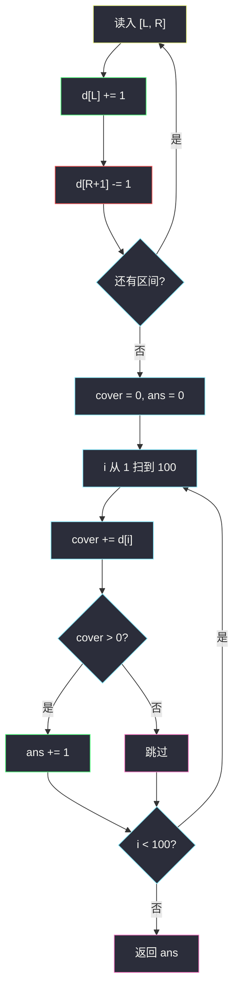
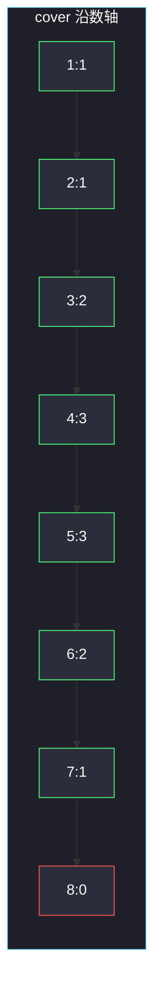

# 与车相交的点

## 一、问题描述

数轴上有若干辆车。`nums[i] = [start_i, end_i]` 表示第 `i` 辆车覆盖闭区间 `[start_i, end_i]` 上的全部整数点。求被**至少一辆车**覆盖的整数点个数。

> 🔗 LeetCode 2848：https://leetcode.cn/problems/points-that-intersect-with-cars/
>
> 数据范围：`1 <= nums.length <= 100`，`1 <= start_i <= end_i <= 100`。

**示例 1**

```
输入：nums = [[3,6],[1,5],[4,7]]
输出：7
解释：覆盖了 1,2,3,4,5,6,7，共 7 个点。
```

**示例 2**

```
输入：nums = [[1,3],[5,8]]
输出：7
解释：1,2,3 与 5,6,7,8，中间 4 没车。
```

**直观理解**

多段闭区间盖在 `[1, 100]` 上，重叠只计一次。问的是「并集里有多少个整数」，不是区间长度之和。

---

## 二、暴力解法

把每个区间里的每个整数丢进集合，集合大小就是答案：

```python
class Solution:
    def numberOfPoints(self, nums: List[List[int]]) -> int:
        seen = set()
        for start, end in nums:
            for x in range(start, end + 1):
                seen.add(x)
        return len(seen)
```

本题坐标 ≤ 100，这样写能过。每个区间长度合计最坏 `O(n · 100)`。

### 复杂度

- **时间**：`O(n · MAX)`，`MAX=100`。
- **空间**：`O(MAX)`。

### 🔴 瓶颈在哪里

集合是对的，但没把「区间覆盖」这个骨架讲出来。坐标再大（到 `10^9`）就不能逐点标记。标准做法是**一维差分**：只在端点 `+1 / -1`，再前缀和还原覆盖次数。

---

## 三、优化探索（核心章节）

> 📚 本题在灵茶题单中属于 **差分数组 · §2.1 一维差分**。差分数组回答的是：每个位置被多少个区间盖住；本题只要次数 `> 0` 的点数。

### 3.1 差分骨架

想让闭区间 `[L, R]` 上每个点覆盖次数 `+1`，只需：

```
d[L]     += 1
d[R + 1] -= 1
```

再令 `cover[i] = cover[i-1] + d[i]`（`cover[0]=0`）。则 `cover[i]` 就是点 `i` 被几辆车盖住。`cover[i] > 0` 计 1。

坐标在 `1 .. 100`，开 `d[0..101]` 足够：`R+1` 最大 101。



### 3.2 为什么 `R+1` 要 `-1`

差分的含义：`d[i]` = 「从 i 开始，覆盖次数的变化量」。区间在 `R` 结束，所以从 `R+1` 起要把刚才加的那 1 撤掉。闭区间所以减在 `R+1`，不是 `R`。

### 3.3 一句话核心

> **每个 `[L,R]` 做 `d[L]+=1`、`d[R+1]-=1`；前缀和 `> 0` 的点计一次。**

---

## 四、代码实现

### Python（主解：一维差分）

```python
class Solution:
    def numberOfPoints(self, nums: List[List[int]]) -> int:
        d = [0] * 102                         # 下标 1..101
        for L, R in nums:
            d[L] += 1
            d[R + 1] -= 1
        ans = cover = 0
        for i in range(1, 101):
            cover += d[i]
            if cover > 0:
                ans += 1
        return ans
```

**变量含义**

| 变量 | 含义 |
|------|------|
| `d[i]` | 点 `i` 处覆盖次数的差分（相对 `i-1` 的变化） |
| `cover` | 扫到 `i` 时的前缀和 = 点 `i` 被几辆车覆盖 |
| `ans` | `cover > 0` 的点数 |

坐标若到 `10^9`，不能开数组，要改成「端点排序 / 离散化后再差分」。本题范围小，直接开数组最清楚。

---

## 五、具体例子演示

以示例 1：`nums = [[3,6],[1,5],[4,7]]`。初始 `d` 全 0。

**逐步改差分数组**（只写非零）

| 区间 | 操作 | d 非零项 |
|------|------|----------|
| `[3,6]` | `d[3]+=1`，`d[7]-=1` | `d[3]=1, d[7]=-1` |
| `[1,5]` | `d[1]+=1`，`d[6]-=1` | `d[1]=1, d[3]=1, d[6]=-1, d[7]=-1` |
| `[4,7]` | `d[4]+=1`，`d[8]-=1` | `d[1]=1, d[3]=1, d[4]=1, d[6]=-1, d[7]=-1, d[8]=-1` |

**前缀和还原覆盖次数**

| i | d[i] | cover | 计入? |
|---|------|-------|-------|
| 1 | 1 | 1 | ✓ |
| 2 | 0 | 1 | ✓ |
| 3 | 1 | 2 | ✓ |
| 4 | 1 | 3 | ✓ |
| 5 | 0 | 3 | ✓ |
| 6 | -1 | 2 | ✓ |
| 7 | -1 | 1 | ✓ |
| 8 | -1 | 0 | ✗ |

1 到 7 都 `> 0`，答案 **7**。点 8 起 `cover=0`，不再计数。

示例 2：`[1,3]`、`[5,8]` → `d[1]+=1, d[4]-=1, d[5]+=1, d[9]-=1`。点 4 的 `cover` 会掉到 0，所以 4 不计入，答案仍是 7。



---

## 六、复杂度分析

| 方法 | 时间 | 空间 | 说明 |
|------|------|------|------|
| 集合逐点标记 | `O(n · MAX)` | `O(MAX)` | MAX=100 能过 |
| 一维差分（主解） | `O(n + MAX)` | `O(MAX)` | 只改端点，再扫一遍轴 |

---

## 七、对比总结

| 维度 | 集合 | 差分 |
|------|------|------|
| 骨架 | 逐点插入 | 端点 +1/-1，前缀和还原 |
| 大坐标 | 不行 | 要离散化 / 排序扫端点 |
| 能回答什么 | 只会计数 | 还能知道每个点盖了几次 |

**易错点**

1. **`d[R] -= 1`**：闭区间应在 `R+1` 减，在 `R` 减会少算右端点。
2. **数组开短了**：`R+1` 最大 101，要开到至少 102。
3. **统计 `cover` 之和**：要的是点数，不是覆盖次数总和。
4. **开区间当成闭**：题目是闭区间，`range(L, R)` 会漏 `R`。

**模板（§2.1 一维差分）**

```python
d[L] += 1
d[R + 1] -= 1
# 再前缀和
cover += d[i]
```

---

## 八、举一反三

| 题目 | 关系 |
|------|------|
| [1094. 拼车](https://leetcode.cn/problems/car-pooling/) | 同一骨架：差分后前缀和不能超过座位 |
| [1109. 航班预订统计](https://leetcode.cn/problems/corporate-flight-bookings/) | `[L,R]` 上 `+val`，最后还原整条轴 |
| [370. 区间加法](https://leetcode.cn/problems/range-addition/) | 差分题原型 |
| [1893. 检查是否区域内所有整数都被覆盖](https://leetcode.cn/problems/check-if-all-the-integers-in-a-range-are-covered/) | 覆盖次数是否全程 `> 0` |
| [56. 合并区间](https://leetcode.cn/problems/merge-intervals/) | 求并集长度，排序合并，不必差分 |

**思想迁移**

- 见到「多个区间在轴上加减 / 计数」，先写 `d[L]+=v, d[R+1]-=v`，再前缀和。
- 口诀：**「左端加点，右端下一位减点；前缀和大于 0 就占了一个整数点。」**
