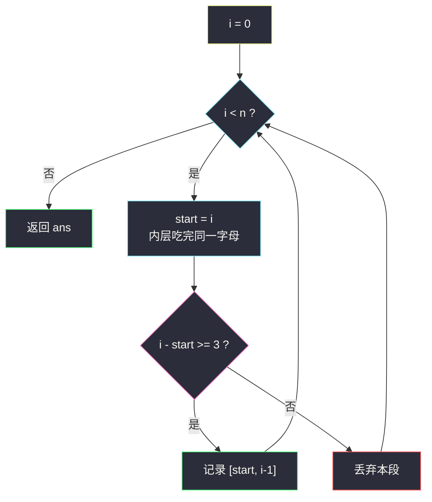
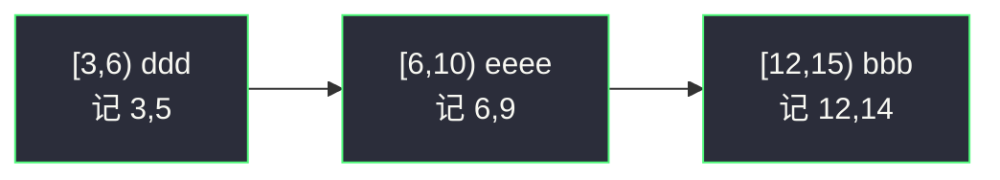

# 较大分组的位置（分组循环 · 同字符连续段）

## 一、问题描述

字符串 `s` 仅由小写字母组成。把**连续相同字符**组成的极大区间叫做一个分组；若某分组长度 ≥ 3，则称它是**较大分组**。返回所有较大分组的闭区间 `[start, end]`（下标从 0），并按起始位置升序。

> 🔗 LeetCode 830：https://leetcode.cn/problems/positions-of-large-groups/
>
> 数据范围：`1 <= s.length <= 1000`，`s` 只含小写字母。

**示例 1**

```
输入：s = "abbxxxxzzy"
输出：[[3,6]]
解释：较大分组只有 "xxxx"，对应闭区间 [3,6]。
```

**示例 2**

```
输入：s = "abc"
输出：[]
解释：没有任何一段连续相同字符长度达到 3。
```

**示例 3**

```
输入：s = "abcdddeeeeaabbbcd"
输出：[[3,5],[6,9],[12,14]]
解释：ddd、eeee、bbb 三段都 ≥ 3。
```

**直观理解**

`s` 天然被切成若干「同一字母的连续段」，段与段之间互不影响。较大分组 = 某一段的长度 ≥ 3。这是灵神 **六、分组循环** 的入门题：外层 `while i < n` 锁定一段起点，内层把同一字母吃完，再按这段长度决定要不要记答案。

---

## 二、暴力解法

对每个下标 `i` 都当起点往右数相同字母，若这段是**极大**的（左边已经换字母或到头）且长度 ≥ 3，就记录。最坏每次都从 `i` 扫到末尾，时间 `O(n²)`。

```python
class Solution:
    def largeGroupPositions(self, s: str) -> List[List[int]]:
        n, ans = len(s), []
        for i in range(n):
            if i > 0 and s[i] == s[i - 1]:   # 不是段起点，跳过
                continue
            j = i
            while j < n and s[j] == s[i]:    # 从 i 再扫一遍本段
                j += 1
            if j - i >= 3:
                ans.append([i, j - 1])
        return ans
```

每个字符都会被内层 `while` 重复扫到（每个起点各扫一次本段后缀），所以是平方。

### 复杂度

- **时间**：`O(n²)`，同一段被反复扫描。
- **空间**：`O(1)` 额外（不计答案）。

### 🔴 瓶颈在哪里

「从每个 `i` 重新往右数」是浪费：一段 `aaaa` 的信息在第一次扫完就已经齐了。分组循环的要点正是：**每段只吃一次，吃完立刻结算。**

---

## 三、优化探索（核心章节）

> 📚 本题在灵茶题单中属于 **六、分组循环**（滑窗① A 路）：外层 `while i < n` 锁定当前段起点，内层把同一字母吃完得到半开区间 `[start, i)`，再处理这一段。组间互不影响。

### 3.1 观察特征

| 特征 | 说明 |
|------|------|
| 分组互斥且覆盖全集 | 每个下标恰好属于一段连续相同字符 |
| 段内信息闭式可得 | 只需 `start` 和段右端，长度 = `i - start` |
| 指针只前进 | 内层吃完后 `i` 正好落在下一段起点，外层不用回退 |

### 3.2 分组循环模板

```text
i = 0
while i < n:
    start = i          # 本段左端（闭）
    i += 1
    while i < n and 与本段同组:
        i += 1
    # 结算半开区间 [start, i)
```

本题「同组」= `s[i] == s[start]`。结算时若 `i - start >= 3`，记下闭区间 `[start, i - 1]`。



### 3.3 正确性

- **不漏**：`i` 从 0 走到 `n`，每段都被内层吃到；判定只用极大段长度，不会把非极大子段误记（例如 `aaaa` 只记 `[0,3]`，不会再记 `[1,3]`）。
- **不重**：外层每次从新的 `start` 开始，段与段不相交。
- **有序**：从左到右结算，答案已按起始下标升序。

### 3.4 一句话核心

> **同一字母一段吃完，长度 ≥ 3 就记闭区间；指针只前进，每段结算一次。**

---

## 四、代码实现

### Python（主解：分组循环）

```python
class Solution:
    def largeGroupPositions(self, s: str) -> List[List[int]]:
        n, ans, i = len(s), [], 0
        while i < n:
            start = i
            i += 1
            while i < n and s[i] == s[start]:  # 把同一字母吃完
                i += 1
            if i - start >= 3:                 # [start, i) 长度
                ans.append([start, i - 1])     # 转成闭区间
        return ans
```

**变量含义**

| 变量 | 含义 |
|------|------|
| `start` | 当前段左端（闭） |
| `i` | 内层结束后是本段右端的下一格，即半开右端 |
| `ans` | 所有较大分组的闭区间 |

**循环不变式**：每次外层循环开始时，`s[0..i)` 已全部结算；本轮处理的是以 `s[i]` 开头的极大相同段。

---

## 五、具体例子演示

以示例 3 `s = "abcdddeeeeaabbbcd"` 走主解。半开区间 `[start, i)` 是分组循环的原生产物，答案转成闭区间 `[start, i-1]`。

| 段 | `[start, i)` | 字符 | 长度 | 决策 |
|----|----------------|------|------|------|
| 1 | [0, 1) | a | 1 | 丢弃 |
| 2 | [1, 2) | b | 1 | 丢弃 |
| 3 | [2, 3) | c | 1 | 丢弃 |
| 4 | [3, 6) | ddd | 3 | 记 `[3,5]` |
| 5 | [6, 10) | eeee | 4 | 记 `[6,9]` |
| 6 | [10, 12) | aa | 2 | 丢弃 |
| 7 | [12, 15) | bbb | 3 | 记 `[12,14]` |
| 8 | [15, 16) | c | 1 | 丢弃 |
| 9 | [16, 17) | d | 1 | 丢弃 |

返回 `[[3,5],[6,9],[12,14]]` ✓。

**示例 1**：`abbxxxxzzy` 各段长度为 1, 2, 4, 2, 1，只有 `xxxx` 对应 `[3,6]`。**示例 2**：三段长度全是 1，空答案。



---

## 六、复杂度分析

| 方法 | 时间 | 空间 | 说明 |
|------|------|------|------|
| 每起点重扫本段 | `O(n²)` | `O(1)` | 同一字符被重复访问 |
| 分组循环（主解） | `O(n)` | `O(1)` | 每个下标进内层一次 |

---

## 七、对比总结

| 维度 | 暴力重扫 | 分组循环 |
|------|----------|----------|
| 每段访问次数 | 段内每个起点各一次 | 恰好一次 |
| 指针 | 外层 `i` 每次 +1，内层回头扫 | `i` 单调到 `n` |
| 答案形态 | 要额外判断「是不是段起点」 | 半开区间天然就是极大段 |

**易错点**

1. **开闭搞混**：循环里是 `[start, i)`，写入答案要 `[start, i-1]`。写成 `[start, i]` 会越界一格。
2. **不要在内层用 `s[i] == s[i-1]` 却忘了 `i += 1` 的起步**：先 `start = i; i += 1`，再比较，单字符段也能正确结束。
3. 长度判断用 `i - start >= 3`，不要写成 `i - start > 3`（恰好 3 也算较大分组）。
4. 全串同一字母（如 `"aaa"`）只有一段，内层会一口气吃到 `n`，记得循环条件 `i < n`。

**模板（同字符分组）**

```python
i = 0
while i < n:
    start = i
    i += 1
    while i < n and s[i] == s[start]:
        i += 1
    # 结算 [start, i)
```

---

## 八、举一反三

| 题目 | 关系 |
|------|------|
| [1446. 连续字符](https://leetcode.cn/problems/consecutive-characters/) | 同模板，结算时取 `max(长度)` 而不是收集区间 |
| [485. 最大连续 1 的个数](https://leetcode.cn/problems/max-consecutive-ones/) | 分组对象从「相同字母」换成「连续的 1」 |
| [228. 汇总区间](https://leetcode.cn/problems/summary-ranges/) | 数字版连续段，组内条件改成 `nums[i] == nums[i-1] + 1` |
| [1759. 统计同质子字符串的数目](https://leetcode.cn/problems/count-number-of-homogenous-substrings/) | 每段长 `k` 贡献 `k(k+1)/2` 个同质子串 |
| [1869. 哪种连续子字符串更长](https://leetcode.cn/problems/longer-contiguous-segments-of-ones-than-zeros/) | 分别对 0/1 两段取最长再比较 |
| [2414. 最长的字母序连续子字符串的长度](https://leetcode.cn/problems/length-of-the-longest-alphabetical-continuous-substring/) | 同批姊妹篇：组内条件改成字母表相邻 |

**思想迁移**

- 凡是「按某种相等 / 相邻关系把数组切成互不相交的极大段」，都先写分组循环，再在段尾做 `O(1)` 结算。
- 口诀：**「外层盯起点，内层把同组吃完；半开区间到手，长度够不够再开口。」**
