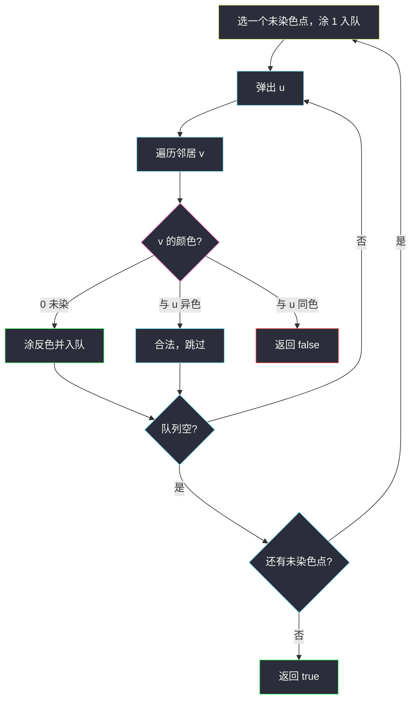
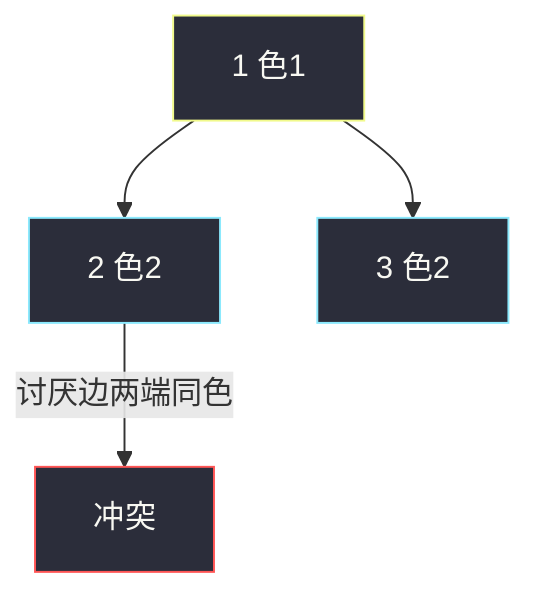

# 可能的二分法（讨厌关系建图 · 二分图染色）

## 一、问题描述

`n` 个人编号 `1 .. n`。`dislikes[i] = [a, b]` 表示 `a` 与 `b` 互相讨厌，不能分进同一组。能否把所有人分成两组，使每对讨厌的人不同组？

> 🔗 LeetCode 886：https://leetcode.cn/problems/possible-bipartition/
>
> 数据范围：`n ≤ 2000`，`dislikes.length ≤ 10^4`。
>
> 📚 灵茶题单：**七、二分图染色**（1795 分）。

**示例 1**

```
输入：n = 4, dislikes = [[1,2],[1,3],[2,4]]
输出：true
一组 {1,4}，另一组 {2,3}。讨厌边都跨组。
```

**示例 2**

```
输入：n = 3, dislikes = [[1,2],[1,3],[2,3]]
输出：false
三人两两讨厌，构成三角形（奇环），无法 2-染色。
```

**示例 3**

```
输入：n = 5, dislikes = [[1,2],[2,3],[3,4],[4,5],[1,5]]
输出：false
五边形，奇数长度环，同样染不开。
```

**直观理解**

把「讨厌」当成无向边：同一组 = 同色，讨厌 = 必须异色。问题就是：**这张无向图是不是二分图。** 与 [785. 判断二分图](https://leetcode.cn/problems/is-graph-bipartite/) 同构，只是输入从邻接表换成了边列表，人从 0 号改成 1 号。

---

## 二、暴力解法

每人两种分组，`2^n` 种方案，再扫一遍 `dislikes` 检查冲突。`n=2000` 不可想象。

```python
# 伪代码：mask 的第 i 位表示 i+1 的组号；对每条讨厌边检查两端 bit 是否不同
```

### 复杂度

- **时间**：`O(2^n · m)`。
- **空间**：`O(1)` 枚举。

### 🔴 瓶颈在哪里

一块连通分量里，起点的颜色定了，其它点的颜色就被边逼着推出来。不该枚举，该 **BFS/DFS 染色**。

---

## 三、优化探索（核心章节）

> 📚 本题在灵茶题单中属于 **七、二分图染色**。建无向图后 2-染色；不连通则枚举每个未染色起点。细节与 `is-graph-bipartite.md` 同一套。

### 3.1 建图

`a、b` 双向加边。节点开 `n+1`，下标 `1..n`，0 空着。

### 3.2 染色规则

`color[u] = 0` 未染色，`1` / `2` 两组。弹出 `u` 时，邻居 `v`：

- 未染色：涂 `3 - color[u]`，入队。
- 已染色且与 `u` 同色：冲突，返回 `false`。

入队即染色，避免同一点多次入队。



### 3.3 不连通

讨厌关系可能是若干森林。只从 1 号出发会漏掉另一块里的奇环，必须 `for i in 1..n: if not color[i]: bfs(i)`。

### 3.4 一句话核心

> **讨厌当边，相邻异色；同色相邻就是奇环，每个连通块都要染。**

---

## 四、代码实现

### Python（主解：BFS 染色）

```python
from collections import deque

class Solution:
    def possibleBipartition(self, n: int, dislikes: list[list[int]]) -> bool:
        g = [[] for _ in range(n + 1)]
        for a, b in dislikes:
            g[a].append(b)
            g[b].append(a)

        color = [0] * (n + 1)

        def bfs(start: int) -> bool:
            q = deque([start])
            color[start] = 1
            while q:
                u = q.popleft()
                for v in g[u]:
                    if color[v] == 0:
                        color[v] = 3 - color[u]
                        q.append(v)
                    elif color[v] == color[u]:
                        return False
            return True

        for i in range(1, n + 1):
            if color[i] == 0 and not bfs(i):
                return False
        return True
```

**变量含义**

| 变量 | 含义 |
|------|------|
| `g` | 无向邻接表，下标 1..n |
| `color` | 0 未染，1 / 2 两组 |
| `3 - color[u]` | 1↔2 翻转 |

DFS 染色同样正确：递归给邻居涂反色，撞见同色即失败。

```python
def dfs(u: int) -> bool:
    for v in g[u]:
        if color[v] == 0:
            color[v] = 3 - color[u]
            if not dfs(v):
                return False
        elif color[v] == color[u]:
            return False
    return True
```

外层仍要 `for i in range(1, n+1): if color[i]==0: color[i]=1; dfs(i)`。面试默写 BFS、DFS 都行。

### Java（可选）

```java
class Solution {
    public boolean possibleBipartition(int n, int[][] dislikes) {
        List<Integer>[] g = new ArrayList[n + 1];
        for (int i = 0; i <= n; i++) g[i] = new ArrayList<>();
        for (int[] e : dislikes) {
            g[e[0]].add(e[1]);
            g[e[1]].add(e[0]);
        }
        int[] color = new int[n + 1];
        for (int i = 1; i <= n; i++) {
            if (color[i] == 0 && !bfs(i, g, color)) return false;
        }
        return true;
    }
    boolean bfs(int start, List<Integer>[] g, int[] color) {
        ArrayDeque<Integer> q = new ArrayDeque<>();
        q.add(start);
        color[start] = 1;
        while (!q.isEmpty()) {
            int u = q.poll();
            for (int v : g[u]) {
                if (color[v] == 0) {
                    color[v] = 3 - color[u];
                    q.add(v);
                } else if (color[v] == color[u]) return false;
            }
        }
        return true;
    }
}
```

---

## 五、具体例子演示

### 示例 1（成功）

边：1-2，1-3，2-4。从 1 涂色 1。

| 弹出 | 邻居动作 | color |
|------|----------|-------|
| 1 | 2 涂 2，3 涂 2 | 1:1，2:2，3:2 |
| 2 | 4 涂 1；1 已是异色 | 4:1 |
| 3 | 1 已异色 | 不变 |
| 4 | 2 已异色 | 不变 |

无同色相邻，返回 true。一组 {1,4}，一组 {2,3}。

### 示例 2（染色冲突）

三角形 1-2-3。从 1 涂 1。

| 弹出 | 动作 | 结果 |
|------|------|------|
| 1 | 2 涂 2，3 涂 2 | 2 和 3 同色 |
| 2 | 看到邻居 3 颜色也是 2 | **冲突**，false |



边 2-3 还没参与推色时两端已被 1 逼成同色——奇环的典型现场。

### 两块分量

若 `dislikes = [[1,2],[3,4],[3,5],[4,5]]`：左边 1-2 是一条边（偶长、合法），右边 3-4-5 是三角形。只从 1 出发会误判 true，必须再从 3 开新 BFS。

示例 3 五边形同理：1 涂 1 → 2 涂 2 → 3 涂 1 → 4 涂 2 → 5 涂 1，最后边 `1-5` 两端都是色 1，冲突。

---

## 六、复杂度分析

| 方法 | 时间 | 空间 | 说明 |
|------|------|------|------|
| 枚举分组 | `O(2^n · m)` | `O(1)` | n=2000 不可用 |
| BFS/DFS 染色（主解） | `O(n+m)` | `O(n+m)` | 每点每边常数次 |

`m = dislikes.length`，无向图邻接表里每条边存两次，仍是 `O(n+m)`。

---

## 七、对比总结

| 维度 | 785 判断二分图 | 本题 886 |
|------|----------------|----------|
| 输入 | 现成邻接表 `graph[i]` | 边列表，要自己建图 |
| 编号 | 0 .. n-1 | 1 .. n |
| 判定 | 完全相同的 2-染色 | 完全相同 |

**易错点**

1. **只从 1 出发**：其它连通块的奇环漏检。
2. **单向加边**：讨厌是互相的，必须 `g[a]`、`g[b]` 都加。
3. **`color=0` 既当未染又当组号**：和 785 一样，用 1/2 或 ±1。
4. **用 vis 代替颜色**：只能防回头，抓不住「绕奇环回到同色」。
5. **数组开成 `n` 却用 1-based**：`color[n]` 越界。
6. 孤立人没有讨厌边，保持 0 或随便涂都合法，外层循环会把他们涂上 1，无影响。

---

## 八、举一反三

| 题目 | 关系 |
|------|------|
| [785. 判断二分图](https://leetcode.cn/problems/is-graph-bipartite/) | 同构题，见同目录 `is-graph-bipartite.md` |
| [1042. 不邻接植花](https://leetcode.cn/problems/flower-planting-with-no-adjacent/) | 相邻不同色，颜色数变成 4 |
| [207. 课程表](https://leetcode.cn/problems/course-schedule/) | 有向图约束，问的是有无环 |
| [2493. 将节点分成尽可能多的组](https://leetcode.cn/problems/divide-nodes-into-the-maximum-number-of-groups/) | 先判二分图，再按层数分组 |
| [886 本题](https://leetcode.cn/problems/possible-bipartition/) | 讨厌关系 = 二分图边 |

数字状态 BFS 见 [打开转盘锁](open-the-lock.md)。

**思想迁移**

- 「不能在同一集合」→ 连边 → 二分图。
- 口诀：**「讨厌连边，相邻异色；同色即奇环，每块都要新起点。」**
