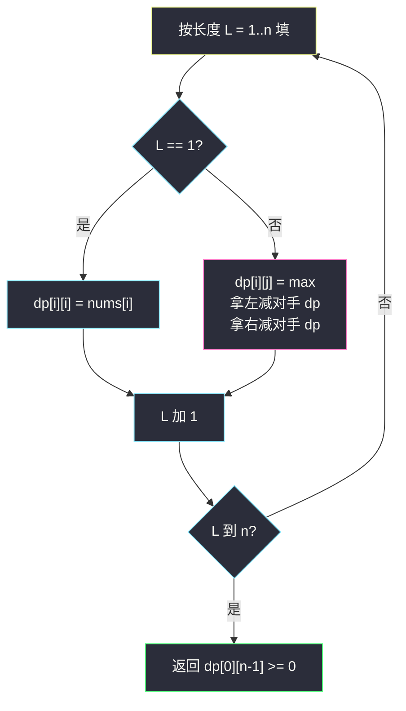
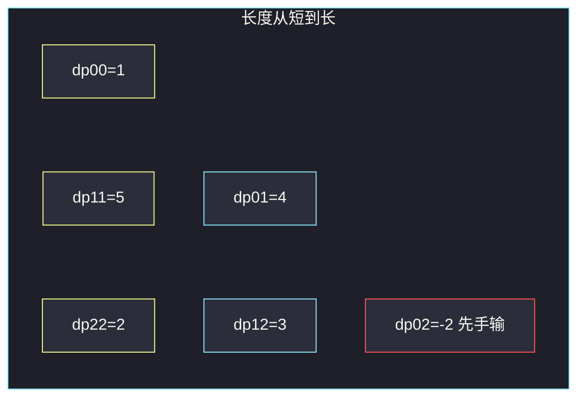

# 预测赢家（区间博弈 DP · 净胜分）

## 一、问题描述

一行 `n` 个分数 `nums`。两人轮流从**当前区间的左端或右端**取一个数加入自己的得分，取完为止。先手得分 **≥** 后手得分则先手赢（**平局算先手赢**）。双方最优，问先手能否赢。

> 🔗 LeetCode 486：https://leetcode.cn/problems/predict-the-winner/
>
> 数据范围：`1 ≤ n ≤ 20`，`0 ≤ nums[i] ≤ 10^7`。
>
> 📚 灵茶题单：**十四、博弈 DP**。标准区间博弈：`dp[i][j]` = 面对区间 `[i,j]` 时，当前玩家相对对手的最大净胜分。先手赢当且仅当 `dp[0][n-1] ≥ 0`。方法名注意大小写：`PredictTheWinner`。

和 [877. 石子游戏](https://leetcode.cn/problems/stone-game/) 规则几乎一样，但 #877 的 `n` 恒为偶数，先手总能通吃更优的奇偶下标，**恒真**；本题 `n` 可为奇数，**不是恒胜**。

**示例 1**

```
输入：nums = [1,5,2]
输出：false
解释：先手无论取 1 还是 2，后手都拿 5，先手再拿剩下那个。先手 3，后手 5。
```

**示例 2**

```
输入：nums = [1,5,233,7]
输出：true
解释：先手可以拿到 1 和 233（或等价地保证净胜分为正）。
```

**直观理解**

每次只动两端，剩下的仍是一段连续区间。局面由两个端点完全决定 → 区间 DP。关心的不是绝对得分，而是**自己比对手多多少**。

---

## 二、暴力解法

递归：当前玩家选左或选右，对手在剩下区间上拿到的「相对自己的净胜分」要反过来减掉。

```python
class Solution:
    def PredictTheWinner(self, nums: list[int]) -> bool:
        def dfs(i: int, j: int) -> int:
            if i == j:
                return nums[i]
            return max(nums[i] - dfs(i + 1, j), nums[j] - dfs(i, j - 1))

        return dfs(0, len(nums) - 1) >= 0
```

官方两例都能过。无记忆化时同一区间被重复计算，最坏指数级。`n ≤ 20` 碰巧能过，但区间只有 `O(n²)` 个，应该填表。

### 🔴 瓶颈在哪里

`dfs(i, j)` 只依赖更短的 `dfs(i+1, j)` 和 `dfs(i, j-1)`。按区间长度从短到长填，每个格子 `O(1)`。

---

## 三、优化探索（核心章节）

> 📚 灵茶 **十四、博弈 DP** 模板：两端取物，状态是区间；转移是「当前这次拿左/拿右，减去对手在剩余区间上的最优净胜分」。填表顺序：长度 1 → 2 → … → n。

### 3.1 状态

`dp[i][j]` = 面对 `nums[i..j]`、由**当前玩家**先取时，当前玩家得分减去对手得分的最大值（净胜分）。

- 长度 1：`dp[i][i] = nums[i]`（全拿走，对手 0）。
- 长度 ≥ 2：
  - 拿左：得到 `nums[i]`，对手在 `[i+1, j]` 上拿到净胜分 `dp[i+1][j]`（对手视角）。对自己来说要减掉，于是 `nums[i] - dp[i+1][j]`。
  - 拿右：`nums[j] - dp[i][j-1]`。
  - `dp[i][j] = max(两种)`。

答案：`dp[0][n-1] ≥ 0`。

为什么减对手的净胜分就对了？对手的净胜分 = 对手分 − 自己之后的分。自己总分 − 对手总分 = 本次拿的数 −（对手分 − 自己之后的分）= 本次 − 对手净胜分。

### 3.2 填表顺序

`dp[i][j]` 依赖下标跨度更小的两格，必须先算短区间。



### 3.3 另一种定义：先手绝对得分

也可以令 `f[i][j]` = 当前玩家从 `[i,j]` 能拿到的**绝对分数**。取左后，对手拿走 `f[i+1][j]`，自己再拿剩下 `sum(i+1..j) - f[i+1][j]`。先手赢 ⇔ `2 * f[0][n-1] ≥ total`。和净胜分差一个线性变换，选更短的那个写。

### 3.4 为什么 #877 恒胜、本题不是

#877 堆数必为偶数。先手可以始终抢「下标全偶数」或「全奇数」里和更大的那一组（每次跟着后手的选择，维持奇偶策略）。本题 `n` 可为奇数，这个奇偶分堆策略失效，必须老老实实 DP。反例就是官方 `[1,5,2]`。

### 3.5 一句话核心

> **dp[i][j] = max(拿左 − 对手净胜, 拿右 − 对手净胜)；短区间先填；答案看 dp 全域是否 ≥ 0。**

---

## 四、代码实现

### Python（主解：区间 DP）

```python
class Solution:
    def PredictTheWinner(self, nums: list[int]) -> bool:
        n = len(nums)
        # dp[i][j]: 面对 [i,j] 时，当前玩家相对对手的最大净胜分
        dp = [[0] * n for _ in range(n)]
        for i in range(n):
            dp[i][i] = nums[i]
        for length in range(2, n + 1):
            for i in range(n - length + 1):
                j = i + length - 1
                dp[i][j] = max(nums[i] - dp[i + 1][j], nums[j] - dp[i][j - 1])
        return dp[0][n - 1] >= 0
```

记忆化递归与填表完全等价，面试两种都会说：

```python
from functools import cache

class Solution:
    def PredictTheWinner(self, nums: list[int]) -> bool:
        @cache
        def dfs(i: int, j: int) -> int:
            # dfs(i, j): 面对 [i,j] 的最大净胜分
            if i == j:
                return nums[i]
            return max(nums[i] - dfs(i + 1, j), nums[j] - dfs(i, j - 1))

        return dfs(0, len(nums) - 1) >= 0
```

**变量含义**

| 写法 | 含义 |
|------|------|
| `length` 从 2 到 n | 保证 `dp[i+1][j]`、`dp[i][j-1]` 已算 |
| `nums[i] - dp[i+1][j]` | 拿左端后，减去对手在剩余区间的净胜 |
| `>= 0` | 平局也算先手赢 |

### Java（最优解）

```java
class Solution {
    public boolean PredictTheWinner(int[] nums) {
        int n = nums.length;
        int[][] dp = new int[n][n];
        for (int i = 0; i < n; i++) {
            dp[i][i] = nums[i];
        }
        for (int length = 2; length <= n; length++) {
            for (int i = 0; i + length - 1 < n; i++) {
                int j = i + length - 1;
                dp[i][j] = Math.max(nums[i] - dp[i + 1][j], nums[j] - dp[i][j - 1]);
            }
        }
        return dp[0][n - 1] >= 0;
    }
}
```

得分差最大约 `n * 10^7`，`int` 够用。

---

## 五、具体例子演示

### 5.1 官方示例 1：按长度填表

`nums = [1, 5, 2]`，`n = 3`。

**长度 1（对角线）**

| 格子 | 值 |
|------|-----|
| `dp[0][0]` | 1 |
| `dp[1][1]` | 5 |
| `dp[2][2]` | 2 |

**长度 2**

| 区间 | 拿左 | 拿右 | dp |
|------|------|------|-----|
| `[0,1]` = `[1,5]` | `1-5 = -4` | `5-1 = 4` | 4 |
| `[1,2]` = `[5,2]` | `5-2 = 3` | `2-5 = -3` | 3 |

**长度 3**

`[0,2] = [1,5,2]`：

- 拿左 1：对手面对 `[5,2]`，对手净胜 `dp[1][2] = 3` → `1-3 = -2`
- 拿右 2：对手面对 `[1,5]`，对手净胜 `dp[0][1] = 4` → `2-4 = -2`

`dp[0][2] = -2 < 0`，先手必败。对拍官方 `false`。



完整上三角（未填的下三角为 0，用不到）：

```
        j=0   j=1   j=2
i=0      1     4    -2
i=1            5     3
i=2                  2
```

### 5.2 官方示例 2：净胜为正

`nums = [1, 5, 233, 7]`。

| 长度 | 新算出的格子 |
|------|----------------|
| 1 | `1, 5, 233, 7` |
| 2 | `dp[0][1]=4`，`dp[1][2]=228`，`dp[2][3]=226` |
| 3 | `dp[0][2]=max(1-228, 233-4)=229`；`dp[1][3]=max(5-226, 7-228)=-221` |
| 4 | `dp[0][3]=max(1-(-221), 7-229)=max(222, -222)=222` |

`222 ≥ 0`，先手赢。对拍官方 `true`。

直观：先手拿左端 1 后，后手面对 `[5,233,7]` 净胜是 `-221`（后手必亏），先手净胜 `1-(-221)=222`。对应一种最优对局：先手拿 1，后手无论哪端都会被先手拿 233。

---

## 六、复杂度分析

| 方法 | 时间 | 空间 | 说明 |
|------|------|------|------|
| 无记忆化递归 | 指数 | `O(n)` 栈 | 不推荐 |
| 记忆化 / 区间 DP（主解） | `O(n²)` | `O(n²)` | 每个区间 O(1) 转移 |

`n ≤ 20` 两种都能过；写成 `O(n²)` 是为了和 #877、#1690 同一套模板。

---

## 七、对比总结

| 维度 | #877 石子游戏 | 本题 #486 |
|------|---------------|-----------|
| n | 必为偶数 | 可奇可偶 |
| 结论 | 先手恒 `true` | 看 `dp[0][n-1] ≥ 0` |
| 模板 | 可偷懒 | 必须区间博弈 DP |

| 维度 | 状压博弈 #464 | 本题 |
|------|---------------|------|
| 局面 | 已用数字集合 | 连续区间两端 |
| 状态数 | `2^n` | `n²` |

**易错点**

1. **平局判负**：题面先手得分 ≥ 后手即赢，是 `>= 0` 不是 `> 0`。
2. **转移加成对手分**：净胜分定义下是**减** `dp`，不是加。
3. **正着按 i、j 乱填**：必须先短后长，否则读到未计算的 0。
4. **套 #877 的「先手必胜」**：`[1,5,2]` 就是反例。
5. **Python 方法名**：提交用 `PredictTheWinner`（老题驼峰），不要写成 `predict_the_winner`。

---

## 八、举一反三

| 题目 | 关系 |
|------|------|
| [464. 我能赢吗](https://leetcode.cn/problems/can-i-win/) | 同批博弈；集合状压，见 `can-i-win.md` |
| [877. 石子游戏](https://leetcode.cn/problems/stone-game/) | 本题偶数 n 特化，答案恒 true |
| [1690. 石子游戏 VII](https://leetcode.cn/problems/stone-game-vii/) | 仍是两端，得分改成「拿走后剩余和」 |
| [1406. 石子游戏 III](https://leetcode.cn/problems/stone-game-iii/) | 只从一端取 1/2/3 堆 |
| [375. 猜数字大小 II](https://leetcode.cn/problems/guess-number-higher-or-lower-ii/) | 区间博弈，枚举分割点 |
| [312. 戳气球](https://leetcode.cn/problems/burst-balloons/) | 区间 DP，但不是零和取端 |

**思想迁移**

- 每次只改区间两端 → `dp[i][j]`，转移看左右两格；零和博弈用净胜分，符号自然翻转。
- 口诀：**「短区间先填；拿一端减去对手的 dp；看全域净胜是否非负。」**
