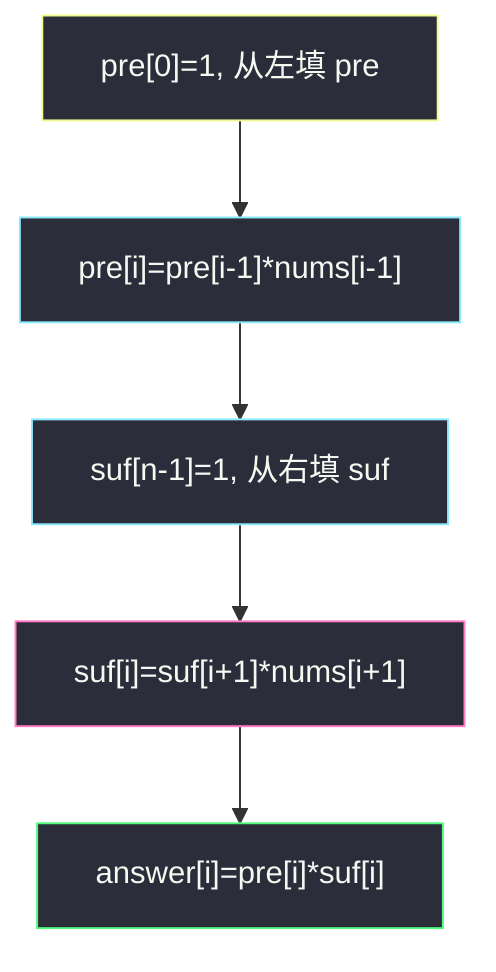
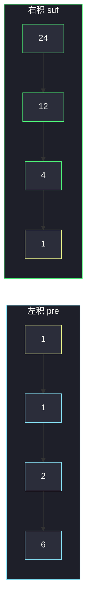

# 除自身以外数组的乘积（前后缀积）

## 一、问题描述

给定数组 `nums`，返回 `answer`，其中 `answer[i]` 等于 `nums` 里**除 `nums[i]` 以外**所有元素的乘积。**禁止使用除法**，时间 `O(n)`。进阶：额外空间 `O(1)`（输出数组不算）。

> 🔗 LeetCode 238：https://leetcode.cn/problems/product-of-array-except-self/
>
> 数据范围：`2 ≤ n ≤ 10^5`，`-30 ≤ nums[i] ≤ 30`，保证答案是 32 位整数。
>
> 📚 灵茶题单：**专题：前后缀分解**。`answer[i] = 左前缀积 × 右后缀积`。`nums` 可以含 0（一个或多个），前缀积会自然变成 0，不要用「总积再除」——既违题又会除零。

**示例 1**

```
输入：nums = [1,2,3,4]
输出：[24,12,8,6]
解释：24=2×3×4，12=1×3×4，8=1×2×4，6=1×2×3
```

**示例 2**

```
输入：nums = [-1,1,0,-3,3]
输出：[0,0,9,0,0]
解释：只有下标 2 的两侧都不含 0，乘积为 (-1)×1×(-3)×3=9；其余位置乘积里都有 0。
```

**直观理解**

每个位置要「除自己以外的积」，等价于把数组在 `i` 切开，左边所有数相乘、右边所有数相乘，再乘到一起。左右两段都不含 `nums[i]`，所以不需要除法。

---

## 二、暴力解法

对每个 `i` 再乘一遍其余位置。

```python
class Solution:
    def productExceptSelf(self, nums: list[int]) -> list[int]:
        n = len(nums)
        ans = [1] * n
        for i in range(n):
            for j in range(n):
                if i != j:
                    ans[i] *= nums[j]
        return ans
```

两例都能对拍。`n=10^5` 时 `O(n²)` 超时。用总积除以 `nums[i]` 是 `O(n)`，但题面禁止除法，且出现 0 时除零。

### 🔴 瓶颈在哪里

`i` 与 `i+1` 的「除自己以外」只差两个因子：`i` 退出、`i+1` 进入。把「左边所有积」和「右边所有积」分别预处理，每个 `i` 两次查表相乘即可。

---

## 三、优化探索（核心章节）

> 📚 本题在灵茶题单中属于 **专题：前后缀分解**。和中心下标那题一样切成「左段 / 自己 / 右段」，把求和改成求积。空段的积定义为 `1`（乘法单位元），对应空段的和定义为 `0`。

### 3.1 两个数组

定义（空积为 1）：

- `pre[i] = nums[0] × … × nums[i-1]`，即严格左侧积。`pre[0] = 1`
- `suf[i] = nums[i+1] × … × nums[n-1]`，即严格右侧积。`suf[n-1] = 1`

则 `answer[i] = pre[i] × suf[i]`。

递推：

```
pre[0] = 1
pre[i] = pre[i-1] * nums[i-1]    (i 从 1 到 n-1)

suf[n-1] = 1
suf[i] = suf[i+1] * nums[i+1]    (i 从 n-2 到 0)
```



### 3.2 空间压到输出数组

进阶要求额外 `O(1)`（不算 `answer`）。把 `pre` 直接写进 `answer`，再从右往左滚一个变量 `suf`：

1. 从左填：`answer[i]` ← 严格左积（此时还没乘右）。
2. `suf = 1`，`i` 从 `n-1` 降到 `0`：`answer[i] *= suf`，然后 `suf *= nums[i]`。

第二步里 `suf` 是「已经看过的严格右侧积」，乘完再把当前 `nums[i]` 吃进去，供更左的位置使用。

### 3.3 零怎么被自动处理

- **一个 0**：`pre` 在 0 的右侧全是 0，`suf` 在 0 的左侧全是 0。只有 0 所在下标：左积不含 0、右积不含 0，得到「其余全积」。
- **两个及以上 0**：任意 `i` 的左或右至少还有一个 0，`answer` 全 0。

不需要 `if nums[i]==0` 分支。

### 3.4 一句话核心

> **answer[i] = 严格左积 × 严格右积；先把左积写入答案，再从右滚 suf 乘上去。**

---

## 四、代码实现

### Python（主解：O(1) 额外空间）

```python
class Solution:
    def productExceptSelf(self, nums: list[int]) -> list[int]:
        n = len(nums)
        ans = [1] * n
        for i in range(1, n):
            ans[i] = ans[i - 1] * nums[i - 1]
        suf = 1
        for i in range(n - 1, -1, -1):
            ans[i] *= suf
            suf *= nums[i]
        return ans
```

### Java（最优解）

```java
class Solution {
    public int[] productExceptSelf(int[] nums) {
        int n = nums.length;
        int[] ans = new int[n];
        ans[0] = 1;
        for (int i = 1; i < n; i++) {
            ans[i] = ans[i - 1] * nums[i - 1];
        }
        int suf = 1;
        for (int i = n - 1; i >= 0; i--) {
            ans[i] *= suf;
            suf *= nums[i];
        }
        return ans;
    }
}
```

**变量含义**

| 写法 | 含义 |
|------|------|
| `ans[i]`（第一轮后） | `nums[0..i-1]` 的积 |
| `suf` | 严格右侧已扫过的积，初值 1 |
| `ans[i] *= suf` | 左积 × 右积 |
| `suf *= nums[i]` | 当前位纳入后缀，供左边用 |

第一轮 `ans[0]` 保持 1，不要乘 `nums[0]`。

---

## 五、具体例子演示

### 5.1 官方示例 1：nums = [1,2,3,4]

分割点画在每个 `i`，空段积为 1。

**左前缀积 `pre`（不含自己）**

| i | 左段 | pre[i] | 计算 |
|---|------|--------|------|
| 0 | （空） | 1 | 单位元 |
| 1 | [1] | 1 | 1×1 |
| 2 | [1,2] | 2 | 1×2 |
| 3 | [1,2,3] | 6 | 2×3 |

**右后缀积 `suf`（不含自己）**

| i | 右段 | suf[i] | 计算 |
|---|------|--------|------|
| 3 | （空） | 1 | 单位元 |
| 2 | [4] | 4 | 1×4 |
| 1 | [3,4] | 12 | 4×3 |
| 0 | [2,3,4] | 24 | 12×2 |

**相乘**

| i | pre | suf | answer |
|---|-----|-----|--------|
| 0 | 1 | 24 | 24 |
| 1 | 1 | 12 | 12 |
| 2 | 2 | 4 | 8 |
| 3 | 6 | 1 | 6 |

对拍 `[24,12,8,6]`。



黄是空段单位元 1；同一列 `pre[i]×suf[i]` 就是答案。

**滚动后缀（空间优化）逐步**

第一轮后 `ans = [1,1,2,6]`。`suf=1`：

| i | 乘之前 ans[i] | suf | 乘完 | 新 suf |
|---|---------------|-----|------|--------|
| 3 | 6 | 1 | 6 | 1×4=4 |
| 2 | 2 | 4 | 8 | 4×3=12 |
| 1 | 1 | 12 | 12 | 12×2=24 |
| 0 | 1 | 24 | 24 | 24×1=24 |

同一结果。

### 5.2 官方示例 2：nums = [-1,1,0,-3,3]

| i | 左段积 pre | 右段积 suf | 乘积 |
|---|-----------|-----------|------|
| 0 | 1 | 1×0×(-3)×3=0 | 0 |
| 1 | -1 | 0×(-3)×3=0 | 0 |
| 2 | (-1)×1=-1 | (-3)×3=-9 | **9** |
| 3 | (-1)×1×0=0 | 3 | 0 |
| 4 | (-1)×1×0×(-3)=0 | 1 | 0 |

对拍 `[0,0,9,0,0]`。唯一不含 0 的左右两侧，出现在 0 自己那一格。

若有两个 0，例如 `[1,0,2,0]`：每个 `i` 的另一侧至少还有一个 0，答案 `[0,0,0,0]`。

---

## 六、复杂度分析

| 方法 | 时间 | 空间 | 说明 |
|------|------|------|------|
| 双重循环 | `O(n²)` | `O(1)` 额外 | 超时 |
| 总积再除 | `O(n)` | `O(1)` | 禁止，且遇 0 炸 |
| pre + suf 数组 | `O(n)` | `O(n)` | 思路完整 |
| 滚 suf 写入 ans（主解） | `O(n)` | `O(1)` 额外 | 输出数组不算 |

两遍扫描，每元素常数次乘法。题面保证答案在 32 位 int 内，不用 64 位。

---

## 七、对比总结

| 维度 | 除法 | 双数组 | 滚后缀 |
|------|------|--------|--------|
| 零 | 除零 / 还要数 0 | 自动 | 自动 |
| 额外空间 | `O(1)` | `O(n)` | `O(1)` |
| 题面 | 违规 | 过 | 进阶 |

**易错点**

1. **用除法**：直接违题；一个 0 还要特判，两个 0 更烦。
2. **`pre[i]` 含了 `nums[i]`**：左右都「严格不含自己」，空侧是 1 不是 `nums[i]`。
3. **第二轮先 `suf *= nums[i]` 再乘进 ans**：当前位被乘进去，等于没除掉自己。
4. **`ans` 初始成 `nums` 的拷贝**：左积应从 1 长出来，不是从 `nums[0]`。
5. **忘记负数**：积的符号由负数个数决定，算法不用单独管符号。

---

## 八、举一反三

| 题目 | 关系 |
|------|------|
| [724. 寻找数组的中心下标](https://leetcode.cn/problems/find-pivot-index/)（`find-pivot-index.md`） | 同一分割；和 vs 积，空段 0 vs 1 |
| [2270. 分割数组的方案数](https://leetcode.cn/problems/number-of-ways-to-split-array/)（`number-of-ways-to-split-array.md`） | 只问左段 vs 右段，不含「自己」这一格 |
| [42. 接雨水](https://leetcode.cn/problems/trapping-rain-water/) | 每个位置取左 max、右 max |
| [135. 分发糖果](https://leetcode.cn/problems/candy/) | 左右各扫一遍再合并 |
| [2574. 左右元素和的差值](https://leetcode.cn/problems/left-and-right-sum-differences/) | 和的版本，公式同构 |

**思想迁移**

- 「不含第 i 个的聚合」= 严格前缀 × 严格后缀；空前缀用运算单位元。
- 口诀：**「左积写入答案，右积倒着滚；空段乘 1，零不用特判。」**
