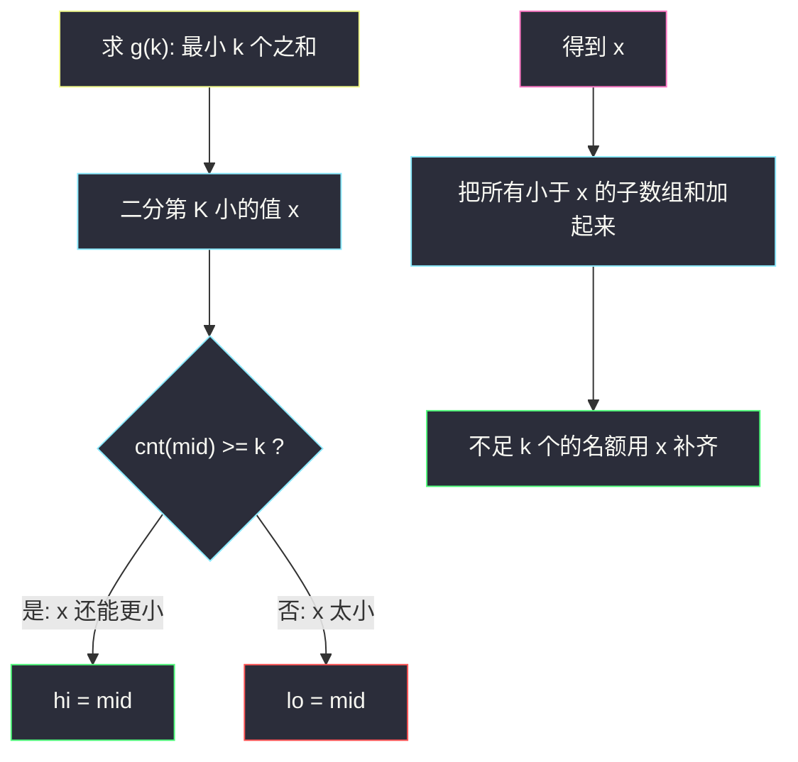

# 子数组和排序后的区间和（枚举 + 二分第 K 小）

## 一、问题描述

给你一个正整数数组 `nums`。求出它的所有**非空连续子数组**的和，把这些和放进新数组后**升序排序**。求这个新数组里下标从 `left` 到 `right` 的元素之和（**下标从 1 开始**），结果对 `10^9+7` 取模。

> 🔗 LeetCode 1508：https://leetcode.cn/problems/range-sum-of-sorted-subarray-sums/
>
> 数据范围：`1 <= nums.length <= 1000`，`1 <= nums[i] <= 100`，`1 <= left <= right <= n·(n+1)/2`。

**示例 1**

```
输入：nums = [1,2,3,4], n = 4, left = 1, right = 5
输出：13
解释：全部子数组和：
  [1]=1, [1,2]=3, [1,2,3]=6, [1,2,3,4]=10
  [2]=2, [2,3]=5, [2,3,4]=9
  [3]=3, [3,4]=7
  [4]=4
排序后：1,2,3,3,4,5,6,7,9,10
下标 1..5（1-based）之和：1+2+3+3+4 = 13
```

**示例 2**

```
输入：nums = [1,2,3,4], n = 4, left = 3, right = 4
输出：6
解释：排序后第 3、4 个数都是 3，和为 6。
```

**示例 3**

```
输入：nums = [1,2,3,4], n = 4, left = 1, right = 10
输出：50
解释：全部 10 个和加起来 50。
```

**直观理解**

一共有 `n(n+1)/2` 个连续子数组。`n ≤ 1000` 时最多约 `5·10^5` 个和，全部算出来排序再取一段，完全在时限内。`left`、`right` 是排序后数组的 **1-based** 下标，写成 Python 切片就是 `sums[left-1:right]`。进阶目标是：不真的列出全部和，也能求「最小的 k 个子数组和的总和」。

---

## 二、暴力解法

双重循环枚举 `L、R`，内部再循环求和——三重循环 `O(n³)`。

```python
class Solution:
    def rangeSum(self, nums: List[int], n: int, left: int, right: int) -> int:
        sums = []
        for i in range(n):
            for j in range(i, n):
                sums.append(sum(nums[i:j + 1]))
        sums.sort()
        MOD = 10**9 + 7
        return sum(sums[left - 1:right]) % MOD
```

### 复杂度

- **时间**：`O(n³ + m log m)`，`m = n(n+1)/2`。内层 `sum(切片)` 又扫一遍。
- **空间**：`O(n²)` 存全部子数组和。

`n = 1000` 时 `n³ = 10^9`，会超时。瓶颈是**同一段区间被反复求和**。固定左端、向右累加，内层变成 `O(1)`，总枚举降到 `O(n²)`。

---

## 三、优化探索（核心章节）

> 📚 本题在灵茶题单中属于 **04-二分查找 · §2.6 第 K 小/大**。主解用枚举即可通过；本章把「第 K 小子数组和」的二分讲清楚，对应题单这一节。

本文若写二分，**仍用开区间 `(left, right)`**（与同批峰值、可移除字符同一套）。注意题目参数也叫 `left`/`right`，下面把二分的两端改叫 `lo`/`hi`，避免重名。

### 3.1 主解：`O(n²)` 枚举 + 排序

固定左端 `i`，`s = 0`，`j` 从 `i` 走到 `n-1`，`s += nums[j]`，每次把 `s` 推进数组。共 `m ≈ n²/2` 个数，排序 `O(m log m) = O(n² log n)`。`n = 1000` 约 `5·10^5 · 20`，轻松通过。

这已经是本题该交的版本。第三章剩下的篇幅给「不排序、二分第 K 小」。

### 3.2 转化：区间和 = 两个前缀「最小 k 个之和」的差

令 `S` 为排序后的子数组和（0-based）。要的是 `S[left-1] + … + S[right-1]`。

定义 `g(k)` = 最小的 k 个子数组和的总和（`g(0) = 0`）。则答案为：

```
(g(right) - g(left - 1)) mod 1_000_000_007
```

于是问题变成：给定 k，求 `g(k)`。

### 3.3 check 的单调性：二分第 K 小的值 x

子数组和的值域是 `[min(nums), sum(nums)]`（正整数数组）。令 `cnt(x)` = 有多少个连续子数组的和 `≤ x`。

- `x` 增大，`cnt(x)` 不减：**单调**。
- 第 k 小的子数组和 = 最小的 `x` 使得 `cnt(x) ≥ k`。

开区间二分这个 `x`：`lo, hi = min(nums)-1, sum(nums)`，`check(mid) = (cnt(mid) ≥ k)` 为真则 `hi = mid`（还能更小），否则 `lo = mid`。结束时 `hi` 就是第 k 小的值。



`cnt(x)` 怎么算：先做前缀和 `pre`（严格递增，因为 `nums[i] ≥ 1`）。对每个右端 `r`，满足 `pre[r] - pre[l] ≤ x` 的左端 `l` 构成一段前缀。双指针：`r` 增大时 `l` 只增不减，`O(n)` 数完所有 `≤ x` 的子数组。顺手还能累加这些和（用前缀的前缀）。

### 3.4 从「第 K 小的值」到「最小 k 个的总和」

设第 k 小是 `x`，有 `c` 个子数组和 **严格小于** `x`，它们的总和是 `tot`。排序后前 k 个里：这 `c` 个小于 `x` 的，再加上 `k - c` 个等于 `x` 的（可能有并列）。

```
g(k) = tot + x * (k - c)
```

`c` 与 `tot` 同样用双指针在前缀和上扫「和 `< x`」。整份 `g(k)` 是 `O(n log SUM)`。求两次 `g` 做差即答案。`n = 1000` 时这套也能过，但实现明显更长，**主解仍用枚举**。

### 3.5 一句话核心

> **n≤1000：枚举全部子数组和再排序，切 1-based 的 `[left, right]`。进阶：答案 = g(right)-g(left-1)，g(k) 靠「二分第 K 小 x + 把小于 x 的加起来、用 x 补足 k 个」；check 是 cnt(x) 对 x 单调。**

---

## 四、代码实现

### Python（主解：枚举全部子数组和）

```python
class Solution:
    def rangeSum(self, nums: List[int], n: int, left: int, right: int) -> int:
        sums = []
        for i in range(n):
            s = 0
            for j in range(i, n):
                s += nums[j]
                sums.append(s)
        sums.sort()
        MOD = 10**9 + 7
        return sum(sums[left - 1:right]) % MOD
```

**变量含义**

| 变量 | 含义 |
|------|------|
| `i`, `j` | 子数组 `nums[i..j]` 的左右端 |
| `s` | 当前左端固定时，右端扩张得到的区间和 |
| `sums` | 全部 `n(n+1)/2` 个子数组和，随后升序 |
| `left`, `right` | 题目给定的 **1-based** 闭区间端点 |

切片 `sums[left-1:right]` 正好覆盖 1-based 的 `left..right`。Python `int` 无溢出；最后 `% MOD` 即可。`sum` 最大约 `5·10^5 * (100*1000) = 5·10^{10}`，先求和再取模安全。

### Java（最优解同款枚举）

```java
class Solution {
    public int rangeSum(int[] nums, int n, int left, int right) {
        int m = n * (n + 1) / 2;
        int[] sums = new int[m];
        int p = 0;
        for (int i = 0; i < n; i++) {
            int s = 0;
            for (int j = i; j < n; j++) {
                s += nums[j];
                sums[p++] = s;
            }
        }
        Arrays.sort(sums);
        long ans = 0;
        int MOD = 1_000_000_007;
        for (int i = left - 1; i < right; i++) {
            ans = (ans + sums[i]) % MOD;
        }
        return (int) ans;
    }
}
```

---

## 五、具体例子演示

以示例 1：`nums = [1,2,3,4]`，`left = 1`，`right = 5`。跟踪枚举（左端 `i` 固定，`s` 向右累加）：

| i | j | 纳入 | s | 写入 sums |
|---|---|------|---|-----------|
| 0 | 0 | 1 | 1 | 1 |
| 0 | 1 | 2 | 3 | 3 |
| 0 | 2 | 3 | 6 | 6 |
| 0 | 3 | 4 | 10 | 10 |
| 1 | 1 | 2 | 2 | 2 |
| 1 | 2 | 3 | 5 | 5 |
| 1 | 3 | 4 | 9 | 9 |
| 2 | 2 | 3 | 3 | 3 |
| 2 | 3 | 4 | 7 | 7 |
| 3 | 3 | 4 | 4 | 4 |

排序后 `1,2,3,3,4,5,6,7,9,10`。`sums[0:5] = 1,2,3,3,4`，和 13 ✓。

**二分第 K 小（理解用，不作为主解）**：求 `g(5)`，即最小 5 个之和。值域 `lo=0`，`hi=10`（全体总和）。以 `k=5` 为例：

| 轮 | lo | hi | mid | cnt(mid) | cnt≥5？ | 新区间 |
|----|----|----|-----|----------|---------|--------|
| 1 | 0 | 10 | 5 | 和≤5 的有 1,2,3,3,4,5 共 6 个 | 是 | `(0, 5)` |
| 2 | 0 | 5 | 2 | 1,2 共 2 个 | 否 | `(2, 5)` |
| 3 | 2 | 5 | 3 | 1,2,3,3 共 4 个 | 否 | `(3, 5)` |
| 4 | 3 | 5 | 4 | 1,2,3,3,4 共 5 个 | 是 | `(3, 4)` |
| 结束 | 3 | 4 | — | — | `lo+1==hi` | 第 5 小 = 4 |

小于 4 的和：`1+2+3+3=9` 共 4 个，再补 1 个 `4`，`g(5)=13`。`g(0)=0`，`g(5)-g(0)=13`，与切片一致 ✓。


---

## 六、复杂度分析

| 方法 | 时间 | 空间 | 说明 |
|------|------|------|------|
| 三重循环求和 | `O(n³)` | `O(n²)` | `n=1000` 超时 |
| 枚举 + 排序（主解） | `O(n² log n)` | `O(n²)` | 能过，代码短 |
| 二分第 K 小 + 前缀双指针 | `O(n log SUM)` 每次 `g` | `O(n)` | 少存 `n²` 个和，实现长 |

`SUM ≤ 100·n ≤ 10^5`，`log SUM` 很小。主解空间 `O(n²)` 在 `n=1000` 也可接受。

---

## 七、对比总结

| 维度 | 枚举排序 | 二分 g(k) |
|------|----------|-----------|
| 代码量 | 十余行 | 要写 cnt / 小于 x 的和 |
| 与题单 §2.6 | 没练到二分值域 | 标准「第 K 小 + 前缀」 |
| 1-based | 切片 `left-1:right` | `g(right)-g(left-1)` |

**易错点**

1. **`left`/`right` 当成 0-based**：少加或多加一个和。切片左闭右开：`[left-1, right)`。
2. **内层用 `sum(nums[i:j+1])`**：又变回 `O(n³)`。
3. **Java `int` 累加答案**：先 `long` 再 `% 1_000_000_007`。单个子数组和最大 `10^5`，放进 `int` 可以；**区间和**要 `long`。
4. **二分 check 用 `>` 还是 `≥`**：第 k 小是「`cnt(x) ≥ k` 的最小 x」。开区间里 check 为真收 `hi`。
5. **`g(k)` 漏掉并列**：只加 `< x` 的和、忘了用 `x` 补 `k-c` 个，少算并列段。
6. **取模负值**：若先减再模，Java 要 `((a - b) % MOD + MOD) % MOD`；Python 的 `%` 对正模数已得到非负。

**模板（枚举连续子数组和）**

```python
sums = []
for i in range(n):
    s = 0
    for j in range(i, n):
        s += nums[j]
        sums.append(s)
sums.sort()
return sum(sums[left - 1:right]) % (10**9 + 7)
```

---

## 八、举一反三

| 题目 | 关系 |
|------|------|
| [378. 有序矩阵中第 K 小的元素](https://leetcode.cn/problems/kth-smallest-element-in-a-sorted-matrix/) | §2.6 原型：二分值域 + 计数 |
| [668. 乘法表中第 k 小的数](https://leetcode.cn/problems/kth-smallest-number-in-multiplication-table/) | 同样 `cnt(x) ≥ k` 找最小 x |
| [719. 找出第 K 小的数对距离](https://leetcode.cn/problems/find-k-th-smallest-pair-distance/) | 有序数组上二分距离，双指针计数 |
| [1439. 有序矩阵中的第 k 个最小数组和](https://leetcode.cn/problems/find-the-kth-smallest-sum-of-a-matrix-with-sorted-rows/) | 多路第 K 小，比本题更难 |
| [209. 长度最小的子数组](https://leetcode.cn/problems/minimum-size-subarray-sum/) | 正数数组 + 前缀 + 双指针 / 二分长度 |
| [560. 和为 K 的子数组](https://leetcode.cn/problems/subarray-sum-equals-k/) | 子数组和，但要的是计数不是排序后区间和 |

**思想迁移**

- 看到「所有子数组和排序后的第 k 个 / 一段」先看 n：`n≤1000` 就枚举；n 更大再上二分值域。
- `g(k) - g(left-1)` 把「一段名次的和」变成两次「最小 k 个之和」，是序统计里常用的差。
- 口诀：**「正数前缀能双指针数个数；第 K 小二分 x，小于 x 的加起来再用 x 补齐。」**
