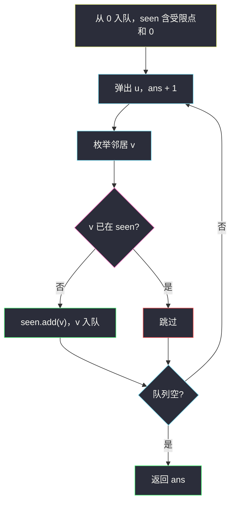
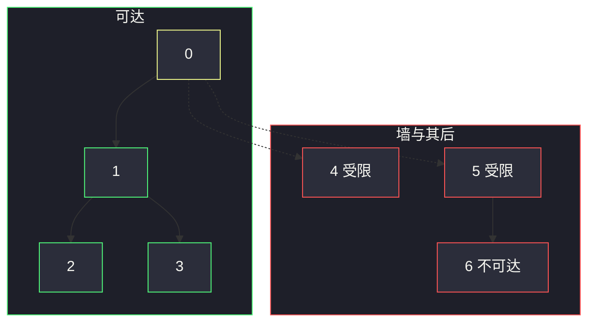

# 受限条件下可到达节点的数目（图遍历 · 从 0 避开受限点）

## 一、问题描述

有一棵 `n` 个节点的无向树，节点编号 `0 .. n-1`，用 `n-1` 条边给出。另有一个数组 `restricted`，表示**受限节点**。你从节点 `0` 出发（`0` 一定不是受限点），不能走进任何受限节点。求能够到达的节点个数（含 `0`）。

> 🔗 LeetCode 2368：https://leetcode.cn/problems/reachable-nodes-with-restrictions/
>
> 数据范围：`2 <= n <= 10^5`，`edges.length == n-1`，`1 <= restricted.length < n`，受限点互不相同且不为 0。
>
> 📚 灵茶题单：**图论 · §3.1 遍历**（1477 分）。

**示例 1**

```
输入：n = 7, edges = [[0,1],[1,2],[3,1],[4,0],[0,5],[5,6]], restricted = [4,5]
输出：4
图形：
      0
    / | \
   1  4  5
  / \     \
 2   3     6
4、5 进不去，6 被 5 挡住。可达 {0,1,2,3}。
```

**示例 2**

```
输入：n = 7, edges = [[0,1],[0,2],[0,5],[0,4],[3,2],[6,5]], restricted = [4,2,1]
输出：3
图形：
      0
   / | | \
  1  2 4  5
     |     \
     3      6
1、2、4 进不去，3 被 2 挡住。可达 {0,5,6}。
```

**直观理解**

树去掉受限点（以及它们后面整块连通块）之后，从 0 还能走到的那一片，大小就是答案。图遍历从 0 出发，遇到受限点当墙，不入队、不递归。这就是 §3.1：遍历时把「不能走的点」从邻接里跳过。

---

## 二、暴力解法

每次看邻居时，在 `restricted` **数组**里线性扫描是否受限：

```python
class Solution:
    def reachableNodes(self, n: int, edges: list[list[int]], restricted: list[int]) -> int:
        g = [[] for _ in range(n)]
        for a, b in edges:
            g[a].append(b)
            g[b].append(a)

        ans = 0
        seen = {0}

        def dfs(u: int, fa: int) -> None:
            nonlocal ans
            ans += 1
            for v in g[u]:
                if v == fa:
                    continue
                if v in restricted:  # 列表上的 in，O(len(restricted))
                    continue
                if v not in seen:
                    seen.add(v)
                    dfs(v, u)

        dfs(0, -1)
        return ans
```

树没有额外环，`fa` 已经能防回头；`seen` 其实可省。真正的问题是 `v in restricted`：列表判断是线性的。

### 复杂度

- **时间**：每个点、每条边都会看一次，但每次判断受限要 `O(|restricted|)`，合计 `O(n · |restricted|)`。`n` 与 `|restricted|` 都可达 `1e5`，平方级超时。
- **空间**：邻接表 `O(n)`，递归栈最坏 `O(n)`。

### 🔴 瓶颈在哪里

`n = 1e5` 必须 `O(n)`。受限判断必须 `O(1)`：先把 `restricted` 转成 `set`。Python 链状树还会把递归打穿，遍历本身更稳妥的是 BFS / 显式栈。

---

## 三、优化探索（核心章节）

> 📚 本题在灵茶题单中属于 **图论 · §3.1 遍历**。无向树先建邻接表，从 0 出发 BFS/DFS，碰到受限点不进入；访问集合保证每个点只走一次。

### 3.1 建图 + 受限集合

边是无向的，邻接表双向加边。`restricted` 转 `set` 后，`v in ban` 平均 `O(1)`。

一个干净技巧：把受限点**预先放进 `seen`**，之后它们看起来就像「已经访问过」，邻居循环里自然不会走进去，也不用单独写 `if v in ban`。`0` 不在受限里，从 `seen = set(restricted)` 再 `add(0)` 即可。

### 3.2 从 0 出发，墙就是受限点



受限点像一堵墙：它们身后的整块连通分量（示例 1 的 6、示例 2 的 3）永远不会入队。树是连通的，去掉墙之后，0 所在连通块的大小就是答案。

### 3.3 为什么必须线性

`n ≤ 1e5`，边数 `n-1`，标准图遍历 `O(n + m) = O(n)`。任何「对每个节点扫一遍 restricted 数组」都会炸。不要用并查集把受限点当断边再数连通块——能做，但常数和代码量都不如直接遍历。

### 3.4 一句话核心

> **邻接表 + restricted 转 set，从 0 做 BFS/DFS；受限点预先视为已访问，遇到就不进入。**

---

## 四、代码实现

### Python（主解：BFS，受限点预加入 seen）

```python
class Solution:
    def reachableNodes(self, n: int, edges: list[list[int]], restricted: list[int]) -> int:
        g = [[] for _ in range(n)]
        for a, b in edges:
            g[a].append(b)
            g[b].append(a)

        seen = set(restricted)
        seen.add(0)
        q = deque([0])
        ans = 0
        while q:
            u = q.popleft()
            ans += 1
            for v in g[u]:
                if v not in seen:
                    seen.add(v)
                    q.append(v)
        return ans
```

**变量含义**

| 变量 | 含义 |
|------|------|
| `g` | 邻接表，无向树 |
| `seen` | 已访问 ∪ 受限（墙） |
| `q` | BFS 队列，只含可达且非受限节点 |
| `ans` | 弹出次数 = 可达节点数 |

入队时标记 `seen`，避免同一点进队两次。树无环，等价于「不走父节点」，但预置受限点后用 `seen` 更统一。

DFS 递归版同理，把 `q` 换成递归；`n = 1e5` 的链在 Python 默认递归深度下会爆栈，所以主解用 BFS。

### Java（可选）

```java
class Solution {
    public int reachableNodes(int n, int[][] edges, int[] restricted) {
        List<Integer>[] g = new ArrayList[n];
        Arrays.setAll(g, i -> new ArrayList<>());
        for (int[] e : edges) {
            g[e[0]].add(e[1]);
            g[e[1]].add(e[0]);
        }
        boolean[] seen = new boolean[n];
        for (int x : restricted) seen[x] = true;
        seen[0] = true;
        ArrayDeque<Integer> q = new ArrayDeque<>();
        q.add(0);
        int ans = 0;
        while (!q.isEmpty()) {
            int u = q.poll();
            ans++;
            for (int v : g[u]) {
                if (!seen[v]) {
                    seen[v] = true;
                    q.add(v);
                }
            }
        }
        return ans;
    }
}
```

---

## 五、具体例子演示

以示例 1 跟踪 BFS。`ban = {4, 5}`，开始 `seen = {0, 4, 5}`，队列 `[0]`。

```
      0
    / | \
   1  4  5
  / \     \
 2   3     6
```

| 步 | 弹出 | ans | 邻居与判定 | 入队 | 队列 | seen |
|----|------|-----|------------|------|------|------|
| 开始 | — | 0 | — | 0 | `[0]` | `{0,4,5}` |
| 1 | 0 | 1 | 1 未访问 → 入队；4、5 已在 seen，跳过 | 1 | `[1]` | `{0,1,4,5}` |
| 2 | 1 | 2 | 0 已访问；2、3 入队 | 2, 3 | `[2, 3]` | `{0,1,2,3,4,5}` |
| 3 | 2 | 3 | 1 已访问 | — | `[3]` | 不变 |
| 4 | 3 | 4 | 1 已访问 | — | `[]` | 不变 |

队列空，答案 4。节点 6 从未出现：它只和 5 相连，而 5 一开始就在 `seen` 里，没有人把它入队。

示例 2：`seen` 初始 `{0,1,2,4}`，从 0 弹出后邻居 1、2、4 全跳过，只入队 5；5 再入队 6。访问集合变化：

| 步 | 弹出 | 新标记 | seen | ans |
|----|------|--------|------|-----|
| 1 | 0 | 5 | `{0,1,2,4,5}` | 1 |
| 2 | 5 | 6 | `{0,1,2,4,5,6}` | 2 |
| 3 | 6 | — | 同上 | 3 |



---

## 六、复杂度分析

| 方法 | 时间 | 空间 | 说明 |
|------|------|------|------|
| 列表判断受限 + DFS | `O(n · \|R\|)` | `O(n)` | `n、\|R\|` 达 `1e5` 超时；链上还可能爆栈 |
| BFS + set/布尔数组（主解） | `O(n)` | `O(n)` 邻接表 + 队列 | 每点每边常数次；Python 安全 |

---

## 七、对比总结

| 维度 | 暴力 `v in 列表` | 预处理 set + BFS |
|------|-------------------|------------------|
| 受限判断 | 线性扫描 | `O(1)` |
| 连通块 | 仍是从 0 遍历 | 同，只是判断更快 |
| Python 深度 | 链上 DFS 危险 | 队列不吃递归栈 |

**易错点**

1. **忘了建无向边**：只 `g[a].append(b)` 会丢半边，从 0 走不出去。
2. **受限仍用列表 `in`**：表面上对，`n = 1e5` 必 TLE。
3. **走进受限点再回头**：必须**进入前**拦截；进去再判断，会把受限点本身算进 `ans`。
4. **没标记就入队**：同一邻居被多次加入，复杂度退化（树还好，写成图模板会炸）。
5. 不要把 `0` 放进 `restricted` 的处理里删掉起点；题目保证 0 不受限，`find` 式的空答案不会出现。

---

## 八、举一反三

| 题目 | 关系 |
|------|------|
| [1971. 寻找图中是否存在路径](https://leetcode.cn/problems/find-if-path-exists-in-graph/) | 同款 §3.1：建无向图，从起点 BFS 直到终点 |
| [841. 钥匙和房间](https://leetcode.cn/problems/keys-and-rooms/) | 从 0 遍历，邻接由「钥匙」给出 |
| [547. 省份数量](https://leetcode.cn/problems/number-of-provinces/) | 多次遍历数连通块；本题只数 0 所在块 |
| [2192. 有向无环图中一个节点的所有祖先](https://leetcode.cn/problems/all-ancestors-of-a-node-in-a-directed-acyclic-graph/) | 遍历方向反过来：从入边推祖先 |
| [2316. 统计无向图中无法互相到达点对数](https://leetcode.cn/problems/count-unreachable-pairs-of-nodes-in-an-undirected-graph/) | 先遍历得到各连通块大小，再组合计数 |

同目录树题：[1026. 节点与其祖先之间的最大差值](https://leetcode.cn/problems/maximum-difference-between-node-and-ancestor/) 在二叉树上自顶向下传 min/max；本题把树看成一般图，遍历时用 `seen` 代替「父亲参数」。

**思想迁移**

- 图/树遍历：先邻接表，再从指定源点走，障碍预先丢进访问集合。
- 口诀：**「restricted 进 set；从 0 出发，墙上的点当已访问，队列弹出多少就是答案。」**
