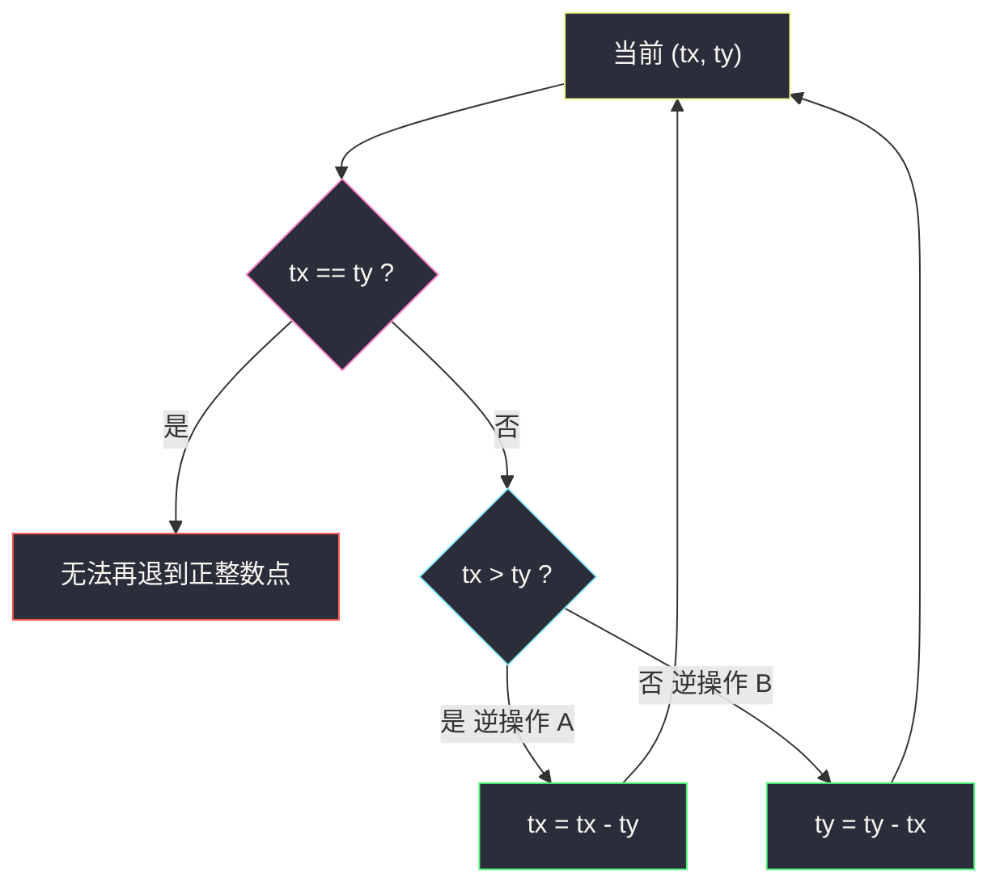
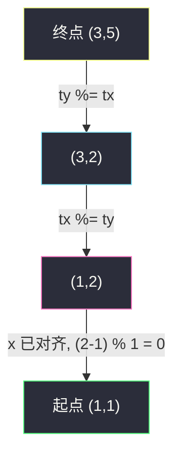

# 到达终点（逆向思维 · 大减小 / 取模）

## 一、问题描述

给定四个正整数 `sx, sy, tx, ty`。从点 `(sx, sy)` 出发，每次可以把当前点 `(x, y)` 变成 `(x + y, y)` 或 `(x, x + y)`。问能否到达 `(tx, ty)`。

> 🔗 LeetCode 780：https://leetcode.cn/problems/reaching-points/
>
> 数据范围：`1 ≤ sx, sy, tx, ty ≤ 10^9`。坐标是正整数，没有 0，也没有负数。
>
> 📚 灵茶题单：**§5.4 逆向思维**（1897 分）。正向每次坐标变大、分支指数爆炸；逆向时较大维减去较小维，路是**唯一**的。差得远就取模，最后再处理「某一维已经等于起点」的尾巴。

**示例 1**

```
输入：sx = 1, sy = 1, tx = 3, ty = 5
输出：true
解释：(1,1) → (1,2) → (3,2) → (3,5)
```

**示例 2**

```
输入：sx = 1, sy = 1, tx = 2, ty = 2
输出：false
解释：从 (1,1) 出发，下一步只能是 (2,1) 或 (1,2)，再到 (3,1)/(2,3)/(1,3)/(3,2)，到不了 (2,2)。
```

**示例 3**

```
输入：sx = 1, sy = 1, tx = 1, ty = 1
输出：true
解释：起点就是终点，一次操作都不用。
```

**直观理解**

正向像一棵二叉树：每个点两个孩子，深度是坐标的量级，`10^9` 根本搜不完。倒过来看：若 `tx > ty`，最后一步**只能**是给 x 加上了当时的 y，所以父亲唯一是 `(tx - ty, ty)`；`ty > tx` 同理。两维相等时父亲会碰到 0，不合法。于是从终点沿唯一路径往回退，看能不能退到起点。差很多时连减改成取模，否则 `ty = 10^9`、`sx = 1` 会退十亿次。

---

## 二、暴力解法

从 `(sx, sy)` BFS / DFS，每次生成两个后继，直到坐标超过 `(tx, ty)` 或命中。

```python
from collections import deque

class Solution:
    def reachingPoints(self, sx: int, sy: int, tx: int, ty: int) -> bool:
        q = deque([(sx, sy)])
        seen = {(sx, sy)}
        while q:
            x, y = q.popleft()
            if (x, y) == (tx, ty):
                return True
            for nx, ny in ((x + y, y), (x, x + y)):
                if nx <= tx and ny <= ty and (nx, ny) not in seen:
                    seen.add((nx, ny))
                    q.append((nx, ny))
        return False
```

坐标 ≤ `10^9`，可达点数量随斐波那契增长，队列和哈希都会爆。只能用来对拍很小的例子（官方三例都能对上）。

### 🔴 瓶颈在哪里

正向分支是 2 选 1；逆向在 `x ≠ y` 时**没有分支**——较大的那个一定是「刚被加上了较小的那个」。搜索树退化成一条链。链上每一步减小当前较大维，复杂度仍可能随坐标线性；再用取模把「连减 k 次」合成一次，变成类似辗转相除的 `O(log)`。

---

## 三、优化探索（核心章节）

> 📚 本题在灵茶题单中属于 **§5.4 逆向思维**。操作不可逆地让坐标变大，正向难、逆向唯一。模板：先按唯一逆操作退到边界，再对剩下的一维做整除判定。

### 3.1 正向操作与唯一逆操作

记当前点 `(x, y)`，两种操作：

- A：`(x, y) → (x + y, y)`，x 变大，y 不变；
- B：`(x, y) → (x, x + y)`，y 变大，x 不变。

所以任意后继都满足新坐标 **严格大于** 原坐标（各项 ≥ 1）。特别地：若终点某一维已经小于起点对应维，直接不可能。

现在从 `(tx, ty)` 往回走：

- 若 `tx > ty`：最后一步不可能是 B（B 会增大 y，增大后 y 更大或至少不会让 x 成为严格较大的那维……更干净的说法：B 保持 x 不变，新点的 x 仍是旧 x；若新点 `tx > ty`，旧点是 `(tx, ty - tx)`，其中 `ty - tx < 0`，不合法）。因此最后一步只能是 A，父亲是 `(tx - ty, ty)`。
- 若 `ty > tx`：最后一步只能是 B，父亲是 `(tx, ty - tx)`。
- 若 `tx == ty`：父亲是 `(0, ty)` 或 `(tx, 0)`，都不在题目的正整数格子里。除非这一点已经是起点，否则无法再退，也到不了别的正整数起点。

因此：**不等时逆路径唯一；相等时只能已经停在起点。** 不存在「两条逆路都要试」的情况。



### 3.2 连减改成取模

若 `tx ≫ ty`，要减很多轮 `tx -= ty` 才小于等于 `ty`。这和欧几里得算法里 `a -= b` 改 `a %= b` 同一回事：在 `ty` 保持不变的这一段，逆操作就是不断减 y。

但**不能无脑 `tx %= ty` 一直模到比起点还小**。如果此时 `ty` 已经等于 `sy`，说明 y 这条轴已经对齐起点，剩下只允许反复执行 A：`x, y, x+y, y, x+2y, y, …`，即 x 每次加 y。这时应该判断 `(tx - sx) % ty == 0`（且 `tx ≥ sx`），而不是把 `tx` 模成 `tx % sy` 可能跳过 `sx`。

所以取模循环的安全条件是：**两维都还严格大于起点，并且还不相等**：

```
while tx > sx and ty > sy and tx != ty:
    if tx > ty:
        tx %= ty
    else:
        ty %= tx
```

`tx != ty` 避免模成 0 后还继续；即使不加，`tx %= ty` 得 0 后也会因 `tx > sx` 失败而退出，对正整数起点同样会判不可达——与「相等且不是起点则失败」一致。

### 3.3 循环结束后的分类——不能只判相等

退出循环后，剩下几种形态：

| 形态 | 含义 | 判定 |
|------|------|------|
| `tx == sx` 且 `ty == sy` | 正好退回起点 | `true` |
| `tx == sx` 且 `ty > sy` | x 已对齐，还要沿 y 方向退 | 只能反复 B，即 `(ty - sy) % sx == 0` |
| `ty == sy` 且 `tx > sx` | y 已对齐，还要沿 x 方向退 | 只能反复 A，即 `(tx - sx) % sy == 0` |
| `tx < sx` 或 `ty < sy` | 取模越过了起点 | `false`（唯一逆路没经过起点） |
| `tx == ty` 且不是起点 | 退到对角线上的非起点 | `false` |

第三种正是任务书强调的易错：`sx = 1, sy = 1, tx = 1, ty = 10^9`。循环因 `tx > sx` 为假立刻结束，此时 `tx == sx` 但 `ty ≠ sy`。若只写 `return tx == sx and ty == sy` 会错成 `false`。实际上 `(1,1) → (1,2) → … → (1, 10^9)`，每次加 x。判定 `(10^9 - 1) % 1 == 0`，`true`。

为什么余数必须是 0：y 轴对齐后，x 不变，只能给 y 加若干次 x，所以差必须是 `sx` 的倍数。对称地，x 轴对齐后差必须是 `sy` 的倍数。

还要保证「没减过头」：`ty ≥ sy` 写进条件。若取模后 `ty < sy`，说明逆路上 y 在碰到 `sy` 之前就模到更小，起点不在这条唯一路上。

### 3.4 gcd 是必要但不充分

操作 A/B 都不改变 `gcd(x, y)`：`gcd(x+y, y) = gcd(x, y)`。因此 `gcd(sx, sy)` 必须等于 `gcd(tx, ty)`。例 2：`gcd(1,1)=1`，`gcd(2,2)=2`，直接不可能。

但 gcd 相同不够。`(1, 3)` 到 `(2, 5)`：gcd 都是 1，逆走 `(2,5) → (2,3) → (2,1)`，落到 `(2,1)` 而不是 `(1,3)`。算法会正确给出 `false`。不要只写一行 gcd 判断当题解。

### 3.5 一句话核心

> **逆向：较大维对较小维取模，直到某一维 ≤ 起点；再分类——两维都相等，或一维相等且另一维的差能被已对齐的那一维整除。**

补充一句不变式：循环体内任意时刻，若原问题可达，则当前 `(tx, ty)` 仍可由 `(sx, sy)` 到达（只是把终点沿着唯一逆路挪近了）。因此循环结束时做的整除判定，等价于「剩下这一段直线路径是否经过起点」。

---

## 四、代码实现

### Python（主解：取模 + 收尾分类）

```python
class Solution:
    def reachingPoints(self, sx: int, sy: int, tx: int, ty: int) -> bool:
        while tx > sx and ty > sy and tx != ty:
            if tx > ty:
                tx %= ty
            else:
                ty %= tx
        if tx == sx and ty == sy:
            return True
        if tx == sx:
            return ty >= sy and (ty - sy) % sx == 0
        if ty == sy:
            return tx >= sx and (tx - sx) % sy == 0
        return False
```

### Java（最优解）

```java
class Solution {
    public boolean reachingPoints(int sx, int sy, int tx, int ty) {
        while (tx > sx && ty > sy && tx != ty) {
            if (tx > ty) {
                tx %= ty;
            } else {
                ty %= tx;
            }
        }
        if (tx == sx && ty == sy) {
            return true;
        }
        if (tx == sx) {
            return ty >= sy && (ty - sy) % sx == 0;
        }
        if (ty == sy) {
            return tx >= sx && (tx - sx) % sy == 0;
        }
        return false;
    }
}
```

**变量含义**

| 写法 | 含义 |
|------|------|
| `tx %= ty` | 在 y 不变的一段里，把多次「x 减去 y」合成一次 |
| `tx != ty` | 相等时再减会到 0，不是正整数点 |
| `(ty - sy) % sx == 0` | x 已对齐起点，y 的差必须是若干次「加上当前 x」 |
| `ty >= sy` | 取模后不能比起点还小 |

`sx ≥ 1`，取模 `% sx` 不会除零。循环里 `ty`、`tx` 在进入 `%` 前都 ≥ 2（因为都 > 起点 ≥ 1 且不相等，较小的至少是 1……若较小是 1 也可以模）。更稳：较小维至少为 1，题目保证正整数。

另一种写法把「某一维已经等于起点」放进循环里，相等时改做整除判断并 `return`，与上面等价，收尾分类更直观。

时间上每次取模至少让较大维变成「对较小维的余数」，严格变小，不会死循环。`tx != ty` 时较小维 ≥ 1，取模合法。Python 的 `%` 对正整数就是非负余数，和 Java 一致。

若题目改成要**输出路径**，不要在对齐轴上再取模：从 `(sx, sy)` 沿固定方向按步长生成点，直到撞上 `(tx, ty)`。布尔判定本题已经够用。

---

## 五、具体例子演示

### 官方例 1：每轮 `(tx, ty)`

`sx = 1, sy = 1, tx = 3, ty = 5`。正向路径 `(1,1)→(1,2)→(3,2)→(3,5)`。逆向跟踪：

| 轮 | (tx, ty) | 循环条件 | 操作 | 新点 |
|----|----------|----------|------|------|
| 0 | (3, 5) | 3>1, 5>1, 3≠5 | 5>3，`ty %= 3` → 2 | (3, 2) |
| 1 | (3, 2) | 3>1, 2>1, 3≠2 | 3>2，`tx %= 2` → 1 | (1, 2) |
| 2 | (1, 2) | `tx > sx` 为假 | **退出** | |

收尾：`tx == sx == 1`，`ty = 2 ≥ 1`，`(2 - 1) % 1 == 0` → **true**。

注意第 0 轮：若只减一次，`(3,5) → (3,2)` 对应逆操作 B，正好是正向最后一步 `(3,2)→(3,5)` 的逆。第 1 轮 `(3,2)→(1,2)` 是逆操作 A，对应正向 `(1,2)→(3,2)`。退出后剩 `(1,2)`，再沿 B 退一步就是 `(1,1)`，被整除判定一口吃掉。



### 官方例 2：对角线上的非起点

`sx = 1, sy = 1, tx = 2, ty = 2`。

循环：`tx > sx`、`ty > sy` 成立，但 `tx == ty`，不进循环。

收尾：既不是两维都等于起点，也不是恰好一维等于起点（`2 ≠ 1`）。返回 **false**。

从 `(2,2)` 逆一步会到 `(0,2)` 或 `(2,0)`，离开正整数格子。正向从 `(1,1)` 第一步到 `(2,1)` 或 `(1,2)`，第二步到 `(3,1)/(2,3)/(1,3)/(3,2)`，没有 `(2,2)`。gcd 不同（1 vs 2）也能提前看出来，但算法不依赖 gcd。

### 官方例 3：已经在终点

`sx = sy = tx = ty = 1`。循环条件 `tx > sx` 为假。第一句收尾命中相等，**true**。

### 易错数据：一维已对齐、另一维巨大

`sx = 1, sy = 1, tx = 1, ty = 1000000000`。

循环不进入（`tx > sx` 假）。`tx == sx`，`(10^9 - 1) % 1 == 0` → **true**。

若收尾只写 `tx == sx and ty == sy`，这里会错。若不用取模、在循环里 `ty -= tx` 减十亿次，会超时。这两条是本题 Hard 的来源。

再看对称：`sx = 1, sy = 1, tx = 1000000000, ty = 1` → `(tx - sx) % sy == 0`，true。路径是一路执行 A。

### 取模越过起点：不可达

`sx = 3, sy = 5, tx = 11, ty = 16`。

| 轮 | (tx, ty) | 操作 |
|----|----------|------|
| 0 | (11, 16) | 16>11，`ty %= 11` → 5，得到 (11, 5) |

`ty == sy == 5`，退出。`ty == sy`，检查 `(11 - 3) % 5 = 3 ≠ 0` → **false**。

正向从 `(3,5)` 走 A 得到 `(8,5),(13,5),…`；走 B 得到 `(3,8),(3,11),…`。到不了 `(11,16)`。逆路唯一地退到 `(11,5)`，而 `(11,5)` 也不在「y=5、x=3+5k」上。

### 取模正好落到对齐轴

`sx = 2, sy = 1, tx = 5, ty = 3`。

`(5,3)`：5>3，`tx %= 3` → 2，得到 `(2,3)`。`tx == sx`，`(3-1)%2 == 0` → **true**。正向：`(2,1) → (2,3) → (5,3)`。

**边界**

- 终点某一维比起点小：循环立刻停，两维对不齐，false。例如 `(5,5)` 到 `(3,8)`。
- `sx = 9, sy = 10, tx = 9, ty = 19`：不进循环，`(19-10)%9==0`，true，一次 B。
- 起点终点相同但很大：`true`，零次操作。

对拍官方三例：true / false / true。任务书给的循环骨架正确；必须加上收尾的整除分类，不能只判断相等。以官方约束为准：全是 ≥ 1 的整数，不必处理 0。

### 从逆向轨迹还原正向路径

例 1 逆向点列是 `(3,5) → (3,2) → (1,2)`，再由整除补上 `(1,1)`。把序列倒过来就是正向：`(1,1) → (1,2) → (3,2) → (3,5)`，与官方解释逐字相同。因为每一步逆操作唯一，还原出的正向路径也是唯一的（从起点到终点的操作序列可能不唯一吗？唯一。每次只能增大当前较大维所对应的那次加法）。

`ty = 10^9`、`sx = sy = tx = 1` 时逆向序列若用减法会有十亿个点；取模把「反复 B」压成一次整除，不必真的列出中间点。若要输出路径而不是布尔值，对齐轴上的那一段可以按步长 `sx` 生成。

### 无脑取模的反例（对齐后仍 `%`）

`sx = 3, sy = 5, tx = 13, ty = 5`。真实路径 `(3,5)→(8,5)→(13,5)`，应 true。循环因 `ty > sy` 为假不进入，走 `(13-3)%5==0`。若有人先写 `tx %= ty` 得到 `13%5=3`，碰巧 `3==sx` 仍对；换成 `tx = 18, ty = 5`：`18%5=3==sx` 仍对。真正翻车是 `sx = 7, sy = 5, tx = 17, ty = 5`：`(17-7)%5==0` 为 true（`(7,5)→(12,5)→(17,5)`），无脑 `17%5=2 ≠ 7` 会判 false。所以「已经有一维等于起点时禁止再模」不是风格问题，是正确性。

---

## 六、复杂度分析

| 方法 | 时间 | 空间 | 说明 |
|------|------|------|------|
| 正向 BFS | 与可达点数成正比，指数级 | 同左 | `10^9` 不可用 |
| 逆向每次减 1 倍 | `O((tx + ty) / min(sx, sy))` | `O(1)` | `ty = 10^9`、`sx = 1` 超时 |
| 取模 + 分类（主解） | `O(log(max(tx, ty)))` | `O(1)` | 同欧几里得辗转相除 |

最坏类似斐波那契比相邻，取模次数仍是对数级。空间只有几个整数，递归栈都不用。

正整数上欧几里得算法的步数有经典上界：不超过 `O(log(max(tx, ty)))`。本题在循环外还有最多一次整除，不改变量级。

和「连减」对比：若 `tx = 10^9`、`ty = 1`，减法要执行约 `10^9` 次；取模一次变成 `tx = 0` 或落到余数，立刻结束。这就是约束写成 `10^9` 的原因——卡线性减法。

空间始终 `O(1)`：只改 `tx, ty` 两个变量，不建递归、不建哈希。正向 BFS 的空间才是爆炸点。

---

## 七、对比总结

| 维度 | 本题 | 365 水壶问题 | 2543 判断一个点是否可以到达 |
|------|------|--------------|------------------------------|
| 操作 | `(x+y,y)` / `(x,x+y)` | 倒满 / 倒空 / 互倒 | 本题操作 **再加上** `(2x,y)` / `(x,2y)` |
| 方向 | 坐标只增，逆向唯一 | 状态多，用 gcd 判定容量 | 逆向要处理倍增，更绕 |
| 判定 | 逆模 + 一维整除 | `z` 是 `gcd(x,y)` 的倍数（且不超过和） | gcd 除掉 2 的因子后为 1 |
| 陷阱 | 收尾不能只判相等；必须取模 | 忽略满壶上限 | 把本题代码直接套过去会错 |

**易错点**

1. **收尾只判断 `tx == sx and ty == sy`**：`(1,1)` 到 `(1, 10^9)` 会假阴性。一维对齐后要用差对另一维取模。
2. **循环里无脑取模，不判断是否已对齐**：`ty == sy` 时还 `tx %= ty`，可能从 `sx + k*sy` 模成比 `sx` 小的余数，把 true 打成 false。循环条件必须 `tx > sx and ty > sy`。
3. **用减法代替取模**：复杂度退化成线性，大数据超时。坐标到 `10^9` 就是为了卡这个。
4. **正向记忆化**：状态空间太大，不是这题的解法。
5. **`tx == ty` 误当成 true**：只有等于起点才行。例 2 就是反例。
6. **取模后余数为 0**：落到 `(0, y)`，不是正整数点；后面分类对不上起点，返回 false。这是对的——除非 y 轴对齐且起点就在这条竖线上，那种情况循环进不去，由整除分支处理。
7. **拿 gcd 当充分条件**：`gcd` 相同只是必要。`(1,3)` 到 `(2,5)` gcd 都是 1，仍不可达，必须走完整逆路。
8. **循环条件写成 `tx >= sx`**：等于起点时还模一次，可能把已经对齐的点模掉。严格大于才能进循环。

---

## 八、举一反三

| 题目 | 关系 |
|------|------|
| [365. 水壶问题](https://leetcode.cn/problems/water-and-jugs/) | 也是线性组合 / gcd；状态可增可减，和本题「只增」不同 |
| [2543. 判断一个点是否可以到达](https://leetcode.cn/problems/check-if-point-is-reachable/) | 从 `(1,1)` 出发，本题操作再加倍增；逆向 + 除掉 2 因子 |
| [397. 整数替换](https://leetcode.cn/problems/integer-replacement/) | §5.4：正向分支多，逆向 / 贪心处理偶、奇 |
| [779. 第 K 个语法符号](https://leetcode.cn/problems/k-th-symbol-in-grammar/) | 逆向：从结果反推在上一层的位置 |
| [1033. 移动石子直到连续](https://leetcode.cn/problems/moving-stones-until-consecutive/) | 端点操作的分类讨论，思考方向类似「先看终局」 |

**思想迁移**

- 操作让某个量**单调变大**且逆操作唯一时，从终点退回起点，差得远就取模（欧几里得）。
- 退到边界后往往还剩「只能沿一个方向走」的尾巴，用整除收口，不要只比相等。
- 口诀：**「大的对小的取模；某一维顶到起点后，另一维的差必须能被已对齐的那一维整除。」**

同族互引：本节和 [397. 整数替换](https://leetcode.cn/problems/integer-replacement/) 都是「正向分叉、逆向唯一或近似唯一」；和 [365. 水壶问题](https://leetcode.cn/problems/water-and-jugs/) 都用到辗转相除，但水壶允许把某个量变小，判定落在 gcd 上，本题只允许变大，判定落在「逆路上是否经过起点」。

[2543. 判断一个点是否可以到达](https://leetcode.cn/problems/check-if-point-is-reachable/) 在本题操作之外还允许倍增，逆向时要先把偶数坐标除 2，不能把 780 的代码原样贴过去。

官方三例对拍为 true / false / true；任务书骨架正确，收尾必须带整除分类。未发现任务书算法推导错误。

坐标全为正整数，不必处理 0 或负数；若变体允许从 `(0, y)` 出发，逆路终点判定要另写。
