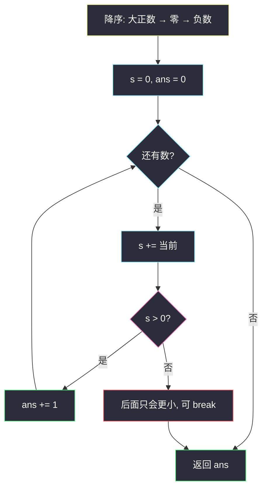
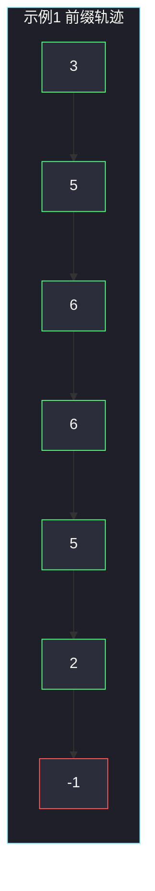

# 重排数组以得到最大前缀分数（从最大开始贪心）

## 一、问题描述

给你整数数组 `nums`。可以按任意顺序重排。定义：

- 前缀和 `prefix[i] = nums[0] + … + nums[i]`（重排后的下标）；
- **分数** = 有多少个下标 `i` 满足 `prefix[i] > 0`。

返回重排后能得到的**最大分数**。

> 🔗 LeetCode 2587：https://leetcode.cn/problems/rearrange-array-to-maximize-prefix-score/
>
> 数据范围：`1 ≤ nums.length ≤ 10^5`，`-10^6 ≤ nums[i] ≤ 10^6`。前缀和绝对值可达约 `10^11`，Python 无忧；Java 累加必须用 `long`。
>
> 📚 灵茶题单：**§1.1 从最小/最大开始贪心**（1337 分）。

**示例 1**

```
输入：nums = [2,-1,0,1,-3,3,-3]
输出：6
解释：一种最优排列 [3,2,1,0,-1,-3,-3] 的前缀和：
3, 5, 6, 6, 5, 2, -1
前 6 个都 > 0，最后一个 ≤ 0，分数 6。
```

**示例 2**

```
输入：nums = [-2,-1,-5]
输出：0
解释：全是负数，无论怎么排，第一个前缀就已经 ≤ 0，后面更小。分数 0。
```

**直观理解**

前缀要尽量长时间停在正数区。正数（越大越好）往前放，前缀立刻拉高；零和负数往后放，拖延「掉到 ≤ 0」的时刻。实现就是**降序排序**，然后扫一遍数有多少个前缀 > 0。

---

## 二、暴力解法

枚举全部排列，对每个算前缀分数，取最大。

```python
from itertools import permutations

class Solution:
    def maxScore(self, nums: list[int]) -> int:
        best = 0
        for perm in set(permutations(nums)):
            s = 0
            sc = 0
            for x in perm:
                s += x
                if s > 0:
                    sc += 1
            best = max(best, sc)
        return best
```

`n ≤ 10^5`，`n!` 不可用。即便 `n=8` 都已经吃力。

### 🔴 瓶颈在哪里

交换论证会证明：任意「前面有个较小数、后面有个较大数」的排列，把这两个对调后，中间那一段前缀只增不减，分数不会变差。于是最优排列就是完全降序，搜索空间塌成 1。

---

## 三、优化探索（核心章节）

> 📚 本题在灵茶题单中属于 **§1.1 从最小/最大开始贪心**：让前缀尽早变大、尽量久地为正，所以从**最大**的数开始排。

### 3.1 交换：大的应该更靠左

设当前位置 `i` 是 `a`、更右边位置 `j` 是 `b`，且 `a < b`。把二者对调：

- `i` 之前的前缀：不变；
- 从 `i` 到 `j−1`：每个前缀都增加 `b − a > 0`，原来 > 0 的仍 > 0，原来 ≤ 0 的有机会翻正；
- `j` 及之后：两端对调不改变区间总和，前缀不变。

分数只可能变好、不会变差。反复交换，得到降序排列。



### 3.2 零和负数放哪

- **正数**：越左越好，且大的比小的更左（降序）。
- **零**：`s + 0 = s`。若当前 `s > 0`，这一位也计分；若 `s = 0`，加零仍是 0，不计分。所以零应紧跟在正数之后——先用正数把 `s` 抬过 0，零才能「蹭」到分数。零放最前：第一个前缀就是 0，白浪费。
- **负数**：不可避免地往下拉。绝对值小的负数（如 `-1`）比 `-3` 更晚把 `s` 拉穿，所以负数内部也是降序：`-1` 在 `-3` 前面。

这恰好是一次性 `sort(reverse=True)` 的结果：`3,2,1,0,-1,-3,-3`。

### 3.3 何时提前停

降序后，一旦某个前缀 `s ≤ 0`，后面的数 ≤ 当前这个数 ≤ 0（因为已经排到非正部分，或剩下的不超过当前），前缀只会更小或持平在非正，不会再 > 0。可以 `break`。

注意：分数统计的是 **> 0**，等于 0 不算。`[1, -1]` 前缀 `1, 0`，分数是 1 不是 2。

### 3.4 一句话核心

> **降序排列，从左往右累加前缀，统计有多少个 `s > 0`；掉到 ≤ 0 就可以停。**

---

## 四、代码实现

### Python（主解）

```python
class Solution:
    def maxScore(self, nums: list[int]) -> int:
        nums.sort(reverse=True)
        s = 0
        ans = 0
        for x in nums:
            s += x
            if s > 0:
                ans += 1
            else:
                break
        return ans
```

**变量含义**

| 写法 | 含义 |
|------|------|
| `sort(reverse=True)` | 大正数在前，零居中，负数从弱到强 |
| `s` | 当前前缀和 |
| `ans` | 已经看到的正前缀个数 |
| `s > 0` | 本题计分条件（0 不算） |

不 `break` 也对：后面 `s` 更小，不会再进 `if`。`break` 只是省点时间。

### Java（前缀用 `long`）

```java
class Solution {
    public int maxScore(int[] nums) {
        Arrays.sort(nums);
        long s = 0;
        int ans = 0;
        for (int i = nums.length - 1; i >= 0; i--) {
            s += nums[i];
            if (s > 0) {
                ans++;
            } else {
                break;
            }
        }
        return ans;
    }
}
```

从右往左取，等价于降序。`n=10^5`、`|nums[i]|=10^6`，前缀能到 `10^11`，`int` 溢出后比较 `s > 0` 会完全错乱。

---

## 五、具体例子演示

**示例 1**：`nums = [2,-1,0,1,-3,3,-3]`。
降序 `[3, 2, 1, 0, -1, -3, -3]`。

| 步 | 选谁 | 前缀 `s` | `s > 0`? | 分数 |
|----|------|----------|----------|------|
| 1 | 3 | 3 | 是 | 1 |
| 2 | 2 | 5 | 是 | 2 |
| 3 | 1 | 6 | 是 | 3 |
| 4 | 0 | 6 | 是 | 4 |
| 5 | -1 | 5 | 是 | 5 |
| 6 | -3 | 2 | 是 | 6 |
| 7 | -3 | -1 | **否** | 6（停） |

7 个数里最多 6 个正前缀：全体总和 `2-1+0+1-3+3-3 = -1 ≤ 0`，最后一个前缀不可能 > 0。贪心打到上界。



绿的是计分前缀，红的 `-1` 不计。分数 6。

**若把负数提前（劣解）**：`[-3, 3, 2, 1, 0, -1, -3]`

| 步 | 选谁 | `s` | 计分? |
|----|------|-----|-------|
| 1 | -3 | -3 | 否 |
| 之后 | … | 一直 ≤ 某条从负数爬升的线 | 可能部分翻正 |

第一步已经丢 1 分，且中间前缀整体偏低。降序不会这样开局。

**零的位置**：`[1, 0, -1]` 降序就是这样。

| 排列 | 前缀 | 分数 |
|------|------|------|
| `1, 0, -1` | 1, 1, 0 | **2** |
| `0, 1, -1` | 0, 1, 0 | 1 |
| `1, -1, 0` | 1, 0, 0 | 1 |

零必须等正数把前缀抬起来之后再出现。

**示例 2**：`[-2,-1,-5]` 降序 `[-1,-2,-5]`。
第一步 `s = -1 ≤ 0`，立刻停，`ans = 0`。

**全正**：`[1,2,3]` 降序后三个前缀 3,5,6 全 > 0，分数 = `n`。

---

## 六、复杂度分析

| 方法 | 时间 | 空间 | 说明 |
|------|------|------|------|
| 枚举排列 | `O(n! · n)` | `O(n)` | 不可用 |
| 降序 + 扫前缀（主解） | `O(n log n)` | `O(1)` 额外 | 排序主导 |

---

## 七、对比总结

| 维度 | 本题 | [3075. 幸福值最大化](https://leetcode.cn/problems/maximize-happiness-of-selected-children/) | [2126. 摧毁小行星](https://leetcode.cn/problems/destroying-asteroids/) |
|------|------|------|------|
| 排序方向 | 降序 | 降序 | 升序 |
| 累加含义 | 前缀和，数 >0 的个数 | 衰减后的幸福值求和 | 行星质量，判断能否过门槛 |
| 停的信号 | 前缀 ≤ 0 | 贡献 ≤ 0 | 质量 < 下一颗 |

三题都是「排好序再线性扫」，差别只在最值朝哪边、累加器拿来干什么。

**易错点**

1. **`s >= 0` 也计分**：题面是严格 `> 0`。零前缀不算。
2. **升序排**：负数会排到最前，分数直接 0。
3. **Java `int` 前缀**：溢出后符号翻转，计分全错。
4. **正数内部随便排**：交换论证说明大的更左更好——虽然有时分数碰巧相同，但降序是唯一不用再想的写法。
5. **零当正数或当负数**：零不改变 `s`，但位置决定它能不能蹭到「已经为正」的前缀。

---

## 八、举一反三

| 题目 | 关系 |
|------|------|
| [3075. 幸福值最大化的选择方案](https://leetcode.cn/problems/maximize-happiness-of-selected-children/) | 同节：降序后按下标衰减，也是从最大开始 |
| [2126. 摧毁小行星](https://leetcode.cn/problems/destroying-asteroids/) | 同节反面：升序累加质量 |
| [2554. 从一个范围内选择最多整数 I](https://leetcode.cn/problems/maximum-number-of-integers-to-choose-from-a-range-i/) | 同节：从小到大累加，目标换成个数 |
| [1413. 逐步求和得到正数的最小值](https://leetcode.cn/problems/minimum-value-to-get-positive-step-by-step-sum/) | 同样盯前缀和，但数组顺序固定，求起始值 |
| [1749. 任意子数组和的绝对值的最大值](https://leetcode.cn/problems/maximum-absolute-sum-of-any-subarray/) | 前缀和的最值，不是重排 |

**思想迁移**

- 重排 + 前缀约束 → 先决定正负零的左右顺序，再用一次排序落地。
- 口诀：**「降序排，累加前缀，大于 0 就记一分。」**
