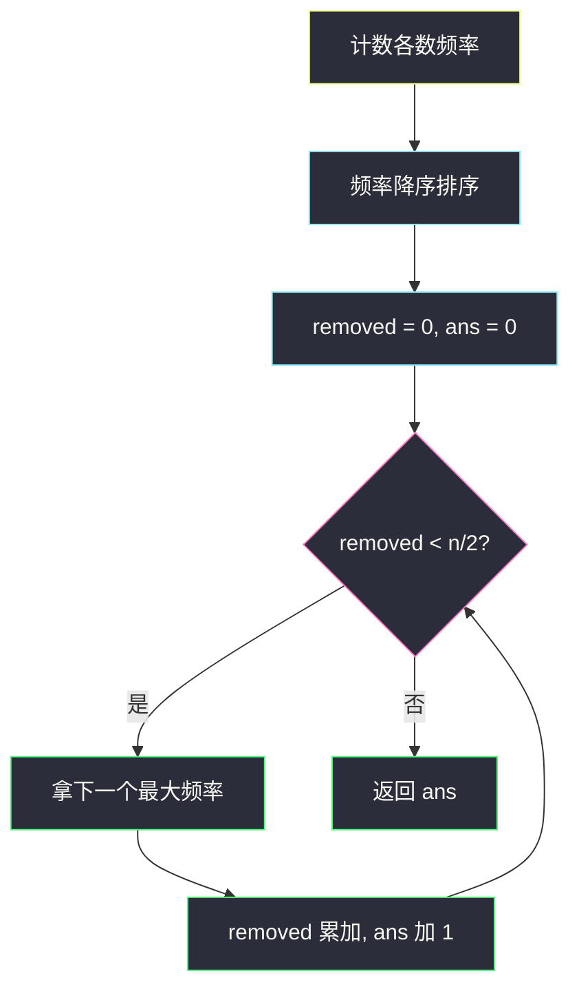
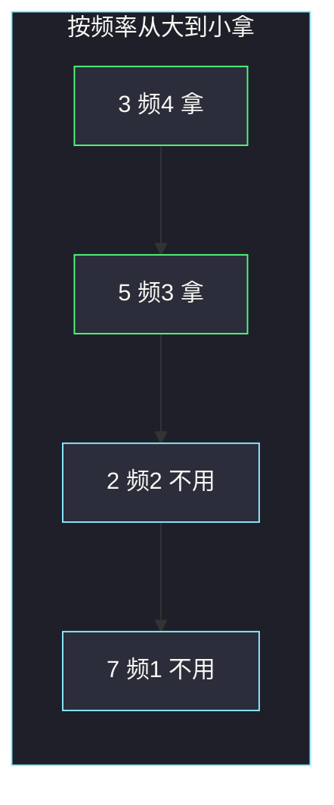

# 数组大小减半（从最大频率开始贪心）

## 一、问题描述

给你整数数组 `arr`，长度为 `n`。你可以选一个整数集合 `set`，然后删掉数组里**所有值属于 `set` 的元素**（一种数要么全删，要么全留）。求使剩下长度 ≤ `n/2` 的 **`set` 最小大小**。

> 🔗 LeetCode 1338：https://leetcode.cn/problems/reduce-array-size-to-the-half/
>
> 数据范围：`1 ≤ arr.length ≤ 10^5`，`arr.length` 为偶数，`1 ≤ arr[i] ≤ 10^9`。
>
> 📚 灵茶题单：**§1.1 从最小/最大开始贪心**（1303 分）。

**示例 1**

```
输入：arr = [3,3,3,3,5,5,5,2,2,7]
输出：2
解释：选 {3,5}，删掉全部 3 和 5，共 7 个，剩下 [2,2,7] 长度 3 ≤ 5。
选一个数最多删掉 4 个（全是 3），不够减半，所以至少 2。
```

**示例 2**

```
输入：arr = [7,7,7,7,7,7]
输出：1
解释：全是 7，选 {7} 就删光，剩下 0 ≤ 3。
```

**直观理解**

`set` 每多一个数，只能多消灭**一种**值的全部出现。想用尽量少的种类删掉至少一半元素，每一种就该尽量「值钱」——优先消灭出现次数最多的数。

---

## 二、暴力解法

计数后得到 `m` 种数的频率。枚举 `set` 包含哪些种类，检查删掉的元素个数是否 ≥ `n/2`，取合法集合的最小大小。

```python
from collections import Counter
from itertools import combinations

class Solution:
    def minSetSize(self, arr: list[int]) -> int:
        freq = list(Counter(arr).values())
        n = len(arr)
        m = len(freq)
        for sz in range(1, m + 1):
            for combo in combinations(freq, sz):
                if sum(combo) >= n // 2:
                    return sz
        return m
```

子集指数级。`n ≤ 10^5` 超时。其实不需要知道删的是哪个值，只需要频率；再进一步，频率大的种类永远比频率小的更值得先选。

### 🔴 瓶颈在哪里

集合大小最小化 + 每种一旦选中贡献固定「删掉的元素数」= 经典的「背包容量 `n/2`，物品体积 = 频率，每件价值相同（都占集合一席）」。贪心按体积从大到小拿即可，不必 DP。

---

## 三、优化探索（核心章节）

> 📚 本题在灵茶题单中属于 **§1.1 从最小/最大开始贪心**。与 1481「不同整数的最少数目」同节镜像：1481 按频率**从小到大灭**（额度有限，灭小的便宜）；本题按频率**从大到小灭**（要删够一半，灭大的划算）。

### 3.1 局部决策

1. 统计每种数的出现次数。
2. 频率**降序**排序。
3. 从大到小累加，直到累加和 ≥ `n/2`。用了几种就是答案。

因为一旦选中某数就必须删光它，不存在「同一种只删一半」——这一点和 1481 正好相反。

### 3.2 为什么「先拿最大频率」最优

设最优 `set` 里有一个频率为 `a` 的数，却没有某个频率 `b > a` 的数。把 `a` 换成 `b`：删掉的元素只多不少，集合大小不变。所以存在一个最优集，由全局频率最高的若干种组成（取前缀即可）。

更形式一点：若答案是 `k`，则频率前 `k` 大的和一定 ≥ 任何其他 `k` 种的和，因此只要存在大小为 `k` 的合法集，前 `k` 大就合法。从小到大试 `k` 时，第一个合法的就是最小 `k`。实现上不必二分 `k`，直接累加到够为止。



### 3.3 桶计数线性化

频率 ∈ `[1, n]`，可开桶 `cnt[f]` 表示有多少种数出现 `f` 次，从 `f = n` 往下扫。每种贡献 `f` 个删除量，需要几种就拿几种。与 1481 的桶相同，只是扫描方向相反。

大根堆是同一贪心的另一种容器：频率全部入堆，反复弹出当前最大并累加。时间仍是 `O(n log n)`，代码比一次排序更长，面试提一句即可。不需要真的记录 `set` 里是哪些值——题目只要大小。

### 3.4 一句话核心

> **选一种数就删光它的全部出现。按频率从大到小拿，累加删掉的个数，刚满 `n/2` 就停。**

---

## 四、代码实现

### Python（主解：频率降序）

```python
from collections import Counter

class Solution:
    def minSetSize(self, arr: list[int]) -> int:
        freq = sorted(Counter(arr).values(), reverse=True)
        need = len(arr) // 2
        removed = ans = 0
        for f in freq:
            removed += f
            ans += 1
            if removed >= need:
                return ans
        return ans
```

**变量含义**

| 写法 | 含义 |
|------|------|
| `freq` | 各数出现次数，已降序 |
| `need` | 至少要删掉的元素个数，即 `n/2`（整数除法） |
| `removed` | 已经靠 `set` 删掉的元素个数 |
| `ans` | 已经选进 `set` 的种类数 |

题目保证 `n` 为偶数，`n/2` 就是一半。剩余长度 ≤ `⌊n/2⌋` 等价于删掉 ≥ `⌈n/2⌉`；偶数时两个写法相同。

循环里每次 `ans += 1` 后立刻判断，保证「刚好满一半」那一步就返回，不会多拿一种。

### Python（桶计数 `O(n)`）

```python
from collections import Counter

class Solution:
    def minSetSize(self, arr: list[int]) -> int:
        n = len(arr)
        bucket = [0] * (n + 1)
        for f in Counter(arr).values():
            bucket[f] += 1
        removed = ans = 0
        for f in range(n, 0, -1):
            while bucket[f] and removed < n // 2:
                removed += f
                ans += 1
                bucket[f] -= 1
            if removed >= n // 2:
                return ans
        return ans
```

### Java（最优解可选）

```java
class Solution {
    public int minSetSize(int[] arr) {
        Map<Integer, Integer> map = new HashMap<>();
        for (int x : arr) {
            map.merge(x, 1, Integer::sum);
        }
        int[] freq = new int[map.size()];
        int i = 0;
        for (int f : map.values()) {
            freq[i++] = f;
        }
        Arrays.sort(freq);
        int removed = 0, ans = 0, n = arr.length;
        for (int j = freq.length - 1; j >= 0; j--) {
            removed += freq[j];
            ans++;
            if (removed >= n / 2) {
                return ans;
            }
        }
        return ans;
    }
}
```

---

## 五、具体例子演示

**示例 1**：`arr = [3,3,3,3,5,5,5,2,2,7]`，`n = 10`，`need = 5`。

计数：

| 数 | 频率 |
|----|------|
| 3 | 4 |
| 5 | 3 |
| 2 | 2 |
| 7 | 1 |

频率降序：`[4, 3, 2, 1]`，对应先删 3，再删 5，再 2，再 7。

| 步 | 选进 set 的数 | 本步删掉 | removed | ans | 够一半? |
|----|---------------|----------|---------|-----|---------|
| 1 | 3 | 4 | 4 | 1 | 4 < 5，继续 |
| 2 | 5 | 3 | 7 | 2 | 7 ≥ 5，**停** |

`set` 大小 2，剩下 `[2,2,7]` 长度 3 ≤ 5。若先选 2 和 7：只删 3 个，不够；再加 5 才能满，集合变成 3，更差。



**示例 2**：全 7，频率 `[6]`，一步 `removed = 6 ≥ 3`，答案 1。

**对比 1481 的同一数组**：若题目改成「最多删 `k=3` 个元素，剩余种类最少」，则应先灭 7（代价 1）再灭 2（代价 2），而不是先灭 3。两种贪心方向不能混。

**边界**：某数出现次数已经 ≥ `n/2` → 答案 1；所有频率都是 1 → 答案是 `n/2`（每种只贡献 1，要拿一半的种类）。

官方例 1 输出 2、例 2 输出 1，与表一致。任务书「删全部 3 和 5，剩 4 个」是口算笔误（4+3=7，剩下 3 个）；以对拍为准：剩下 `[2,2,7]` 长度 3 ≤ 5。

---

## 六、复杂度分析

| 方法 | 时间 | 空间 | 说明 |
|------|------|------|------|
| 枚举频率子集 | `O(2^m · m)` | `O(m)` | `m` 为种类数 |
| 频率降序贪心（主解） | `O(n log n)` | `O(n)` | 哈希计数 + 排序 |
| 桶计数 | `O(n)` | `O(n)` | 从大频率桶往下拿 |

---

## 七、对比总结

| 维度 | 本题 1338 | 1481 不同整数的最少数目 |
|------|-----------|-------------------------|
| 删除粒度 | 选中则**整类全删** | 可以只删一类中的若干个元素 |
| 额度 | 至少删掉 `n/2` 个元素 | 至多删 `k` 个元素 |
| 贪心方向 | 频率**降序** | 频率**升序** |
| 答案含义 | `set` 的大小 | 剩下的种类数 |

**易错点**

1. **按频率升序拿**：那是 1481。本题升序会让你先拿一堆「便宜但贡献小」的种类，集合更大。
2. **以为可以只删一种数的一部分**：题面是「删除数组中所有等于该整数的元素」，粒度是整类。
3. **比较写成 `removed > n/2`**：剩余长度 ≤ `n/2` 等价于删掉 ≥ `n/2`，等号必须算合法。
4. **返回 `removed` 而不是 `ans`**：要的是集合大小，不是删掉了多少元素。

---

## 八、举一反三

| 题目 | 关系 |
|------|------|
| [1481. 不同整数的最少数目](https://leetcode.cn/problems/least-number-of-unique-integers-after-k-removals/) | 同节镜像，频率升序灭种类 |
| [347. 前 K 个高频元素](https://leetcode.cn/problems/top-k-frequent-elements/) | 同样要「频率最高的若干种」，K 是输入而不是累加到一半 |
| [451. 根据字符出现频率排序](https://leetcode.cn/problems/sort-characters-by-frequency/) | 计数 + 按频率排序的基本功 |
| [621. 任务调度器](https://leetcode.cn/problems/task-scheduler/) | 也是高频任务优先，约束变成冷却间隔 |
| [1647. 字符频次唯一的最小删除次数](https://leetcode.cn/problems/minimum-deletions-to-make-character-frequencies-unique/) | 频率数组上的另一种贪心删除 |

**思想迁移**

- 物品代价相同（都占集合一格）、收益不同（频率）→ 按收益从大到小拿。
- 口诀：**「整类删除看频率，从大加到满一半。」**
