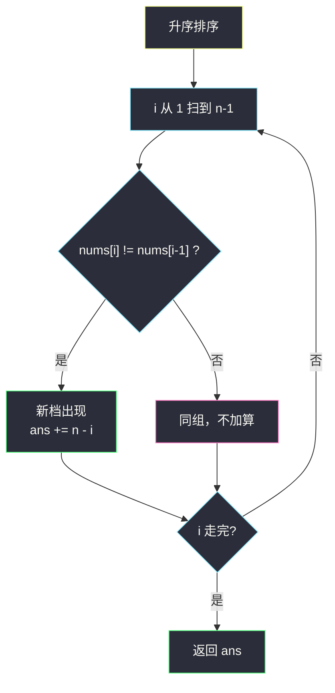
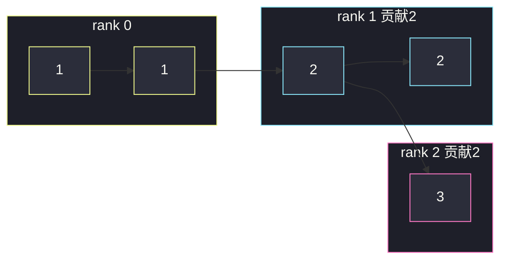

# 使数组元素相等的减少操作次数（分组循环 · 贡献法）

## 一、问题描述

给你一个整数数组 `nums`。一次操作：选出当前的一个**最大值**，把它改成数组里存在的**严格次大值**（比它小的数里最大的那个）。

返回使数组所有元素都相等所需的**最少操作次数**。最终一定能全部变成全局最小值（最小值永远不会被选中去改）。

> 🔗 LeetCode 1887：https://leetcode.cn/problems/reduction-operations-to-make-the-array-elements-equal/
>
> 数据范围：`1 <= nums.length <= 5 * 10^4`，`1 <= nums[i] <= 5 * 10^4`。

**示例 1**

```
输入：nums = [5,1,3]
输出：3
解释：5→3 得到 [3,1,3]；一次 3→1 得到 [1,1,3]；再一次 3→1 得到 [1,1,1]。
```

**示例 2**

```
输入：nums = [1,1,1]
输出：0
解释：已经全相等。
```

**示例 3**

```
输入：nums = [1,1,2,2,3]
输出：4
解释：3→2 一次；三个 2 各 →1 三次，共 4。
```

**直观理解**

每次操作只把「当前最大」往下压一档（压到现存的次大）。某个数要从自己的值一路降到全局最小，必须**跨过中间每一个不同的值**，跨一档算一次。相同的值一起降，互不影响。

> 📚 灵茶题单 **六、分组循环**：排序后相同值成一组；每出现一个新的更大值，它右边（含自己）所有数都要再跨一档。

---

## 二、暴力解法

模拟：每轮找出最大值和严格次大值，把所有最大值改成次大，操作数加上最大值的个数。重复直到只剩一种值。

```python
class Solution:
    def reductionOperations(self, nums: List[int]) -> int:
        ans = 0
        while True:
            uniq = sorted(set(nums))
            if len(uniq) == 1:
                return ans
            mx, nxt = uniq[-1], uniq[-2]
            cnt = nums.count(mx)
            ans += cnt
            nums = [nxt if x == mx else x for x in nums]
```

### 复杂度

- **时间**：值的种类最多 `O(U)` 轮（`U ≤ n`），每轮 `O(n)`，最坏 `O(n²)`。
- **空间**：`O(n)`。

### 🔴 瓶颈在哪里

每一轮都在重复「有多少个数还高于某一档」。排序之后，这些「还高于某档」的数就是后缀，贡献可以一次算清。

---

## 三、优化探索（核心章节）

> 📚 本题在灵茶题单中属于 **六、分组循环**（排序后按值分组）。核心是**贡献**：每出现一个新的不同值，所有更大的元素各要多做 1 次操作。

### 3.1 观察特征

| 特征 | 说明 |
|------|------|
| 最小值永不改 | 最终全员等于 `min(nums)` |
| 降档必须逐级 | 不能从 5 直接跳到 1，中间有 3 就要 5→3→1 |
| 同值同命运 | 相同数字跨的档数一样 |

### 3.2 贡献：从左扫到右

把数组**升序**排序。从左到右，当下标 `i` 处出现一个**新的更大值**（`nums[i] != nums[i-1]`）时：

- 下标 `i .. n-1` 的数都 ≥ 这个新值；
- 它们相对「再小一档」又多了一级台阶，**每个都要多 1 次操作**；
- 贡献 `n - i`。

```
排序后 [1, 1, 2, 2, 3]
          ↑        ↑
       i=2 新值2   i=4 新值3
       贡献 n-2=3  贡献 n-4=1
总操作 4
```

解释：两个 2 和一个 3 都要跨过「1→2」这一档（+3）；那个 3 还要再跨「2→3」（+1）。

### 3.3 分组视角（等价）

排序后相同值一组。从最小组开始，rank = 0；每进入一个新组 rank += 1，该组每个元素贡献 `rank` 次（要降 `rank` 档才能到最小值）。

`ans = Σ rank(v) * freq(v)`。



### 3.4 正确性

元素 `x` 若在去重升序里排第 `r` 档（最小档 `r = 0`），必须做恰好 `r` 次操作。每种操作把某一档的所有现存最大值压到下一档，等价于「每个元素各自走完自己的 `r` 步」。求和与模拟一致，且不会多操作（没有捷径可跳档）。

### 3.5 一句话核心

> **排序后每碰到一个新的更大值，它右边所有数各记一次；等价于「第 r 大档的元素贡献 r」。**

---

## 四、代码实现

### Python（主解：排序 + 后缀贡献）

```python
class Solution:
    def reductionOperations(self, nums: List[int]) -> int:
        nums.sort()
        n, ans = len(nums), 0
        for i in range(1, n):
            if nums[i] != nums[i - 1]:          # 新档
                ans += n - i                    # 后缀每个再跨一档
        return ans
```

**分组循环写法（按频次累计 rank）**

```python
class Solution:
    def reductionOperations(self, nums: List[int]) -> int:
        nums.sort()
        n, ans, i, rank = len(nums), 0, 0, 0
        while i < n:
            start = i
            while i < n and nums[i] == nums[start]:
                i += 1                          # 吃完同一值
            if start > 0:                       # 不是最小组
                rank += 1
            ans += rank * (i - start)
        return ans
```

**变量含义**

| 变量 | 含义 |
|------|------|
| `i` | 新值首次出现的下标（主解） |
| `n - i` | 仍严格大于上一档的元素个数 |
| `rank` | 当前组相对最小值要跨的档数 |
| `i - start` | 当前组频次 |

**循环不变式**：扫到 `i` 时，`ans` 已计入所有「跨过更小档」的贡献；新档只把后缀再 +1。

### Java（可选）

```java
class Solution {
    public int reductionOperations(int[] nums) {
        Arrays.sort(nums);
        int n = nums.length, ans = 0;
        for (int i = 1; i < n; i++)
            if (nums[i] != nums[i - 1]) ans += n - i;
        return ans;
    }
}
```

---

## 五、具体例子演示

以示例 3 `nums = [1,1,2,2,3]`，排序后相同。

**主解逐步跟踪**

| i | nums[i] | 与前一个 | 贡献 `n-i` | ans |
|---|---------|----------|------------|-----|
| 1 | 1 | 同 | 0 | 0 |
| 2 | 2 | 新档 | 5-2=3 | 3 |
| 3 | 2 | 同 | 0 | 3 |
| 4 | 3 | 新档 | 5-4=1 | 4 |

返回 **4** ✓。

**分组视角**

| 段 `[start, i)` | 值 | rank | 频次 | 贡献 |
|-----------------|-----|------|------|------|
| [0, 2) | 1 | 0 | 2 | 0 |
| [2, 4) | 2 | 1 | 2 | 2 |
| [4, 5) | 3 | 2 | 1 | 2 |

`0+2+2 = 4`，与主解一致。两个 2 各降 1 档，一个 3 降 2 档。

**示例 1** 排序 `[1,3,5]`：

| i | 值 | 新档? | 贡献 | 含义 |
|---|-----|-------|------|------|
| 1 | 3 | 是 | 2 | 3 和 5 都要跨过「1→3」 |
| 2 | 5 | 是 | 1 | 只有 5 还要跨「3→5」 |

合计 3，对应模拟：5→3 一次，然后两个 3 各 →1 两次。

全相等 `[1,1,1]`：没有新档，贡献 0，循环体一次加法都不做。



---

## 六、复杂度分析

| 方法 | 时间 | 空间 | 说明 |
|------|------|------|------|
| 逐档模拟 | `O(n²)` | `O(n)` | 值种类多时超时 |
| 排序 + 贡献 / 分组（主解） | `O(n log n)` | `O(1)` 额外 | 排序主导；扫描 `O(n)` |

（若计入排序所用数组，空间按实现为 `O(log n)` 或 `O(n)`。）

---

## 七、对比总结

| 维度 | 模拟压档 | 排序贡献 |
|------|----------|----------|
| 每档工作 | 改写整个数组 | 一次加法 `n-i` |
| 与分组关系 | 隐式按最大值分组 | 显式同值一段 |

**易错点**

1. **不是变成任意更小值**：必须变成**当前数组里存在的**严格次大，所以中间档不能跳。
2. **同值不要重复加 `n-i`**：只在值**第一次**出现时加。
3. **全相等返回 0**：循环从 `i=1` 开始，没有新档。
4. **不要按「最大值出现次数 × 某种距离」瞎乘**：必须按去重后的档数。

**模板（排序后新值贡献后缀，Python）**

```python
nums.sort()
ans = 0
for i in range(1, n):
    if nums[i] != nums[i - 1]:
        ans += n - i
```

---

## 八、举一反三

| 题目 | 关系 |
|------|------|
| [453. 最小操作次数使数组元素相等](https://leetcode.cn/problems/minimum-moves-to-equal-array-elements/) | 也是全员靠齐，但每次是全体非最大 +1，公式不同 |
| [462. 最少移动次数使数组元素相等 II](https://leetcode.cn/problems/minimum-moves-to-equal-array-elements-ii/) | 靠齐到中位数，排序后贡献 |
| [945. 使数组唯一的最小增量](https://leetcode.cn/problems/minimum-increment-to-make-array-unique/) | 排序后贪心处理同值组 |
| [1338. 数组大小减半](https://leetcode.cn/problems/reduce-array-size-to-the-half/) | 按频次分组，从大频次贪心 |
| [1648. 销售价值减少的颜色球](https://leetcode.cn/problems/sell-diminishing-valued-colored-balls/) | 按值分档，每档贡献可闭式计算 |
| [1636. 按照频率将数组升序排序](https://leetcode.cn/problems/sort-array-by-increasing-frequency/) | 同值分组后的频次是一等公民 |

**思想迁移**

- 「每次把当前最大压到次大」= 每个元素按值的**名次**付费。先排序（或去重），再按组结算。
- 口诀：**「排好序，新值一冒头，右边每人再加一刀。」**
