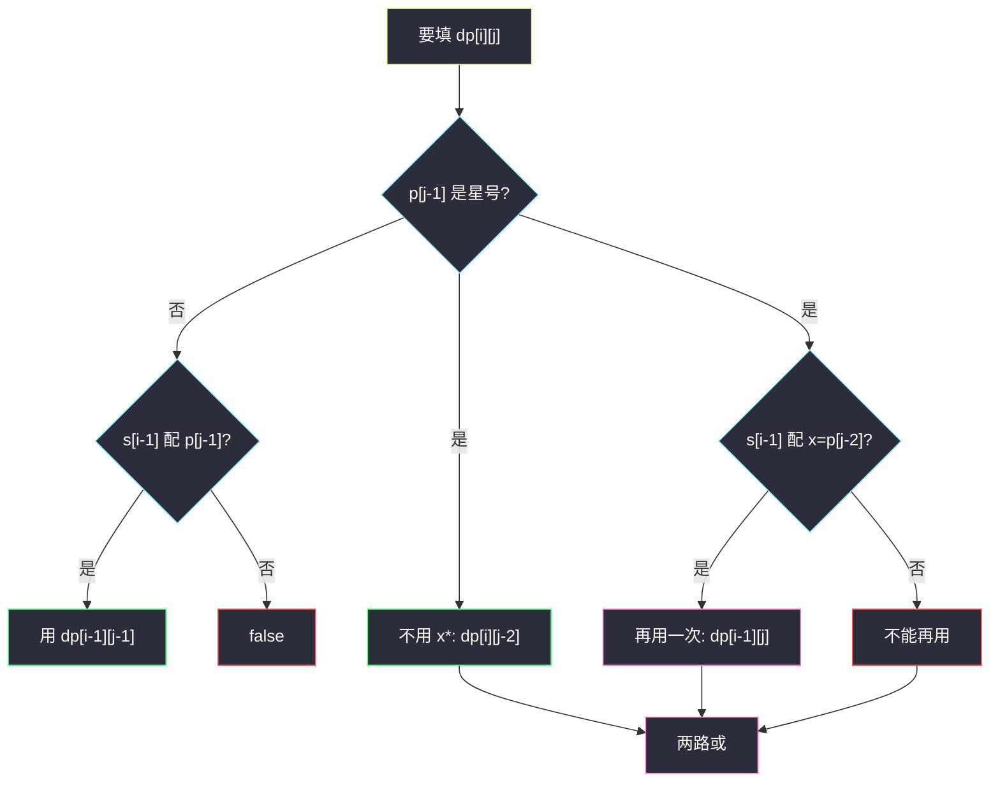
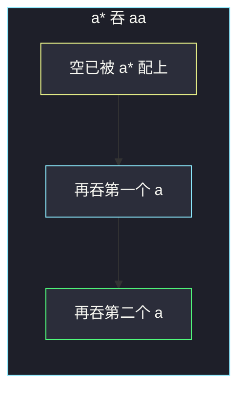

# 正则表达式匹配（LCS 型二维布尔 DP）

## 一、问题描述

实现一个支持 `'.'` 和 `'*'` 的正则匹配器，判断模式串 `p` 是否**完整覆盖**字符串 `s`（不是搜子串，是整串匹配）。

- `'.'` 匹配**任意一个**字符。
- `'*'` 匹配**零个或多个**「它前面那一个元素」。前面那一个可以是普通字母，也可以是 `'.'`。所以 `a*` 表示若干个 `a`，`.*` 表示任意长度（含空）的任意字符串。

> 🔗 LeetCode 10：https://leetcode.cn/problems/regular-expression-matching/
>
> 数据范围：`s`、`p` 长度通常 ≤20（老题约束偏小），但写法必须是多项式 DP，指数回溯只当理解用。`s` 只含小写字母；`p` 含小写、`'.'`、`'*'`。题目保证每个 `'*'` 前面都有元素，所以 `p` 不会以 `'*'` 开头。
>
> 📚 灵茶题单：**§4.1 最长公共子序列（LCS）**。和 1143、97 同一张「双串前缀」表：`dp[i][j]` 看 `s` 前 i、`p` 前 j。本题不是求长度，而是问这两个前缀能不能匹配上。`'*'` 让转移比普通 LCS 多一个「吞或不吞」。

方法名 `isMatch`。

**示例 1**

```
输入：s = "aa", p = "a"
输出：false
解释：p 只能吃掉一个 a，s 还剩一个。
```

**示例 2**

```
输入：s = "aa", p = "a*"
输出：true
解释：'*' 让前面的 a 重复两次。
```

**示例 3**

```
输入：s = "ab", p = ".*"
输出：true
解释：".*" 等于「任意字符串」。
```

**直观理解**

`p` 是带量词的压缩描述。没有 `'*'` 时，两串必须等长、逐格相等（`'.'` 当万能符）。一旦出现 `x*`，这块可以匹配 0 段、1 段、2 段……`x`。DP 要同时尝试「这块不用」和「再吞 s 的一个字符」。

整串匹配：`s` 用完且 `p` 用完。空对空是 true。

---

## 二、暴力解法

指针 `i`、`j` 分别扫 `s`、`p`。若下一位是 `x*`，要么跳过这两个字符（匹配 0 次），要么在当前 `s[i]` 配得上 `x` 时把 `i` 加一、`j` 不动（再用一次）。否则必须当前字符配上，两指针都加一。

```python
class Solution:
    def isMatch(self, s: str, p: str) -> bool:
        def dfs(i: int, j: int) -> bool:
            if j == len(p):
                return i == len(s)
            first = i < len(s) and (p[j] == '.' or p[j] == s[i])
            if j + 1 < len(p) and p[j + 1] == '*':
                # 0 次，或先用一次再递归（j 不动）
                return dfs(i, j + 2) or (first and dfs(i + 1, j))
            return first and dfs(i + 1, j + 1)

        return dfs(0, 0)
```

官方三例：false / true / true。额外官方常见例：`s="aab", p="c*a*b" → true`；`s="mississippi", p="mis*is*p*." → false`。

最坏每次 `'*'` 两岔，指数级。同一对 `(i,j)` 会重复出现。

### 🔴 瓶颈在哪里

状态只依赖两个前缀长度，一共 `(len(s)+1)*(len(p)+1)` 个。记忆化或填表就是多项式。和 LCS 把 `f(i,j)` 铺成表是同一套方法论，只是转移里多了星号的两种用法。

---

## 三、优化探索（核心章节）

> 📚 灵神双串模板：用**长度**定义状态，格子 `(i,j)` 对应 `s[:i]` 与 `p[:j]`，避免下标 -1 想岔。

### 3.1 状态

`dp[i][j]` = `s` 的前 `i` 个字符能否被 `p` 的前 `j` 个字符完整匹配。

目标：`dp[m][n]`，`m=len(s)`，`n=len(p)`。

### 3.2 转移：先看 p 的最后一个字符是不是 '*'

**情况 A：`p[j-1] != '*'`**（普通字母或 `'.'`）

当前这对必须配上，然后看去掉这对之后：

```
配得上  ⇔  i>0 且 (p[j-1]=='.' 或 p[j-1]==s[i-1])
dp[i][j] = 配得上 且 dp[i-1][j-1]
```

**情况 B：`p[j-1] == '*'`**

`p` 的末尾是 `x*` 这块（`x = p[j-2]`）。两种互斥用法取或：

1. **不用这块**：`x*` 匹配空，看 `p` 去掉末尾两个字符：`dp[i][j-2]`。
2. **再用一次**：`x` 吃掉 `s[i-1]`（要求 `i>0` 且 `x` 配得上 `s[i-1]`），`'*'` 仍留着继续工作：`dp[i-1][j]`。

```
dp[i][j] = dp[i][j-2]
        or (配得上 x 时的 dp[i-1][j])
```

「再用一次」可以重复套用：`dp[i-1][j]` 自己也可能走「再用一次」，于是 `x*` 能吞 1 个、2 个、3 个……这就是星号匹配多个的全部实现。**不要**再写一个循环去枚举重复次数。



### 3.3 空串边界（必须单独写）

`dp[0][0] = True`：空匹配空。

`s` 为空、`p` 非空：只有形如 `a*b*c*` 这种「每一段都是 0 次」的模式能匹配空。递推：

```
若 p[j-1]=='*'：dp[0][j] = dp[0][j-2]
否则：dp[0][j] = False
```

`a*` 的 `j=2`：`dp[0][2] = dp[0][0] = True`。`a*b*` 继续 `dp[0][4] = dp[0][2] = True`。单独一个字母 `a`：`dp[0][1] = False`。

`p` 为空、`s` 非空：第一列除 `(0,0)` 全 False。循环从 `i=1` 自然得到。

### 3.4 连续 '*'、`'.'` 与 `'*'` 组合

**`.*`**：`x` 是点，配得上任意 `s[i-1]`，「再用一次」永远可走（只要 `i>0`）。再配合「不用」匹配空。所以 `.*` 能吃掉 s 的任意前缀——这就是示例 3。

**`x*` 接在别的东西后面**：例如 `c*a*b`。`c*` 对不含 c 的串只能走「不用」，退化成后面的 `a*b`。

**连续两个星号**如 `a**`：题目保证 `'*'` 前面有元素，语法上第二个 `'*'` 的「前面元素」是第一个 `'*'`。s 只有小写字母，不会等于字符 `'*'`，「再用一次」配不上；「不用」把多余的 `'*'` 剥掉，退化成 `a*`。按公式机械转移即可，不必特判。LeetCode 测试里连续星号极少见，面试讲清楚「公式仍然成立」就够。

**星号不能单独出现在模式开头**：`p="*"` 非法。边界循环 `j` 从 1 走时，访问 `j-2` 前要保证 `p[j-1]=='*'` 已蕴含 `j>=2`。

### 3.5 填表顺序

`dp[i][j]` 依赖：

- 左上 `dp[i-1][j-1]`（普通匹配）；
- 左左 `dp[i][j-2]`（星号不用）；
- 正上 `dp[i-1][j]`（星号再用）。

`i` 从小到大、`j` 从小到大。同一行里 `j-2` 已经算过。

不要滚成一维除非你非常清楚覆盖顺序：星号依赖 `j-2`，一维很容易把还要用的旧值盖掉。Hard 主解保留二维。

### 3.6 和 LCS / 通配符的差别

1143 允许丢字符；本题一个都不能随便丢，除非 `'*'` 声明「这块可以是空」。

第 44 题通配符的 `'*'` **不绑定前一个字符**，自己就能吞任意序列。本题 `'*'` 只是量词，必须和前面的 `x` 组成 `x*`。两题都叫 `isMatch`，转移差在星号这一格，对比见同目录 `wildcard-matching.md`。

### 3.7 一句话核心

> **`dp[i][j]`：两前缀能否匹配；遇普通字符对一下，遇星号「不用或再吞一个」。**

---

## 四、代码实现

### Python（主解：二维 DP）

```python
class Solution:
    def isMatch(self, s: str, p: str) -> bool:
        m, n = len(s), len(p)
        dp = [[False] * (n + 1) for _ in range(m + 1)]
        dp[0][0] = True
        for j in range(1, n + 1):
            if p[j - 1] == '*':
                dp[0][j] = dp[0][j - 2]
        for i in range(1, m + 1):
            for j in range(1, n + 1):
                if p[j - 1] == '*':
                    # 不用 x*
                    dp[i][j] = dp[i][j - 2]
                    x = p[j - 2]
                    if x == '.' or x == s[i - 1]:
                        dp[i][j] = dp[i][j] or dp[i - 1][j]
                elif p[j - 1] == '.' or p[j - 1] == s[i - 1]:
                    dp[i][j] = dp[i - 1][j - 1]
        return dp[m][n]
```

### Java

```java
class Solution {
    public boolean isMatch(String s, String p) {
        int m = s.length(), n = p.length();
        boolean[][] dp = new boolean[m + 1][n + 1];
        dp[0][0] = true;
        for (int j = 1; j <= n; j++) {
            if (p.charAt(j - 1) == '*') {
                dp[0][j] = dp[0][j - 2];
            }
        }
        for (int i = 1; i <= m; i++) {
            for (int j = 1; j <= n; j++) {
                if (p.charAt(j - 1) == '*') {
                    dp[i][j] = dp[i][j - 2];
                    char x = p.charAt(j - 2);
                    if (x == '.' || x == s.charAt(i - 1)) {
                        dp[i][j] = dp[i][j] || dp[i - 1][j];
                    }
                } else if (p.charAt(j - 1) == '.' || p.charAt(j - 1) == s.charAt(i - 1)) {
                    dp[i][j] = dp[i - 1][j - 1];
                }
            }
        }
        return dp[m][n];
    }
}
```

**变量含义**

| 写法 | 含义 |
|------|------|
| `dp[i][j]` | `s[:i]` 能否配 `p[:j]` |
| `x = p[j-2]` | 星号绑定的那个元素 |
| `dp[i][j-2]` | `x*` 匹配零次 |
| `dp[i-1][j]` | `x*` 再匹配一次（星号留着） |

---

## 五、具体例子演示

`.` 表示 false，`T` 表示 true。行是 `s` 用了几个，列是 `p` 用了几个。列头 `ε` 表示空模式。

### 5.1 官方示例 1：`s="aa"`，`p="a"`

| i \ j | ε | a |
|-------|---|---|
| ε | T | . |
| a | . | T |
| a | . | . |

`dp[1][1]`：`s[0]==p[0]=='a'`，左上是 T → T。  
`dp[2][1]`：还想用一个 `a` 去配第二个 `a`，左上 `dp[1][0]` 是 false（模式已经空了）→ false。  
`dp[2][1] = false`，对拍官方。

### 5.2 官方示例 2：逐格填 `s="aa"`，`p="a*"`

先处理空串行：`p[1]=='*'`，`dp[0][2] = dp[0][0] = T`。`a*` 可以匹配空。

| i \ j | ε | a | * |
|-------|---|---|---|
| ε | T | . | T |
| a | . | T | T |
| a | . | . | T |

- `dp[1][1]`：普通 `a` 配 `a`，左上 T → T。
- `dp[1][2]`：星号。不用：`dp[1][0]=false`。再用：`x='a'` 配 `s[0]='a'`，正上 `dp[0][2]=T` → T。含义：空串已经被 `a*` 匹配，再吞一个 a。
- `dp[2][1]`：普通 `a` 配第二个 a，左上 `dp[1][0]=false` → false。单字母模式吃不了两个 a。
- `dp[2][2]`：不用 `dp[2][0]=false`；再用，`x` 配 `s[1]`，正上 `dp[1][2]=T` → T。星号吞第二个 a。

`dp[2][2] = T`，对拍官方。



### 5.3 官方示例 3：`s="ab"`，`p=".*"`

空串行同样 `dp[0][2]=T`（`.*` 匹配空）。

| i \ j | ε | . | * |
|-------|---|---|---|
| ε | T | . | T |
| a | . | T | T |
| b | . | . | T |

`dp[1][1]`：`'.'` 配 `a`，T。  
`dp[1][2]`：再用时 `x='.'` 任意配，正上 T。  
`dp[2][1]`：只一个点，吃不了两个字符，false。  
`dp[2][2]`：再用，`'.'` 配 `b`，正上 `dp[1][2]=T` → T。

`.*` 一路「再用」把 `ab` 全吞掉。对拍官方。

### 5.4 额外官方例：`s="aab"`，`p="c*a*b"`

`c*` 对 `aab` 只能匹配 0 次。`a*` 吞两个 a，最后 `b` 配 `b`。

| i \ j | ε | c | * | a | * | b |
|-------|---|---|---|---|---|---|
| ε | T | . | T | . | T | . |
| a | . | . | . | T | T | . |
| a | . | . | . | . | T | . |
| b | . | . | . | . | . | T |

空串行：`c*` 可空 → T；后面跟裸 `a` 不能空 → false；再跟 `*` 变成 `a*` 可空 → T；裸 `b` 不能空 → false。

`dp[1][3]`：第一个 a 配模式里的 a。  
`dp[1][4]`：`a*` 吞这个 a。  
`dp[2][4]`：`a*` 再吞第二个 a。  
`dp[3][5]`：`b` 配 `b`，左上 `dp[2][4]=T` → T。

右下角 T。`c*` 整列几乎全 false（s 里没有 c），全靠「不用」把这一段跳过。

### 5.5 失败例：`s="mississippi"`，`p="mis*is*p*."`

按同样规则填完整张 12×11 表，右下角是 false。卡点在后段：`p*` 和最后的 `'.'` 吃不掉剩余的 `ppi` 结构——模式末尾的点只能再吃一个字符，而 `p*` 只能吃 `p`，中间那个 `i` 对不上。对拍官方 false。

不必手填全部 132 格；面试画到 `is*` 吃掉中间的 `iss` 之后，指出末尾 `p*.` 无法覆盖 `ippi` 即可。

### 5.6 空串与 `a*`

`s=""`，`p="a*"`：表只有一行 `[T, ., T]`，答案 true。  
`s=""`，`p=""`：`dp[0][0]`，true。  
`s="ab"`，`p=".*c"`：`.*` 可以吃掉 `ab`，但最后还要一个 `c`，s 已经空了，右下 false。这是「模式更长且末尾不是可空星号」的典型否例。

---

## 六、复杂度分析

| 方法 | 时间 | 空间 | 说明 |
|------|------|------|------|
| 暴力 DFS | 指数 | `O(m+n)` 栈 | 超时风险 |
| 二维 DP（主解） | `O(mn)` | `O(mn)` | 长度很短，足够 |

---

## 七、对比总结

| 维度 | 1143 LCS | 本题 | 44 通配符 |
|------|----------|------|-----------|
| 状态 | 两前缀最长公共 | 两前缀能否匹配 | 同左 |
| `*` | 无 | 量词，绑定前一元素 | 独立，吞任意 |
| 丢字符 | 允许 | 仅当 `x*` 声明可空 | `*` 可空 |

**易错点**

1. **星号当成独立通配。** 那是 44 题。这里 `*` 必须看 `p[j-2]`。
2. **枚举重复次数写成三重循环。** 「再用一次 + 留着星号」已经覆盖任意次数。
3. **空串行没处理。** `a*` 配空会错。必须先把 `dp[0][*]` 按星号递推完。
4. **`j-2` 越界。** 合法输入下 `'*'` 不在开头；写代码仍建议只在 `p[j-1]=='*'` 时访问 `j-2`。
5. **`'.'` 只在普通分支处理，忘了星号的 `x` 也可以是点。** `.*` 会全部失败。
6. **子串匹配。** 题目是整串。不要在 `i<m` 时提前 true。
7. **「再用」写成 `dp[i-1][j-2]` 或 `dp[i-1][j-1]`。** 星号要留着，必须是 `dp[i-1][j]`。写成 `j-1` 等于把星号也消耗掉，只能重复一次。

**模板**

双串布尔 DP：先写无量词的对角转移，再给量词加「跳过两个 / 留着继续吞」。

---

## 八、举一反三

| 题目 | 关系 |
|------|------|
| [44. 通配符匹配](https://leetcode.cn/problems/wildcard-matching/) | 同目录下一篇；`*` 语义不同 |
| [97. 交错字符串](https://leetcode.cn/problems/interleaving-string/) | 同属 §4.1 双串前缀布尔 DP |
| [1143. 最长公共子序列](https://leetcode.cn/problems/longest-common-subsequence/) | 原型；站点 `solutions/base/longest-common-subsequence.md` |
| [72. 编辑距离](https://leetcode.cn/problems/edit-distance/) | 同一张表，转移改成插删替 |
| [115. 不同的子序列](https://leetcode.cn/problems/distinct-subsequences/) | 双串 DP，问方案数 |
| [392. 判断子序列](https://leetcode.cn/problems/is-subsequence/) | 双串前缀的退化：只有「配或跳过 s」 |

**思想迁移**

- 模式串多一种语法，就多一条转移；状态定义不要改。
- 口诀：**「看 p 尾巴：不是星就对角配；是星就不用或再吞，星留在原地。」**
