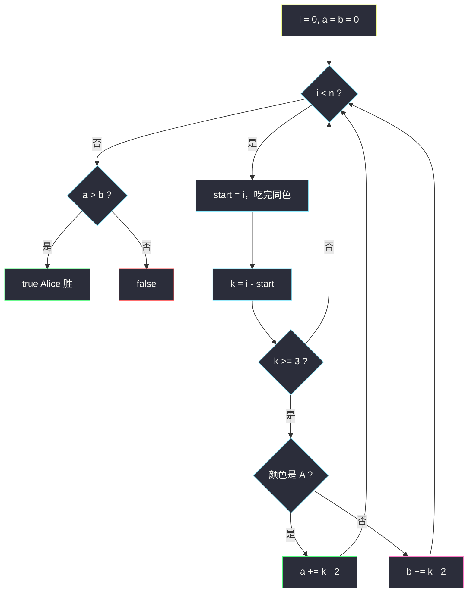
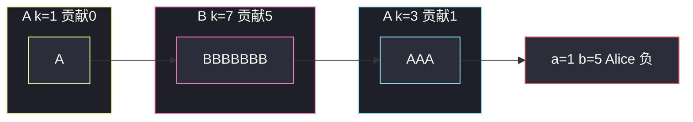

# 如果相邻两个颜色均相同则删除当前颜色（分组循环 · 独立计数）

## 一、问题描述

字符串 `colors` 只含 `'A'` 和 `'B'`，表示一排棋子。Alice 和 Bob 轮流操作，Alice 先手：

- Alice 只能删一个 `'A'`，且它的左右邻居也都是 `'A'`（即删 `AAA` 的中间那个）。
- Bob 同理，只能删 `BBB` 的中间 `'B'`。
- 不能操作两端（没有两个邻居）。
- **不能跳过回合**；无法操作的人输掉。

返回 `true` 当且仅当 Alice 获胜。

> 🔗 LeetCode 2038：https://leetcode.cn/problems/remove-colored-pieces-if-both-neighbors-are-the-same-color/
>
> 数据范围：`1 <= colors.length <= 10^5`，`colors[i]` 为 `'A'` 或 `'B'`。

**示例 1**

```
输入：colors = "AAABABB"
输出：true
解释：仅有一段 AAA，Alice 可删 1 次；没有 BBB，Bob 0 次。Alice 先手删完后 Bob 无法动，Alice 胜。
```

**示例 2**

```
输入：colors = "AA"
输出：false
解释：长度不足 3，双方都 0 次，Alice 先手立刻无法操作。
```

**示例 3**

```
输入：colors = "ABBBBBBBAAA"
输出：false
解释：7 个 B → Bob 5 次；3 个 A → Alice 1 次。1 不大于 5。
```

**直观理解**

删一个中间 A 不会把 B 段拆开或接上，反之亦然。两个人在**互不干扰的棋盘**上各自取子。连续 k 个同色，两端动不了，中间可以依次删掉 `k-2` 个（删到剩 2 个为止）。比较次数即可，不必搜博弈树。

> 📚 灵茶题单 **六、分组循环**：外层 `while i < n`，内层把同一颜色吃完，长度为 `k` 则该颜色增加 `max(k-2, 0)` 次操作。

---

## 二、暴力解法

真去模拟轮流：每回合在字符串里找一个可删位置，删掉后拼接。双方各搜可行点。

```python
class Solution:
    def winnerOfGame(self, colors: str) -> bool:
        s = list(colors)
        def can(ch):
            return [i for i in range(1, len(s) - 1)
                    if s[i] == ch == s[i - 1] == s[i + 1]]
        alice_turn = True
        while True:
            ch = 'A' if alice_turn else 'B'
            pos = can(ch)
            if not pos:
                return not alice_turn           # 当前玩家输 → Alice 胜当且仅当现在是 Bob 的回合
            s.pop(pos[0])
            alice_turn = not alice_turn
```

### 复杂度

- **时间**：每次 `O(n)` 找点 + 删除，操作次数 `O(n)`，最坏 `O(n²)`，`n = 10^5` 超时。
- **空间**：`O(n)`。

### 🔴 瓶颈在哪里

删除不改变对方的连续段长度（A 的操作发生在 A 段内部，B 段纹丝不动）。因此总操作数在开始时就已经定了，模拟过程是浪费。

---

## 三、优化探索（核心章节）

> 📚 本题在灵茶题单中属于 **六、分组循环**：同色连续一段结算一次。Alice 胜 ⟺ Alice 可操作次数 **严格大于** Bob。

### 3.1 观察特征

| 特征 | 说明 |
|------|------|
| 颜色互不干扰 | 删 A 只缩短 A 段，B 段长度不变 |
| 段内独立 | 两段 AAA 互不相邻（中间必有 B），操作次数相加 |
| 不能跳过 | 有子就必须下，等价于比较总次数 |

### 3.2 一段能删几次

连续 k 个同色：

- `k < 3`：两端不够邻居，0 次；
- `k ≥ 3`：可删位置是下标区间里的中间 `k-2` 个；每删一个，段长减 1，直到剩 2。一共 **`k-2`** 次。

例如 `AAAAA`（k=5）：可删 3 次，剩 `AA`。

### 3.3 为什么比大小就够

设 Alice 有 `a` 次、Bob 有 `b` 次。交替进行，Alice 先手，有子必须下：

- `a > b`：前 `b` 个回合双方都能下；之后 Alice 还能再下，Bob 无法应手，**Alice 胜**；
- `a ≤ b`：Alice 的 `a` 次用尽后轮到 Bob（或 Alice 开局就没子），下一次 Alice 无法操作，**Alice 负**。

所以只需 `return a > b`。平局（`a == b`）Alice 负，因为她先手却没有多出来的一步。



### 3.4 一句话核心

> **同色一段长 k 贡献 `max(k-2, 0)` 次；A、B 分开加。Alice 胜当且仅当她的次数严格更多。**

---

## 四、代码实现

### Python（主解：分组循环）

```python
class Solution:
    def winnerOfGame(self, colors: str) -> bool:
        n, i, a, b = len(colors), 0, 0, 0
        while i < n:
            start = i
            c = colors[i]
            while i < n and colors[i] == c:
                i += 1                          # 吃完同一段
            k = i - start
            if k >= 3:
                if c == 'A':
                    a += k - 2
                else:
                    b += k - 2
        return a > b
```

**线性扫描变体（遇异色就结算）**

```python
class Solution:
    def winnerOfGame(self, colors: str) -> bool:
        a = b = cnt = 0
        prev = '#'
        for c in colors + '$':                  # 哨兵强制收尾
            if c == prev:
                cnt += 1
            else:
                if cnt >= 3:
                    if prev == 'A':
                        a += cnt - 2
                    elif prev == 'B':
                        b += cnt - 2
                prev, cnt = c, 1
        return a > b
```

**变量含义**

| 变量 | 含义 |
|------|------|
| `start` / `i` | 当前同色段的半开区间 `[start, i)` |
| `k` | 段长 |
| `a` / `b` | Alice / Bob 的总可操作次数 |

**循环不变式**：每段结算后，`a`、`b` 等于已扫描前缀里双方的操作总数。

### Java（可选）

```java
class Solution {
    public boolean winnerOfGame(String colors) {
        int n = colors.length(), i = 0, a = 0, b = 0;
        while (i < n) {
            int start = i;
            char c = colors.charAt(i);
            while (i < n && colors.charAt(i) == c) i++;
            int k = i - start;
            if (k >= 3) {
                if (c == 'A') a += k - 2;
                else b += k - 2;
            }
        }
        return a > b;
    }
}
```

---

## 五、具体例子演示

以示例 3 `colors = "ABBBBBBBAAA"` 分组。

| 段 | `[start, i)` | 颜色 | k | 贡献 `k-2` | a | b |
|----|--------------|------|---|------------|---|---|
| 1 | [0, 1) | A | 1 | 0 | 0 | 0 |
| 2 | [1, 8) | B | 7 | 5 | 0 | 5 |
| 3 | [8, 11) | A | 3 | 1 | 1 | 5 |

`1 > 5` 为假，返回 **false** ✓。

示例 1 `"AAABABB"`：`AAA` k=3 → Alice 1；`B`、`A`、`BB` 均 k<3。`1 > 0`，**true**。



---

## 六、复杂度分析

| 方法 | 时间 | 空间 | 说明 |
|------|------|------|------|
| 轮流模拟删除 | `O(n²)` | `O(n)` | 超时 |
| 分组循环（主解） | `O(n)` | `O(1)` | 每个字符进入内层一次 |

---

## 七、对比总结

| 维度 | 当真博弈搜 | 分组计数 |
|------|------------|----------|
| 状态 | 字符串不断变短 | 段长在开始时已定 |
| 胜负 | 谁先没子 | `a > b` |

**易错点**

1. **是严格大于**：`a == b` 时 Alice 负（先手没有多余一步）。
2. **贡献是 `k-2` 不是 `k-3`**：三个 A 就能删中间那一个，贡献 1。
3. **两端不能删**：已经包含在 `k-2` 里，不要再单独减两端。
4. **A、B 不要加到同一个计数器**。
5. **不是「必须连续操作同一段」的限制**：规则允许同一人下次去另一段，但因为不干扰，总次数不变。

**模板（同色分组，Python）**

```python
i = 0
while i < n:
    start = i
    while i < n and s[i] == s[start]:
        i += 1
    k = i - start
    # 结算 k：本题贡献 max(k-2, 0)
```

---

## 八、举一反三

| 题目 | 关系 |
|------|------|
| [1759. 统计同质子字符串的数目](https://leetcode.cn/problems/count-number-of-homogenous-substrings/) | 同色段长 `k` 贡献三角形数，分组骨架相同 |
| [1446. 连续字符](https://leetcode.cn/problems/consecutive-characters/) | 同色分组后取最大 `k` |
| [1869. 哪种连续子字符串更长](https://leetcode.cn/problems/longer-continuous-substring/) | 比较 0/1 两色最长段，类似 A/B 分开统计 |
| [696. 计数二进制子串](https://leetcode.cn/problems/count-binary-substrings/) | 相邻两段长度取 min，仍是分组循环 |
| [830. 较大分组的位置](https://leetcode.cn/problems/positions-of-large-groups/) | `k ≥ 3` 才记录，门槛和本题一样 |
| [649. Dota2 参议院](https://leetcode.cn/problems/dota2-senate/) | 也是 A/B 轮流，但操作会**互相禁掉**，不能再独立计数 |

**思想迁移**

- 博弈题先问：**双方的操作是否解耦**。解耦就数次数；耦合才需要队列/贪心对抗（如 649）。
- 口诀：**「同色一段 k-2 次，A、B 分开加；多一步才赢，平局先手输。」**
