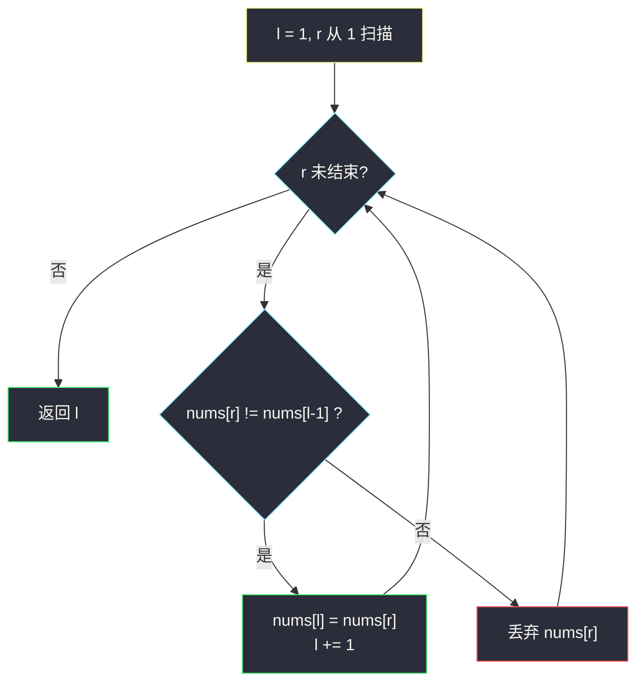
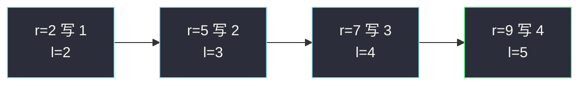

# 删除有序数组中的重复项（原地修改 · 快慢指针）

## 一、问题描述

给定**非递减**有序数组 `nums`，原地删除重复项，使每个元素只出现一次，相对顺序保持不变。返回删除后的新长度 `k`；`nums` 的前 `k` 个位置必须是去重后的结果，`k` 之后的内容无所谓。

> 🔗 LeetCode 26：https://leetcode.cn/problems/remove-duplicates-from-sorted-array/
>
> 数据范围：`1 <= nums.length <= 3 * 10^4`，`-100 <= nums[i] <= 100`，`nums` 已按非递减排序。

**示例 1**

```
输入：nums = [1,1,2]
输出：2, nums = [1,2,_]
解释：函数返回 k = 2，前两个元素是 1 和 2。
```

**示例 2**

```
输入：nums = [0,0,1,1,1,2,2,3,3,4]
输出：5, nums = [0,1,2,3,4,_,_,_,_,_]
解释：前 5 个位置是不重复的 0,1,2,3,4。
```

**直观理解**

有序 ⇒ 相同值一定挨在一起。原地去重 = 把「每种值的第一次出现」依次写到数组前部。灵神 **§3.5 原地修改**：写指针 `l`（下一个空位）、读指针 `r`（扫描源）；当 `nums[r] != nums[l-1]` 时写入。

---

## 二、暴力解法

开一个新列表，遇到「和已写入末尾不同」的值就追加，最后拷回 `nums`。正确，但用了 `O(n)` 额外空间，违背「原地」约束（面试会扣）。

```python
class Solution:
    def removeDuplicates(self, nums: List[int]) -> int:
        uniq = []
        for x in nums:
            if not uniq or x != uniq[-1]:
                uniq.append(x)
        for i, x in enumerate(uniq):
            nums[i] = x
        return len(uniq)
```

### 复杂度

- **时间**：`O(n)`。
- **空间**：`O(n)` 额外数组。

### 🔴 瓶颈在哪里

新数组只是「已保留前缀」的一份拷贝。既然 `nums` 前部空出来的位置正好能承接这些值，用写指针覆盖即可，额外数组可以扔掉。

---

## 三、优化探索（核心章节）

> 📚 本题在灵茶题单中属于 **§3.5 原地修改**（滑窗① A 路）：快慢指针，`nums[0..l)` 是已处理好的不重复前缀；读指针 `r` 扫全集，`nums[r] != nums[l-1]` 时写入 `nums[l]` 并 `l += 1`。

### 3.1 观察特征

| 特征 | 说明 |
|------|------|
| 已排序 | 重复值连续，只需和「上一个保留值」比较 |
| 相对顺序不变 | 从左到右写，天然保序 |
| 覆盖安全 | `l <= r` 恒成立，写入不会踩到尚未读的元素 |

### 3.2 快慢指针

第一个元素必须保留，所以 `l` 从 1 起步，`r` 从 1 扫到末尾：

- `nums[r] == nums[l-1]`：重复，丢掉（`r` 独走）。
- `nums[r] != nums[l-1]`：新值，写入 `nums[l]`，`l += 1`。

结束时 `l` 就是新长度。



### 3.3 不变式

循环过程中：

- `nums[0..l)` 已是 `nums[0..r)` 去重后的结果（相对顺序不变）；
- `nums[l-1]` 是当前保留前缀的最后一个值，所以「和上一个保留值比较」写成 `nums[r] != nums[l-1]`。

`l <= r`：每次写入最多让 `l` 加 1，而 `r` 已经指向当前元素，写入发生在 `l` 处，不会覆盖 `r` 及以后。

### 3.4 一句话核心

> **写指针盯着「下一个空位」，读到的值和前一个保留值不同才写入。**

---

## 四、代码实现

### Python（主解：快慢指针）

```python
class Solution:
    def removeDuplicates(self, nums: List[int]) -> int:
        l = 1                                   # nums[0] 必留，从下标 1 开始写
        for r in range(1, len(nums)):           # 读指针
            if nums[r] != nums[l - 1]:          # 新值
                nums[l] = nums[r]
                l += 1
        return l
```

题目保证 `nums.length >= 1`，`l = 1` 安全。若要兼容空数组，加一行 `if not nums: return 0` 即可。

**变量含义**

| 变量 | 含义 |
|------|------|
| `l` | 写指针；`nums[0..l)` 已是不重复前缀 |
| `r` | 读指针，扫描整个数组 |
| `nums[l-1]` | 最近一次写入（保留）的值 |

---

## 五、具体例子演示

以示例 2 `nums = [0,0,1,1,1,2,2,3,3,4]` 逐步跟踪。初始 `l = 1`，`nums[0] = 0` 已保留。

| r | nums[r] | nums[l-1] | 动作 | l | 数组快照（前 l 为保留区） |
|---|---------|-----------|------|---|---------------------------|
| 1 | 0 | 0 | 相等，丢弃 | 1 | `[0 \| 0,1,1,1,2,2,3,3,4]` |
| 2 | 1 | 0 | 写入 `nums[1]=1` | 2 | `[0,1 \| 1,1,1,2,2,3,3,4]` |
| 3 | 1 | 1 | 丢弃 | 2 | `[0,1 \| 1,1,1,2,2,3,3,4]` |
| 4 | 1 | 1 | 丢弃 | 2 | `[0,1 \| 1,1,1,2,2,3,3,4]` |
| 5 | 2 | 1 | 写入 `nums[2]=2` | 3 | `[0,1,2 \| 1,1,2,2,3,3,4]` |
| 6 | 2 | 2 | 丢弃 | 3 | `[0,1,2 \| 1,1,2,2,3,3,4]` |
| 7 | 3 | 2 | 写入 `nums[3]=3` | 4 | `[0,1,2,3 \| 1,2,2,3,3,4]` |
| 8 | 3 | 3 | 丢弃 | 4 | `[0,1,2,3 \| 1,2,2,3,3,4]` |
| 9 | 4 | 3 | 写入 `nums[4]=4` | 5 | `[0,1,2,3,4 \| 2,2,3,3,4]` |

返回 **5**，前五位 `[0,1,2,3,4]` ✓。竖线右侧是未整理区，题目允许不管。

**示例 1** `[1,1,2]`：`r=1` 丢弃第二个 1；`r=2` 写入 2，`l=2`。



---

## 六、复杂度分析

| 方法 | 时间 | 空间 | 说明 |
|------|------|------|------|
| 额外数组再拷回 | `O(n)` | `O(n)` | 不满足原地 |
| 快慢指针（主解） | `O(n)` | `O(1)` | `r` 扫一遍，`l` 只增不减 |

---

## 七、对比总结

| 维度 | #26 去重 | #27 移除 val | #80 最多留 2 个 |
|------|----------|--------------|-----------------|
| 保留条件 | `nums[r] != nums[l-1]` | `nums[r] != val` | `nums[r] != nums[l-2]` |
| `l` 初值 | 1（至少留 1 个） | 0 | 2（或按长度兜底） |
| 有序前提 | 需要 | 不需要 | 需要 |

**易错点**

1. **拿 `nums[r]` 和 `nums[r-1]` 比**：那是「和原数组前一个」比，写入之后 `r-1` 可能已被覆盖成别的值。必须和**已保留前缀的末尾** `nums[l-1]` 比。
2. `l` 从 0 起步的写法要特判 `l == 0`，否则 `nums[l-1]` 越界。从 1 起步更干净。
3. 返回的是 `l` 不是 `l-1`：`l` 本身就是前缀长度。
4. 全相同（`[1,1,1]`）时从不写入，`l` 保持 1，正确。

**模板（原地保留满足条件的元素）**

```python
l = 1
for r in range(1, len(nums)):
    if nums[r] != nums[l - 1]:
        nums[l] = nums[r]
        l += 1
return l
```

---

## 八、举一反三

| 题目 | 关系 |
|------|------|
| [80. 删除有序数组中的重复项 II](https://leetcode.cn/problems/remove-duplicates-from-sorted-array-ii/) | 同一模板，条件改成「最多留 2 个」：`nums[r] != nums[l-2]` |
| [27. 移除元素](https://leetcode.cn/problems/remove-element/) | 同批姊妹篇：保留条件换成 `!= val` |
| [283. 移动零](https://leetcode.cn/problems/move-zeroes/) | 先把非 0 用同样快慢指针压到前面，再把尾巴补 0 |
| [905. 按奇偶排序数组](https://leetcode.cn/problems/sort-array-by-parity/) | 把「保留非重复」换成「保留偶数」 |
| [1089. 复写零](https://leetcode.cn/problems/duplicate-zeros/) | 原地修改但要从右往左写，避免覆盖未读区 |
| [2460. 对数组执行操作](https://leetcode.cn/problems/apply-operations-to-an-array/) | 先合并相邻相等，再把 0 移到末尾，两套原地模板拼接 |

**思想迁移**

- §3.5 的通用骨架：`nums[0..l)` 是「已经符合题意的答案前缀」，`r` 负责发现下一个该写进去的值。
- 口诀：**「慢指针是坑位，快指针去淘金；和坑边那个不一样，才配写进去。」**
