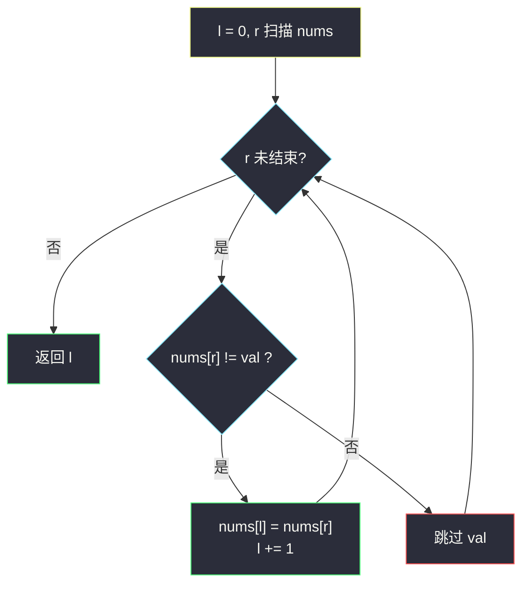
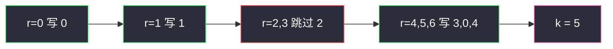

# 移除元素（原地修改 · 快慢指针）

## 一、问题描述

给你数组 `nums` 和值 `val`，原地移除所有等于 `val` 的元素，返回移除后数组的新长度 `k`。`nums` 的前 `k` 个元素必须是所有不等于 `val` 的值（顺序可变），`k` 之后的内容无所谓。

> 🔗 LeetCode 27：https://leetcode.cn/problems/remove-element/
>
> 数据范围：`0 <= nums.length <= 100`，`0 <= nums[i] <= 50`，`0 <= val <= 100`。

**示例 1**

```
输入：nums = [3,2,2,3], val = 3
输出：2, nums = [2,2,_,_]
解释：前两个位置是两个 2，原来的 3 都被丢掉。
```

**示例 2**

```
输入：nums = [0,1,2,2,3,0,4,2], val = 2
输出：5, nums = [0,1,4,0,3,_,_,_]
解释：不等于 2 的五个数放进前 5 位即可，顺序不唯一。
```

**直观理解**

把「要的留下、不要的跳过」压缩到数组前部。灵神 **§3.5 原地修改**：写指针 `l`、读指针 `r`；`nums[r] != val` 时写入 `nums[l]` 并让 `l` 前进一步。和 #26 同一骨架，只是保留条件从「不等于上一个保留值」换成「不等于 `val`」。

---

## 二、暴力解法

新开一个列表收集全部 `!= val` 的元素，再拷回 `nums`。逻辑直白，但额外 `O(n)` 空间，不是原地。

```python
class Solution:
    def removeElement(self, nums: List[int], val: int) -> int:
        kept = [x for x in nums if x != val]
        for i, x in enumerate(kept):
            nums[i] = x
        return len(kept)
```

### 复杂度

- **时间**：`O(n)`。
- **空间**：`O(n)` 额外列表。

### 🔴 瓶颈在哪里

收集结果时，`nums` 前部那些已经被读过的坑位正好空着。用写指针覆盖这些坑，就不必另开数组。数据范围虽小（`n ≤ 100`），模板本身是 `O(1)` 额外空间的通用写法。

---

## 三、优化探索（核心章节）

> 📚 本题在灵茶题单中属于 **§3.5 原地修改**（滑窗① A 路）：快慢指针，`l` 是写指针，`r` 是读指针；`nums[r] != val` 时写入。`nums[0..l)` 始终是「已经保留下来的元素」。

### 3.1 观察特征

| 特征 | 说明 |
|------|------|
| 无需有序 | 只按值过滤，相邻关系无意义 |
| 顺序可变 | 保序的压缩写法自然保序，也满足题面 |
| 覆盖安全 | `l` 永远不超过 `r`，写入不会破坏未读区 |

### 3.2 快慢指针

`l` 从 0 起（一开始什么都没留）：

- `nums[r] == val`：丢掉，只动 `r`；
- `nums[r] != val`：`nums[l] = nums[r]`，`l += 1`。

扫完后 `l` 就是新长度。



### 3.3 与「双端交换」的对比

另一种常见写法：右端 `n` 往回收缩，遇到 `val` 就和末尾交换再 `n -= 1`。元素顺序会被打乱，但赋值次数可能更少（`val` 很少时）。题面允许乱序。本篇主解选**保序压缩**——和 #26 同一套肌肉记忆，更好默写。

### 3.4 一句话核心

> **读到不是 `val` 的就往写指针上放，是 `val` 的直接跳过。**

---

## 四、代码实现

### Python（主解：快慢指针保序压缩）

```python
class Solution:
    def removeElement(self, nums: List[int], val: int) -> int:
        l = 0
        for r in range(len(nums)):
            if nums[r] != val:
                nums[l] = nums[r]
                l += 1
        return l
```

空数组时 `for` 不进入，返回 `0`，边界天然正确。`nums[r] != val` 时即使 `l == r` 也是自己赋给自己，无害。

**变量含义**

| 变量 | 含义 |
|------|------|
| `l` | 写指针；`nums[0..l)` 全是 `!= val` |
| `r` | 读指针 |

**循环不变式**：处理完 `r` 之前，`nums[0..l)` 恰好是 `nums[0..r)` 中所有不等于 `val` 的元素（相对顺序不变）。

---

## 五、具体例子演示

以示例 2 `nums = [0,1,2,2,3,0,4,2]`、`val = 2` 跟踪。初始 `l = 0`。

| r | nums[r] | 动作 | l | 数组快照（`\|` 分隔保留区） |
|---|---------|------|---|------------------------------|
| 0 | 0 | 写入 `nums[0]=0` | 1 | `[0 \| 1,2,2,3,0,4,2]` |
| 1 | 1 | 写入 `nums[1]=1` | 2 | `[0,1 \| 2,2,3,0,4,2]` |
| 2 | 2 | 等于 val，跳过 | 2 | `[0,1 \| 2,2,3,0,4,2]` |
| 3 | 2 | 跳过 | 2 | `[0,1 \| 2,2,3,0,4,2]` |
| 4 | 3 | 写入 `nums[2]=3` | 3 | `[0,1,3 \| 2,3,0,4,2]` |
| 5 | 0 | 写入 `nums[3]=0` | 4 | `[0,1,3,0 \| 3,0,4,2]` |
| 6 | 4 | 写入 `nums[4]=4` | 5 | `[0,1,3,0,4 \| 0,4,2]` |
| 7 | 2 | 跳过 | 5 | `[0,1,3,0,4 \| 0,4,2]` |

返回 **5**，前五位 `[0,1,3,0,4]`。官方示例写的是 `[0,1,4,0,3]`，那是乱序版本的一种合法结果；本题只要求前 `k` 个是全部非 `val` 元素，两种都对。

**示例 1** `[3,2,2,3]`、`val=3`：`r=0` 跳过，`r=1` 写 2，`r=2` 写 2，`r=3` 跳过，`l=2`。



---

## 六、复杂度分析

| 方法 | 时间 | 空间 | 说明 |
|------|------|------|------|
| 额外列表再拷回 | `O(n)` | `O(n)` | 不满足原地 |
| 快慢指针（主解） | `O(n)` | `O(1)` | 每个元素读一次、至多写一次 |

---

## 七、对比总结

| 维度 | #27 移除 val | #26 去重 | #283 移零 |
|------|--------------|----------|-----------|
| 保留条件 | `!= val` | `!= nums[l-1]` | `!= 0` |
| `l` 初值 | 0 | 1 | 0 |
| 尾巴 | 不管 | 不管 | 必须补 0 |

**易错点**

1. 写成 `if nums[r] == val: l += 1` 会把 `val` 留下、把好元素丢掉，条件反了。
2. 不要 `del nums[r]` 或 `nums.pop(r)`：中间删除是 `O(n)`，总复杂度退化到 `O(n²)`，且下标会乱。
3. 返回 `l` 之后不要再 `nums = nums[:l]`——函数要的是原地改数组并返回长度，重新绑定局部变量改不到调用者。
4. `val` 不在数组里时每次都 `l == r` 自赋值，返回 `n`，正确。

**模板（原地过滤）**

```python
l = 0
for r in range(len(nums)):
    if nums[r] != val:
        nums[l] = nums[r]
        l += 1
return l
```

---

## 八、举一反三

| 题目 | 关系 |
|------|------|
| [26. 删除有序数组中的重复项](https://leetcode.cn/problems/remove-duplicates-from-sorted-array/) | 同批姊妹篇：同一快慢骨架，保留条件不同 |
| [283. 移动零](https://leetcode.cn/problems/move-zeroes/) | 先按本题把非 0 压到前面，再把 `[l..n)` 填 0 |
| [203. 移除链表元素](https://leetcode.cn/problems/remove-linked-list-elements/) | 链表版「丢掉 val」，dummy + 指针跳过节点 |
| [905. 按奇偶排序数组](https://leetcode.cn/problems/sort-array-by-parity/) | 保留条件换成「偶数」 |
| [2460. 对数组执行操作](https://leetcode.cn/problems/apply-operations-to-an-array/) | 合并后再把 0 移走，过滤阶段同本题 |
| [80. 删除有序数组中的重复项 II](https://leetcode.cn/problems/remove-duplicates-from-sorted-array-ii/) | 仍是写指针，条件变成与 `nums[l-2]` 比较 |

**思想迁移**

- 「原地留下满足谓词 `P` 的元素」一律：`if P(nums[r]): nums[l] = nums[r]; l += 1`。
- 口诀：**「慢针挖坑快针筛，不是 val 就往里填。」**
