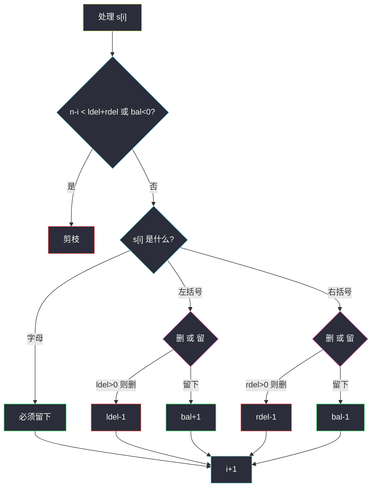
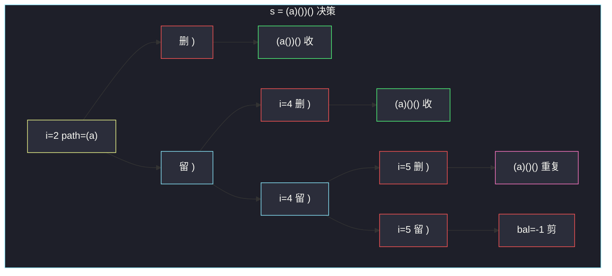

# 删除无效的括号（先算最少删除 · 组合型回溯）

## 一、问题描述

给你一个由括号 `'('`、`')'` 和英文小写字母组成的字符串 `s`。从中删除**最少**数量的括号（可以删 `'('` 或 `')'`，字母一律保留），使得剩下的串是合法括号序列。返回所有互不相同的合法结果（顺序任意）。

合法：空串合法；若 `A`、`B` 合法则 `AB` 合法；若 `A` 合法则 `(A)` 合法。字母不参与匹配，相当于透明字符。

> 🔗 LeetCode 301：https://leetcode.cn/problems/remove-invalid-parentheses/
>
> 数据范围：`1 ≤ s.length ≤ 25`。长度小，但要的是**全部**最少删除方案，不是任意一个。
>
> 📚 灵茶题单：**回溯 · §4.4 组合型回溯**。先用一遍扫描算出「最少删几个左、几个右」，再在这个配额里做选/不选。配额用完后得到的合法串，删除次数一定最少。

**示例 1**

```
输入：s = "()())()"
输出：["(())()","()()()"]
```

删掉下标 2 的 `)` 得到 `(())()`；删掉下标 4 的 `)` 得到 `()()()`。两种都只删 1 个，都合法。删别的位置要么不合法，要么删得更多。

**示例 2**

```
输入：s = "(a)())()"
输出：["(a())()","(a)()()"]
```

和示例 1 结构相同，中间多了字母 `a`。字母必须保留，搜索空间只在括号上。下文用这一例做端到端跟踪。

**示例 3**

```
输入：s = ")("
输出：[""]
解释：两个括号都无法配对，最少删 2 个，只剩空串。
```

**直观理解**

「最少删除」有两层：

1. **删几个**：从左到右扫一遍就能确定。多出来的 `)` 当时就该删；扫完还没配上的 `'('` 也该删。这两个数记为 `rdel`、`ldel`。
2. **删哪些**：在所有括号位置里选出恰好 `ldel` 个 `'('` 和 `rdel` 个 `')'` 删掉，使全程任意前缀里右括号不超过左括号。这是组合搜索，不是排列——同一组被删下标对应同一个串。

同类「括号最少改动」可对照站内 [32. 最长有效括号](https://leetcode.cn/problems/longest-valid-parentheses/)（`longest-valid-parentheses.md`）：32 只要最长合法**子串长度**；本题要的是原串删最少字符后的**全部子序列方案**。

---

## 二、暴力解法

BFS：每一层从当前串删掉一个括号，得到下一层更短的候选。同一层删的个数相同。一旦某一层出现合法串，这一层全部合法串就是答案（再往下删只会更多）。用集合去重。

```python
class Solution:
    def removeInvalidParentheses(self, s: str) -> List[str]:
        def valid(t: str) -> bool:
            bal = 0
            for c in t:
                if c == '(':
                    bal += 1
                elif c == ')':
                    bal -= 1
                    if bal < 0:
                        return False
            return bal == 0

        q = {s}
        while q:
            good = [t for t in q if valid(t)]
            if good:
                return good
            nxt = set()
            for t in q:
                for i, c in enumerate(t):
                    if c in '()':
                        nxt.add(t[:i] + t[i + 1:])
            q = nxt
        return [""]
```

### 复杂度

- **时间**：最坏每一层把串里每个括号都删一遍，串长 `n ≤ 25`，状态数按子集膨胀，能过但常数大，大量非法前缀也会入队。
- **空间**：一层的去重集合。

### 🔴 瓶颈在哪里

1. BFS 不知道最少要删几个，只能一层层试；很多分支删错了位置，要等到更深层才死。
2. 同一结果会由不同删除顺序到达，全靠 `set` 硬去重。
3. 字母位置根本不用枚举，BFS 却每次扫描整串。

优化方向：先 `O(n)` 算出 `ldel`、`rdel`，回溯时**配额用尽才合法**，深度固定、不会多删；再用前缀平衡剪枝，非法前缀立刻停。

---

## 三、优化探索（核心章节）

> 📚 本题在灵茶题单中属于 **回溯 · §4.4 组合型回溯**。组合 = 每个括号「删 / 留」二选一，但总删除次数被 `ldel`、`rdel` 卡死；不是排列（顺序由原串下标决定）。

### 3.1 最少删除数：一遍扫描

维护「尚未匹配的左括号」计数 `left`：

- 遇 `'('`：`left += 1`
- 遇 `')'`：若 `left > 0` 则配对 `left -= 1`；否则这是多出来的右括号，`rdel += 1`
- 字母跳过

扫完后仍为正的 `left` 就是多出来的左括号，记 `ldel = left`。

正确性：每个无法被当时已有的左括号吃掉的 `')'` 必须删（再留左边也配不上——左边已经没有空闲的 `'('`）；扫完剩下的 `'('` 右边再也没有 `')'` 可配，也必须删。这给出删除次数的下界。回溯恰好删这么多个，若还能拼出合法串，次数就是最少。

例：`s = "(a)())()"`

| 下标 | 字符 | left | rdel | 说明 |
|------|------|------|------|------|
| 0 | `(` | 1 | 0 | |
| 1 | `a` | 1 | 0 | 字母 |
| 2 | `)` | 0 | 0 | 配对 |
| 3 | `(` | 1 | 0 | |
| 4 | `)` | 0 | 0 | 配对 |
| 5 | `)` | 0 | 1 | 多余的右括号 |
| 6 | `(` | 1 | 1 | |
| 7 | `)` | 0 | 1 | 配对 |

`ldel = 0`，`rdel = 1`：最少只删 1 个 `)`，左括号一个都不必删。

### 3.2 回溯状态

走到下标 `i` 时带四个量：

- `ldel` / `rdel`：还要删几个左 / 右
- `bal`：当前路径里已留下的 `'('` 减去 `')'`（字母不改 `bal`）
- `path`：已留下的字符

对 `s[i]`：

| 字符 | 可做的选择 |
|------|-----------|
| `'('` | `ldel > 0` 则可删（`ldel-1`，`bal` 不变）；或者留下（`bal+1`） |
| `')'` | `rdel > 0` 则可删；或者留下（`bal-1`） |
| 字母 | 必须留下 |

`i == n` 且 `ldel == rdel == bal == 0` 时收进答案。用 `set` 去重：删不同下标的相同字符会得到同一字符串（如连续两个 `)` 删哪个都一样）。

### 3.3 剪枝：为什么这些分支一定废

必须讲清「剪掉之后不会漏最优」。

**剪枝 A：`bal < 0`**  
已留下的右括号比左括号多。后面无论怎么删、怎么留，这段前缀已经不合法，且多出来的 `)` 已经留在路径里，删配额改变不了已经写下的字符。所以整棵子树无解。

**剪枝 B：`ldel < 0` 或 `rdel < 0`**  
配额是最少删除的精确值，不能超删（超删得到的串即使合法也不是「最少删除」）。实现上用「只在配额 > 0 时才走删除分支」，不会出现负数；若写成先减再判，负数直接 return。

**剪枝 C：剩余长度不够删**  
`n - i < ldel + rdel`：剩下的字符全删都凑不齐配额，死。

**剪枝 D（可选）：连续相同括号只删第一个**  
`s[i] == s[i-1]` 且当前在「删除」分支时跳过。这是组合去重：连续 `))` 删第 1 个和第 2 个生成同一串。有 `set` 时正确性不依赖它，但能少搜。主解用 `set`，例子里会标出重复来源。

**不会剪掉的**：`bal > 0` 一直到串末。末尾若还有未配的 `'('`，则 `bal > 0` 或 `ldel` 没用完，终点条件挡掉。配额保证我们不会「该删左却没删」。



红边是「删除」（消耗配额），绿是「留下」。字母没有红边。

### 3.4 正确性：配额 + 平衡 ⇔ 最少删除的合法串

- **必要性**：任何合法串对原串的删除次数 ≥ `(ldel, rdel)` 这一对（3.1 的下界）。所以答案里每条都必须恰好删这么多（不能少；多了就不是最少）。
- **充分性**：回溯枚举了「恰好删 `ldel` 个左、`rdel` 个右」的全部组合；`bal` 全程非负且结束为 0，即留下的子序列合法。`set` 去掉相同字符串。因此答案完备且无超集。

与 BFS 的关系：BFS 第 `ldel+rdel` 层就是这些串；先计数等于直接跳到那一层，还带平衡剪枝。

### 3.5 一句话核心

> **先扫出最少要删的左、右个数；回溯时每个括号删或留，前缀右不能多过左，配额与平衡同时归零即答案。**

---

## 四、代码实现

### Python（主解：先计数再组合回溯）

```python
class Solution:
    def removeInvalidParentheses(self, s: str) -> List[str]:
        ldel = rdel = 0
        for c in s:
            if c == '(':
                ldel += 1
            elif c == ')':
                if ldel:
                    ldel -= 1
                else:
                    rdel += 1

        n = len(s)
        ans = set()
        path = []

        def dfs(i: int, ldel: int, rdel: int, bal: int) -> None:
            if ldel < 0 or rdel < 0 or bal < 0:
                return
            if n - i < ldel + rdel:
                return
            if i == n:
                if ldel == 0 and rdel == 0 and bal == 0:
                    ans.add("".join(path))
                return
            c = s[i]
            if c == '(':
                dfs(i + 1, ldel - 1, rdel, bal)
                path.append(c)
                dfs(i + 1, ldel, rdel, bal + 1)
                path.pop()
            elif c == ')':
                dfs(i + 1, ldel, rdel - 1, bal)
                path.append(c)
                dfs(i + 1, ldel, rdel, bal - 1)
                path.pop()
            else:
                path.append(c)
                dfs(i + 1, ldel, rdel, bal)
                path.pop()

        dfs(0, ldel, rdel, 0)
        return list(ans)
```

删除分支里 `ldel-1` / `rdel-1` 可能短暂变成 -1，入口第一句立刻剪掉——等价于「配额为 0 时不走删除」，写起来少一层 `if`。

**变量含义**

| 名字 | 含义 |
|------|------|
| 扫描阶段的 `ldel` | 先当「未匹配左括号」，结束时变成「要删的左括号数」 |
| `rdel` | 无法匹配的右括号数 = 要删的 `)` 个数 |
| `bal` | 路径上已留左减已留右，任何时候不能为负 |
| `path` | 当前留下的字符，回溯必须 `pop` |

### Java（最优解：配额回溯 + HashSet）

```java
class Solution {
    public List<String> removeInvalidParentheses(String s) {
        int ldel = 0, rdel = 0;
        for (int i = 0; i < s.length(); i++) {
            char c = s.charAt(i);
            if (c == '(') {
                ldel++;
            } else if (c == ')') {
                if (ldel > 0) {
                    ldel--;
                } else {
                    rdel++;
                }
            }
        }
        Set<String> ans = new HashSet<>();
        dfs(s, 0, ldel, rdel, 0, new StringBuilder(), ans);
        return new ArrayList<>(ans);
    }

    private void dfs(String s, int i, int ldel, int rdel, int bal,
                     StringBuilder path, Set<String> ans) {
        if (ldel < 0 || rdel < 0 || bal < 0) {
            return;
        }
        if (s.length() - i < ldel + rdel) {
            return;
        }
        if (i == s.length()) {
            if (ldel == 0 && rdel == 0 && bal == 0) {
                ans.add(path.toString());
            }
            return;
        }
        char c = s.charAt(i);
        int len = path.length();
        if (c == '(') {
            dfs(s, i + 1, ldel - 1, rdel, bal, path, ans);
            path.append(c);
            dfs(s, i + 1, ldel, rdel, bal + 1, path, ans);
            path.setLength(len);
        } else if (c == ')') {
            dfs(s, i + 1, ldel, rdel - 1, bal, path, ans);
            path.append(c);
            dfs(s, i + 1, ldel, rdel, bal - 1, path, ans);
            path.setLength(len);
        } else {
            path.append(c);
            dfs(s, i + 1, ldel, rdel, bal, path, ans);
            path.setLength(len);
        }
    }
}
```

---

## 五、具体例子演示

**端到端**：`s = "(a)())()"`，下标 `0..7`，字符 `( a ) ( ) ) ( )`。

扫描得 `ldel = 0`，`rdel = 1`。左括号没有删除分支（一删 `ldel` 变 -1 立刻剪）。只需决定删哪一个 `)`。

状态写成 `(i, rdel, bal, path)`。`ldel` 恒为 0，省略。

```
s = ( a ) ( ) ) ( )
    0 1 2 3 4 5 6 7
```

字母 `a` 只有「留下」。从 `i=0` 强制留 `(`，`i=1` 强制留 `a`，来到 `i=2`，path=`"(a"`，`bal=1`，`rdel=1`。

| 步 | i | 字符 | 选择 | rdel | bal | path | 说明 |
|----|---|------|------|------|-----|------|------|
| 1 | 2 | `)` | **删** | 0 | 1 | `(a` | 配额用尽 |
| 2 | 3 | `(` | 留 | 0 | 2 | `(a(` | 不能再删左 |
| 3 | 4 | `)` | 留 | 0 | 1 | `(a()` | rdel=0，删会被剪 |
| 4 | 5 | `)` | 留 | 0 | 0 | `(a())` | |
| 5 | 6 | `(` | 留 | 0 | 1 | `(a())(` | |
| 6 | 7 | `)` | 留 | 0 | 0 | `(a())()` | |
| 7 | 8 | — | 收 | 0 | 0 | `(a())()` | **答案 1** |

回到 `i=2` 走「留下」：

| 步 | i | 字符 | 选择 | rdel | bal | path | 说明 |
|----|---|------|------|------|-----|------|------|
| 8 | 2 | `)` | **留** | 1 | 0 | `(a)` | |
| 9 | 3 | `(` | 留 | 1 | 1 | `(a)(` | |
| 10 | 4 | `)` | **删** | 0 | 1 | `(a)(` | |
| 11 | 5..7 | | 全留 | 0 | 0 | `(a)()()` | **答案 2** |
| 12 | 4 | `)` | **留** | 1 | 0 | `(a)()` | 与步 10 并列 |
| 13 | 5 | `)` | **删** | 0 | 0 | `(a)()` | |
| 14 | 6..7 | | 全留 | 0 | 0 | `(a)()()` | 与答案 2 相同，set 去重 |
| 15 | 5 | `)` | **留** | 1 | -1 | `(a)())` | **bal<0 剪枝** |

步 15 是关键剪枝：前缀 `(a)())` 已经多一个 `)`，后面即使删掉最后的 `)` 得到 `(a)())(`，末尾还剩一个未配的 `'('`，本来也不合法。`bal < 0` 让我们根本不必走到串尾。

因此不会出现「删最后一个 `)`」这条废方案。两个互异答案：`"(a())()"`、`"(a)()()"`。



粉节点是同一字符串的另一条删除路径；红叉是平衡剪枝。

**对照**：`s = ")("` 扫描 `ldel=1, rdel=1`。两个字符都只能删，path 空，收 `""`。若留下任何一个，`bal` 或配额过不了终点。

---

## 六、复杂度分析

| 方法 | 时间 | 空间 | 说明 |
|------|------|------|------|
| BFS 按删除层 | 最坏指数，层内串更多 | 一层的 set | 不知配额，废状态多 |
| 先计数再回溯（主解） | `O(2^p · n)` 量级，`p` 为括号个数 | `O(n)` 递归 + 答案 | `n ≤ 25`；剪枝后远小于 `2^p` |
| 扫描配额 | `O(n)` | `O(1)` | 预处理 |

答案条数本身可能不少，把字符串写进 `set` 的成本含在时间里。

---

## 七、对比总结

| 维度 | 20 有效括号 | 32 最长有效括号 | 本题 301 |
|------|-------------|-----------------|----------|
| 问什么 | 整串是否合法 | 最长合法子串长度 | 删最少后的全部串 |
| 手段 | 计数 / 栈 | 下标栈 | 配额 + 组合回溯 |
| 字母 | 无 | 无 | 必须原样保留 |

**易错点**

1. **没先计数**：纯回溯「删或不删」会得到删除次数更多的合法串（如把整串删空），必须用配额或 BFS 分层卡死最少次数。
2. **只维护 `bal` 不维护配额**：会把「多删几个也合法」的串收进来。
3. **字母被删**：字母不是括号，没有删的选项。
4. **终点只看 `bal==0`**：若 `ldel` 还剩，说明该删的左括号没删完，串更长但按本题不是合法答案集合里该有的（实际上若 ldel>0 且 bal==0 矛盾——没删的左会反映在 bal 里；仍应三个条件一起写，防漏）。
5. **忘记去重**：连续 `)` 删不同下标得到同一结果。
6. **`bal<0` 仍继续**：后面救不回来，白白指数膨胀。

---

## 八、举一反三

| 题目 | 关系 |
|------|------|
| [32. 最长有效括号](https://leetcode.cn/problems/longest-valid-parentheses/) | 同目录 Hard：合法括号改成「最长连续段」，见 `longest-valid-parentheses.md` |
| [20. 有效的括号](https://leetcode.cn/problems/valid-parentheses/) | `bal` / 栈判定，本题终点条件的原型 |
| [1249. 移除无效的括号](https://leetcode.cn/problems/minimum-remove-to-make-valid-parentheses/) | 只要**一种**最少删除方案，贪心标出必删下标即可 |
| [921. 使括号有效的最少添加](https://leetcode.cn/problems/minimum-add-to-make-parentheses-valid/) | 与本题扫描同一对 `(ldel, rdel)`，问的是加几个而不是删哪些 |
| [22. 括号生成](https://leetcode.cn/problems/generate-parentheses/) | 同样 `bal` 剪枝，但是从空串往里放，不是从原串里删 |

**思想迁移**

- 组合型回溯：先算出「必须选几次某种操作」的配额，再在配额内搜索，比裸 BFS 更干净。
- 口诀：**「先数多余的左和右；每个括号删或留；前缀右不多于左。」**
