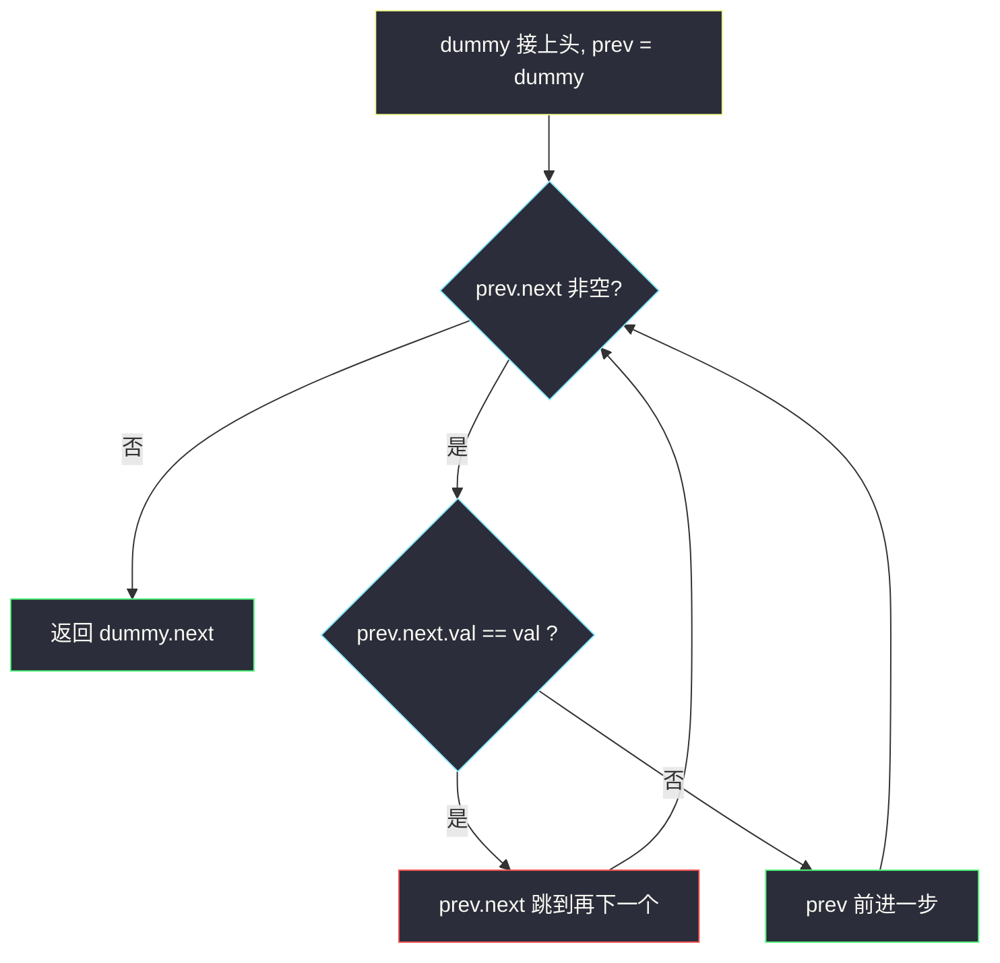
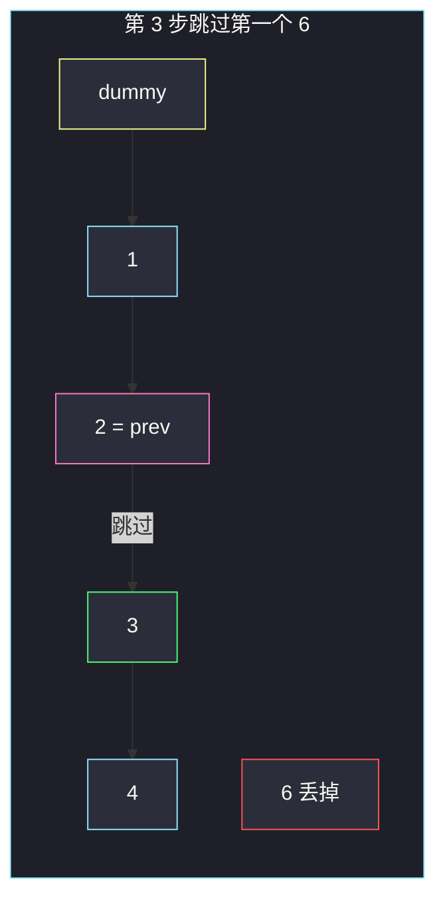

# 移除链表元素（dummy 头 · 前驱跳过）

## 一、问题描述

给你链表头 `head` 和整数 `val`，删除所有**节点值等于 `val`** 的节点，返回新头。

> 🔗 LeetCode 203：https://leetcode.cn/problems/remove-linked-list-elements/
>
> 数据范围：节点数 `[0, 10^4]`，`1 <= Node.val <= 50`，`0 <= val <= 50`。
>
> 📚 灵神题单 **§1.2 删除节点**。

**示例 1**

```
输入：head = [1,2,6,3,4,5,6], val = 6
输出：[1,2,3,4,5]
```

**示例 2**

```
输入：head = [], val = 1
输出：[]
```

**示例 3**

```
输入：head = [7,7,7,7], val = 7
输出：[]
解释：头也会被删光，新头是 None。
```

**直观理解**

数组版是 #27：写指针覆盖。链表不能覆盖，只能让**前一个节点的 `next` 跳过**被删的人。头可能被删，所以先挂一个假头 `dummy`，删除统一成「改 `prev.next`」，最后返回 `dummy.next`。

---

## 二、暴力解法

开新链表，只把 `!= val` 的节点拷过去。正确，但额外 `O(n)` 节点，面试会追问原地。

```python
class Solution:
    def removeElements(self, head: Optional[ListNode], val: int) -> Optional[ListNode]:
        dummy = ListNode(0)
        tail = dummy
        cur = head
        while cur:
            if cur.val != val:
                tail.next = ListNode(cur.val)
                tail = tail.next
            cur = cur.next
        return dummy.next
```

### 🔴 瓶颈在哪里

节点已经在内存里，只需改指针，不必 new。难点是**删头**：没有前驱。`dummy` 把「有没有前驱」变成永远有。

---

## 三、优化探索（核心章节）

> 📚 灵神 **§1.2 删除节点**：要删的是 `prev.next`，不是 `prev` 自己。

### 3.1 dummy + 前驱

`dummy.next = head`，`prev` 从 dummy 出发：

- `prev.next.val == val`：`prev.next = prev.next.next`（跳过，`prev` 不动，可能连续多个 val）。
- 否则 `prev = prev.next`。

循环条件看 `prev.next`，这样每次检验的都是「下一个要不要留」。



删完 `prev` **不要**前进：新的 `prev.next` 可能还是 `val`。

### 3.2 递归一句话

先处理完后面，再决定当前留不留：

```
head.next = recurse(head.next)
若 head.val == val：返回 head.next，否则返回 head
```

### 3.3 一句话核心

> **假头托住真头；前驱的 next 跳过所有 val，自己别跟着跳。**

---

## 四、代码实现

### Python（主解：dummy 迭代）

```python
class Solution:
    def removeElements(self, head: Optional[ListNode], val: int) -> Optional[ListNode]:
        dummy = ListNode(0, head)
        prev = dummy
        while prev.next:
            if prev.next.val == val:
                prev.next = prev.next.next
            else:
                prev = prev.next
        return dummy.next
```

**可选递归**

```python
class Solution:
    def removeElements(self, head: Optional[ListNode], val: int) -> Optional[ListNode]:
        if not head:
            return None
        head.next = self.removeElements(head.next, val)
        return head.next if head.val == val else head
```

空链表：`dummy.next` 一开始就是 `None`，循环不进，返回 `None`。全是 `val`：dummy 一直跳到空，返回 `None`。

---

## 五、具体例子演示

`1 → 2 → 6 → 3 → 4 → 5 → 6`，`val = 6`。

初始：`dummy → 1 → 2 → 6 → 3 → 4 → 5 → 6`，`prev` 在 dummy。

| 步 | prev 指向 | prev.next | 动作 |
|----|-----------|-----------|------|
| 1 | dummy | 1 | 保留，prev 走到 1 |
| 2 | 1 | 2 | 保留，prev 走到 2 |
| 3 | 2 | **6** | `2.next = 3`，prev 仍在 2 |
| 4 | 2 | 3 | 保留，prev 走到 3 |
| 5 | 3 | 4 | 保留，prev 走到 4 |
| 6 | 4 | 5 | 保留，prev 走到 5 |
| 7 | 5 | **6** | `5.next = None`，prev 仍在 5 |
| 8 | 5 | None | 结束 |



示例 3 四个 7：`prev` 一直停在 dummy，四次跳过，`dummy.next` 变成 `None`。

---

## 六、复杂度分析

| 方法 | 时间 | 空间 | 说明 |
|------|------|------|------|
| 新建链表 | `O(n)` | `O(n)` | 多占一套节点 |
| dummy 迭代（主解） | `O(n)` | `O(1)` | 只改指针 |
| 递归 | `O(n)` | `O(n)` 栈 | 斜链最坏 |

---

## 七、对比总结

| | #27 数组 | #203 链表 |
|--|----------|----------|
| 丢掉 val | 写指针覆盖 | `prev.next` 跳过 |
| 头被删 | 下标从 0 写起即可 | 必须 dummy（或单独 while 摘头） |

**易错点**

1. 删完 `prev = prev.next`：连续两个 val 会漏删。
2. 用 `cur` 指向被删节点再 `cur = cur.next`，但没改前驱的 `next`——链表没断干净。
3. 返回 `head` 而不是 `dummy.next`：原头被删时仍指向垃圾节点。
4. 不要 `prev.next = None` 然后找不到后面——跳的是 `prev.next.next`。

**模板（链表按值删）**

```python
dummy = ListNode(0, head)
prev = dummy
while prev.next:
    if prev.next.val == val:
        prev.next = prev.next.next
    else:
        prev = prev.next
return dummy.next
```

---

## 八、举一反三

| 题目 | 关系 |
|------|------|
| [27. 移除元素](https://leetcode.cn/problems/remove-element/) | 数组版同一思想，见 `remove-element.md` |
| [83. 删除排序链表中的重复元素](https://leetcode.cn/problems/remove-duplicates-from-sorted-list/) | 有序，重复留一个，仍是前驱跳过 |
| [82. 删除排序链表中的重复元素 II](https://leetcode.cn/problems/remove-duplicates-from-sorted-list-ii/) | 重复的一段全删，dummy 更关键 |
| [19. 删除链表的倒数第 N 个结点](https://leetcode.cn/problems/remove-nth-node-from-end-of-list/) | dummy + 快慢定位前驱 |
| [3217. 从链表中移除在数组中存在的所有节点](https://leetcode.cn/problems/delete-nodes-from-linked-list-present-in-array/) | `val` 换成集合，骨架相同 |

**思想迁移**

- 口诀：**「假头托真头，前驱看下家；相等就跳过，不等再往前。」**
