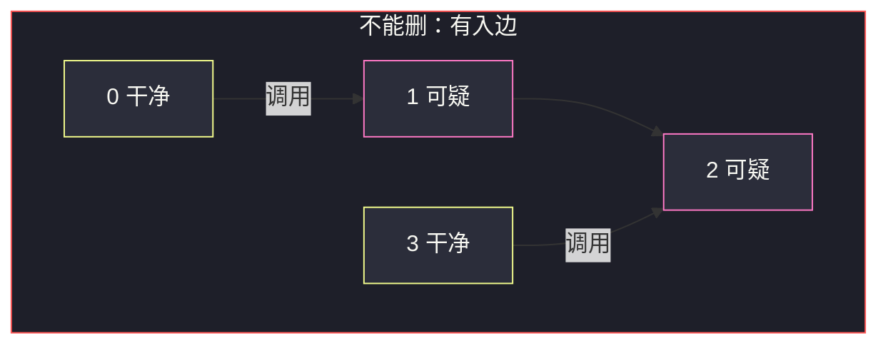
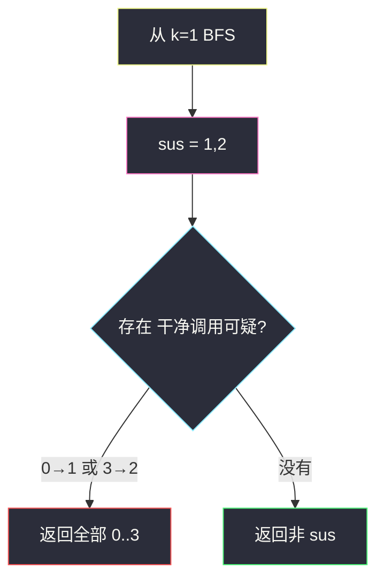

# 移除可疑的方法（有向 DFS 标记 + 跨边检查）

## 一、问题描述

`n` 个方法编号 `0 .. n-1`。有向调用 `invocations[i] = [ai, bi]` 表示 `ai` 调用 `bi`（无重边、无自环）。方法 `k` 有 bug：`k` 以及它直接或间接调用到的方法都是**可疑**的。若这组可疑方法**没有被组外任何方法调用**，则整组删除；否则一个都不删。返回删除后剩下的方法编号（顺序任意）。不能删则返回 `0 .. n-1` 全部。

> 🔗 LeetCode 3310：https://leetcode.cn/problems/remove-methods-from-project/
>
> 数据范围：`1 ≤ n ≤ 1e5`，调用边 ≤ `2e5`。`ai ≠ bi`，边不重复。
>
> 📚 灵茶题单：**§1.1 DFS**。必须建**有向**图。`n=1e5` 用迭代 BFS/DFS，不要递归。

**示例 1**

```
输入：n = 4, k = 1, invocations = [[1,2],[0,1],[3,2]]
输出：[0,1,2,3]
```

可疑是 `{1,2}`（1 调用 2）。组外的 0 调用 1、3 调用 2，删不了，原样返回。

**示例 2**

```
输入：n = 5, k = 0, invocations = [[1,2],[0,2],[0,1],[3,4]]
输出：[3,4]
```

从 0 能走到 1 和 2，可疑 `{0,1,2}`。没有组外打进来的边，删掉后剩 3、4。

**示例 3**

```
输入：n = 3, k = 2, invocations = [[1,2],[0,1],[2,0]]
输出：[]
```

`2 → 0 → 1 → 2` 成环，三个都可疑。组外是空的，可以整组删光。

**直观理解**

可疑集合 = 有向图里从 `k` 出发的可达点（含自己）。像摘掉一块「污染子图」：只有这块没有入边来自干净节点时才能摘；有一根从干净点伸进来的调用，bug 会从外面再被触发，于是整组都留着。

---

## 二、暴力解法

对每个方法 `x`，从 `k` DFS 看能不能走到 `x` 来判断可疑——同一张图重复搜 `n` 次，`O(n(n+m))`，`n=1e5` 必死。标记可疑只需要**从 k 出发一次**。

「能不能删」若对每个可疑点再扫一遍谁指向它，不建反图时会反复扫边，也能写出 `O(n+m)`，但容易建成无向、漏边。正确暴力已经没意义，直接一次遍历 + 一次扫边。

```python
# 错误示意：建成无向后，示例 1 会把 0、3 也标成可疑
# 0-1-2-3 全连通，逻辑彻底跑偏
```

正确的「暴力」已经是线性的：从 k 标记一次，再 `O(m)` 看跨边。再慢就只能是建错图。

### 🔴 瓶颈在哪里

有向可达一次 BFS；再扫边找是否存在 `¬sus[a] ∧ sus[b]`。两遍都是 `O(n+m)`。`n=1e5` 只能这个量级。

---

## 三、优化探索（核心章节）

> 📚 本题在灵茶题单中属于 **§1.1 DFS**。新题，模型就两步：标污染闭包，再看有没有干净点调用污染点。

### 3.1 可疑集合 = 从 k 出发的有向可达

只沿 `ai → bi` 走。`k` 调用到的才被传染；**谁调用 k 并不自动可疑**——调用方还是干净的，除非它自己也能被 k 走到（环）。

示例 1：`0 → 1 → 2 ← 3`。从 1 只能到 2，0 和 3 干净，但它们打进可疑组，所以不能删。

### 3.2 删除条件

可疑组 `S` 能删，当且仅当不存在边 `a → b` 满足 `a ∉ S` 且 `b ∈ S`。

- 组内互调：无所谓，反正一起删。
- 可疑调用干净：按可达定义，对端一定已被标进 `S`，不会留下「可疑→干净」。
- 干净调用可疑：不行。这是唯一的否决。

若 `S` 是全部方法，组外为空，一定能删，返回 `[]`（示例 3）。

不变式：BFS 结束后，`sus[x] == True` 当且仅当存在有向路径 `k ↝ x`。因此 `S` 关于出边闭合；唯一可能的割边是从 `V\S` 指向 `S`。



### 3.3 一句话核心

> **有向从 k 标记可疑；存在干净→可疑的边则一个不删，否则留下所有非可疑。**

---

## 四、代码实现

### Python（主解：BFS 标记 + 扫边）

```python
from collections import deque
from typing import List

class Solution:
    def remainingMethods(
        self, n: int, k: int, invocations: List[List[int]]
    ) -> List[int]:
        g = [[] for _ in range(n)]
        for a, b in invocations:
            g[a].append(b)
        sus = [False] * n
        sus[k] = True
        q = deque([k])
        while q:
            x = q.popleft()
            for y in g[x]:
                if not sus[y]:
                    sus[y] = True
                    q.append(y)
        for a, b in invocations:
            if not sus[a] and sus[b]:
                return list(range(n))
        return [i for i in range(n) if not sus[i]]
```

方法名以力扣为准。迭代队列保证 `n=1e5` 不爆栈。检查跨边时扫原始 `invocations`，不必建反图。

不要双向加边：无向化会把「谁调用了可疑方法」也标成可疑，示例 1 会把 0、3 一齐标进去，后面扫跨边什么都看不到，误返回 `[ ]`。

栈 DFS 与队列 BFS 等价，选一个迭代写法即可：

```python
stk = [k]
while stk:
    x = stk.pop()
    for y in g[x]:
        if not sus[y]:
            sus[y] = True
            stk.append(y)
```

先 `sus[k]=True` 再压栈，避免环上把 k 重复当新点处理（重复没有正确性伤害，只是浪费）。

---

## 五、具体例子演示

**示例 1** 逐步标记可疑。

图：`1→2`，`0→1`，`3→2`，`k=1`。

| 步骤 | 队列 | 弹出 | 沿出边 | sus |
|------|------|------|--------|-----|
| 初 | `[1]` | | | `{1}` |
| 1 | 空再入 2 | 1 | 1→2，2 未标记 | `{1,2}` |
| 2 | `[2]` | 2 | 2 无出边 | `{1,2}` |

可疑集合 `{1,2}`。再扫边：

| 边 | 干净→可疑？ |
|----|-------------|
| 1→2 | 两端都可疑，忽略 |
| 0→1 | **是**（0 干净，1 可疑） |
| 3→2 | **是** |

发现跨边，返回 `[0,1,2,3]`。不必等扫完所有跨边，第一根就该返回。



**示例 2**

从 0：`0→2`、`0→1`，再 `1→2`。`sus={0,1,2}`。边 `3→4` 两端都不在集合里；没有干净点指向 0/1/2。返回 `[3,4]`（顺序任意，`[4,3]` 也对）。

**示例 3**

从 2：`2→0→1→2`，三人全标上。扫边每条都是可疑→可疑。组外没有调用，删除全部，返回 `[]`。

**孤立 k**

`n=3, k=1`，没有边。`sus={1}`，没有跨边，返回 `[0,2]`。

**可疑调用干净？——不会出现**

`0→1`，`k=0`：从 0 能走到 1，1 已经被标进可疑。有向可达集对外边是闭合的：可疑点的出边对端一定也在集合里。因此「可疑 → 干净」这条边在标记结束后不存在。真正要防的只有反向：干净打进来。

所以检查跨边时只看 `not sus[a] and sus[b]`，不必处理另一种方向。

**链式调用、中间才是 k**

`0 → 1 → 2 → 3`，`k=1`。可疑 `{1,2,3}`。跨边 `0→1`，不能删，返回全部。若误从 0 开始标，会把整条链当可疑，但「能不能删」仍会被 `0→1` 否决——碰巧答案对；一旦 0 没有指向 1、只是旁观节点，从 0 出发就会多标。必须从 `k` 出发。

**n=1**

没有边。`sus={0}`，组外为空，删除后返回 `[]`。不要特判成 `[0]`。

**自环、重边**

题面 `ai ≠ bi` 且边不重复，代码不必去重。若本地对拍数据有重边，邻接表重复走一次不影响正确性。

---

## 六、复杂度分析

| 方法 | 时间 | 空间 | 说明 |
|------|------|------|------|
| 对每个点搜一次 | `O(n(n+m))` | `O(n+m)` | TLE |
| BFS + 扫边（主解） | `O(n+m)` | `O(n+m)` | 迭代 |

---

## 七、对比总结

| 维度 | 无向连通块 | 本题 |
|------|------------|------|
| 边 | 双向 | 只 `ai → bi` |
| 集合 | 无向分量 | 从 k 的有向可达 |
| 额外 | 无 | 必须检查干净→可疑 |

**易错点**

1. **无向化**：把调用方也标进可疑，或漏掉「单向入边」否决。
2. **递归 DFS**：链长 `1e5` 爆栈。
3. **只删 k、不删后代**：题面后代一并可疑。
4. **有跨边时只留跨边相关的点**：规定是**全不删**。
5. **`n=1`**：唯一方法可疑且无组外调用，返回 `[]`，不要返回 `[0]`。
6. **漏掉 k 自己**：`sus[k]=True` 再出发。

---

## 八、举一反三

| 题目 | 关系 |
|------|------|
| [802. 找到最终的安全状态](https://leetcode.cn/problems/find-eventual-safe-states/) | 有向图上「坏点」闭包 |
| [207. 课程表](https://leetcode.cn/problems/course-schedule/) | 有向边语义不能反 |
| [851. 喧闹和富有](https://leetcode.cn/problems/loud-and-rich/) | 有向图 DFS 预处理 |
| [1557. 可以到达所有点的最少点数目](https://leetcode.cn/problems/minimum-number-of-vertices-to-reach-all-nodes/) | 入度为 0 的点，对照「有没有外部入边」 |

**思想迁移**

- 有向「从源点传染」用一次 BFS；「集合能否安全删除」看割边是否从集合外打入。
- 图论题第一件事：有向还是无向。口诀：**「从 k 顺着调用走；干净打进可疑则全留；否则留下非可疑。」**
