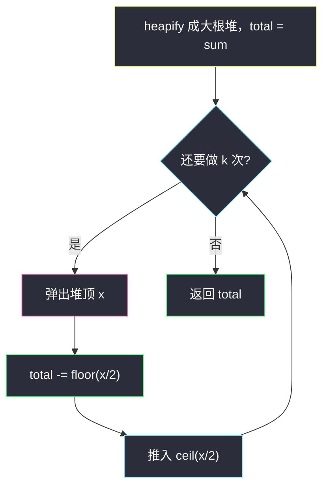
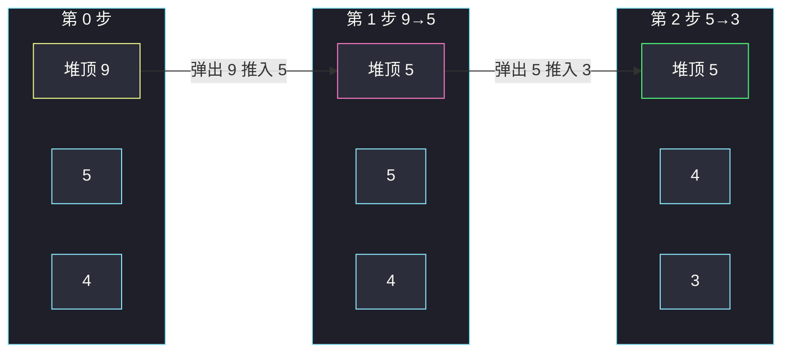

# 移除石子使总数最小（大根堆反复削最大堆）

## 一、问题描述

给你下标从 0 开始的整数数组 `piles`，`piles[i]` 是第 `i` 堆的石子数，再给一个整数 `k`。必须**恰好**做 `k` 次操作，每次：

1. 选任意一堆（同一堆可以反复选）；
2. 从中移除 `⌊pile / 2⌋` 颗石子，等价于留下 `⌈pile / 2⌉`。

返回 `k` 次之后剩余石子的**最小**总数。

> 🔗 LeetCode 1962：https://leetcode.cn/problems/remove-stones-to-minimize-the-total/
>
> 数据范围：`1 <= piles.length, k <= 10^5`，`1 <= piles[i] <= 10^4`。

**示例 1**

```
输入：piles = [5, 4, 9], k = 2
输出：12
解释：
  选 9 → 留下 ⌈9/2⌉ = 5，变成 [5, 4, 5]，和 14
  选其中一个 5 → 留下 3，变成 [3, 4, 5]，和 12
```

**示例 2**

```
输入：piles = [4, 3, 6, 7], k = 3
输出：12
解释：贪心顺序是 7 → 4、6 → 3、再削一个 4 → 2，剩余 [4, 3, 3, 2]，和 12。
题面给的操作顺序是先 6 再 7，得到同一多集合，总和一样。
```

**直观理解**

每次削掉当前堆的大约一半。要让总和尽量小，每一次都应该削**当前最大的那一堆**——同样砍一半，砍 9 掉 4，砍 4 只掉 2。用大根堆反复「取堆顶、留下上取整的一半、推回去」。

---

## 二、暴力解法

每次扫一遍数组找最大值，改完再扫。

```python
class Solution:
    def minStoneSum(self, piles: List[int], k: int) -> int:
        for _ in range(k):
            i = max(range(len(piles)), key=lambda j: piles[j])
            piles[i] = (piles[i] + 1) // 2          # ⌈x/2⌉
        return sum(piles)
```

`⌈x / 2⌉` 用整数 `(x + 1) // 2`：`x=9 → 5`，`x=8 → 4`。不要用浮除再 `ceil`。

### 复杂度

- **时间**：`O(k · n)`。`n`、`k` 都达 `10^5`，超时。
- **空间**：`O(1)` 额外。

### 🔴 瓶颈在哪里

找最大是瓶颈。堆把「取最大 + 插入新值」降到 `O(log n)`。必须做到 `O(n + k log n)`。

---

## 三、优化探索（核心章节）

> 📚 本题在灵茶题单中属于 **堆 · §5.1 基础**：heapify 建堆，然后反复取最值、修改、推回。与同目录 [#2530 执行 K 次操作后的最大分数](https://leetcode.cn/problems/maximal-score-after-applying-k-operations/)（`maximal-score-after-applying-k-operations.md`）同一骨架，只是目标从「加最大」换成「削最大」。

### 3.1 贪心

第 `t` 次操作减少的量是当时最大值的 `⌊x / 2⌋`。若故意削次大，本次少减一块；被留下的那个最大值以后再削，也还是那么大，不会自己变小。所以每次选当前最大，贪心成立。

同一堆可以连削多次：堆会自动决定「现在这坨减半之后还是不是最大」。

### 3.2 大根堆模拟

Python `heapq` 是小根堆，存 **`-x`** 模拟大根堆。

循环 `k` 次：

1. `x = -heappop(h)` —— 当前最大；
2. 留下 `⌈x / 2⌉ = (x + 1) // 2`；
3. `heappush(h, -留下的值)`。

也可以维护一个 `total`，每次减去 `x // 2`（本次真正拿掉的数量），避免最后再 `sum`。



### 3.3 取整公式

```
移除 ⌊x / 2⌋  ⇔  留下 ⌈x / 2⌉ = (x + 1) // 2 = x - x // 2
```

奇数 `x=5`：移除 2，留下 3；偶数 `x=8`：移除 4，留下 4。

### 3.4 一句话核心

> **每次削当前最大堆的一半；Python 取负模拟大根堆，循环 k 次，总和每次减去 ⌊x/2⌋。**

---

## 四、代码实现

### Python（主解）

```python
class Solution:
    def minStoneSum(self, piles: List[int], k: int) -> int:
        h = [-x for x in piles]
        heapq.heapify(h)                 # O(n) 建堆，不要循环 heappush
        total = -sum(h)                  # 当前剩余总和
        for _ in range(k):
            x = -heapq.heappop(h)
            leave = (x + 1) // 2         # ⌈x/2⌉
            total -= x - leave           # 即 ⌊x/2⌋
            heapq.heappush(h, -leave)
        return total
```

**变量含义**

| 变量 | 含义 |
|------|------|
| `h` | 元素取负后的小根堆，堆顶对应当前最大堆 |
| `x` | 本轮选中的堆大小 |
| `leave` | 削完留下的 `⌈x/2⌉` |
| `total` | 当前剩余石子总数 |

`heapify` 是 §5.1 的基本功：`n` 次 `heappush` 是 `O(n log n)`，一次 `heapify` 是 `O(n)`。

总和最大 `n · 10^4 = 10^9`，Python `int` 与 Java `int` 都放得下。

### Java（最优解同款）

```java
class Solution {
    public int minStoneSum(int[] piles, int k) {
        PriorityQueue<Integer> pq = new PriorityQueue<>(Comparator.reverseOrder());
        int total = 0;
        for (int x : piles) {
            pq.offer(x);
            total += x;
        }
        while (k-- > 0) {
            int x = pq.poll();
            int leave = (x + 1) / 2;
            total -= x - leave;
            pq.offer(leave);
        }
        return total;
    }
}
```

不要写比较器 `(a, b) -> b - a`：本题值非负刚好不溢出，换题就容易炸。用 `reverseOrder()`。

---

## 五、具体例子演示

堆内容按**逻辑从大到小**列出（堆顶 = 最左）。Python 内部是负数，表里写正数方便读。

### 5.1 `piles = [5, 4, 9]`，`k = 2`

初始堆 `[9, 5, 4]`，总和 `18`。

| 步 | 堆顶 | 弹出 | 留下 ⌈x/2⌉ | 推入后堆 | 总和 |
|----|------|------|-------------|----------|------|
| 0 | — | — | — | `[9, 5, 4]` | 18 |
| 1 | 9 | 9 | 5 | `[5, 5, 4]` | 18-4=14 |
| 2 | 5 | 5 | 3 | `[5, 4, 3]` | 14-2=12 |

返回 **12** ✓。第二步两个 5 一样大，选哪个都行。



### 5.2 `piles = [4, 3, 6, 7]`，`k = 3`

初始堆 `[7, 6, 4, 3]`，总和 `20`。

| 步 | 堆顶 | 弹出 | 留下 | 推入后堆 | 总和 |
|----|------|------|------|----------|------|
| 1 | 7 | 7 | 4 | `[6, 4, 4, 3]` | 17 |
| 2 | 6 | 6 | 3 | `[4, 4, 3, 3]` | 14 |
| 3 | 4 | 4 | 2 | `[4, 3, 3, 2]` | 12 |

返回 **12** ✓。题面示例先削 6 再削 7，两步之后多集合同样是 `{4, 4, 3, 3}`，因为操作落在两堆不同的石子上，顺序可交换。若连削同一堆 7 三次：`7 → 4 → 2 → 1`，剩余 `[4, 3, 6, 1]` 和 14，更差——所以必须每次重新看全局最大。

对拍：随机小数据上「每次扫 max」与大根堆结果一致。

---

## 六、复杂度分析

| 方法 | 时间 | 空间 | 说明 |
|------|------|------|------|
| 每次扫最大值 | `O(k · n)` | `O(1)` | n、k 达 1e5，超时 |
| 大根堆（主解） | `O(n + k log n)` | `O(n)` | heapify `O(n)`，k 次弹/推 |

---

## 七、对比总结

| 维度 | 暴力扫 max | 大根堆 |
|------|-----------|--------|
| 找当前最大 | `O(n)` | `O(1)` 看堆顶，`O(log n)` 维护 |
| 改完放回 | 原地改数组 | 推入新值 |
| 适用规模 | n、k 很小 | 本题数据 |

**易错点**

1. **留下 `x // 2` 而不是 `⌈x/2⌉`**：奇数 5 会变成 2，少留了 1。
2. **Python 忘取负**：`heapq` 默认小根堆，会每次削最小堆，总和几乎不降。
3. **循环 `heappush` 建堆**：正确但慢一截，面试写 `heapify`。
4. **少做或多亏一次**：题目是恰好 `k` 次，不要提前停（即使堆顶已经是 1，`⌈1/2⌉=1`，白做也得做）。
5. **改成「至少 k 次」**：不是本题；石子减到 1 再削不变，恰好 k 次没有副作用。

**模板（§5.1 反复取最大并改回）**

```python
h = [-x for x in piles]
heapq.heapify(h)
for _ in range(k):
    x = -heapq.heappop(h)
    heapq.heappush(h, -((x + 1) // 2))
```

---

## 八、举一反三

| 题目 | 关系 |
|------|------|
| [2530. 执行 K 次操作后的最大分数](https://leetcode.cn/problems/maximal-score-after-applying-k-operations/) | 同目录 `maximal-score-after-applying-k-operations.md`：同样 k 次取最大，那边加分再 `⌈x/3⌉` |
| [2558. 从数量最多的堆取走礼物](https://leetcode.cn/problems/take-gifts-from-the-richest-pile/) | 几乎同款：每次把最大堆改成 `⌊√x⌋`，求剩余和 |
| [2208. 将数组和减半的最少操作次数](https://leetcode.cn/problems/minimum-operations-to-halve-array-sum/) | 每次把最大减半，问最少几次使总和降到一半 |
| [3066. 超过阈值的最少操作数 II](https://leetcode.cn/problems/minimum-operations-to-exceed-threshold-value-ii/) | 同目录 `minimum-operations-to-exceed-threshold-value-ii.md`：对称的小根堆合并 |

**思想迁移**

- 「恰好 / 至少 k 次，每次改当前最值」→ §5.1 堆模拟。
- 口诀：**「要总和尽量小，每次砍最肥的那一刀；取负就是大根堆。」**
